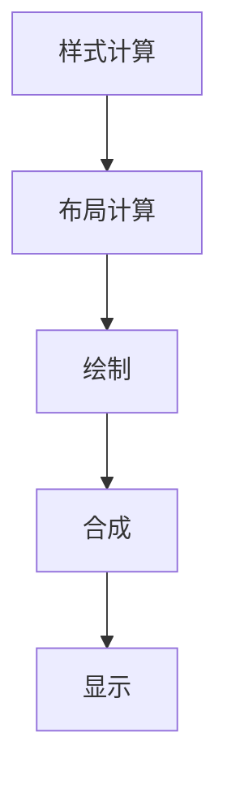

# 动画性能优化

## 动画性能优化概述

动画性能优化是确保流畅用户体验的关键，通过合理的技术手段提升动画的渲染性能。

## 性能影响因素

### 1. 渲染管道


### 2. 性能层级
| 层级 | 属性类型 | 性能影响 | 示例 |
|------|----------|----------|------|
| 布局 | 影响布局 | 高 | width, height, margin |
| 绘制 | 影响绘制 | 中 | background, color |
| 合成 | 仅影响合成 | 低 | transform, opacity |

## 优化策略

### 1. 选择高性能属性
```css
/* 推荐：使用transform和opacity */
.optimized {
    transition: transform 0.3s ease, opacity 0.3s ease;
}

.optimized:hover {
    transform: translateX(10px) scale(1.1);
    opacity: 0.8;
}

/* 避免：使用布局属性 */
.avoid {
    transition: left 0.3s ease, width 0.3s ease;
}

.avoid:hover {
    left: 10px;
    width: 200px;
}
```

### 2. 使用will-change
```css
/* 提示浏览器优化 */
.will-change {
    will-change: transform, opacity;
    transition: transform 0.3s ease;
}

.will-change:hover {
    transform: translateY(-5px);
}

/* 动画结束后移除 */
.will-change.animation-complete {
    will-change: auto;
}
```

### 3. 启用硬件加速
```css
/* 强制GPU加速 */
.gpu-accelerated {
    transform: translateZ(0);
    /* 或者 */
    transform: translate3d(0, 0, 0);
}

/* 3D变换触发硬件加速 */
.three-d {
    transform: perspective(1000px) rotateY(0deg);
}
```

## 具体优化技巧

### 1. Transform优化
```css
/* 推荐：使用transform */
.transform-optimized {
    transition: transform 0.3s ease;
}

.transform-optimized:hover {
    transform: translateX(100px) rotate(45deg) scale(1.2);
}

/* 避免：使用位置属性 */
.position-avoid {
    transition: left 0.3s ease, top 0.3s ease;
}

.position-avoid:hover {
    left: 100px;
    top: 50px;
}
```

### 2. Opacity优化
```css
/* 推荐：使用opacity */
.opacity-optimized {
    transition: opacity 0.3s ease;
}

.opacity-optimized:hover {
    opacity: 0.5;
}

/* 避免：使用visibility */
.visibility-avoid {
    transition: visibility 0.3s ease;
}

.visibility-avoid:hover {
    visibility: hidden;
}
```

### 3. 动画数量控制
```css
/* 推荐：合并动画 */
.combined-animation {
    animation: combined 2s ease;
}

@keyframes combined {
    0% { 
        transform: translateX(0) scale(1); 
        opacity: 1;
    }
    100% { 
        transform: translateX(100px) scale(1.2); 
        opacity: 0.8;
    }
}

/* 避免：多个独立动画 */
.multiple-animations {
    animation: 
        move 2s ease,
        scale 2s ease,
        fade 2s ease;
}
```

## 性能监控

### 1. 使用DevTools
```css
/* 性能调试样式 */
.debug-performance {
    /* 添加边框帮助识别重排 */
    outline: 1px solid red;
}

.debug-performance::before {
    content: "Performance Issue";
    position: absolute;
    top: -20px;
    left: 0;
    background: red;
    color: white;
    padding: 2px 4px;
    font-size: 10px;
}
```

### 2. 性能指标
```css
/* 性能监控类 */
.performance-monitor {
    position: fixed;
    top: 10px;
    right: 10px;
    background: rgba(0,0,0,0.8);
    color: white;
    padding: 10px;
    font-size: 12px;
    z-index: 9999;
}
```

## 实际应用

### 1. 滚动动画优化
```css
/* 优化滚动动画 */
.scroll-optimized {
    transform: translateY(0);
    transition: transform 0.3s ease;
}

.scroll-optimized.scrolled {
    transform: translateY(-100px);
}

/* 使用Intersection Observer */
.scroll-triggered {
    opacity: 0;
    transform: translateY(50px);
    transition: opacity 0.6s ease, transform 0.6s ease;
}

.scroll-triggered.visible {
    opacity: 1;
    transform: translateY(0);
}
```

### 2. 列表动画优化
```css
/* 优化列表动画 */
.list-item {
    transform: translateX(0);
    transition: transform 0.3s ease;
}

.list-item.entering {
    transform: translateX(-100%);
}

.list-item.entered {
    transform: translateX(0);
}

/* 使用transform代替left */
.list-item-optimized {
    transform: translateX(0);
    transition: transform 0.3s ease;
}

.list-item-optimized.slide-out {
    transform: translateX(-100%);
}
```

### 3. 页面过渡优化
```css
/* 优化页面过渡 */
.page-transition {
    transform: translateX(0);
    transition: transform 0.4s ease;
}

.page-transition.slide-out {
    transform: translateX(-100%);
}

.page-transition.slide-in {
    transform: translateX(100%);
}

/* 使用opacity代替display */
.fade-transition {
    opacity: 1;
    transition: opacity 0.3s ease;
}

.fade-transition.hidden {
    opacity: 0;
    pointer-events: none;
}
```

## 高级优化

### 1. 动画暂停和恢复
```css
/* 智能动画控制 */
.smart-animation {
    animation: move 2s ease infinite;
    animation-play-state: running;
}

/* 页面不可见时暂停 */
.smart-animation.paused {
    animation-play-state: paused;
}

/* 用户偏好减少动画 */
@media (prefers-reduced-motion: reduce) {
    .smart-animation {
        animation: none;
    }
}
```

### 2. 动画延迟加载
```css
/* 延迟加载动画 */
.lazy-animation {
    opacity: 0;
    transform: translateY(50px);
    transition: opacity 0.6s ease, transform 0.6s ease;
}

.lazy-animation.loaded {
    opacity: 1;
    transform: translateY(0);
}

/* 使用Intersection Observer触发 */
.lazy-animation.visible {
    opacity: 1;
    transform: translateY(0);
}
```

### 3. 动画缓存
```css
/* 缓存动画状态 */
.cached-animation {
    transform: translateX(0);
    transition: transform 0.3s ease;
}

.cached-animation.cached {
    transform: translateX(100px);
}

/* 避免重复计算 */
.cached-animation.optimized {
    will-change: transform;
    transform: translateX(0);
}
```

## 性能测试

### 1. 帧率监控
```css
/* 帧率监控样式 */
.fps-monitor {
    position: fixed;
    top: 10px;
    left: 10px;
    background: rgba(0,0,0,0.8);
    color: white;
    padding: 5px 10px;
    font-size: 12px;
    z-index: 9999;
}
```

### 2. 性能警告
```css
/* 性能警告样式 */
.performance-warning {
    position: fixed;
    top: 50px;
    left: 10px;
    background: rgba(255,0,0,0.8);
    color: white;
    padding: 5px 10px;
    font-size: 12px;
    z-index: 9999;
}
```

## 常见问题

### 1. 动画卡顿
```css
/* 问题：动画卡顿 */
.stutter {
    animation: stutterMove 1s ease;
}

@keyframes stutterMove {
    0% { left: 0; }
    100% { left: 100px; }
}

/* 解决：使用transform */
.smooth {
    animation: smoothMove 1s ease;
}

@keyframes smoothMove {
    0% { transform: translateX(0); }
    100% { transform: translateX(100px); }
}
```

### 2. 内存泄漏
```css
/* 问题：内存泄漏 */
.memory-leak {
    animation: infinite 1s ease;
}

/* 解决：限制动画次数 */
.memory-fix {
    animation: limited 1s ease 3;
    animation-fill-mode: forwards;
}
```

### 3. 电池消耗
```css
/* 问题：电池消耗高 */
.battery-drain {
    animation: continuous 1s ease infinite;
}

/* 解决：减少动画频率 */
.battery-optimized {
    animation: optimized 2s ease infinite;
}

/* 或者根据设备状态调整 */
@media (prefers-reduced-motion: reduce) {
    .battery-optimized {
        animation: none;
    }
}
```

## 相关链接

- [[过渡效果]] - 学习基础过渡
- [[关键帧动画]] - 掌握复杂动画
- [[现代CSS特性/CSS函数与计算]] - 了解CSS函数
- [[性能优化/渲染优化]] - 优化渲染性能

## 实践练习

### 基础练习
1. 优化简单动画性能
2. 使用will-change属性
3. 监控动画帧率

### 进阶练习
1. 构建高性能动画系统
2. 实现智能动画控制
3. 优化复杂动画性能

---

*下一步：学习 [[现代布局/Flexbox布局]] 了解现代布局方式*
