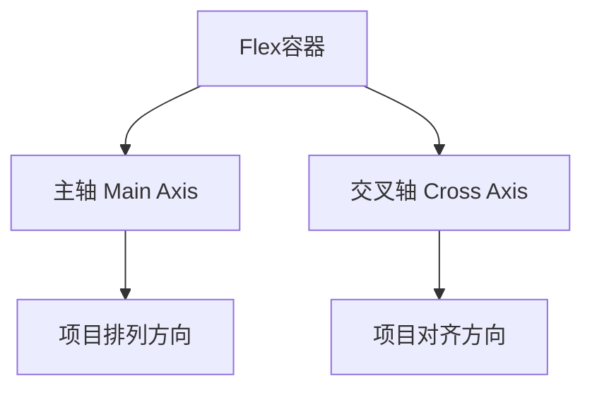

# Flexbox布局

## Flexbox概述

Flexbox（弹性盒子布局）是现代CSS布局的核心技术，提供了强大的布局能力。

## 基本概念

### 1. 容器和项目
```css
/* 容器（flex container） */
.flex-container {
    display: flex;
}

/* 项目（flex item） */
.flex-item {
    /* 自动成为flex项目 */
}
```

### 2. 主轴和交叉轴


## 容器属性

### 1. flex-direction
```css
/* 设置主轴方向 */
.flex-container {
    flex-direction: row;           /* 默认：水平从左到右 */
    flex-direction: row-reverse;   /* 水平从右到左 */
    flex-direction: column;        /* 垂直从上到下 */
    flex-direction: column-reverse; /* 垂直从下到上 */
}
```

### 2. flex-wrap
```css
/* 设置换行方式 */
.flex-container {
    flex-wrap: nowrap;    /* 默认：不换行 */
    flex-wrap: wrap;      /* 换行 */
    flex-wrap: wrap-reverse; /* 反向换行 */
}
```

### 3. flex-flow
```css
/* 简写属性 */
.flex-container {
    flex-flow: row wrap;           /* direction + wrap */
    flex-flow: column nowrap;      /* 垂直不换行 */
}
```

### 4. justify-content
```css
/* 主轴对齐方式 */
.flex-container {
    justify-content: flex-start;    /* 默认：左对齐 */
    justify-content: flex-end;      /* 右对齐 */
    justify-content: center;        /* 居中对齐 */
    justify-content: space-between; /* 两端对齐 */
    justify-content: space-around;  /* 环绕分布 */
    justify-content: space-evenly;  /* 均匀分布 */
}
```

### 5. align-items
```css
/* 交叉轴对齐方式 */
.flex-container {
    align-items: stretch;    /* 默认：拉伸 */
    align-items: flex-start; /* 顶部对齐 */
    align-items: flex-end;   /* 底部对齐 */
    align-items: center;     /* 居中对齐 */
    align-items: baseline;   /* 基线对齐 */
}
```

### 6. align-content
```css
/* 多行对齐方式 */
.flex-container {
    align-content: stretch;      /* 默认：拉伸 */
    align-content: flex-start;   /* 顶部对齐 */
    align-content: flex-end;     /* 底部对齐 */
    align-content: center;       /* 居中对齐 */
    align-content: space-between; /* 两端对齐 */
    align-content: space-around;  /* 环绕分布 */
}
```

## 项目属性

### 1. flex-grow
```css
/* 放大比例 */
.flex-item {
    flex-grow: 0;    /* 默认：不放大 */
    flex-grow: 1;    /* 放大1倍 */
    flex-grow: 2;    /* 放大2倍 */
}
```

### 2. flex-shrink
```css
/* 缩小比例 */
.flex-item {
    flex-shrink: 1;  /* 默认：可缩小 */
    flex-shrink: 0;  /* 不缩小 */
    flex-shrink: 2;  /* 缩小2倍 */
}
```

### 3. flex-basis
```css
/* 基础尺寸 */
.flex-item {
    flex-basis: auto;    /* 默认：自动 */
    flex-basis: 200px;   /* 固定宽度 */
    flex-basis: 50%;     /* 百分比 */
    flex-basis: 0;       /* 最小尺寸 */
}
```

### 4. flex
```css
/* 简写属性 */
.flex-item {
    flex: 1;                    /* grow: 1, shrink: 1, basis: 0% */
    flex: 0 1 auto;            /* 默认值 */
    flex: 2 1 200px;           /* grow: 2, shrink: 1, basis: 200px */
    flex: none;                /* 0 0 auto */
    flex: auto;                /* 1 1 auto */
}
```

### 5. align-self
```css
/* 单个项目对齐 */
.flex-item {
    align-self: auto;        /* 默认：继承父容器 */
    align-self: flex-start;  /* 顶部对齐 */
    align-self: flex-end;    /* 底部对齐 */
    align-self: center;      /* 居中对齐 */
    align-self: stretch;     /* 拉伸 */
}
```

### 6. order
```css
/* 排序 */
.flex-item {
    order: 0;    /* 默认：原始顺序 */
    order: 1;    /* 排在后面 */
    order: -1;   /* 排在前面 */
}
```

## 实际应用场景

### 1. 水平居中
```css
/* 水平居中 */
.center-horizontal {
    display: flex;
    justify-content: center;
}

/* 垂直居中 */
.center-vertical {
    display: flex;
    align-items: center;
}

/* 完全居中 */
.center-both {
    display: flex;
    justify-content: center;
    align-items: center;
}
```

### 2. 导航菜单
```css
/* 水平导航 */
.nav {
    display: flex;
    justify-content: space-between;
    align-items: center;
    padding: 1rem;
}

.nav-logo {
    flex: 0 0 auto;
}

.nav-menu {
    display: flex;
    gap: 2rem;
}

.nav-actions {
    display: flex;
    gap: 1rem;
}
```

### 3. 卡片布局
```css
/* 卡片容器 */
.card-container {
    display: flex;
    flex-wrap: wrap;
    gap: 1rem;
}

.card {
    flex: 1 1 300px;
    min-width: 0;
    background: white;
    border-radius: 8px;
    box-shadow: 0 2px 4px rgba(0,0,0,0.1);
    padding: 1.5rem;
}
```

### 4. 表单布局
```css
/* 表单行 */
.form-row {
    display: flex;
    gap: 1rem;
    margin-bottom: 1rem;
}

.form-group {
    flex: 1;
    min-width: 0;
}

.form-group.half {
    flex: 0 0 50%;
}

.form-group.third {
    flex: 0 0 33.333%;
}
```

### 5. 响应式网格
```css
/* 响应式网格 */
.responsive-grid {
    display: flex;
    flex-wrap: wrap;
    gap: 1rem;
}

.grid-item {
    flex: 1 1 300px;
    min-width: 0;
}

/* 移动端单列 */
@media (max-width: 767px) {
    .grid-item {
        flex: 1 1 100%;
    }
}

/* 平板端两列 */
@media (min-width: 768px) and (max-width: 1023px) {
    .grid-item {
        flex: 1 1 50%;
    }
}

/* 桌面端三列 */
@media (min-width: 1024px) {
    .grid-item {
        flex: 1 1 33.333%;
    }
}
```

## 高级技巧

### 1. 圣杯布局
```css
/* 圣杯布局 */
.holy-grail {
    display: flex;
    flex-direction: column;
    min-height: 100vh;
}

.holy-grail-header {
    flex: 0 0 auto;
}

.holy-grail-main {
    display: flex;
    flex: 1;
}

.holy-grail-content {
    flex: 1;
    min-width: 0;
}

.holy-grail-sidebar {
    flex: 0 0 250px;
    order: -1;
}

.holy-grail-aside {
    flex: 0 0 200px;
}

.holy-grail-footer {
    flex: 0 0 auto;
}
```

### 2. 粘性页脚
```css
/* 粘性页脚 */
.sticky-footer {
    display: flex;
    flex-direction: column;
    min-height: 100vh;
}

.sticky-footer-main {
    flex: 1;
}

.sticky-footer-footer {
    flex: 0 0 auto;
}
```

### 3. 等高列
```css
/* 等高列 */
.equal-height {
    display: flex;
    align-items: stretch;
}

.equal-height-item {
    flex: 1;
    display: flex;
    flex-direction: column;
}

.equal-height-content {
    flex: 1;
}
```

## 性能优化

### 1. 避免过度嵌套
```css
/* 避免：过度嵌套 */
.avoid-nesting {
    display: flex;
}

.avoid-nesting .nested {
    display: flex;
}

.avoid-nesting .nested .deep {
    display: flex;
}

/* 推荐：扁平化结构 */
.flat-structure {
    display: flex;
    flex-wrap: wrap;
}
```

### 2. 合理使用flex属性
```css
/* 推荐：使用简写 */
.efficient {
    flex: 1;
}

/* 避免：分别设置 */
.inefficient {
    flex-grow: 1;
    flex-shrink: 1;
    flex-basis: 0%;
}
```

### 3. 避免不必要的重排
```css
/* 推荐：使用固定尺寸 */
.optimized {
    flex: 0 0 200px;
}

/* 避免：动态计算 */
.avoid {
    flex: 1 1 auto;
    min-width: 200px;
    max-width: 300px;
}
```

## 常见问题

### 1. 项目溢出
```css
/* 问题：项目溢出 */
.overflow-issue {
    display: flex;
}

.overflow-issue .item {
    flex: 1;
    min-width: 300px;
}

/* 解决：设置最小宽度 */
.overflow-fix {
    display: flex;
    flex-wrap: wrap;
}

.overflow-fix .item {
    flex: 1 1 300px;
    min-width: 0;
}
```

### 2. 对齐问题
```css
/* 问题：对齐不正确 */
.alignment-issue {
    display: flex;
    align-items: center;
}

.alignment-issue .item {
    height: 100px;
}

/* 解决：使用align-self */
.alignment-fix {
    display: flex;
    align-items: stretch;
}

.alignment-fix .item {
    align-self: center;
    height: 100px;
}
```

### 3. 响应式问题
```css
/* 问题：移动端布局 */
.mobile-issue {
    display: flex;
    gap: 2rem;
}

/* 解决：响应式调整 */
.mobile-fix {
    display: flex;
    gap: 2rem;
}

@media (max-width: 767px) {
    .mobile-fix {
        flex-direction: column;
        gap: 1rem;
    }
}
```

## 相关链接

- [[Grid布局]] - 学习网格布局
- [[布局对比与选择]] - 了解布局选择
- [[响应式设计/媒体查询]] - 学习响应式设计
- [[性能优化/渲染优化]] - 优化布局性能

## 实践练习

### 基础练习
1. 创建水平居中布局
2. 实现导航菜单
3. 设计卡片布局

### 进阶练习
1. 构建复杂Flexbox布局
2. 实现响应式网格
3. 优化Flexbox性能

---

*下一步：学习 [[Grid布局]] 掌握网格布局系统*
