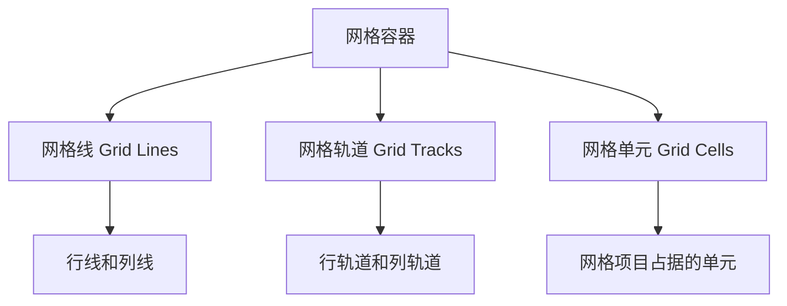

# Grid布局

## Grid布局概述

CSS Grid（网格布局）是二维布局系统，提供了强大的网格布局能力。

## 基本概念

### 1. 网格容器和网格项目
```css
/* 网格容器（grid container） */
.grid-container {
    display: grid;
}

/* 网格项目（grid item） */
.grid-item {
    /* 自动成为网格项目 */
}
```

### 2. 网格线、网格轨道和网格单元


## 容器属性

### 1. grid-template-columns
```css
/* 定义列轨道 */
.grid-container {
    grid-template-columns: 200px 200px 200px;
    grid-template-columns: 1fr 2fr 1fr;
    grid-template-columns: repeat(3, 1fr);
    grid-template-columns: 100px 1fr 100px;
    grid-template-columns: [start] 1fr [middle] 1fr [end];
}
```

### 2. grid-template-rows
```css
/* 定义行轨道 */
.grid-container {
    grid-template-rows: 100px 200px 100px;
    grid-template-rows: 1fr 2fr 1fr;
    grid-template-rows: repeat(3, 1fr);
    grid-template-rows: auto 1fr auto;
}
```

### 3. grid-template-areas
```css
/* 定义网格区域 */
.grid-container {
    grid-template-areas: 
        "header header header"
        "sidebar main aside"
        "footer footer footer";
}

.header { grid-area: header; }
.sidebar { grid-area: sidebar; }
.main { grid-area: main; }
.aside { grid-area: aside; }
.footer { grid-area: footer; }
```

### 4. grid-template
```css
/* 简写属性 */
.grid-container {
    grid-template: 
        "header header header" 60px
        "sidebar main aside" 1fr
        "footer footer footer" 40px
        / 200px 1fr 200px;
}
```

### 5. gap属性
```css
/* 网格间距 */
.grid-container {
    gap: 20px;              /* 行和列间距相同 */
    row-gap: 20px;          /* 行间距 */
    column-gap: 30px;       /* 列间距 */
    gap: 20px 30px;         /* 行间距 列间距 */
}
```

### 6. justify-items
```css
/* 水平对齐网格项目 */
.grid-container {
    justify-items: start;    /* 左对齐 */
    justify-items: end;      /* 右对齐 */
    justify-items: center;   /* 居中对齐 */
    justify-items: stretch;  /* 拉伸（默认） */
}
```

### 7. align-items
```css
/* 垂直对齐网格项目 */
.grid-container {
    align-items: start;      /* 顶部对齐 */
    align-items: end;        /* 底部对齐 */
    align-items: center;     /* 居中对齐 */
    align-items: stretch;    /* 拉伸（默认） */
}
```

### 8. justify-content
```css
/* 水平对齐整个网格 */
.grid-container {
    justify-content: start;      /* 左对齐 */
    justify-content: end;        /* 右对齐 */
    justify-content: center;     /* 居中对齐 */
    justify-content: stretch;    /* 拉伸（默认） */
    justify-content: space-around; /* 环绕分布 */
    justify-content: space-between; /* 两端对齐 */
    justify-content: space-evenly;  /* 均匀分布 */
}
```

### 9. align-content
```css
/* 垂直对齐整个网格 */
.grid-container {
    align-content: start;        /* 顶部对齐 */
    align-content: end;          /* 底部对齐 */
    align-content: center;       /* 居中对齐 */
    align-content: stretch;      /* 拉伸（默认） */
    align-content: space-around; /* 环绕分布 */
    align-content: space-between; /* 两端对齐 */
    align-content: space-evenly;  /* 均匀分布 */
}
```

## 项目属性

### 1. grid-column
```css
/* 列位置 */
.grid-item {
    grid-column: 1 / 3;         /* 从第1列到第3列 */
    grid-column: 1 / span 2;    /* 从第1列开始，跨越2列 */
    grid-column: 1;             /* 只占据第1列 */
    grid-column: -1;            /* 最后一列 */
}
```

### 2. grid-row
```css
/* 行位置 */
.grid-item {
    grid-row: 1 / 3;            /* 从第1行到第3行 */
    grid-row: 1 / span 2;       /* 从第1行开始，跨越2行 */
    grid-row: 1;                /* 只占据第1行 */
    grid-row: -1;               /* 最后一行 */
}
```

### 3. grid-area
```css
/* 简写属性 */
.grid-item {
    grid-area: 1 / 1 / 3 / 3;   /* row-start / col-start / row-end / col-end */
    grid-area: header;          /* 使用命名区域 */
    grid-area: 1 / 1 / span 2 / span 2; /* 使用span */
}
```

### 4. justify-self
```css
/* 单个项目水平对齐 */
.grid-item {
    justify-self: start;        /* 左对齐 */
    justify-self: end;          /* 右对齐 */
    justify-self: center;       /* 居中对齐 */
    justify-self: stretch;      /* 拉伸（默认） */
}
```

### 5. align-self
```css
/* 单个项目垂直对齐 */
.grid-item {
    align-self: start;          /* 顶部对齐 */
    align-self: end;            /* 底部对齐 */
    align-self: center;         /* 居中对齐 */
    align-self: stretch;        /* 拉伸（默认） */
}
```

## 实际应用场景

### 1. 页面布局
```css
/* 页面布局 */
.page-layout {
    display: grid;
    grid-template-areas: 
        "header header header"
        "sidebar main aside"
        "footer footer footer";
    grid-template-rows: 60px 1fr 40px;
    grid-template-columns: 200px 1fr 200px;
    min-height: 100vh;
    gap: 1rem;
}

.header { grid-area: header; }
.sidebar { grid-area: sidebar; }
.main { grid-area: main; }
.aside { grid-area: aside; }
.footer { grid-area: footer; }
```

### 2. 卡片网格
```css
/* 卡片网格 */
.card-grid {
    display: grid;
    grid-template-columns: repeat(auto-fit, minmax(300px, 1fr));
    gap: 2rem;
    padding: 2rem;
}

.card {
    background: white;
    border-radius: 8px;
    box-shadow: 0 2px 4px rgba(0,0,0,0.1);
    padding: 1.5rem;
}
```

### 3. 图片画廊
```css
/* 图片画廊 */
.gallery {
    display: grid;
    grid-template-columns: repeat(auto-fill, minmax(250px, 1fr));
    gap: 1rem;
    padding: 1rem;
}

.gallery-item {
    aspect-ratio: 1;
    overflow: hidden;
    border-radius: 8px;
}

.gallery-item img {
    width: 100%;
    height: 100%;
    object-fit: cover;
}
```

### 4. 表单布局
```css
/* 表单布局 */
.form-grid {
    display: grid;
    grid-template-columns: 1fr 1fr;
    gap: 1rem 2rem;
    max-width: 600px;
}

.form-group {
    display: contents;
}

.form-label {
    grid-column: 1;
    align-self: center;
}

.form-input {
    grid-column: 2;
}

.form-group.full-width {
    grid-column: 1 / -1;
}

.form-group.full-width .form-input {
    grid-column: 1 / -1;
}
```

### 5. 响应式网格
```css
/* 响应式网格 */
.responsive-grid {
    display: grid;
    gap: 1rem;
    padding: 1rem;
}

/* 移动端单列 */
@media (max-width: 767px) {
    .responsive-grid {
        grid-template-columns: 1fr;
    }
}

/* 平板端两列 */
@media (min-width: 768px) and (max-width: 1023px) {
    .responsive-grid {
        grid-template-columns: repeat(2, 1fr);
    }
}

/* 桌面端三列 */
@media (min-width: 1024px) {
    .responsive-grid {
        grid-template-columns: repeat(3, 1fr);
    }
}

/* 大屏幕四列 */
@media (min-width: 1440px) {
    .responsive-grid {
        grid-template-columns: repeat(4, 1fr);
    }
}
```

## 高级技巧

### 1. 命名网格线
```css
/* 命名网格线 */
.named-grid {
    display: grid;
    grid-template-columns: 
        [sidebar-start] 200px 
        [sidebar-end main-start] 1fr 
        [main-end aside-start] 200px 
        [aside-end];
    grid-template-rows: 
        [header-start] 60px 
        [header-end content-start] 1fr 
        [content-end footer-start] 40px 
        [footer-end];
}

.header {
    grid-column: sidebar-start / aside-end;
    grid-row: header-start / header-end;
}

.sidebar {
    grid-column: sidebar-start / sidebar-end;
    grid-row: content-start / content-end;
}
```

### 2. 子网格
```css
/* 子网格（现代浏览器支持） */
.parent-grid {
    display: grid;
    grid-template-columns: repeat(4, 1fr);
    gap: 1rem;
}

.child-grid {
    display: grid;
    grid-template-columns: subgrid;
    grid-column: span 2;
}
```

### 3. 动态网格
```css
/* 动态网格 */
.dynamic-grid {
    display: grid;
    grid-template-columns: repeat(var(--columns, 3), 1fr);
    gap: var(--gap, 1rem);
}

/* 通过CSS变量控制 */
.dynamic-grid.columns-2 {
    --columns: 2;
}

.dynamic-grid.columns-4 {
    --columns: 4;
}

.dynamic-grid.large-gap {
    --gap: 2rem;
}
```

## 性能优化

### 1. 避免过度嵌套
```css
/* 避免：过度嵌套 */
.avoid-nesting {
    display: grid;
}

.avoid-nesting .nested {
    display: grid;
}

/* 推荐：扁平化结构 */
.flat-structure {
    display: grid;
    grid-template-columns: repeat(12, 1fr);
}
```

### 2. 合理使用auto-fit和auto-fill
```css
/* 推荐：使用auto-fit */
.auto-fit {
    grid-template-columns: repeat(auto-fit, minmax(300px, 1fr));
}

/* 避免：固定列数 */
.fixed-columns {
    grid-template-columns: repeat(3, 1fr);
}
```

### 3. 优化网格计算
```css
/* 推荐：使用fr单位 */
.efficient {
    grid-template-columns: 200px 1fr 200px;
}

/* 避免：复杂计算 */
.inefficient {
    grid-template-columns: 200px calc(100% - 400px) 200px;
}
```

## 常见问题

### 1. 网格项目溢出
```css
/* 问题：项目溢出 */
.overflow-issue {
    display: grid;
    grid-template-columns: repeat(3, 200px);
}

/* 解决：使用minmax */
.overflow-fix {
    display: grid;
    grid-template-columns: repeat(auto-fit, minmax(200px, 1fr));
}
```

### 2. 响应式问题
```css
/* 问题：移动端布局 */
.mobile-issue {
    display: grid;
    grid-template-columns: repeat(3, 1fr);
    gap: 2rem;
}

/* 解决：响应式调整 */
.mobile-fix {
    display: grid;
    grid-template-columns: repeat(auto-fit, minmax(250px, 1fr));
    gap: 1rem;
}

@media (max-width: 767px) {
    .mobile-fix {
        grid-template-columns: 1fr;
        gap: 0.5rem;
    }
}
```

### 3. 对齐问题
```css
/* 问题：对齐不正确 */
.alignment-issue {
    display: grid;
    grid-template-columns: repeat(3, 1fr);
}

/* 解决：使用对齐属性 */
.alignment-fix {
    display: grid;
    grid-template-columns: repeat(3, 1fr);
    justify-items: center;
    align-items: center;
}
```

## 相关链接

- [[Flexbox布局]] - 学习弹性布局
- [[布局对比与选择]] - 了解布局选择
- [[响应式设计/媒体查询]] - 学习响应式设计
- [[性能优化/渲染优化]] - 优化布局性能

## 实践练习

### 基础练习
1. 创建页面布局
2. 实现卡片网格
3. 设计表单布局

### 进阶练习
1. 构建复杂Grid布局
2. 实现响应式网格
3. 优化Grid性能

---

*下一步：学习 [[布局对比与选择]] 了解布局选择策略*
