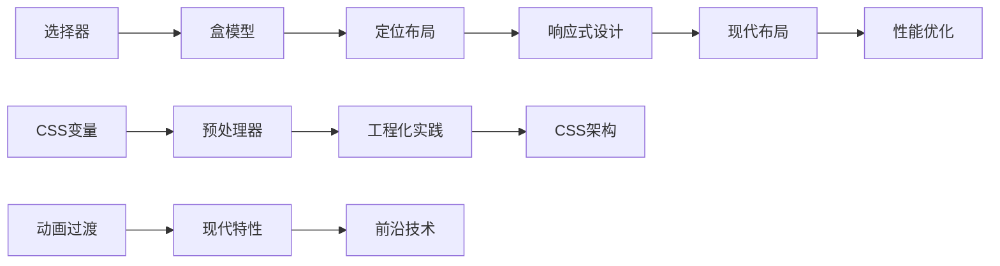
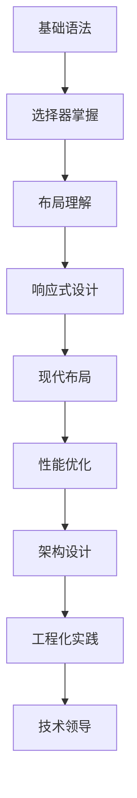

# CSS知识地图

## 知识体系概览

```mermaid
graph TD
    A[CSS知识体系] --> B[01-基础认知层]
    A --> C[02-核心理解层]
    A --> D[03-应用实践层]
    A --> E[04-高级进阶层]
    A --> F[05-实战项目]
    A --> G[06-资源汇总]
    
    B --> B1[CSS概述与基础概念]
    B --> B2[CSS语法与结构]
    B --> B3[CSS引入方式]
    B --> B4[浏览器渲染原理]
    
    C --> C1[选择器系统]
    C --> C2[盒模型]
    C --> C3[定位与布局]
    C --> C4[文本与字体]
    C --> C5[颜色与背景]
    C --> C6[CSS变量与自定义属性]
    
    D --> D1[响应式设计]
    D --> D2[动画与过渡]
    D --> D3[现代布局]
    D --> D4[现代CSS特性]
    D --> D5[预处理器]
    D --> D6[性能优化]
    
    E --> E1[CSS架构]
    E --> E2[工程化实践]
    E --> E3[浏览器兼容性]
    E --> E4[调试技巧]
    E --> E5[最佳实践]
    E --> E6[前沿技术]
    
    F --> F1[项目案例]
    F --> F2[练习题库]
    
    G --> G1[速查与FAQ]
    G --> G2[常用属性速查]
    G --> G3[浏览器支持表]
    G --> G4[工具推荐]
    G --> G5[学习资源]
```

## 学习路径导航

### 🎯 学习目标设定
- **初学者**：掌握CSS基础语法和核心概念
- **中级开发者**：熟练运用现代CSS特性和布局技术
- **高级开发者**：掌握CSS架构设计和工程化实践

### 📚 分层学习策略

#### 01-基础认知层
**学习目标**：建立CSS基础认知框架
- [[01-基础认知层/CSS概述与基础概念]] - 了解CSS本质和作用
- [[01-基础认知层/CSS语法与结构]] - 掌握基本语法规则
- [[01-基础认知层/CSS引入方式]] - 学会在HTML中使用CSS
- [[01-基础认知层/浏览器渲染原理]] - 理解浏览器如何渲染CSS

**学习时间**：1-2周
**实践重点**：基础语法练习、简单样式应用

#### 02-核心理解层
**学习目标**：深入理解CSS核心机制
- [[02-核心理解层/选择器系统]] - 掌握选择器的使用和优先级
- [[02-核心理解层/盒模型]] - 理解元素尺寸和布局基础
- [[02-核心理解层/定位与布局]] - 学会控制元素位置和布局
- [[02-核心理解层/文本与字体]] - 掌握文本样式和字体控制
- [[02-核心理解层/颜色与背景]] - 学会使用颜色和背景效果
- [[02-核心理解层/CSS变量与自定义属性]] - 理解CSS变量系统

**学习时间**：3-4周
**实践重点**：布局练习、样式设计、选择器优化

#### 03-应用实践层
**学习目标**：掌握现代CSS应用技术
- [[03-应用实践层/响应式设计]] - 学会创建响应式网站
- [[03-应用实践层/动画与过渡]] - 掌握CSS动画和交互效果
- [[03-应用实践层/现代布局]] - 熟练使用Flexbox和Grid
- [[03-应用实践层/现代CSS特性]] - 学习最新CSS功能
- [[03-应用实践层/预处理器]] - 掌握Sass/Less等工具
- [[03-应用实践层/性能优化]] - 学会优化CSS性能

**学习时间**：4-5周
**实践重点**：响应式项目、动画效果、性能优化

#### 04-高级进阶层
**学习目标**：掌握CSS架构和工程化实践
- [[04-高级进阶层/CSS架构]] - 学习BEM、OOCSS等架构方法
- [[04-高级进阶层/工程化实践]] - 掌握CSS模块化和构建工具
- [[04-高级进阶层/浏览器兼容性]] - 学会处理兼容性问题
- [[04-高级进阶层/调试技巧]] - 掌握CSS调试和问题排查
- [[04-高级进阶层/最佳实践]] - 学习CSS开发最佳实践
- [[04-高级进阶层/前沿技术]] - 了解CSS未来发展趋势

**学习时间**：5-6周
**实践重点**：架构设计、团队协作、技术选型

#### 05-实战项目
**学习目标**：通过项目实践巩固知识
- [[05-实战项目/项目案例]] - 学习真实项目案例
- [[05-实战项目/练习题库]] - 通过练习提升技能

**学习时间**：持续实践
**实践重点**：项目开发、问题解决、经验积累

#### 06-资源汇总
**学习目标**：建立知识查询和参考体系
- [[06-资源汇总/速查与FAQ]] - 快速查找语法和解决问题
- [[06-资源汇总/常用属性速查]] - 查找属性用法和示例
- [[06-资源汇总/浏览器支持表]] - 查看兼容性信息
- [[06-资源汇总/工具推荐]] - 了解开发工具和资源
- [[06-资源汇总/学习资源]] - 获取学习资料和教程

**学习时间**：持续参考
**实践重点**：知识查询、工具使用、资源整合

## 知识关联图谱

### 核心概念关联

### 技能发展路径

## 学习检查清单

### 基础认知层检查
- [ ] 理解CSS的作用和重要性
- [ ] 掌握CSS基本语法结构
- [ ] 学会在HTML中引入CSS
- [ ] 了解浏览器渲染CSS的过程

### 核心理解层检查
- [ ] 熟练使用各种选择器
- [ ] 理解盒模型的计算方式
- [ ] 掌握定位和布局方法
- [ ] 学会控制文本和字体样式
- [ ] 熟练使用颜色和背景属性
- [ ] 理解CSS变量的作用域

### 应用实践层检查
- [ ] 能够创建响应式网站
- [ ] 掌握CSS动画和过渡效果
- [ ] 熟练使用Flexbox和Grid布局
- [ ] 了解现代CSS新特性
- [ ] 能够使用CSS预处理器
- [ ] 掌握CSS性能优化方法

### 高级进阶层检查
- [ ] 理解CSS架构设计原则
- [ ] 掌握CSS工程化实践
- [ ] 能够处理浏览器兼容性问题
- [ ] 熟练使用CSS调试技巧
- [ ] 遵循CSS开发最佳实践
- [ ] 了解CSS前沿技术发展

## 实践项目建议

### 初级项目
1. **个人简历页面** - 练习基础布局和样式
2. **产品展示页面** - 学习响应式设计
3. **动画效果展示** - 掌握CSS动画技术

### 中级项目
1. **电商网站首页** - 综合运用布局技术
2. **管理后台界面** - 学习组件化设计
3. **移动端应用界面** - 掌握移动端适配

### 高级项目
1. **设计系统构建** - 学习CSS架构设计
2. **大型网站重构** - 掌握性能优化
3. **开源组件库** - 实践工程化开发

## 学习资源导航

### 快速查询
- [[06-资源汇总/CSS速查表]] - 语法快速查询
- [[06-资源汇总/常用属性速查]] - 属性用法查询
- [[06-资源汇总/浏览器支持表]] - 兼容性查询

### 问题解决
- [[06-资源汇总/CSS常见问题FAQ]] - 常见问题解答
- [[04-高级进阶层/调试技巧]] - 调试方法指南
- [[04-高级进阶层/最佳实践]] - 最佳实践参考

### 工具资源
- [[06-资源汇总/工具推荐]] - 开发工具推荐
- [[06-资源汇总/学习资源]] - 学习资料汇总
- [[06-资源汇总/CSS学习路径图]] - 学习路径指导

## 持续学习建议

### 学习方法
1. **费曼学习法** - 通过教授他人来巩固知识
2. **刻意练习** - 有针对性的技能练习
3. **项目驱动** - 通过实际项目学习
4. **社区参与** - 参与技术社区讨论

### 学习节奏
- **每日学习**：30-60分钟理论学习
- **每周实践**：2-3小时项目练习
- **每月总结**：回顾学习成果和不足
- **每季度提升**：学习新技术和趋势

### 知识更新
- **关注规范** - 跟踪CSS规范更新
- **学习新技术** - 了解CSS新特性
- **实践应用** - 在实际项目中应用新技术
- **分享经验** - 向社区分享学习心得

---

*这是一个完整的CSS知识体系，按照金字塔模型构建，从基础认知到高级应用，层层递进。每个层级都有明确的学习目标和实践重点，通过内部链接实现知识点的有机连接。*

*开始你的CSS学习之旅吧！建议从 [[01-基础认知层/CSS概述与基础概念]] 开始。*
