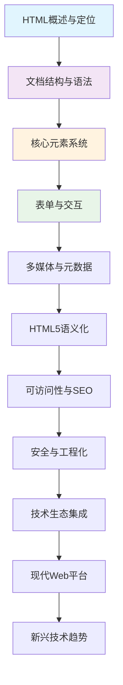
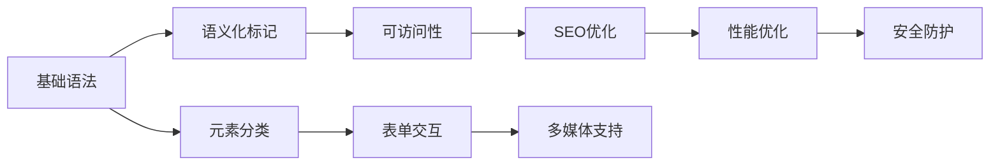

# HTML学习路径规划

## 🎯 学习目标设定

### 认知目标 | Understanding Goals
| 层级 | 目标描述 | 评估标准 |
|------|----------|----------|
| **基础认知** | 理解HTML在Web架构中的作用 | 能够解释HTML的核心价值 |
| **理解运用** | 掌握HTML语法和常用元素 | 能够独立编写基础HTML文档 |
| **实践深化** | 应用现代HTML最佳实践 | 能够构建高质量的Web页面 |
| **知识拓展** | 具备工程化思维和技术视野 | 能够在项目中做出技术决策 |

## 🗺️ INTJ学习路径图

## 📚 学习策略

### 费曼学习法应用
1. **选择概念** → 从基础认知层开始
2. **教授他人** → 用自己的话总结每个知识点
3. **发现问题** → 识别知识漏洞，回到相关章节
4. **简化表达** → 用类比和图表辅助理解

### 刻意练习原则
| 练习类型 | 频率建议 | 目标 |
|----------|----------|------|
| **基础练习** | 每天30分钟 | 巩固语法记忆 |
| **项目实战** | 每周2-3次 | 应用综合技能 |
| **知识拓展** | 每周1次 | 保持技术敏感度 |
| **复盘总结** | 每章节后 | 建立知识连接 |

## 🚀 学习节奏建议

### 阶段一：基础建设 (1-2周)
- 完成[01-基础认知层](01-基础认知层/)的所有内容
- 重点掌握`[[01-2 文档类型与基本结构]]`和`[[01-3 基础语法规则]]`

### 阶段二：技能掌握 (2-3周)  
- 完成[02-理解运用层](02-理解运用层/)的核心内容
- 重点练习`[[02-2 结构性标记元素]]`到`[[02-6 列表与表格结构]]`

### 阶段三：实践应用 (2-3周)
- 完成[03-实践深化层](03-实践深化层/)的重要内容
- 重点应用`[[03-1 语义化设计理念]]`和`[[03-6 WCAG可访问性标准]]`

### 阶段四：拓展深化 (持续学习)
- 根据实际需要选择性学习[04-知识拓展层](04-知识拓展层/)内容
- 定期查看`[[附录资源/学习资源汇总]]`保持技术更新

## 🔗 关键连接点

## 📊 学习效果评估

### 自我评估清单
- [ ] 能够解释HTML的核心作用和历史发展
- [ ] 能够独立编写完整的HTML文档结构
- [ ] 理解并能够应用语义化标记原则
- [ ] 掌握表单设计和用户交互的基本原理
- [ ] 了解并能够实施基本的SEO和可访问性策略
- [ ] 具备现代前端工程化的基础认知

### 实战项目检验
1. **个人博客项目** - 综合运用基础语法和语义化
2. **企业官网项目** - 实践SEO和无障碍设计
3. **管理后台项目** - 表单交互和数据展示

## 🎯 下一步行动

➡️ **立即开始**: 阅读 `[[知识图谱导航]]` 了解知识点关联
➡️ **制定计划**: 根据个人时间安排选择学习节奏
➡️ **建立习惯**: 设定固定的学习和练习时间

---

**💡 学习提示**: 这个学习路径设计遵循INTJ的认知特点，强调系统性、逻辑性和实用性。建议按顺序学习，同时充分利用Obsidian的链接功能建立知识网络。
