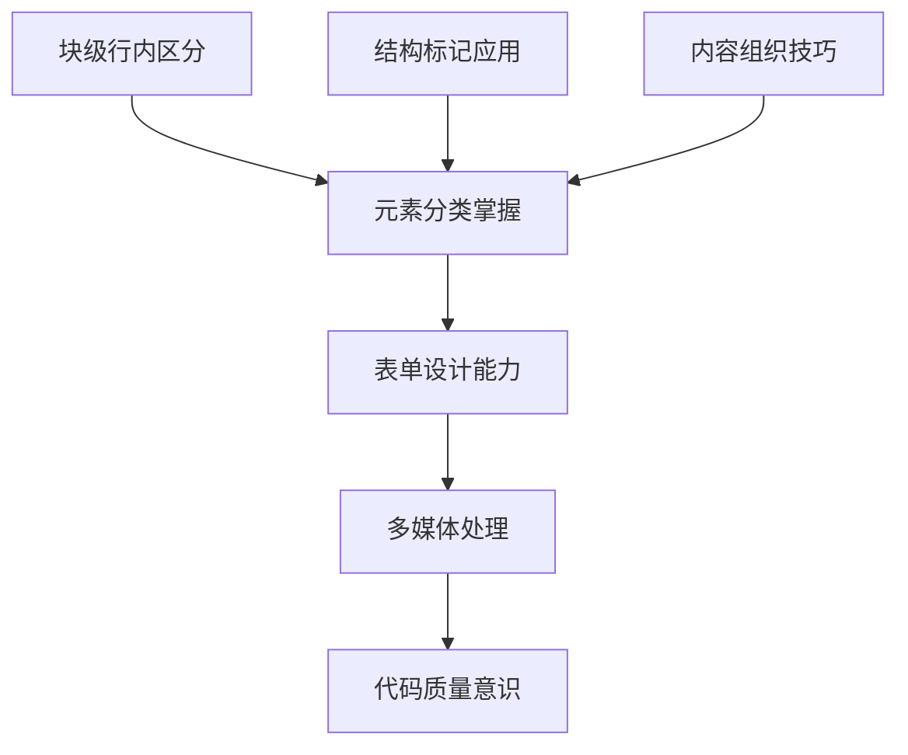
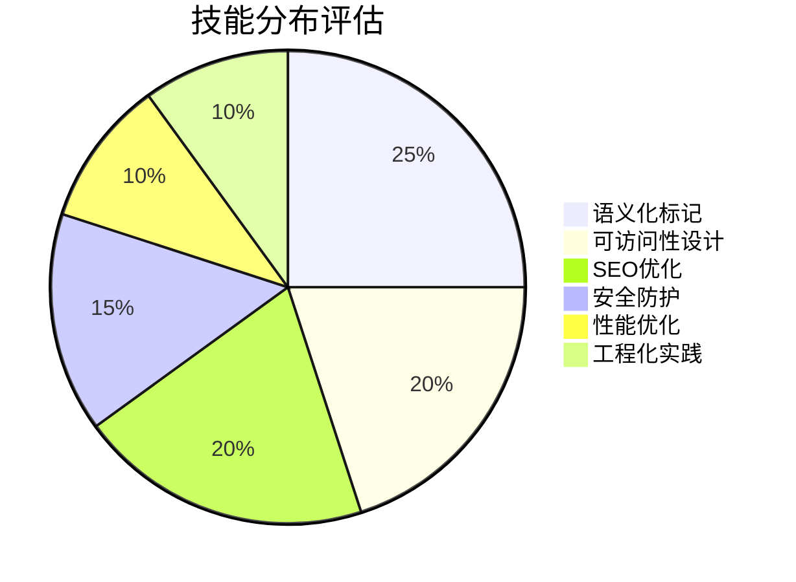
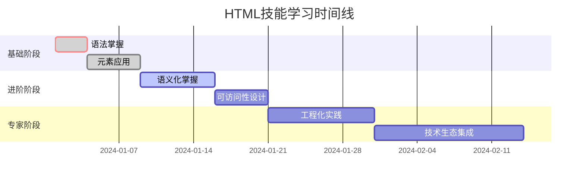

# HTML技能评估清单

## 📊 能力等级定义

| 等级 | 描述 | 特征表现 | 学习建议 |
|------|------|----------|----------|
| **🌱 新手** | 刚开始学习HTML | 能做基础标记，理解语法规则 | 深入学习基础知识 |
| **🌿 入门** | 能独立编写HTML页面 | 掌握常用元素，理解HTML结构 | 练习更多元素类型 |
| **🌳 进阶** | 理解语义化和最佳实践 | 能用语义化标签，注重可访问性 | 学习工程化实践 |
| **🏆 专家** | 具备架构思维和技术视野 | 能进行技术决策，指导团队开发 | 关注前沿技术趋势 |

## 🎯 分阶段评估标准

### 📍 基础认知层评估

| 技能点 | 新手标准 | 进阶标准 | 专家标准 |
|--------|----------|----------|----------|
| **HTML定位理解** | 能说明HTML是标记语言 | 能解释HTML在Web开发中的作用 | 能分析HTML与其他技术的协作关系 |
| **文档结构掌握** | 知道DOCTYPE和基本结构 | 能选择合适的DOCTYPE声明 | 能根据不同项目选择最优结构 |
| **语法规则应用** | 掌握基本标签语法 | 理解嵌套规则和属性使用 | 能编写规范的HTML代码 |

**💡 自我测评方式**:
- 能否解释HTML的全称和含义？
- 能否独立编写一个完整的HTML文档骨架？
- 能否识别并修正HTML语法错误？

### 📍 理解运用层评估

**📋 具体技能清单**:

#### 核心元素系统
- [ ] **元素分类**: 能区分块级元素和行内元素
- [ ] **结构标记**: 正确使用`html`、`head`、`body`等结构性标签
- [ ] **内容组织**: 合理使用`div`、`span`、`p`、`h1-h6`等
- [ ] **文本格式化**: 掌握`strong`、`em`、`mark`等格式化标签
- [ ] **链接图像**: 正确使用`a`、`img`等多媒体标签
- [ ] **列表表格**: 能创建复杂列表和表格结构

#### 表单与交互
- [ ] **表单架构**: 理解`form`、`fieldset`、`legend`的组织结构
- [ ] **输入控件**: 掌握各种`input`类型的适用场景
- [ ] **选择控件**: 能设计复杂的下拉菜单和多选框
- [ ] **验证机制**: 了解客户端表单验证的基本原理
- [ ] **用户体验**: 考虑表单的可用性和交互设计

#### 多媒体与元数据
- [ ] **音视频嵌入**: 能添加音频和视频内容
- [ ] **图形处理**: 了解Canvas和SVG的基本用法
- [ ] **Meta标签**: 掌握重要的meta标签类型
- [ ] **文档头部**: 合理组织head内的各种元素

### 📍 实践深化层评估

**🔧 工程化技能评估**:

#### HTML5语义化
- [ ] **设计理念**: 理解语义化的重要性和基本原则
- [ ] **结构语义**: 正确使用`header`、`main`、`section`、`article`等
- [ ] **内容语义**: 合理使用`aside`、`nav`、`footer`等标签
- [ ] **最佳实践**: 在项目中正确应用语义化标记

#### 可访问性与国际化
- [ ] **WCAG标准**: 了解Web内容可访问性准则
- [ ] **ARIA属性**: 能使用无障碍属性改善页面可访问性
- [ ] **键盘导航**: 设计支持键盘操作的页面
- [ ] **国际化**: 了解多语言页面设计基础

#### SEO与性能优化
- [ ] **SEO基础**: 理解搜索引擎优化的基本原理
- [ ] **结构化数据**: 了解Schema.org和结构化标记
- [ ] **性能优化**: 关注页面加载速度优化
- [ ] **移动适配**: 了解移动端SEO特殊要求

#### 安全与工程化
- [ ] **安全基础**: 了解HTML相关的安全最佳实践
- [ ] **代码质量**: 掌握代码检查和格式化工具
- [ ] **项目管理**: 了解HTML项目的组织和管理
- [ ] **工程化工具**: 熟悉现代前端构建工具

### 📍 知识拓展层评估

**🚀 技术视野评估**:

#### 技术生态集成
- [ ] **CSS协作**: 理解HTML如何与CSS协同工作
- [ ] **JavaScript交互**: 了解HTML与JavaScript的数据交互
- [ ] **前端框架**: 了解现代前端框架中HTML的角色
- [ ] **服务端集成**: 理解HTML与后端技术的集成

#### 现代Web平台
- [ ] **响应式设计**: 理解移动优先的设计理念
- [ ] **PWA支持**: 了解渐进式Web应用中的HTML
- [ ] **触摸交互**: 掌握移动设备上的交互设计

#### 新兴技术趋势
- [ ] **Web Components**: 了解自定义元素的发展
- [ ] **AI辅助**: 了解AI在HTML生成中的应用
- [ ] **未来标准**: 关注HTML6和新标准提案

## 📈 能力提升路径

### 🎯 阶段化目标设定

### 🔄 持续改进机制

**定期评估计划**:
- **每周自评**: 完成学习内容后的自我检查
- **每月回顾**: 总结一个月来的技能提升
- **项目反思**: 每完成一个项目后的经验总结
- **技术更新**: 关注HTML新特性和最佳实践

**改进建议**:
1. 设定明确的学习目标和时间期限
2. 通过实际项目验证学习成果
3. 参与社区讨论，获取他人反馈
4. 持续关注技术发展趋势

## 🏆 认证和奖励机制

### 📜 技能徽章系统
- **基础建设者** 🏗️ - 完成基础认知层学习
- **元素专家** 🔧 - 掌握核心元素系统
- **语义化大师** 📝 - 精通语义化标记
- **可访问性倡导者** ♿ - 具备无障碍设计能力
- **性能优化师** ⚡ - 掌握性能优化技巧
- **技术前瞻者** 🚀 - 了解前沿技术趋势

---

**📋 快速自评**: 根据上述清单，您现在处于哪个等级？接下来应该重点关注哪些技能点？
