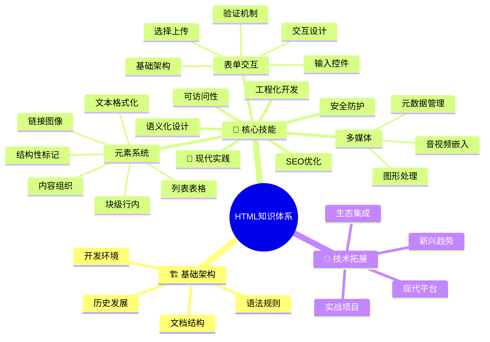
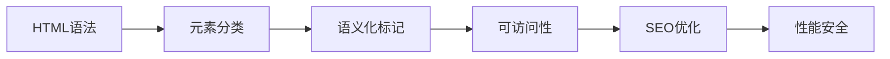
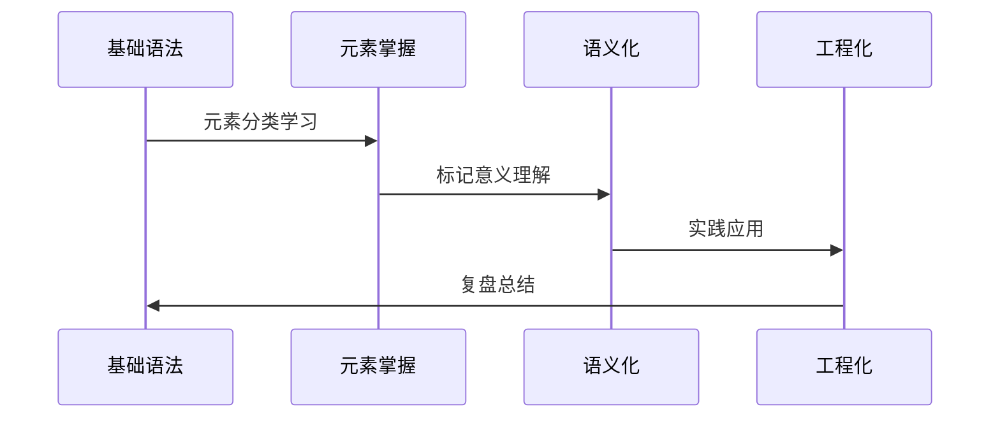
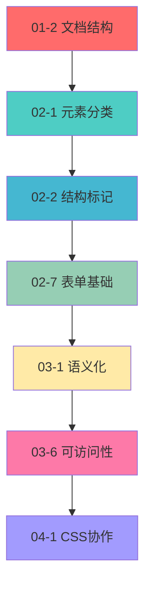
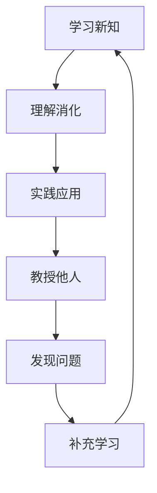

# HTML知识图谱导航

## 🧠 知识体系总览

## 🔗 关键知识点关联

### 核心概念轴

### 技能发展线

## 📍 学习节点定位

### 🔴 关键节点 (必须掌握)
| 编号 | 知识点 | 重要性 | 前置条件 |
|------|--------|--------|----------|
| 01-2 | [文档类型与基本结构](01-基础认知层/01-2%20文档类型与基本结构.md) | ⭐⭐⭐⭐⭐ | 无 |
| 02-1 | [块级与行内元素详解](02-理解运用层/02-1%20块级与行内元素详解.md) | ⭐⭐⭐⭐⭐ | 基础语法 |
| 02-2 | [结构性标记元素](02-理解运用层/核心元素系统/02-2%20结构性标记元素.md) | ⭐⭐⭐⭐⭐ | 元素分类 |
| 03-1 | [语义化设计理念](03-实践深化层/HTML5语义化/03-1%20语义化设计理念.md) | ⭐⭐⭐⭐⭐ | 元素掌握 |

### 🟡 重要节点 (应当掌握)
| 编号 | 知识点 | 重要性 | 前置条件 |
|------|--------|--------|----------|
| 02-7 | [表单基础架构](02-理解运用层/表单与交互/02-7%20表单基础架构.md) | ⭐⭐⭐⭐ | 元素系统 |
| 03-6 | [WCAG可访问性标准](03-实践深化层/可访问性与国际化/03-6%20WCAG可访问性标准.md) | ⭐⭐⭐⭐ | 语义化 |
| 03-12 | [SEO基础概念](03-实践深化层/SEO性能优化/03-12%20SEO基础概念.md) | ⭐⭐⭐⭐ | 语义化 |

### 🟢 扩展节点 (可选掌握)
| 编号 | 知识点 | 重要性 | 前置条件 |
|------|--------|--------|----------|
| 04-12 | [Web Components体系](04-知识拓展层/新兴技术趋势/04-12%20Web%20Components体系.md) | ⭐⭐⭐ | 工程化 |
| 04-14 | [AI与HTML生成](04-知识拓展层/新兴技术趋势/04-14%20AI与HTML生成.md) | ⭐⭐⭐ | 现代开发 |

## 🗺️ 学习路径映射

### 快速通道 (12小时掌握)

### 深度学习 (30小时精通)
- 包含所有🔴和🟡节点
- 添加实战项目练习
- 深入理解工程化实践

### 专家进阶 (60小时+)
- 涵盖完整知识体系
- 深入新兴技术领域
- 参与开源项目实践

## 🔄 知识循环学习

### 费曼循环模型

### 刻意练习循环
1. **基础练习** - 每天30分钟语法练习
2. **应用练习** - 每周完成一个小项目
3. **拓展练习** - 每月学习一个新技术点
4. **反思练习** - 定期回顾和总结

## 📚 推荐学习顺序

### 横向学习 (同层级内)
- 按编号顺序学习同一层级内容
- 重点理解知识点间的逻辑关系
- 通过实践项目巩固技能

### 纵向学习 (跨层级深入)
- 从基础认知到实践深化
- 每个阶段完成后进行能力评估
- 根据实际需求调整学习重点

## 🎯 个性化学习策略

### INTJ学习特点适配
- **系统性**: 建立完整的知识框架
- **逻辑性**: 理解知识点间的因果关系
- **独立性**: 自主选择学习节奏和重点
- **实用性**: 注重知识与实际应用的结合

### 记忆强化技巧
- **概念关联**: 将新知识与已有知识建立连接
- **情境模拟**: 在具体场景中应用知识点
- **项目驱动**: 通过真实项目巩固学习成果

---

**🔗 快速导航链接**:
- ➡️ 开始学习: `[[01-基础认知层]]`
- 📊 技能评估: `[[技能评估清单]]`
- 🛠️ 实战项目: `[[04-知识拓展层]]`
