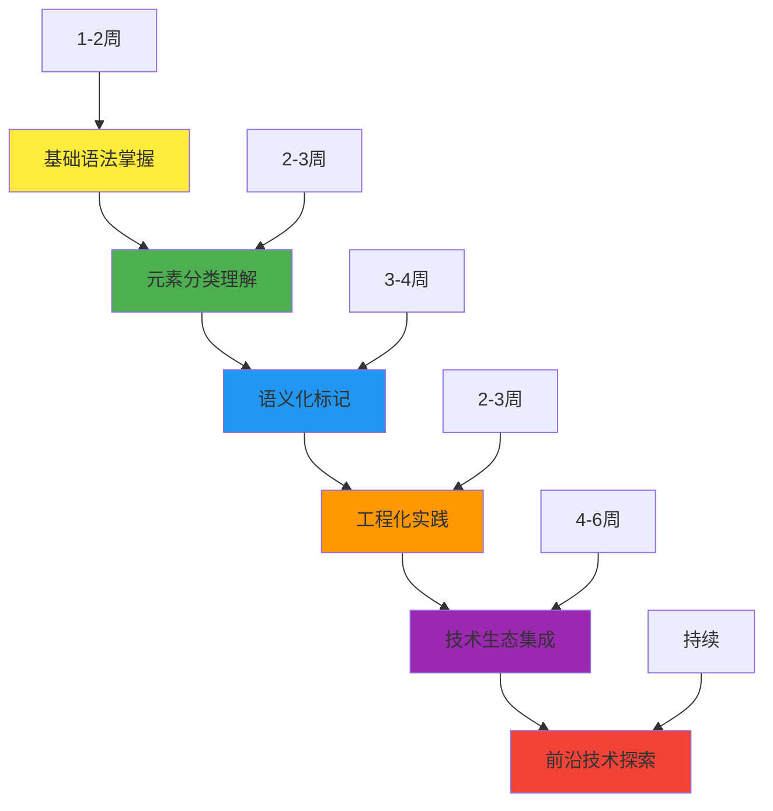
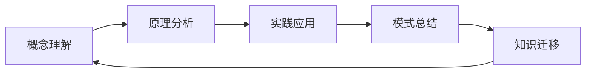
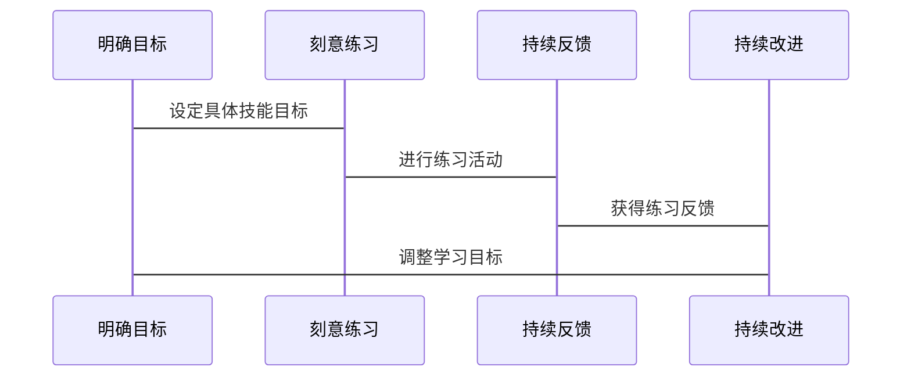
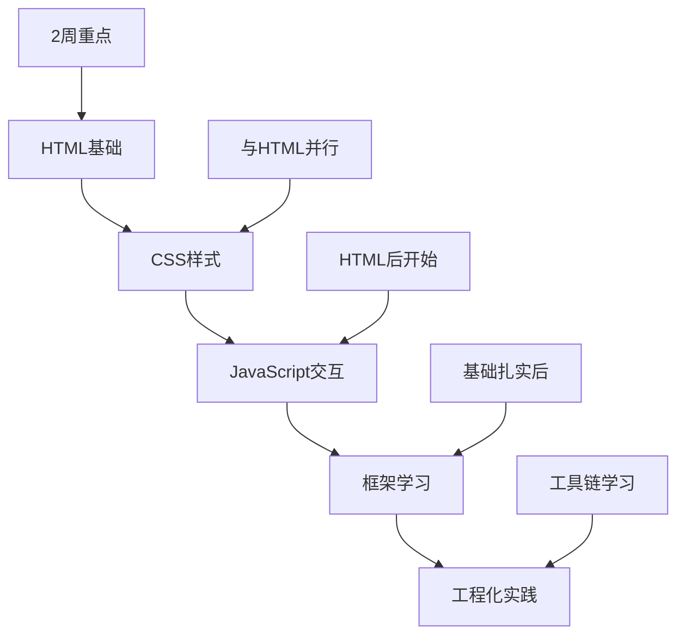
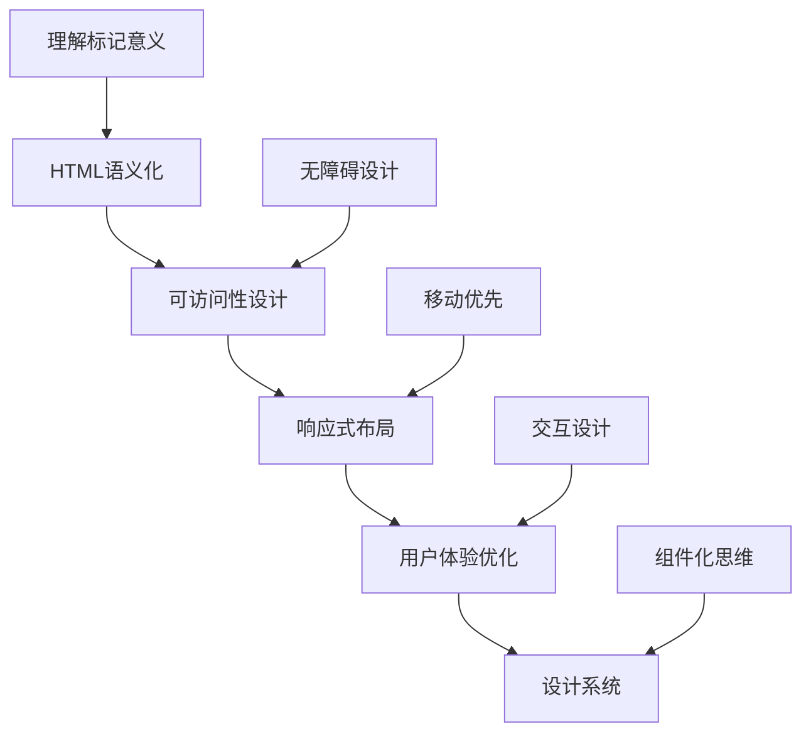
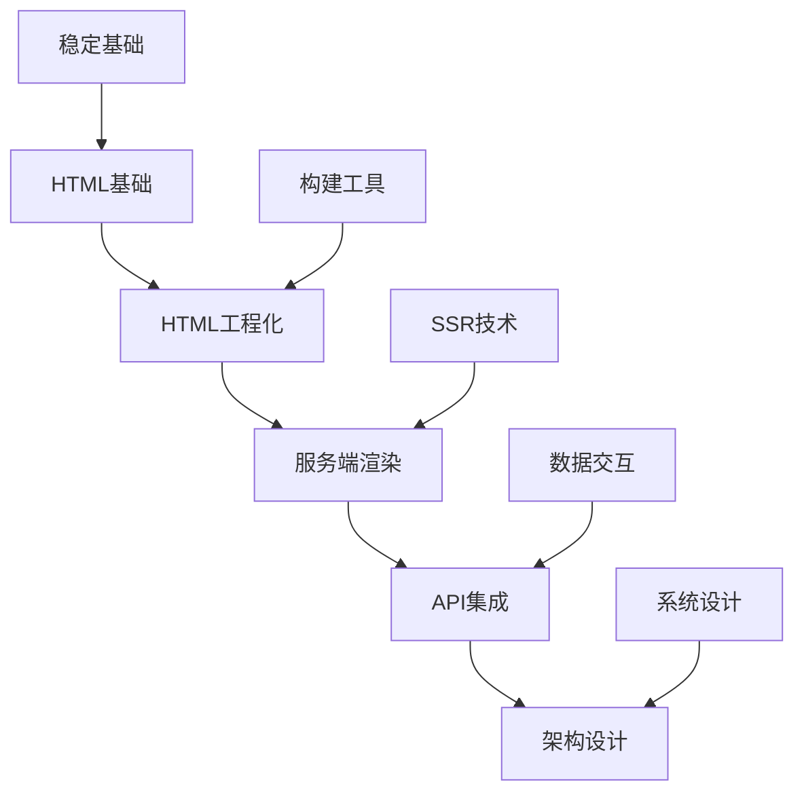
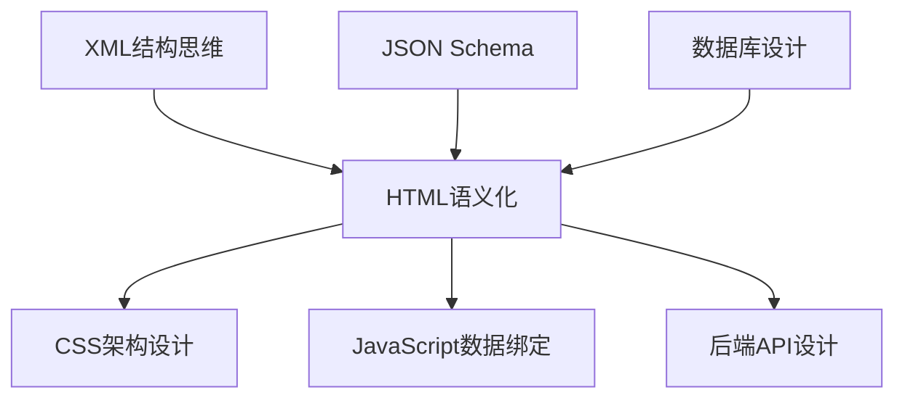
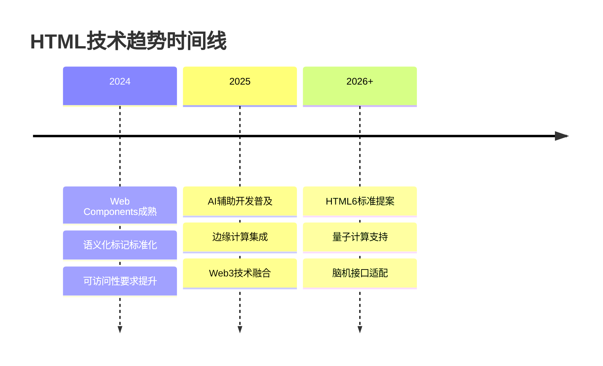

# HTML进阶学习建议

## 🚀 学习进阶路线图

### 📈 能力发展阶段



## 🎯 个性化学习策略

### INTJ学习者优化建议

**🧠 认知特点适配**:
- **系统性思维**: 建立完整的技术知识图谱
- **独立学习**: 制定个人化的学习计划
- **深度探索**: 追求技术的本质和原理
- **实用导向**: 关注知识与实际应用的结合

**⚡ 学习效率提升**:


### 📚 深度学习法

#### 费曼教授法
1. **选择概念**: 选择一个HTML概念深入学习
2. **教授他人**: 用自己的话解释这个概念
3. **发现问题**: 找出解释中的不足和模糊点
4. **回归学习**: 针对问题进行深入学习

#### 刻意练习框架


## 🔗 学习路径定制

### 🎯 职业目标导向

#### 前端开发工程师路径


#### UI/UX设计师路径


#### 全栈工程师路径


## 📖 进阶学习资源

### 📚 推荐阅读层次

| 学习阶段 | 推荐资源类型 | 具体建议 |
|----------|-------------|----------|
| **基础进阶** | 官方文档 + 实战教程 | W3C MDN + 简单项目练习 |
| **中级深化** | 最佳实践指南 + 案例分析 | Web.dev + 企业级项目源码 |
| **高级专业** | 技术前沿 + 开源项目 | GitHub trending + 技术大会分享 |
| **专家级别** | 标准制定 + 原创思考 | W3C规范 + 个人技术博客 |

### 🌐 在线学习平台

**🎓 结构化课程**:
- **MDN Web Docs** - 权威的技术文档
- **W3Schools** - 互动式学习平台
- **Codecademy** - 系统性前端课程
- **FreeCodeCamp** - 免费的完整课程

**💼 实战平台**:
- **GitHub** - 开源项目实践
- **Codepen** - 前端代码实验
- **JSFiddle** - 快速原型开发
- **Stack Overflow** - 问题解答交流

## 🔄 知识巩固策略

### 📊 遗忘曲线对抗

```mermaid
gantt
    title 知识巩固时间表
    dateFormat  HH:mm
    axisFormat %H:%M
    
    section 第一次学习
    新概念掌握           :active, 09:00, 30m
    section 24小时后复习
    快速回顾            :active, 09:30, 15m
    section 3天后复习
    深度复习            :active, 10:00, 20m
    section 1周后复习
    应用练习            :active, 10:30, 30m
    section 1月后复习
    综合回顾            :active, 11:00, 45m
```



### 🎯 主动回忆法

**认知负荷控制**:
- **分块学习**: 将复杂概念分解为小块
- **间隔重复**: 合理安排复习时间间隔
- **多样化练习**: 通过不同方式强化记忆
- **实际应用**: 在项目中使用所学知识

## 🌟 技能迁移策略

### 🔄 跨领域应用

**HTML技能向其他技术迁移**:


**通用技能养成**:
- **抽象思维**: 从具体标签到抽象概念
- **结构化思考**: 从层级标记到系统架构
- **标准化意识**: 从HTML规范到行业标准
- **用户体验**: 从标记语义到交互设计

## 📈 持续改进计划

### 🎯 学习目标设定

**SMART原则应用**:
- **S**pecific: 具体的学习目标
- **M**easurable: 可量化的进步指标
- **A**chievable: 可实现的目标设定
- **R**elevant: 与职业规划相关
- **T**ime-bound: 有时间期限的目标

### 📊 学习效果追踪

**多维度评估**:
```mermaid
radar
    title 学习效果雷达图
    "知识理解" : 80
    "实践应用" : 70
    "创新思维" : 60
    "知识迁移" : 75
    "技术视野" : 65
    "问题解决" : 85
```

### 🔄 反馈循环机制

**360度学习反馈**:
1. **自我评估**: 定期进行学习成果自查
2. **同行评议**: 参与技术社区讨论
3. **实战验证**: 通过项目实践检验
4. **导师指导**: 寻求资深人士的指导

## 🚀 技术前沿关注

### 📰 信息来源

**技术资讯平台**:
- **Hacker News** - 技术热点动态
- **Dev.to** - 开发者社区分享
- **CSS-Tricks** - 前端技术博客
- **Smashing Magazine** - Web设计趋势

**官方资源**:
- **W3C官网** - 标准制定进度
- **WHATWG** - HTML规范维护
- **Web.dev** - Google技术指南
- **MDN** - Mozilla技术文档

### 🎯 趋势预判

**技术发展方向**:


---

**💡 行动指南**: 选择适合自己职业目标的进阶路径，制定具体的学习计划，并坚持执行和持续改进。
