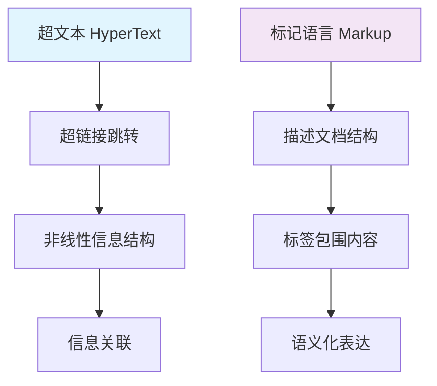
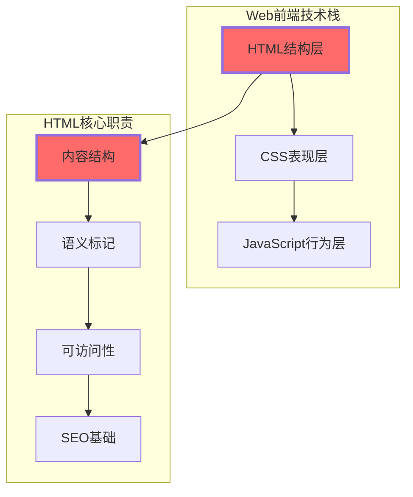
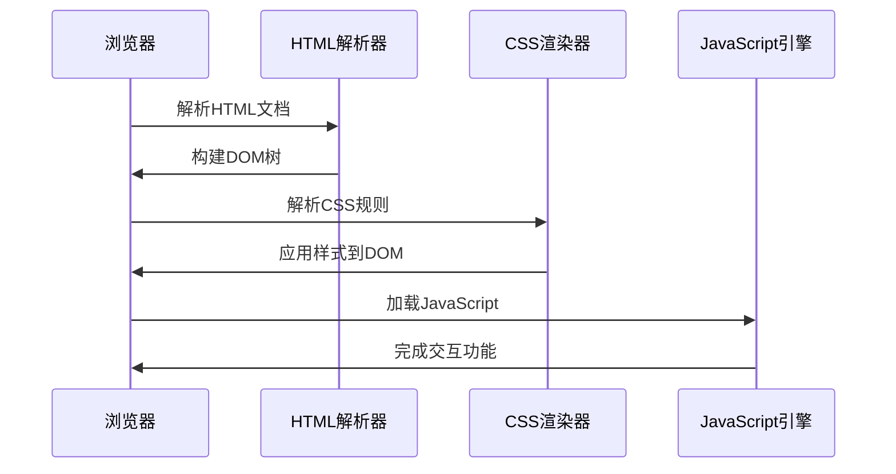
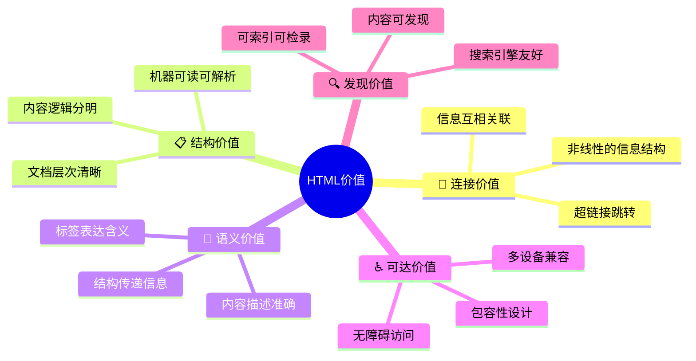
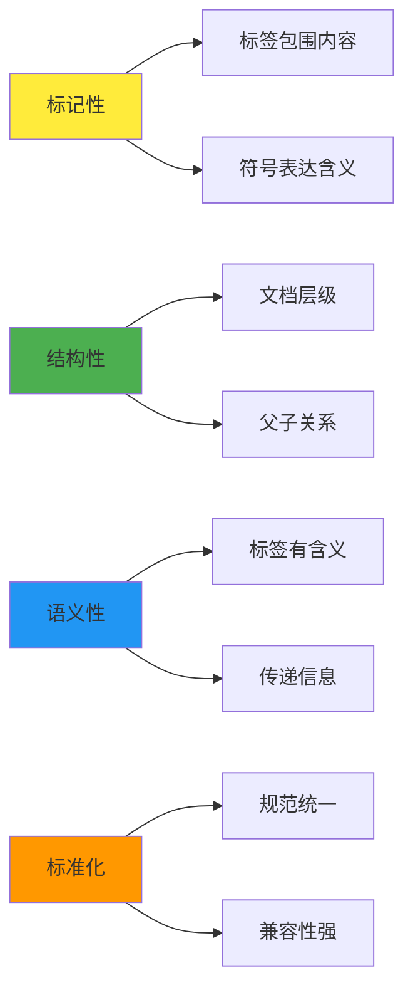
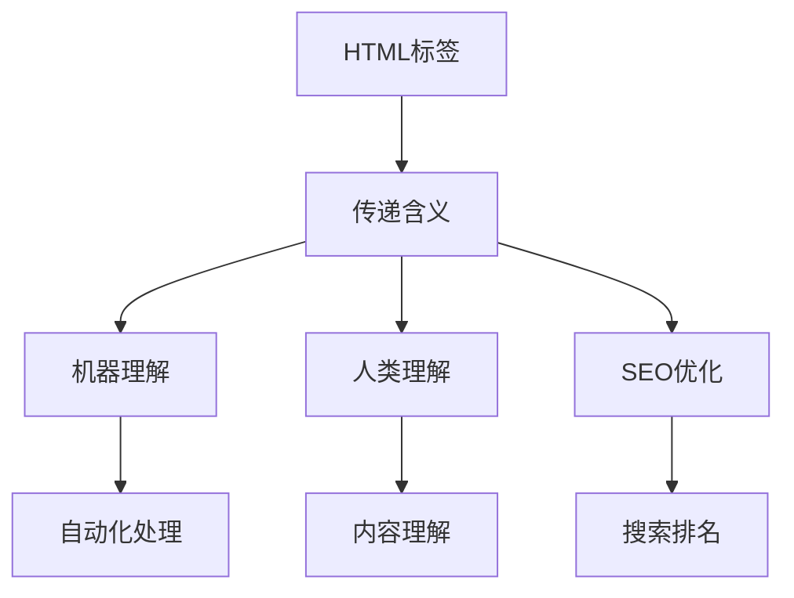
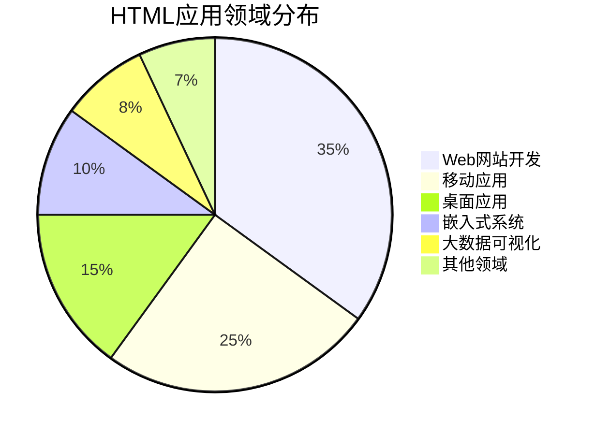
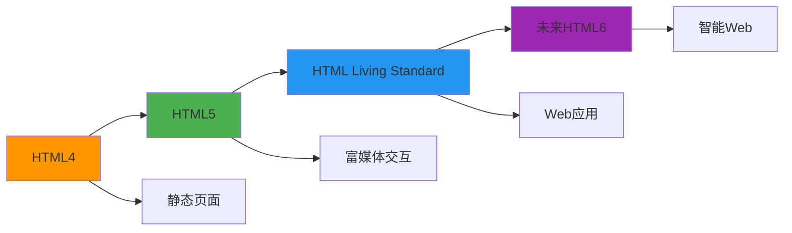

# HTML概述与定位

## 🎯 核心认知：HTML的本质

### 什么是HTML？

HTML = **HyperText Markup Language** (超文本标记语言)

**🔑 关键理解**：
- HTML**不是编程语言**，而是**标记语言**
- 作用是**描述和结构化**内容，而非执行逻辑
- 构建Web的**基础骨架**，与CSS(样式)和JavaScript(行为)配合

## 🌐 HTML在Web技术栈中的地位

### 三层架构模型

**💡 技术定位**：

| 层级 | 技术 | HTML的关系 | 协作方式 |
|------|------|------------|----------|
| **结构层** | HTML | ✅ **核心基础** | 提供语义化标记 |
| **表现层** | CSS | 🔗 依赖关系 | 基于HTML结构美化 |
| **行为层** | JavaScript | 🔗 交互基础 | 操作HTML元素 |

### 🏗️ Web页面构建流程

## 📚 HTML的核心价值

### 🎯 五个核心价值

### ⚖️ HTML的双重身份

**📄 人类读物 vs 🤖 机器语言**

| 方面 | 人类视角 | 机器视角 |
|------|----------|----------|
| **理解方式** | 视觉阅读文本内容 | 解析标签结构关系 |
| **关注重点** | 文字含义和信息 | 标签语义和层次 |
| **处理模式** | 线性和整体性阅读 | 层级化和结构化解析 |
| **需求满足** | 信息和娱乐需求 | 自动化处理和索引 |

## 🚀 HTML的技术特性

### 🔧 四个基础特性

#### 1️⃣ 标记性 (Markup Nature)
- **标签语法**：`<标签名>` 内容 `</标签名>`
- **自闭合标签**：`<标签名 属性="值" />`
- **属性修饰**：为标签添加额外信息

#### 2️⃣ 结构性 (Structural)
- **树状结构**：HTML文档形成DOM树
- **层级关系**：父子、兄弟元素关系清晰
- **嵌套规则**：元素可嵌套，但不能交叉

#### 3️⃣ 语义性 (Semantic)

#### 4️⃣ 标准化 (Standardized)
- **W3C规范**：国际标准组织制定
- **向后兼容**：新版本保持向下兼容
- **浏览器统一**：各浏览器遵循相同标准

## 🌍 HTML的应用范围

### 📍 主要应用领域

**🎯 具体应用场景**：

| 领域 | HTML作用 | 典型案例 |
|------|----------|----------|
| **企业网站** | 内容结构组织 | 公司官网、产品展示 |
| **电商平台** | 产品信息展示 | 淘宝、亚马逊页面结构 |
| **移动应用** | 混合应用开发 | Ionic、Cordova框架 |
| **数据可视化** | 图表和报告结构 | D3.js数据展示 |
| **学习平台** | 教育内容组织 | MOOC课程页面 |

## 🔮 HTML的未来发展

### 📈 技术演进趋势

**🚀 发展方向**：
- **更丰富的语义**：新的语义化标签不断涌现
- **更强的交互性**：与JavaScript的深度集成
- **更好的可访问性**：无障碍设计的标准化
- **更智能的处理**：AI时代的自动化应用

---

**🔗 扩展阅读**：
- 深入理解：`[[01-2 文档类型与基本结构]]`
- 技术细节：`[[01-3 基础语法规则]]`
- 历史演进：`[[01-4 历史发展与版本演进]]`
- 实践应用：`[[02-理解运用层]]`
