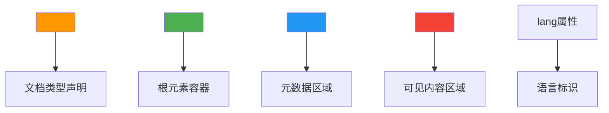
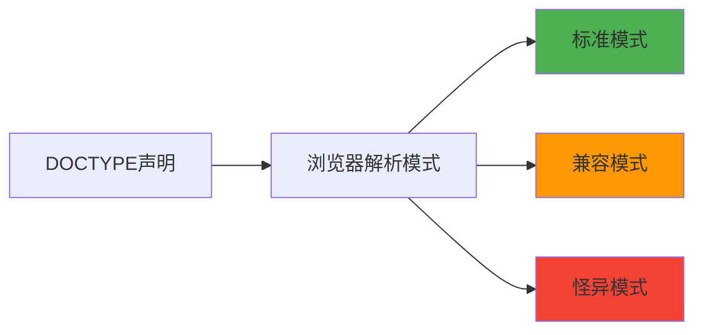
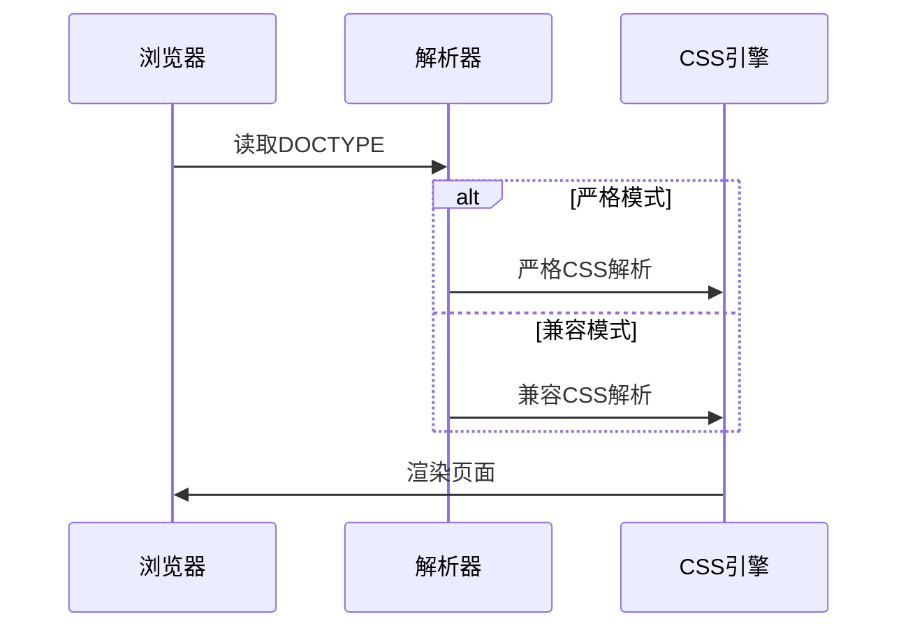
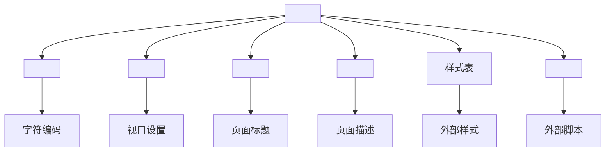
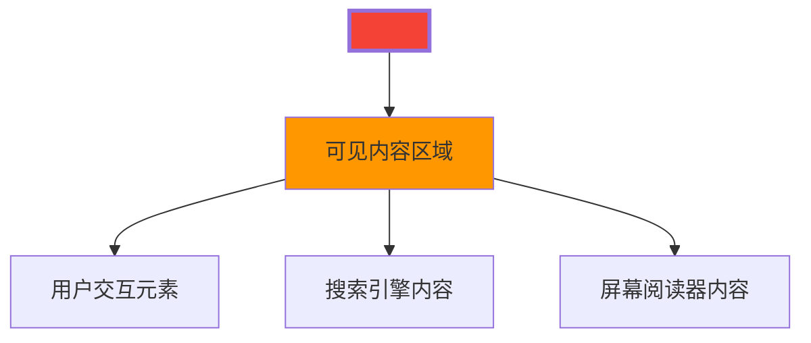
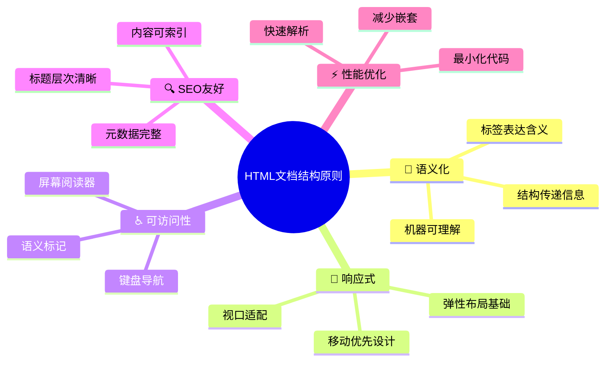

# 文档类型与基本结构

## 🏗️ HTML文档的骨架

### 📋 基本HTML文档模板

```html
<!DOCTYPE html>
<html lang="zh-CN">
<head>
    <meta charset="UTF-8">
    <meta name="viewport" content="width=device-width, initial-scale=1.0">
    <title>文档标题</title>
</head>
<body>
    <!-- 页面内容 -->
</body>
</html>
```

**🎯 五要素解析**：


## 📄 DOCTYPE文档类型声明

### 🔍 DOCTYPE的本质作用

DOCTYPE告诉浏览器使用何种HTML规范解析文档：



### 📊 DOCTYPE历史演进

| HTML版本 | DOCTYPE声明 | 使用场景 |
|----------|-------------|----------|
| **HTML 4.01 Strict** | `<!DOCTYPE HTML PUBLIC "-//W3C//DTD HTML 4.01//EN" "http://www.w3.org/TR/html4/strict.dtd">` | 限制性HTML4 |
| **HTML 4.01 Transitional** | `<!DOCTYPE HTML PUBLIC "-//W3C//DTD HTML 4.01 Transitional//EN" "http://www.w3.org/TR/html4/loose.dtd">` | 包容性HTML4 |
| **HTML 4.01 Frameset** | `<!DOCTYPE HTML PUBLIC "-//W3C//DTD HTML 4.01 Frameset//EN" "http://www.w3.org/TR/html4/frameset.dtd">` | 框架结构HTML4 |
| **XHTML 1.0 Strict** | `<!DOCTYPE html PUBLIC "-//W3C//DTD XHTML 1.0 Strict//EN" "http://www.w3.org/TR/xhtml1/DTD/xhtml1-strict.dtd">` | 严格XHTML |
| **HTML5** | `<!DOCTYPE html>` | 现代HTML5 |

### 🎯 HTML5的DOCTYPE

**✅ 推荐使用**：
```html
<!DOCTYPE html>
```

**💡 为什么如此简洁？**
- HTML5不需要引用外部DTD（文档类型定义）
- 浏览器内置了HTML5的解析规则
- 简化了文档声明，利于标准化

### 🔧 DOCTYPE的解析模式影响



## 🌐 HTML根元素

### 📍 `<html>`标签详解

```html
<html lang="zh-CN">
```

**🎯 `lang`属性重要性**：

| 语言代码 | 语言 | 使用场景 |
|----------|------|----------|
| `lang="zh-CN"` | 简体中文 | 中国大陆网站 |
| `lang="zh-TW"` | 繁体中文 | 台湾地区网站 |
| `lang="en"` | 英语 | 国际网站 |
| `lang="en-US"` | 美式英语 | 美国网站 |

**💡 `lang`属性的价值**：
- **可访问性**：屏幕阅读器选择正确语音
- **SEO优化**：搜索引擎理解内容语言
- **浏览器功能**：如拼写检查、翻译等
- **CSS样式**：特定语言的样式定制

## 🔧 Head元数据区域

### 📋 Head区域的结构



### 🎯 必需Meta标签

#### 1️⃣ 字符编码 (charset)
```html
<meta charset="UTF-8">
```
**重要性**：⭐⭐⭐⭐⭐
- **必需性**：防止中文乱码问题
- **标准值**：UTF-8（支持所有Unicode字符）
- **位置要求**：必须在`<head>`的前1024个字符内

#### 2️⃣ 视口设置 (viewport)
```html
<meta name="viewport" content="width=device-width, initial-scale=1.0">
```
**重要性**：⭐⭐⭐⭐⭐
- **移动适配**：确保移动设备正确显示
- **响应式基础**：现代Web开发必需
- **参数解析**：
  - `width=device-width`：宽度等于设备宽度
  - `initial-scale=1.0`：初始缩放比例

#### 3️⃣ 页面标题 (title)
```html
<title>页面标题</title>
```
**重要性**：⭐⭐⭐⭐⭐
- **浏览器标签**：显示在浏览器标签栏
- **SEO关键**：搜索引擎的重要排名因素
- **书签标题**：用户收藏时的默认标题

### 🔍 高级Meta标签

#### SEO优化标签
```html
<meta name="description" content="页面描述，用于SEO">
<meta name="keywords" content="关键词1,关键词2,关键词3">
<meta name="author" content="作者姓名">
```

#### Open Graph标签（社交媒体优化）
```html
<meta property="og:title" content="页面标题">
<meta property="og:description" content="页面描述">
<meta property="og:image" content="图片URL">
<meta property="og:url" content="页面URL">
```

## 📦 Body内容区域

### 🎯 Body的结构特点



### 📍 Body中的内容组织

**基本层次结构**：
```html
<body>
    <!-- 页面头部 -->
    <header>
        <nav>导航菜单</nav>
    </header>
    
    <!-- 主要内容 -->
    <main>
        <section>内容区块</section>
        <article>文章内容</article>
    </main>
    
    <!-- 页面底部 -->
    <footer>版权信息</footer>
</body>
```

## 🏛️ 文档结构最佳实践

### 💡 结构设计原则



### 📊 文档结构检查清单

| 检查项目 | 要求 | 重要性 |
|----------|------|--------|
| **DOCTYPE声明** | 使用HTML5标准 | ⭐⭐⭐⭐⭐ |
| **HTML根元素** | 包含lang属性 | ⭐⭐⭐⭐ |
| **Meta charset** | UTF-8编码 | ⭐⭐⭐⭐⭐ |
| **Meta viewport** | 移动设备适配 | ⭐⭐⭐⭐ |
| **Title标签** | 简洁明确的标题 | ⭐⭐⭐⭐⭐ |
| **Body内容** | 语义化标签组织 | ⭐⭐⭐⭐ |

### 🔧 常见错误避免

**❌ 常见错误示例**：
```html
<!-- 错误1：缺少DOCTYPE -->
<html>
<head>
    <!-- 没有字符编码声明 -->
    <title>页面</title>
</head>
<body>
    内容
</body>
</html>
```

**✅ 正确示例**：
```html
<!DOCTYPE html>
<html lang="zh-CN">
<head>
    <meta charset="UTF-8">
    <meta name="viewport" content="width=device-width, initial-scale=1.0">
    <title>页面标题</title>
</head>
<body>
    <h1>页面内容</h1>
</body>
</html>
```

---

**🔗 后续学习**：
- 语法基础：`[[01-3 基础语法规则]]`
- 元素分类：`[[02-1 块级与行内元素详解]]`
- 结构标记：`[[02-2 结构性标记元素]]`
