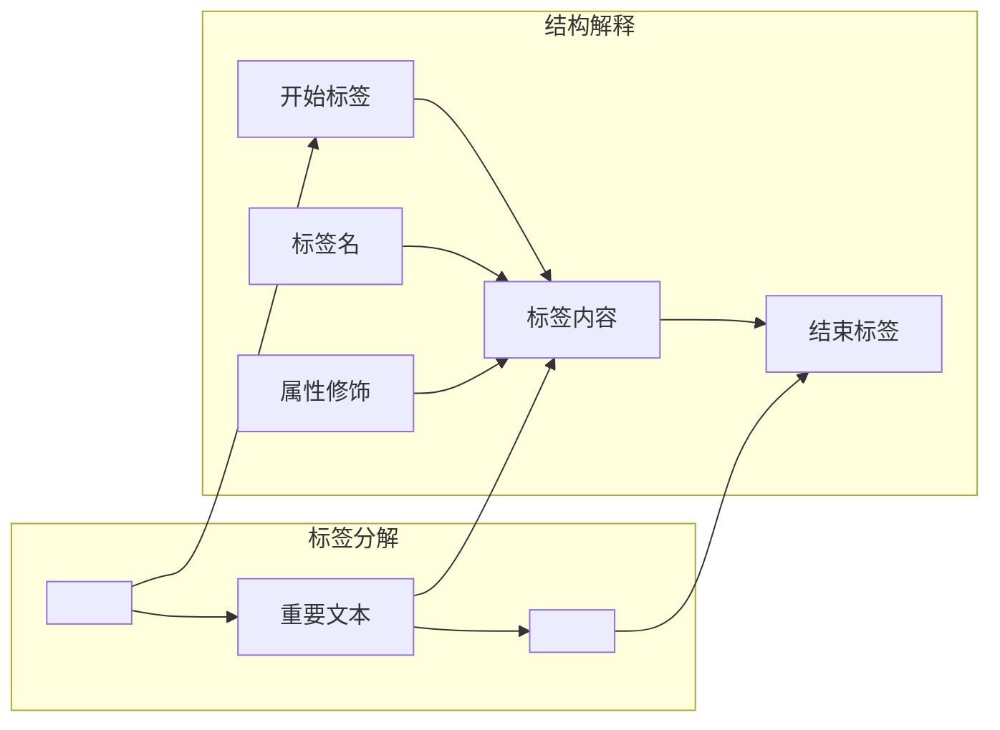
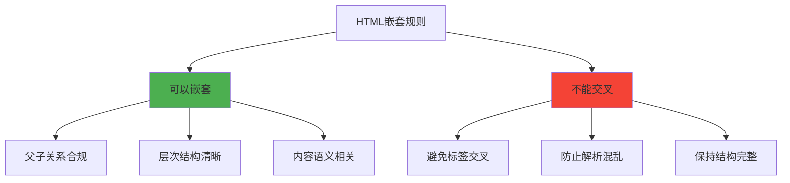
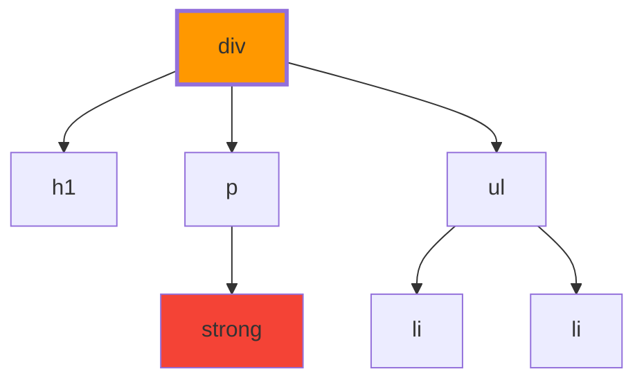
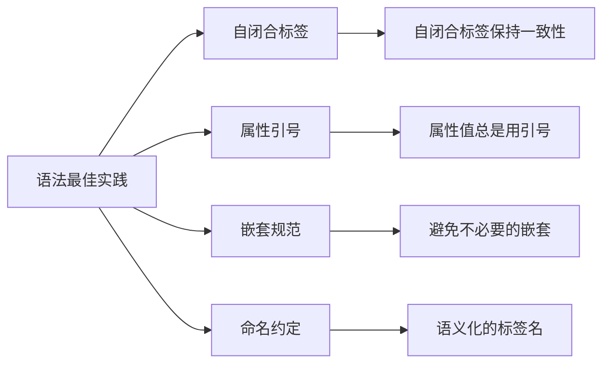
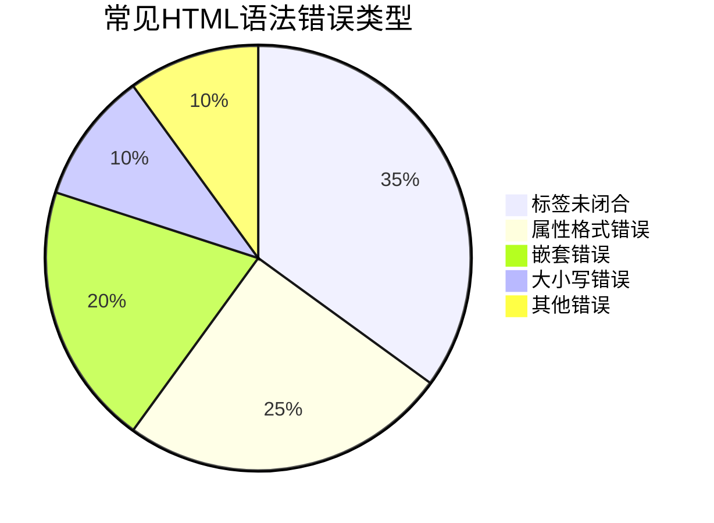

# HTML基础语法规则

## 🎯 HTML语法的本质

### 📝 标记语言的语法特征

HTML语法基于**标记**概念，通过**标签**来描述和结构化内容：

```mermaid
graph TD
    A[HTML语法本质] --> B[标记语法]
    B --> C[标签包围内容]
    C --> D[<标签名>内容</标签名>]
    
    A --> E[嵌套语法]
    E --> F[标签相互套嵌]
    F --> G[树状结构]
    
    A --> H[属性语法]
    H --> I[键值对修饰]
    I --> J[key="value"]
    
    style B fill:#ff9800
    style E fill:#4caf50
    style H fill:#2196f3
```

**🔑 核心理解**：HTML语法 = 标签语法 + 嵌套规则 + 属性修饰

## 🏷️ 标签基础语法

### 📍 标签的基本形式

```html
<!-- 包围型标签（双标签） -->
<标签名>内容</标签名>

<!-- 自闭合标签（单标签） --> 
<标签名 属性="值" />

<!-- 带属性的包围型标签 -->
<标签名 属性1="值1" 属性2="值2">内容</标签名>
```

### 🔄 标签解剖示例



**📊 标签语法表**：

| 类型 | 语法形式 | 示例 | 用途 |
|------|----------|------|------|
| **包围型** | `<tag>content</tag>` | `<p>段落文本</p>` | 包含内容 |
| **自闭合** | `<tag />` | `<br />` | 无需内容 |
| **带属性** | `<tag attr="value">content</tag>` | `<a href="/">链接</a>` | 修饰功能 |

## 🏗️ 嵌套规则

### 📐 嵌套的基本原则



### ✅ 正确嵌套示例

```html
<div>
    <h1>标题</h1>
    <p>这是一个包含<strong>重要性</strong>的段落</p>
    <ul>
        <li>列表项一</li>
        <li>列表项二</li>
    </ul>
</div>
```

**🔍 嵌套层次分析**：


### ❌ 错误嵌套示例

```html
<!-- ❌ 错误：标签交叉 -->
<p>这是<strong>错误</p>的嵌套</strong>

<!-- ✅ 正确：标签嵌套 -->
<p>这是<strong>正确</strong>的嵌套</p>
```

## ⚙️ 属性语法规则

### 🔧 属性的基本结构

```html
<标签名 属性名="属性值" 属性名2="属性值2">
```

### 📋 属性类型分析

```mermaid
mindmap
  root((HTML属性类型))
    🔗 URL属性
      href <a>链接地址
      src <img>资源路径
      action <form>提交地址
    🎨 样式属性
      class CSS类名
      id 唯一标识
      style 内联样式
    🔧 功能属性
      type 输入类型
      name 表单字段名
      value 默认值
    ♿ 可访问性
      alt 图片描述
      title 提示信息
      aria-label 屏幕阅读器标签
```



### 🎯 常用属性详解

#### 1️⃣ class属性 - CSS类选择器
```html
<div class="container primary theme-dark">
```
**特点**：
- **多值支持**：可以包含多个类名（空格分隔）
- **可重用**：多个元素可以共享同一个类名
- **样式绑定**：与CSS选择器`.container`对应

#### 2️⃣ id属性 - 唯一标识符
```html
<div id="main-content">
```
**特点**：
- **唯一性**：整个文档中只能出现一次
- **JavaScript操作**：`document.getElementById('main-content')`
- **锚点链接**：可以作为页面锚点`#main-content`

#### 3️⃣ href和src属性 - 资源引用
```html
<a href="https://example.com">链接文本</a>

```
**特点**：
- **相对路径**：`./`、`../`、`/`层级导航
- **绝对路径**：完整的URL地址
- **锚点定位**：`#id`跳转到指定位置

## 📏 语法验证规则

### ✅ HTML5语法特点

**🔧 松散语法**：
```html
<!-- HTML5更宽松的语法 -->

<br>
<input type="text">

<!-- 等价于严格写法 -->

<br />
<input type="text" />
```

### 🎯 语法最佳实践



### 📊 编码约定

| 规范类型 | HTML5 | XHTML | 推荐使用 |
|----------|-------|-------|----------|
| **DOCTYPE** | `<!DOCTYPE html>` | 严格DTD | HTML5 |
| **标签闭合** | 可选自闭合 | 必须闭合 | 一致性原则 |
| **属性引号** | 可选 | 必须 | 总是使用 |
| **大小写** | 不区分 | 严格小写 | 小写统一 |

## 🔍 常见语法错误

### ❌ 错误类型及修正

```html
<!-- 错误1：标签未正确闭合 -->
<p>段落内容

<!-- 修正 -->
<p>段落内容</p>

<!-- 错误2：属性值缺少引号 -->
<div class=container>

<!-- 修正 -->
<div class="container">

<!-- 错误3：标签交叉嵌套 -->
<div><p>内容</div></p>

<!-- 修正 -->
<div><p>内容</p></div>

<!-- 错误4：无效的属性值 -->
<input type="button" name="submit">

<!-- 修正（取决于使用场景） -->
<input type="submit" name="submit">
```

### 📋 语法检查清单

| 检查项目 | 要求 | 状态 |
|----------|------|------|
| **标签闭合** | 每个开放标签都有对应的闭合标签 | □ |
| **属性格式** | 所有属性值都用引号包围 | □ |
| **嵌套规则** | 标签按正确的层次嵌套 | □ |
| **大小写** | 标签名和属性名使用小写 | □ |
| **空标签处理** | 自闭合标签语法一致 | □ |

## 🛠️ 语法工具与验证

### 🔧 验证工具

**在线验证器**：
- **W3C Markup Validator**：官方HTML验证器
- **Nu HTML Checker**：WHATWG标准的现代验证器
- **浏览器开发者工具**：自动检测语法错误

**编辑器功能**：
- **语法高亮**：Visual Studio Code、Sublime Text
- **实时预览**：Live Server、Preview
- **错误检测**：ESLint HTML插件

### 📊 语法错误模式



---

**🔗 下一步学习**：
- 元素分类：`[[02-1 块级与行内元素详解]]`
- 历史发展：`[[01-4 历史发展与版本演进]]`
- 开发环境：`[[01-5 HTML开发环境搭建]]`
