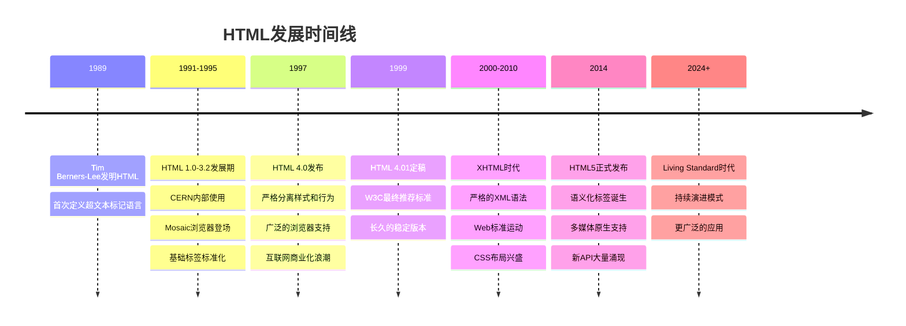
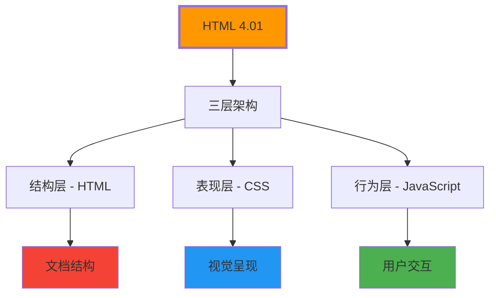
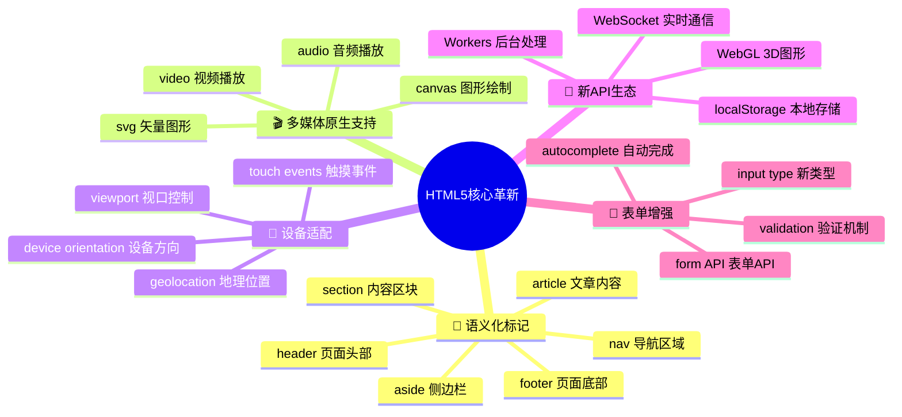
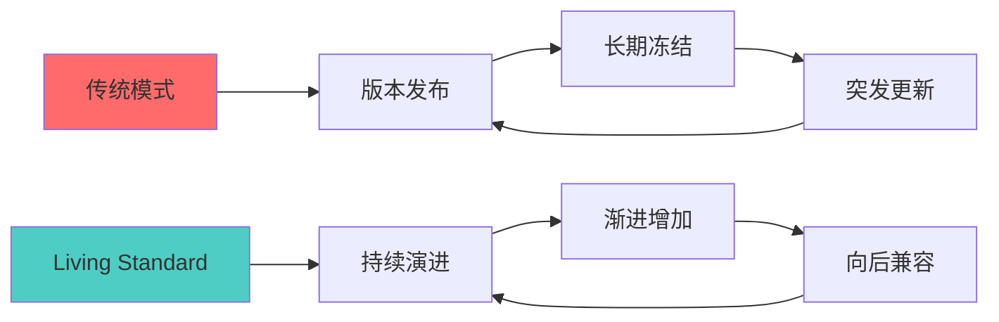
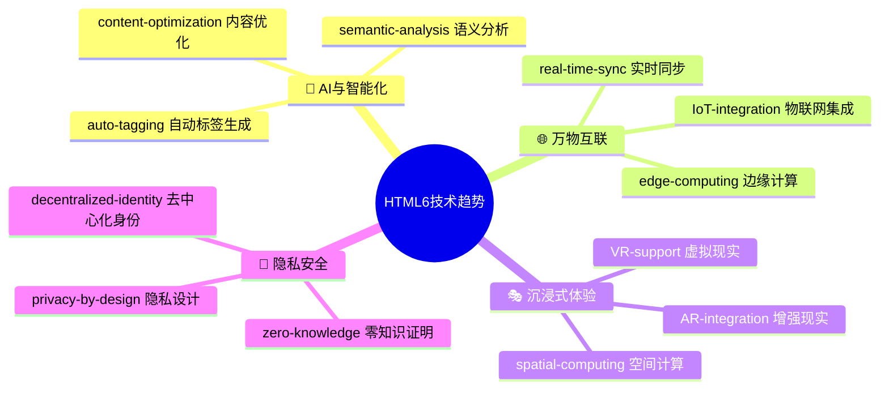
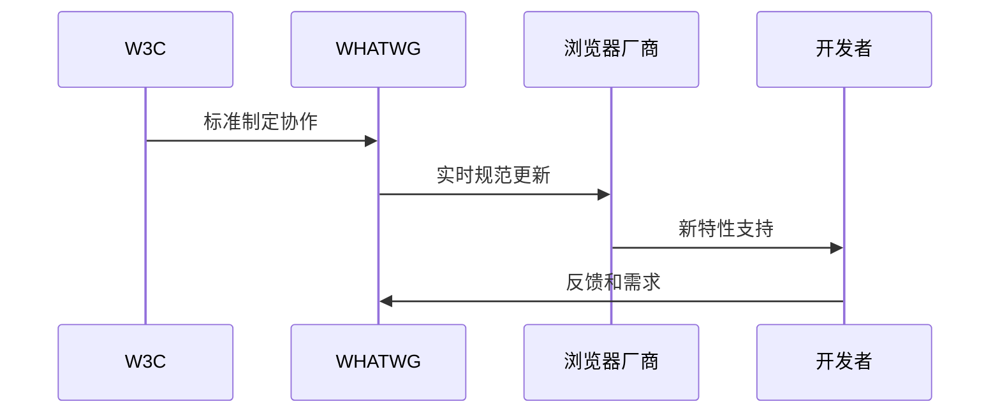

# HTML历史发展与版本演进

## 🕰️ HTML的发展时间线

### 📈 重要里程碑



## 🚀 HTML版本演进详解

### 📊 版本对比表

| 版本 | 发布时间 | 重要特性 | 影响意义 |
|------|----------|----------|----------|
| **HTML 1.0** | 1991 | 超链接、标题、段落 | Web诞生 |
| **HTML 2.0** | 1995 | 表单、图片、表格 | 内容展现 |
| **HTML 3.2** | 1997 | 样式、脚本、框架 | 视觉化 |
| **HTML 4.0** | 1997 | CSS分离、国际化 | 标准化 |
| **HTML 4.01** | 1999 | 错误修正、稳定化 | 经典版本 |
| **XHTML 1.0** | 2000 | XML语法、严格检查 | 标准化运动 |
| **HTML5** | 2014 | 语义化、媒体、API | 现代Web |

### 🔧 HTML 4.01时代（1999-2014）

**🎯 核心成就**：
- **三层分离**：HTML（结构）+ CSS（表现）+ JavaScript（行为）
- **标准化推进**：统一的浏览器行为
- **商业应用**：电子商务、企业网站普及



**🔧 时代特征**：
- **表格布局**：使用`<table>`进行页面布局
- **内联样式**：大量使用`style`属性
- **浏览器兼容**：微软IE vs Netscape的浏览器战争
- **插件依赖**：Flash、Silverlight等插件盛行

### 🌟 XHTML时代（2000-2010）

**🎯 革命性变化**：
- **严格语法**：要求所有标签正确闭合
- **XML基础**：基于XML的标记语言
- **工具验证**：强制进行语法验证

```html
<!-- XHTML严格要求 -->
<p>这是一个段落</p>
<br />


<!-- 等价HTML写法 -->
<p>这是一个段落</p>
<br>

```

**📊 XHTML vs HTML对比**：

| 特性 | HTML | XHTML |
|------|------|-------|
| **标签闭合** | 可选 | 必须 |
| **属性引号** | 可选 | 必须 |
| **大小写** | 不敏感 | 严格小写 |
| **验证** | 浏览器宽容 | 严格验证 |
| **错误处理** | 自动修复 | 解析失败 |

### 🚀 HTML5时代（2014-至今）

**🎯 突破性创新**：



## 📊 HTML5的具体发展

### 🏷️ 新语义化标签

**传统HTML与HTML5对比**：

```html
<!-- HTML4/XHTML 传统布局 -->
<html>
<head><title>页面标题</title></head>
<body>
    <div id="header">头部</div>
    <div id="nav">导航</div>
    <div id="content">内容</div>
    <div id="sidebar">边栏</div>
    <div id="footer">脚部</div>
</body>
</html>

<!-- HTML5 语义化布局 -->
<html>
<head><title>页面标题</title></head>
<body>
    <header>头部</header>
    <nav>导航</nav>
    <main>
        <article>主内容</article>
        <aside>边栏</aside>
    </main>
    <footer>脚部</footer>
</body>
</html>
```

### 🎬 多媒体革命

**HTML4时代的多媒体**：
```html
<!-- 依赖Flash插件 -->
<object type="application/x-shockwave-flash">
    <param name="movie" value="video.swf">
</object>
```

**HTML5原生多媒体**：
```html
<!-- 原生视频支持 -->
<video controls width="800">
    <source src="video.mp4" type="video/mp4">
    <source src="video.webm" type="video/webm">
    您的浏览器不支持视频播放
</video>

<!-- 原生音频支持 -->
<audio controls>
    <source src="audio.mp3" type="audio/mpeg">
    <source src="audio.ogg" type="audio/ogg">
</audio>
```

### 📝 表单增强

| HTML4 | HTML5新特性 | 优势说明 |
|-------|-------------|----------|
| `<input type="text">` | `<input type="email">` | 邮件验证 |
| `<input type="text">` | `<input type="tel">` | 电话格式 |
| `<input type="text">` | `<input type="url">` | URL验证 |
| `<input type="text">` | `<input type="search">` | 搜索样式 |
| `<input type="text">` | `<input type="range">` | 滑块控件 |
| `<input type="text">` | `<input type="color">` | 颜色选择 |

## 🔮 现代Web发展与未来趋势

### 📈 Living Standard模式

**传统发布模式 vs Living Standard**：



**🔄 Living Standard特点**：
- **持续更新**：不需要等待大版本发布
- **渐进增强**：新特性逐步加入浏览器
- **向后兼容**：新特性不影响旧代码
- **社区驱动**：WHATWG维护，广泛参与

### 🚀 新兴技术趋势

**🎯 HTML6设想**：



### 📊 技术生态变化

| 时间阶段 | 主要技术栈 | 开发特点 | 用户需求 |
|----------|------------|----------|----------|
| **Web 1.0 (1991-2000)** | HTML + 少量CSS | 静态展示 | 信息获取 |
| **Web 2.0 (2000-2010)** | HTML + CSS + JS | 动态交互 | 内容创作 |
| **Web 3.0 (2010-2020)** | HTML5 + 现代框架 | SPA应用 | 移动优先 |
| **Web 4.0 (2020+)** | PWA + AI | 智能化应用 | 个性化体验 |

## 🌍 标准化机构的演进

### 🏛️ W3C vs WHATWG

**组织对比**：

| 机构 | 成立时间 | 特点 | 现状 |
|------|----------|------|------|
| **W3C** | 1994 | 学术化、标准化 | 制定HTML5标准 |
| **WHATWG** | 2004 | 实用性、快速迭代 | 维护HTML Living Standard |

**🔧 协作模式变化**：



## 💡 历史学习的重要性

### 🎯 从历史中学习

**理解演进规律**：
- **技术推动需求**：从基础信息展示到丰富交互体验
- **标准统一发展**：从各自为政到协作统一
- **用户需求驱动**：从简单链接到复杂应用场景

**预测未来方向**：
- **移动优先**：响应式设计成为标配
- **性能优化**：页面加载速度持续优化
- **可访问性**：无障碍设计日益重要
- **智能化**：AI辅助开发和应用

---

**🔗 深入了解**：
- 环境搭建：`[[01-5 HTML开发环境搭建]]`
- 现代应用：`[[03-实践深化层]]`
- 技术趋势：`[[04-12 Web Components体系]]`
