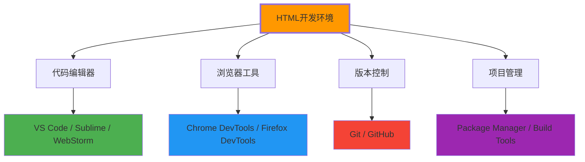
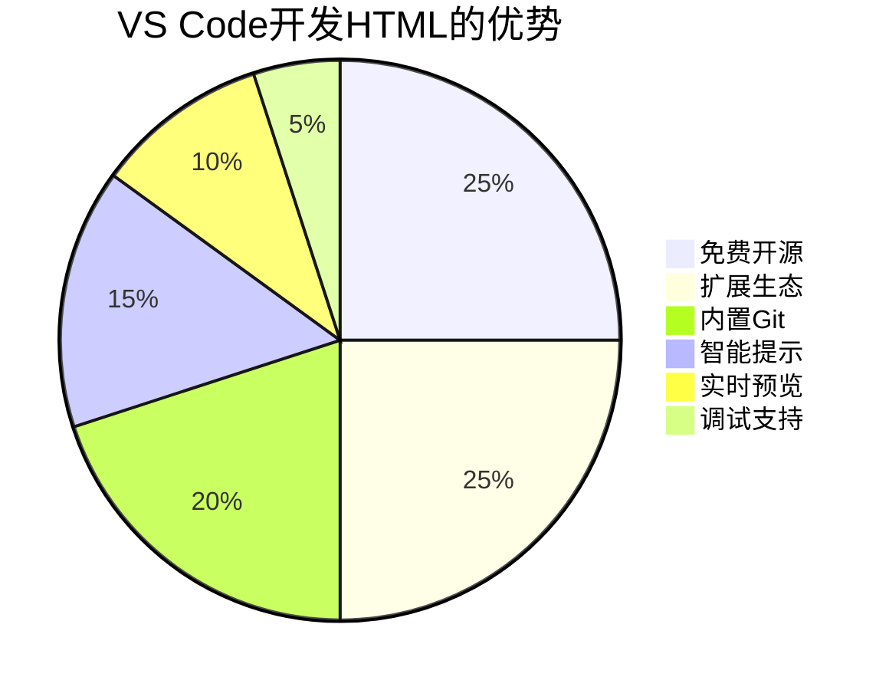
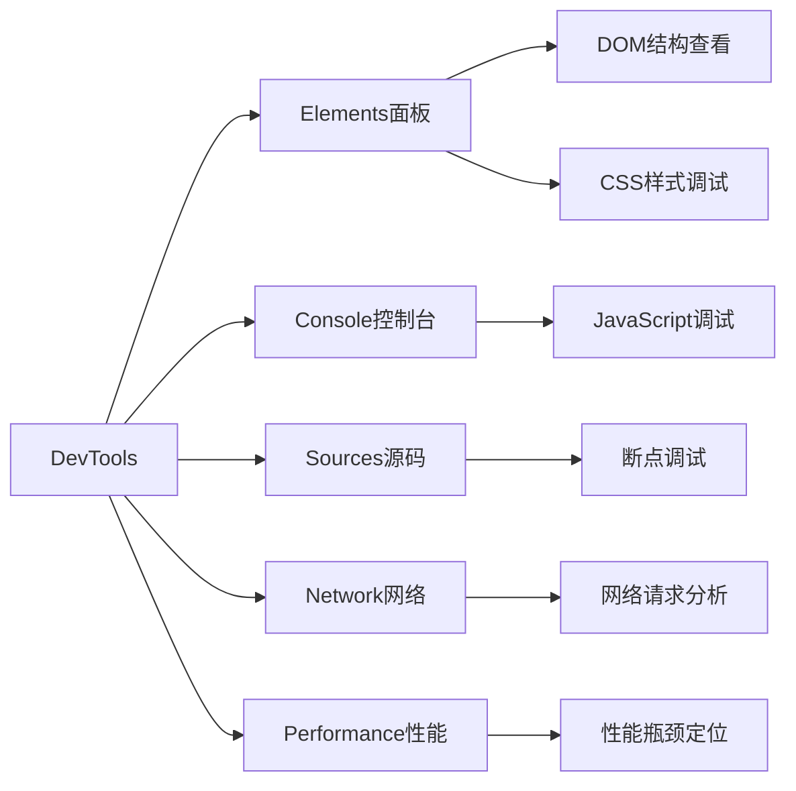
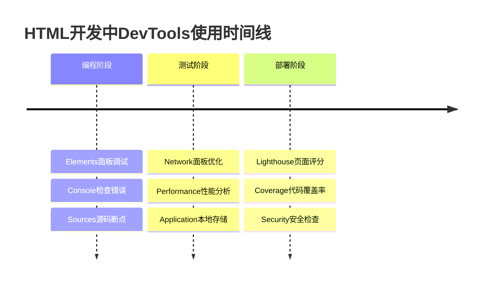
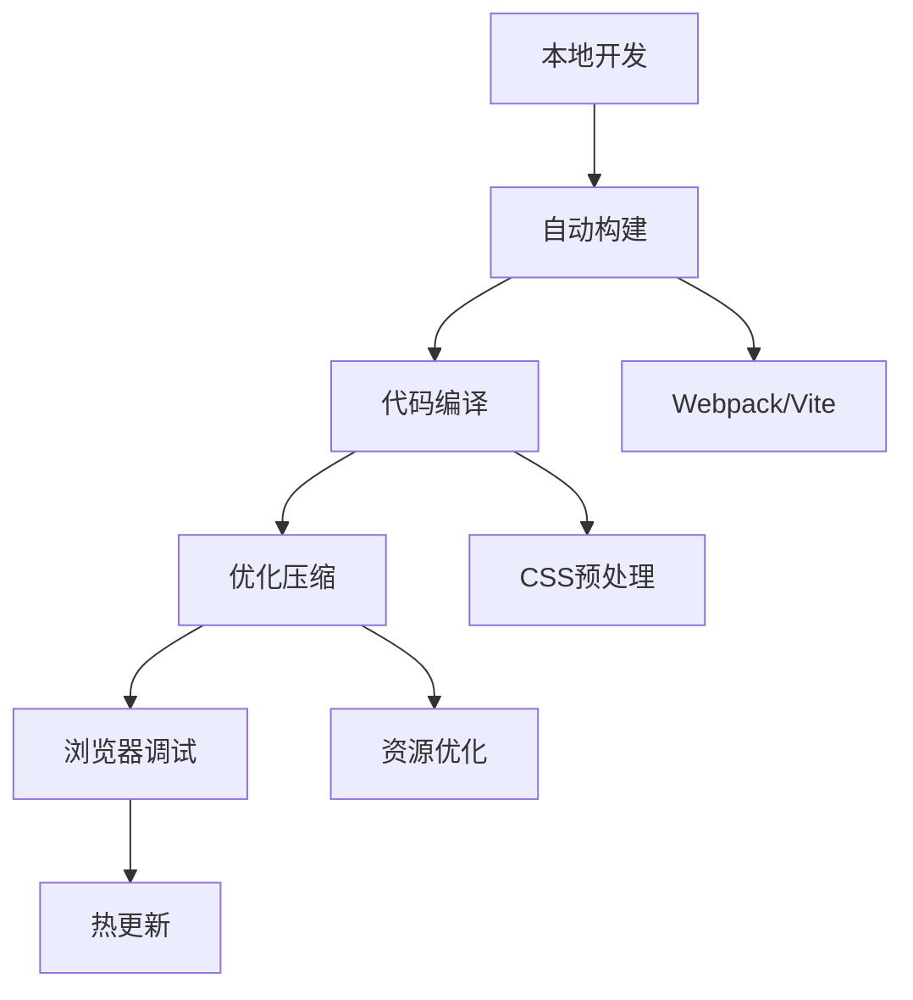
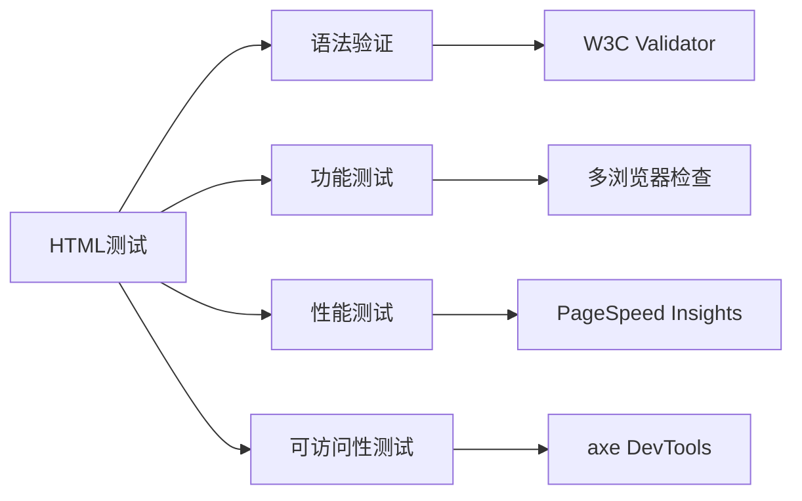
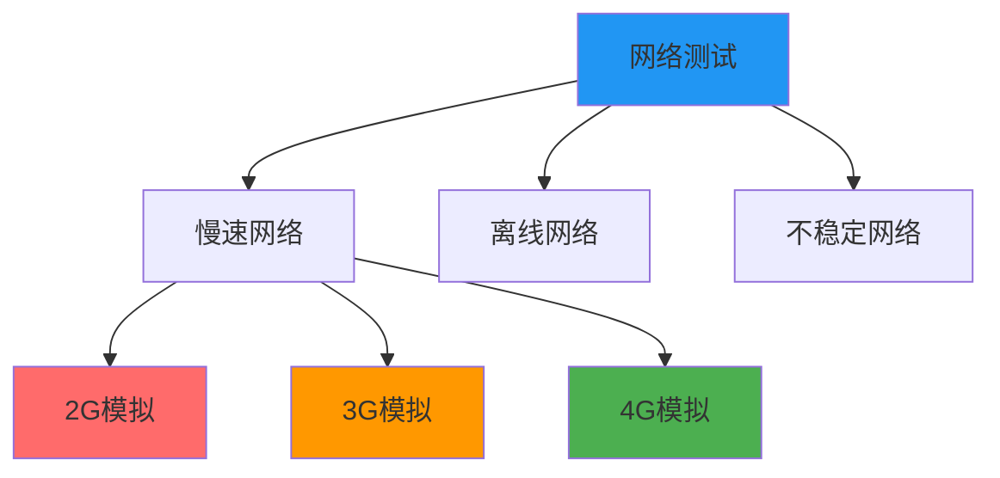

# HTML开发环境搭建

## 🛠️ 开发环境基础架构

### 📋 必备工具清单



## 💻 代码编辑器选择

### 🎯 主推荐：Visual Studio Code

**VS Code的优势**：


**必备VS Code扩展**：
| 扩展名称 | 功能描述 | 重要性 |
|----------|----------|--------|
| **Live Server** | 实时预览HTML页面 | ⭐⭐⭐⭐⭐ |
| **Prettier** | 代码自动格式化 | ⭐⭐⭐⭐ |
| **Auto Rename Tag** | 标签同步重命名 | ⭐⭐⭐⭐ |
| **HTML CSS Support** | CSS智能提示 | ⭐⭐⭐⭐ |
| **Bracket Pair Colorizer** | 括号颜色配对 | ⭐⭐⭐ |
| **HTML Snippets** | HTML代码片段 | ⭐⭐⭐ |

### 🔧 VS Code配置示例

```json
{
  "emmet.includeLanguages": {
    "html": "html"
  },
  "html.format.indentInnerHtml": true,
  "html.format.wrapLineLength": 100,
  "editor.tabSize": 2,
  "editor.insertSpaces": true,
  "files.autoSave": "afterDelay",
  "editor.formatOnSave": true
}
```

### 🌐 其他编辑器选择

**📊 编辑器对比**：

| 编辑器 | 价格 | HTML支持 | 扩展生态 | 性能 | 适用人群 |
|--------|------|----------|----------|------|----------|
| **VS Code** | 免费 | ⭐⭐⭐⭐⭐ | ⭐⭐⭐⭐⭐ | ⭐⭐⭐⭐ | 所有级别 |
| **WebStorm** | 收费 | ⭐⭐⭐⭐⭐ | ⭐⭐⭐⭐ | ⭐⭐⭐⭐⭐ | 专业开发者 |
| **Sublime Text** | 付费 | ⭐⭐⭐⭐ | ⭐⭐⭐ | ⭐⭐⭐⭐⭐ | 轻量级开发 |
| **Atom** | 免费 | ⭐⭐⭐⭐ | ⭐⭐⭐⭐ | ⭐⭐⭐ | GitHub用户 |

### 📝 Notepad++的选择价值

**适合场景**：
- 快速查看和简单编辑HTML文件
- 学习阶段了解HTML语法
- 不需要复杂功能的场景

## 🌐 浏览器开发环境

### 🔍 Chrome DevTools核心功能



### 🛡️ 重要DevTools功能



**🔧 常用调试技巧**：

#### DOM Elements调试
1. **右键检查元素**：快速定位HTML结构
2. **实时编辑**：直接修改HTML和CSS
3. **移动端模拟**：测试响应式设计

#### Console调试
```javascript
// 获取DOM元素
document.getElementById('myElement')
document.querySelector('.myClass')

// 检查网络请求
console.table(performance.getEntriesByType('navigation'))

// 调试CSS样式
// 在Elements面板中编辑样式，实时预览效果
```

## 📁 项目结构最佳实践

### 🏗️ 标准HTML项目结构

```
my-html-project/
├── 📁 assets/           # 静态资源目录
│   ├── 📁 css/         # 样式文件
│   │   └── style.css
│   ├── 📁 js/          # JavaScript文件
│   │   └── script.js
│   ├── 📁 images/       # 图片资源
│   │   └── logo.png
│   └── 📁 fonts/       # 字体文件
│       └── custom.woff2
├── 📁 pages/            # 页面文件
│   ├── index.html       # 首页
│   ├── about.html       # 关于页面
│   └── contact.html     # 联系页面
├── 📁 templates/        # 模板文件
│   └── base.html
├── 📄 README.md         # 项目说明
├── 📄 .gitignore        # Git忽略文件
└── 📄 favicon.ico       # 网站图标
```

### 📊 资源组织策略

| 文件类型 | 存放位置 | 命名规范 | 数量限制 |
|----------|----------|----------|----------|
| **HTML页面** | `/pages/` | `小写-连字符` | 无限制 |
| **CSS样式** | `/assets/css/` | `功能模块.css` | 按模块组织 |
| **JavaScript** | `/assets/js/` | `组件名.js` | 按功能分离 |
| **图片资源** | `/assets/images/` | `描述性名称.png` | 按用途分类 |
| **字体文件** | `/assets/fonts/` | `字体系列.woff2` | 统一管理 |

## 🔧 开发工具链

### 📦 本地服务器环境

**🌐 Live Server（推荐）**：
- 自动刷新页面
- 支持热更新
- Chrome扩展或VS Code插件
- 简单易用，无需配置

```bash
# VS Code扩展安装
Ctrl+Shift+X 打开扩展市场
搜索 "Live Server" 安装
右键HTML文件选择 "Open with Live Server"
```

### 🔄 自动化工具

**⚡ 现代化开发环境**：



**🛠️ 构建工具选择**：

| 工具 | 适用场景 | 学习曲线 | 性能 |
|------|----------|----------|------|
| **Webpack** | 复杂项目 | 陡峭 | 高 |
| **Vite** | 现代应用 | 平滑 | 很高 |
| **Parcel** | 零配置 | 简单 | 中等 |
| **Rollup** | 库开发 | 中等 | 高 |

### 📊 包管理器

**npm vs yarn 对比**：
- **npm**：Node.js内置，生态最大
- **yarn**：更快的安装速度，更好的离线支持
- **pnpm**：节省磁盘空间，严格的依赖管理

## 🔍 调试与测试环境

### 🧪 基础测试策略



### ✅ 质量保证清单

| 测试项目 | 工具/方法 | 频率 | 重要性 |
|----------|----------|------|--------|
| **语法验证** | W3C Validator | 每次提交 | ⭐⭐⭐⭐⭐ |
| **浏览器兼容** | Multiple Browsers | 每周 | ⭐⭐⭐⭐ |
| **响应式测试** | DevTools Device Mode | 每日 | ⭐⭐⭐⭐ |
| **性能检查** | Lighthouse | 每月 | ⭐⭐⭐ |
| **可访问性** | axe DevTools | 发布前 | ⭐⭐⭐⭐ |

## 📱 移动端开发环境

### 🔧 移动设备调试

**iOS Safari调试**：
1. Mac连接iPhone/iPad
2. Safari → 开发 → [设备名]
3. 启用Web检查器

**Android Chrome调试**：
1. Chrome → 菜单 → 更多工具 → 远程设备
2. USB连接Android设备
3. 选择目标页面调试

### 🌐 网络环境模拟



## 🚀 性能优化环境

### ⚡ 实时性能监控

**核心性能指标监控**：
```javascript
// 页面加载性能
window.addEventListener('load', () => {
    const navigation = performance.getEntriesByType('navigation')[0];
    console.log('页面加载时间:', navigation.loadEventEnd - navigation.loadEventStart);
});

// 资源加载监控
const observer = new PerformanceObserver((list) => {
    list.getEntries().forEach((entry) => {
        console.log(`${entry.name}: ${entry.duration}ms`);
    });
});
observer.observe({entryTypes: ['resource']});
```

### 🔍 代码质量检查

**自动化工具配置**：
```json
{
  "extends": ["htmlhint"],
  "rules": {
    "html-syntax": true,
    "tag-pair": true,
    "tagname-lowercase": true,
    "attr-lowercase": true,
    "attr-value-double-quotes": true,
    "id-unique": true,
    "head-script-disabled": true
  }
}
```

---

**🔗 开始实践**：
- 语法掌握：`[[01-3 基础语法规则]]`
- 元素学习：`[[02-1 块级与行内元素详解]]`
- 实战项目：`[[04-知识拓展层]]`
