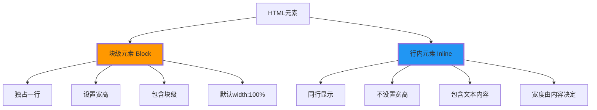
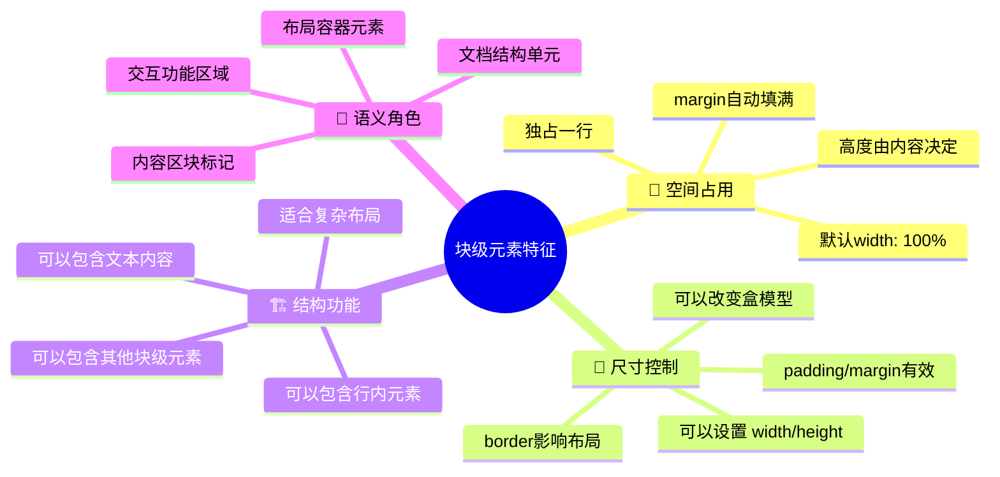
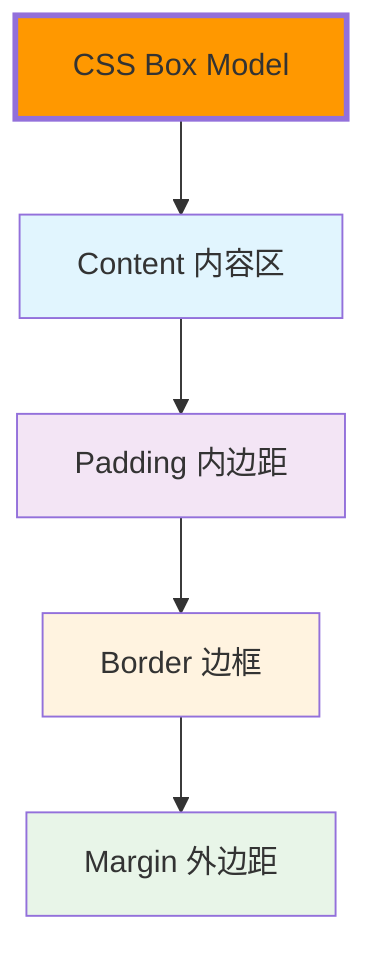
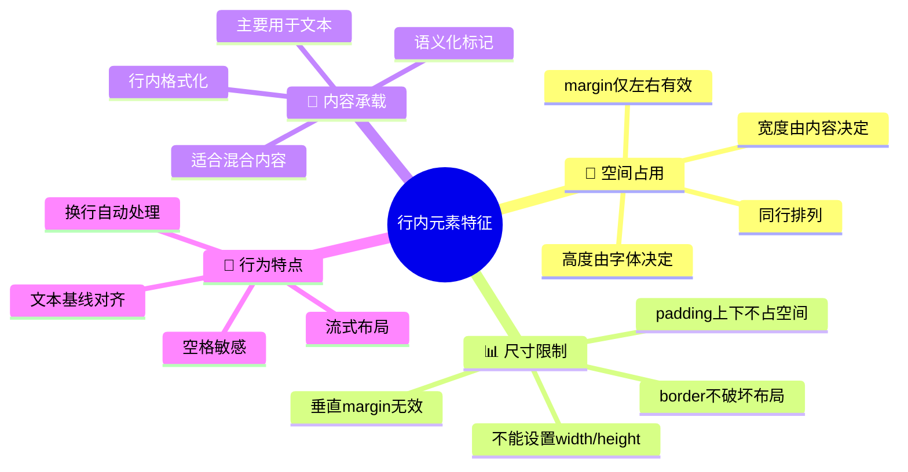
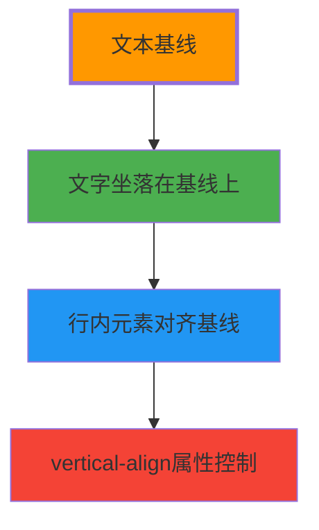
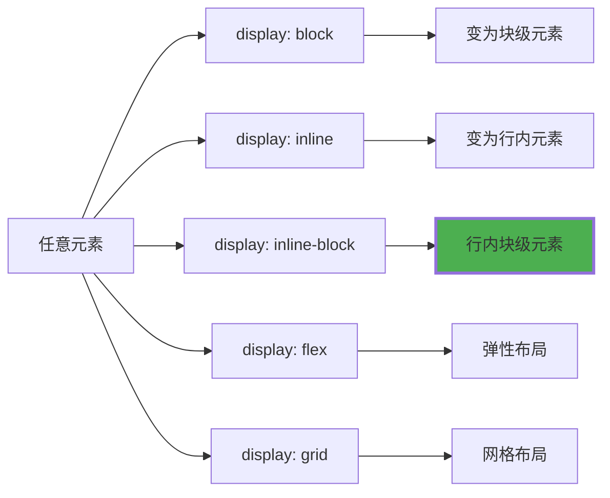
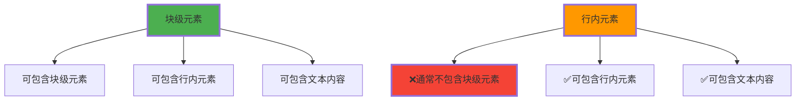
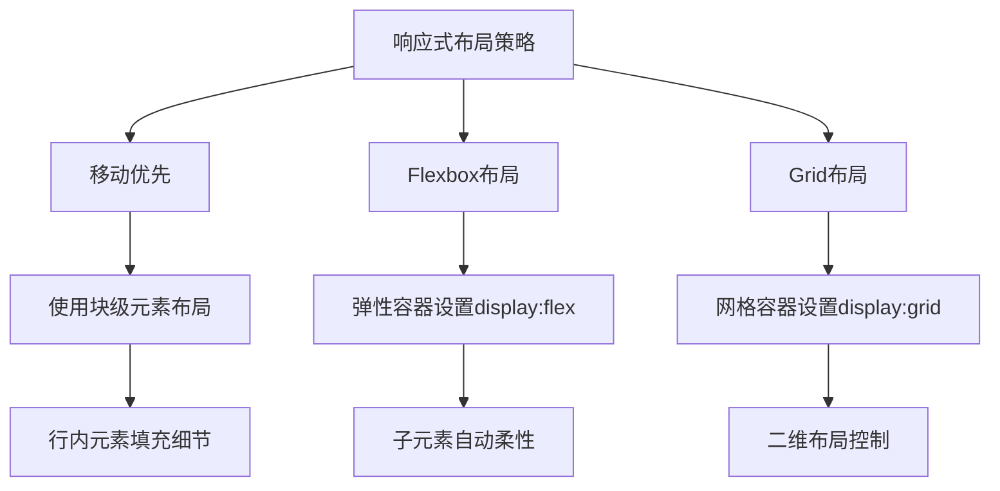
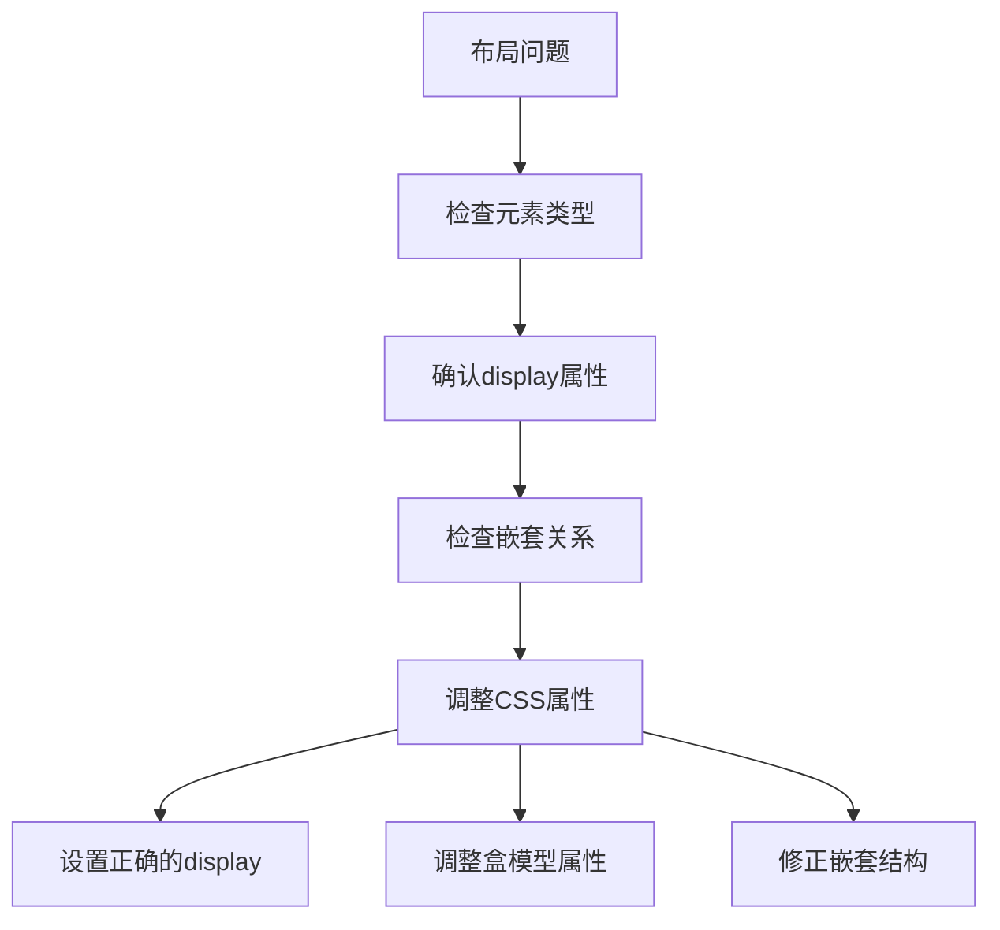

# 块级与行内元素详解

## 🎯 元素分类的核心认知

### 📋 两大类别的本质区别

HTML元素根据**默认显示行为**分为两大类：



**🔑 关键理解**：元素分类决定**布局行为**，而非语义功能

## 🏗️ 块级元素详解

### 📐 块级元素的四大特征



### 🎯 常见块级元素类型

#### 📋 结构性元素
```html
<div>页面容器</div>
<section>章节容器</section>
<article>文章容器</article>
<header>头部区域</header>
<footer>脚部区域</footer>
<aside>侧边栏容器</aside>
```

#### 📝 内容组织元素
```html
<h1>主标题</h1>
<h2>二级标题</h2>
<!-- h3-h6 -->
<p>段落内容</p>
<ul>
    <li>列表项</li>
</ul>
<ol>
    <li>有序列表项</li>
</ol>
```

#### 📊 表格与表单元素
```html
<table>
    <tr>
        <td>表格数据</td>
    </tr>
</table>

<form>
    <fieldset>
        <legend>表单分组</legend>
    </fieldset>
</form>
```

### 🔧 块级元素的盒模型



**📊 盒模型示例**：
```css
.block-element {
    width: 300px;          /* 内容宽度 */
    height: 150px;         /* 内容高度 */
    padding: 20px;         /* 内边距 */
    border: 2px solid #333; /* 边框 */
    margin: 10px;          /* 外边距 */
}
```

## 🔗 行内元素详解

### 📏 行内元素的四大特征



### 🎯 常见行内元素类型

#### 📝 文本格式化元素
```html
<span>文本容器</span>
<strong>强调文本</strong>
<em>强调文本</em>
<mark>高亮文本</mark>
<code>代码文本</code>
```

#### 🔗 链接与引用元素
```html
<a href="/">链接文本</a>
<q>短引用</q>
<cite>引用来源</cite>
<abbr title="说明">缩写</abbr>
```

#### 📋 表单行内元素
```html
<input type="text">
<button>按钮</button>
<label>标签文本</label>
<select>
    <option>选择项</option>
</select>
```

#### 🖼️ 替换元素（特殊行内元素）
```html

<input type="image">
<br> <!-- 特殊自闭合标签 -->
```

### 🔍 行内元素的布局特性

**📊 基线对齐原理**：



**🎯 对齐方式**：
```css
.inline-element {
    vertical-align: baseline;  /* 默认：基线对齐 */
    vertical-align: top;      /* 顶部对齐 */
    vertical-align: middle;   /* 居中对齐 */
    vertical-align: bottom;   /* 底部对齐 */
}
```

## 🔄 元素类型转换

### 🔧 display属性控制



### 🎯 inline-block混合特性

**🌟 inline-block的独特优势**：
- **同行显示**：像行内元素一样水平排列
- **设置尺寸**：像块级元素一样可以设置宽高
- **完整盒模型**：padding和margin都有效

**📊 三种模式对比**：

| 显示模式 | 水平排列 | 设置宽高 | 垂直margin | 适用场景 |
|----------|----------|----------|-------------|----------|
| **block** | ❌ 独占一行 | ✅ | ✅ | 容器布局 |
| **inline** | ✅ | ❌ | ❌ | 文本标记 |
| **inline-block** | ✅ | ✅ | ✅ | 导航按钮 |

## 📚 嵌套规则与最佳实践

### 🏗️ 嵌套层级分析



### ⚠️ 嵌套错误示例与修正

**❌ 错误的嵌套**：
```html
<!-- 错误：行内元素p不能放在span内 -->
<span>这是文本 <p>错误段落</p> 结束</span>

<!-- 错误：div不能放在p内 -->
<p>段落开始 <div>错误容器</div> 段落结束</p>
```

**✅ 正确的嵌套**：
```html
<!-- 正确：块级元素包含行内元素 -->
<div>容器 <span>行内文本</span> 结束</div>

<!-- 正确：块级元素包含文本 -->
<section>
    <h2>标题</h2>
    <p>段落中可以有<strong>强调</strong>和<em>斜体</em></p>
</section>
```

## 🎯 实际应用场景

### 📱 响应式布局中的应用



### 🔧 常见布局模式

**📋 经典两栏布局**：
```html
<div class="container">
    <div class="sidebar"> <!-- 块级 -->
        <nav>
            <a href="#">链接1</a> <!-- 行内 -->
            <a href="#">链接2</a>
        </nav>
    </div>
    <main class="content"> <!-- 块级 -->
        <h1>主标题</h1>
        <p>这里是主要内容...</p>
    </main>
</div>
```

**🎯 导航栏布局**：
```html
<nav class="navigation"> <!-- 块级容器 -->
    <ul class="nav-list">
        <li class="nav-item">
            <a href="#" class="nav-link">首页</a> <!-- 行内链接 -->
        </li>
        <li class="nav-item">
            <a href="#" class="nav-link">关于</a>
        </li>
    </ul>
</nav>
```

## 🔍 调试技巧

### 🛠️ DevTools中的可视化

**查看盒模型**：
1. 右键检查元素
2. Elements面板 → Computed标签
3. 查看盒模型图解
4. 调整属性值观察效果

### 📊 布局问题排查



**常见问题与解决方案**：

| 问题现象 | 可能原因 | 解决方案 |
|----------|----------|----------|
| **元素不换行** | 设置了`display:inline` | 改为`display:block` |
| **无法设置宽高** | 使用了`display:inline` | 改为`display:block`或`inline-block` |
| **边距无效** | 垂直margin在inline元素上无效 | 使用padding或改为block |
| **嵌套报错** | 不符合HTML嵌套规范 | 调整HTML结构 |

---

**🔗 深入学习**：
- 结构性标记：`[[02-2 结构性标记元素]]`
- 内容组织：`[[02-3 内容组织标记]]`
- 文本格式化：`[[02-4 文本格式化元素]]`
```

## 💡 记忆口诀

**块级元素特**：
- 独占一行，宽高可控
- 包含容器，布局之王

**行内元素特**：
- 同行排列，内容决定
- 文本标记，格式化首选

**混合使用**：
- 结构用块级，细节用行内
- inline-block，取两之长
