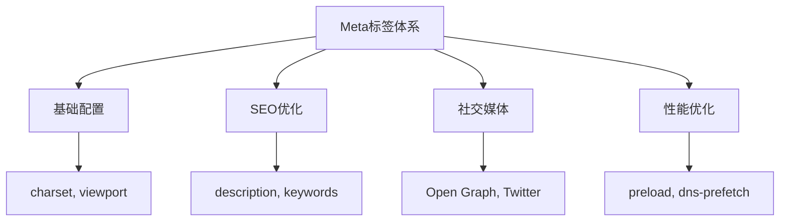

# Meta标签体系

## 🏷️ Meta标签分类

### 📊 Meta标签功能划分



## 💡 核心Meta标签

### ⭐ 必需的Meta标签

```html
<head>
    <!-- 字符编码 -->
    <meta charset="UTF-8">
    
    <!-- 视口设置 -->
    <meta name="viewport" content="width=device-width, initial-scale=1.0">
    
    <!-- 页面描述 -->
    <meta name="description" content="页面描述，用于SEO">
    
    <!-- 页面关键词 -->
    <meta name="keywords" content="HTML, CSS, JavaScript">
</head>
```

### 🌐 社交媒体Meta标签

```html
<!-- Facebook/Open Graph -->
<meta property="og:title" content="页面标题">
<meta property="og:description" content="页面描述">
<meta property="og:image" content="图片URL">

<!-- Twitter卡片 -->
<meta name="twitter:card" content="summary">
<meta name="twitter:title" content="页面标题">
```

### ⚡ 性能优化Meta标签

```html
<!-- DNS预解析 -->
<link rel="dns-prefetch" href="//fonts.googleapis.com">

<!-- 资源预加载 -->
<link rel="preload" href="fonts/main.woff2" as="font" type="font/woff2" crossorigin>

<!-- 资源预加载 -->
<link rel="prefetch" href="images/large-image.jpg">
```

---

**🔗 相关资源**：
- 文档头部：`[[02-15 文档头部管理]]`
- SEO优化：`[[03-12 SEO基础概念]]`
