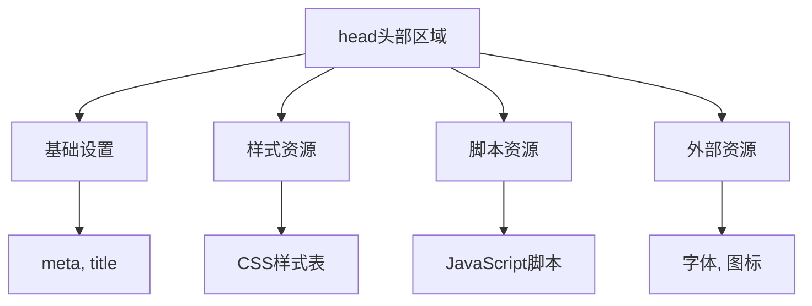

# 文档头部管理

## 🏗️ head区域结构化管理

### 📋 head元素层次



## 🔧 head内容最佳实践

### ⭐ 加载顺序优化

```html
<head>
    <!-- 1. 字符编码：最高优先级 -->
    <meta charset="UTF-8">
    
    <!-- 2. 视口设置：移动端必需 -->
    <meta name="viewport" content="width=device-width, initial-scale=1.0">
    
    <!-- 3. 页面标题：SEO必需 -->
    <title>页面标题</title>
    
    <!-- 4. 关键CSS：内联样式 -->
    <style>
        .critical { color: red; }
    </style>
    
    <!-- 5. 主要样式表 -->
    <link rel="stylesheet" href="styles/main.css">
    
    <!-- 6. 非关键脚本：延迟加载 -->
    <script defer src="scripts/main.js"></script>
</head>
```

## 🚀 性能优化策略

### 📊 资源加载优化

```html
<!-- 字体图标优先级更高 -->
<link rel="preload" href="fonts/main.woff2" as="font" type="font/woff2" crossorigin>

<!-- 关键图片预加载 -->
<link rel="preload" href="images/hero.jpg" as="image">

<!-- 外部资源DNS预解析 -->
<link rel="dns-prefetch" href="//www.google-analytics.com">
```

---
