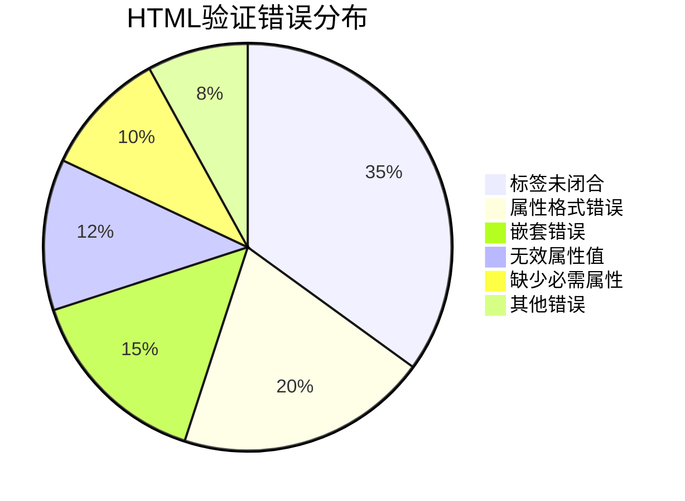

# HTML验证器使用

## 🔧 W3C HTML验证器

### 📍 官方验证工具

**W3C Markup Validator**: https://validator.w3.org/

### 🎯 验证标准类型

| 标准 | HTML5 | XHTML 1.0 | HTML 4.01 |
|------|-------|-----------|-----------|
| **DOCTYPE** | `<!DOCTYPE html>` | Strict DTD | Strict/Transitional |
| **语法要求** | 相对宽松 | 严格XML | 传统HTML |
| **错误等级** | 建议性 | 致命性 | 警告/错误 |

## 📊 常见验证错误

### ❌ 语法错误类型



### ✅ 修正示例

```html
<!-- 错误：缺少alt属性 -->


<!-- 修正：添加alt描述 -->


<!-- 错误：标签未闭合 -->
<p>段落内容

<!-- 修正：正确闭合 -->
<p>段落内容</p>
```

## 🛠️ 在线验证工具

### 🔍 主要验证平台

| 工具 | URL | 特点 |
|------|-----|------|
| **W3C Validator** | validator.w3.org | 官方权威 |
| **Nu Checker** | checker.validator.nu | 现代标准 |
| **Validator Sauce** | www.validatorsauce.com | 批量验证 |

---
