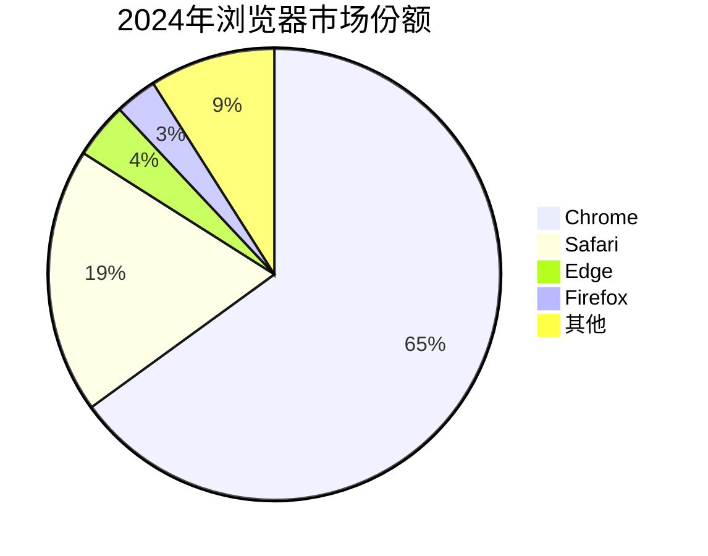
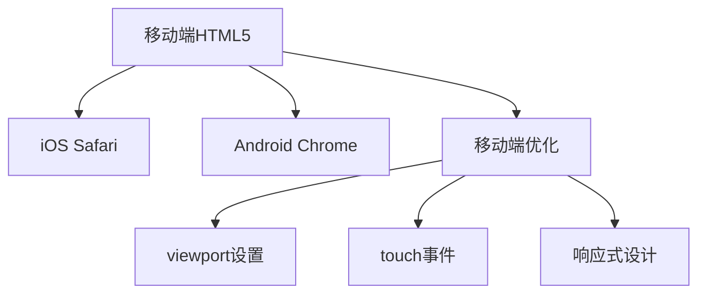

# 浏览器兼容性

## 🌐 主流浏览器兼容矩阵

### 📊 浏览器市场份额



### 🎯 HTML5特性支持

| 特性 | Chrome | Firefox | Safari | Edge |
|------|--------|---------|--------|------|
| **语义化标签** | ✅ 100% | ✅ 100% | ✅ 100% | ✅ 100% |
| **video/audio** | ✅ | ✅ | ✅ | ✅ |
| **Canvas 2D** | ✅ | ✅ | ✅ | ✅ |
| **WebGL** | ✅ | ✅ | ✅ | ✅ |
| **CSS Grid** | ✅ | ✅ | ✅ | ✅ |
| **Flexbox** | ✅ | ✅ | ✅ | ✅ |

## 🛠️ 兼容性处理策略

### 🔧 Polyfill方案

```html
<!-- HTML5元素IE兼容性 -->
<script>
document.createElement('header');
document.createElement('nav');
document.createElement('section');
document.createElement('article');
document.createElement('footer');
</script>

<!-- 或使用modernizr.js检测 -->
<script src="modernizr.js"></script>
```

### 📱 移动端兼容性



---
