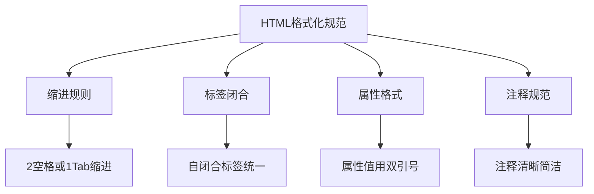

# 代码格式化规范

## 🎨 HTML代码格式化标准

### 📋 基础格式化规则



## 🔧 格式化最佳实践

### ✅ 标签缩进规范

```html
<!-- 正确：层级缩进 -->
<div class="container">
    <header class="page-header">
        <h1>网站标题</h1>
        <nav class="main-nav">
            <ul>
                <li><a href="/">首页</a></li>
                <li><a href="/about">关于</a></li>
            </ul>
        </nav>
    </header>
</div>
```

### 📦 属性排序规范

```html
<!-- 推荐的属性顺序 -->

```

## 🛠️ 格式化工具

### 💻 编辑器插件

| 工具 | 用途 | 安装命令 |
|------|------|----------|
| **Prettier** | 自动格式化 | VS Code: Extension |
| **HTMLHint** | 代码检查 | npm install htmlhint |
| **Emmet** | 快速编写 | VS Code: 内置支持 |

### 📊 格式化配置文件

```json
{
    "editor.insertSpaces": true,
    "editor.tabSize": 2,
    "html.format.indentInnerHtml": true,
    "html.format.wrapLineLength": 100,
    "editor.formatOnSave": true
}
```

---
