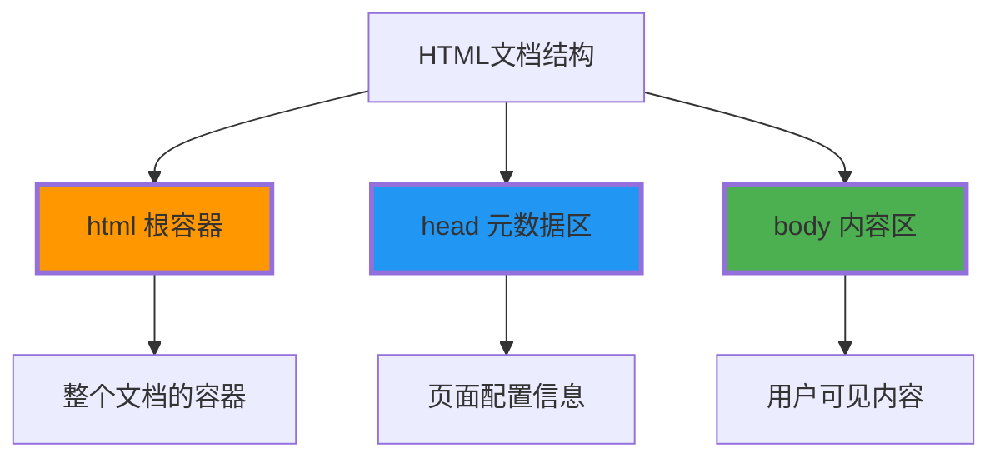
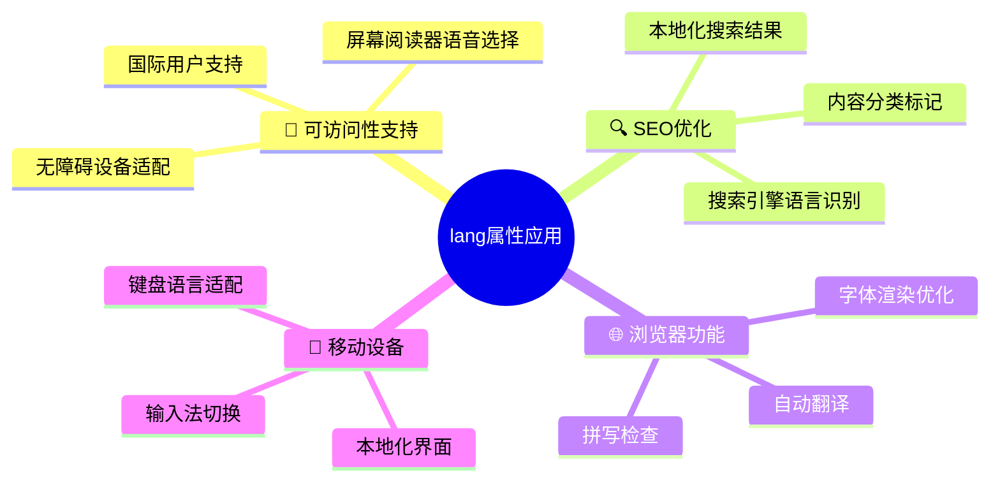
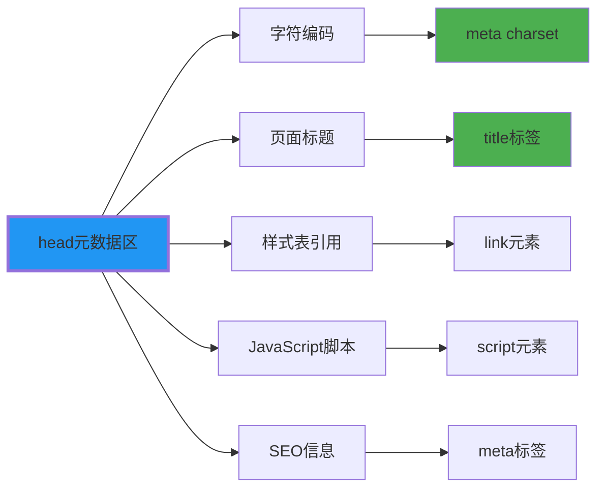
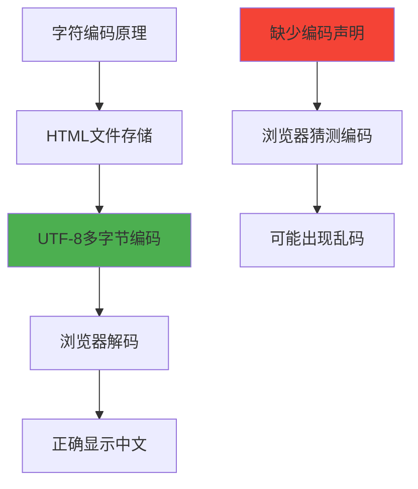
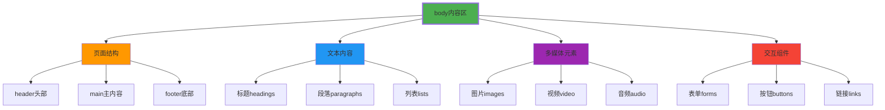
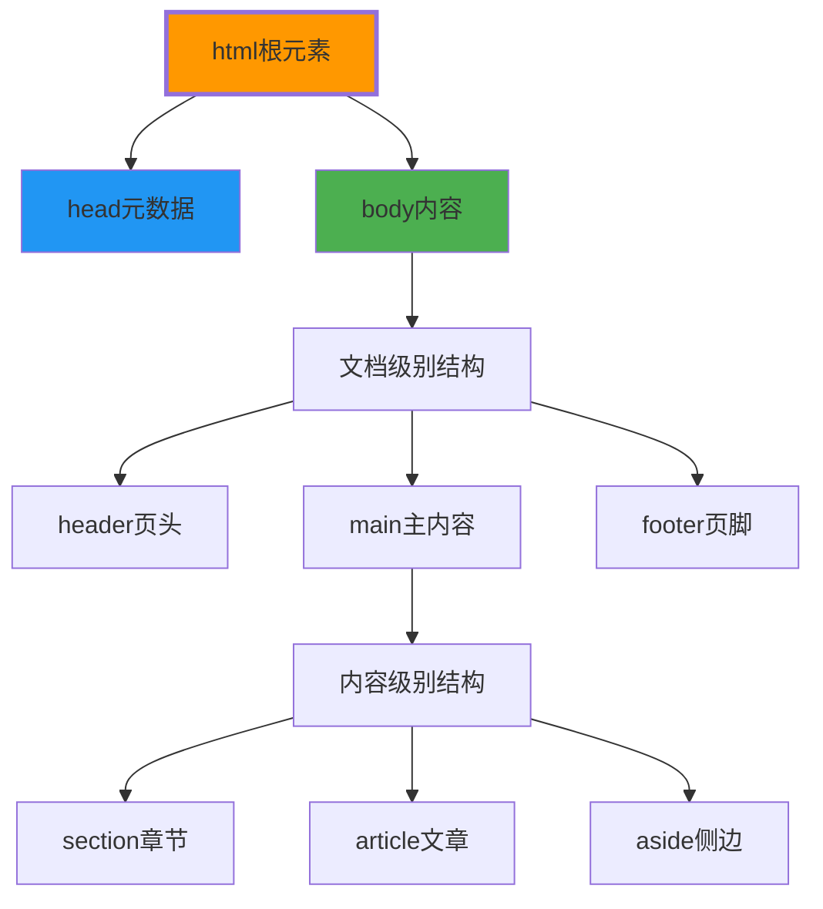

# 结构性标记元素

## 🏗️ HTML文档的结构性标记

### 📋 结构性标记的核心作用

结构性标记定义HTML文档的**基本框架**和**层次关系**：



**🎯 结构性标记的价值**：
- **文档框架**：建立清晰的信息分类
- **浏览器解析**：指导浏览器正确渲染
- **SEO优化**：帮助搜索引擎理解页面
- **可访问性**：支持屏幕阅读器导航

## 🌐 html根元素详解

### 📍 html标签的职责

**html标签**是整个HTML文档的**根容器**，包裹所有其他元素：

```html
<!DOCTYPE html>
<html lang="zh-CN">
    <!-- 整个HTML文档的内容 -->
</html>
```

### 🔧 html标签的重要属性

| 属性名 | 作用 | 示例值 | 重要性 |
|--------|------|--------|--------|
| **lang** | 文档语言标识 | `zh-CN`, `en-US` | ⭐⭐⭐⭐⭐ |
| **dir** | 文本方向 | `ltr`, `rtl` | ⭐⭐⭐ |
| **xmlns** | XML命名空间 | `http://www.w3.org/1999/xhtml` | ⭐⭐ |

**🔍 lang属性详解**：



**💡 lang属性最佳实践**：
```html
<!-- 推荐的完整配置 -->
<html lang="zh-CN" dir="ltr">
    
<!-- 多语言页面的处理 -->
<html lang="zh-CN" xml:lang="zh-CN">
    
<!-- 动态语言的设置 -->
<html lang="zh-CN" class="no-js">
```

## 📋 head元数据区域

### 🎯 head标签的职责范围

**head标签**包含页面的**元数据信息**，通常是**不可见的**：



### 📊 head区域内元素分类

| 元素类型 | 标签 | 必需性 | 作用描述 |
|----------|------|--------|----------|
| **字符编码** | `<meta charset>` | ⭐⭐⭐⭐⭐ | 防止中文乱码 |
| **页面标题** | `<title>` | ⭐⭐⭐⭐⭐ | 浏览器标签与SEO |
| **视口设置** | `<meta name="viewport">` | ⭐⭐⭐⭐ | 移动设备适配 |
| **页面描述** | `<meta name="description">` | ⭐⭐⭐⭐ | 搜索引擎摘要 |
| **样式表** | `<link rel="stylesheet">` | ⭐⭐⭐ | 外观样式定义 |
| **脚本文件** | `<script>` | ⭐⭐⭐ | 交互功能实现 |

### 🔧 必需Head元素详解

#### 1️⃣ meta charset - 字符编码声明

```html
<meta charset="UTF-8">
```

**📍 关键特点**：
- **位置要求**：必须在head的前1024字节内
- **标准值**：UTF-8（支持所有全球字符）
- **重要性**：💥 没有此标签中文会乱码



#### 2️⃣ title - 页面标题

```html
<title>页面标题 - 网站名称</title>
```

**🎯 标题的作用**：
- **浏览器标签**：显示在浏览器标签栏
- **书签默认名**：用户收藏时的默认标题
- **搜索结果**：搜索引擎显示在搜索结果中
- **SEO权重**：搜索引擎的重要排名因素

**📊 title优化策略**：
```html
<!-- 基础格式 -->
<title>具体页面名 - 品牌名称</title>

<!-- SEO优化格式 -->
<title>关键词组合 - 长尾词 - 品牌</title>

<!-- 示例 -->
<title>HTML教程 - Web开发入门 - 编程学院</title>
```

#### 3️⃣ meta viewport - 移动适配

```html
<meta name="viewport" content="width=device-width, initial-scale=1.0">
```

**🔧 viewport参数详解**：

| 参数 | 含义 | 推荐值 | 作用 |
|------|------|--------|------|
| **width** | 视口宽度 | `device-width` | 页面宽度等于设备宽度 |
| **initial-scale** | 初始缩放 | `1.0` | 不缩放，100%显示 |
| **minimum-scale** | 最小缩放 | `0.1` | 允许缩放到10% |
| **maximum-scale** | 最大缩放 | `5.0` | 允许放大最多500% |
| **user-scalable** | 用户缩放 | `yes/no` | 是否允许用户手动缩放 |

### 🎨 head扩展元素

#### 📝 SEO优化Meta标签

```html
<head>
    <meta charset="UTF-8">
    <meta name="viewport" content="width=device-width, initial-scale=1.0">
    <title>页面标题</title>
    
    <!-- SEO优化标签 -->
    <meta name="description" content="页面描述，用于搜索引擎摘要">
    <meta name="keywords" content="关键词1,关键词2,关键词3">
    <meta name="author" content="网站作者">
    <meta name="robots" content="index,follow">
    
    <!-- Open Graph标签 -->
    <meta property="og:title" content="社交媒体标题">
    <meta property="og:description" content="社交媒体描述">
    <meta property="og:image" content="分享图片URL">
    <meta property="og:url" content="页面URL">
    <meta property="og:type" content="website">
</head>
```

#### 🔗 外部资源引用

```html
<!-- CSS样式表引用 -->
<link rel="stylesheet" href="styles/main.css">
<link rel="preload" href="fonts/custom.woff2" as="font" type="font/woff2" crossorigin>

<!-- 网站图标 -->
<link rel="icon" type="image/x-icon" href="/favicon.ico">
<link rel="apple-touch-icon" sizes="180x180" href="/apple-touch-icon.png">

<!-- 规范链接 -->
<link rel="canonical" href="https://example.com/current-page.html">
```

## 📦 body内容容器

### 🎯 body标签的职责

**body标签**包含页面的**所有可见内容**，用户实际看到和交互的部分：



### 📋 body内容的组织结构

**🎯 推荐的内容结构**：
```html
<body>
    <!-- 页面头部 -->
    <header>
        <nav>导航菜单</nav>
        <h1>主要标题</h1>
    </header>
    
    <!-- 主要内容 -->
    <main>
        <section>
            <h2>章节标题</h2>
            <article>
                <h3>文章标题</h3>
                <p>文章内容...</p>
            </article>
        </section>
        
        <aside>
            <h3>侧边栏标题</h3>
            <p>补充内容</p>
        </aside>
    </main>
    
    <!-- 页面底部 -->
    <footer>
        <p>版权信息</p>
        <nav>页脚导航</nav>
    </footer>
</body>
```

### 🔧 body的CSS类管理

**🎯 常见的body类策略**：
```html
<!-- 功能类 -->
<body class="home-page">
<body class="about-page">
<body class="contact-page">

<!-- 状态类 -->
<body class="loading">
<body class="error">
<body class="success">

<!-- 主题类 -->
<body class="light-theme">
<body class="dark-theme">
<body class="colorful-theme">

<!-- 设备类（通过JavaScript添加） -->
<body class="mobile">
<body class="tablet">
<body class="desktop">
```

## 📊 结构化标记最佳实践

### ✅ HTML文档结构检查清单

| 检查项目 | 要求 | 验证方式 |
|----------|------|----------|
| **DOCTYPE声明** | HTML5标准 | `<!DOCTYPE html>` |
| **HTML标签** | 包含lang属性 | `<html lang="zh-CN">` |
| **Head完整** | 必需meta标签 | charset, viewport, title |
| **Body内容** | 语义化结构 | header, main, footer等 |
| **标题层次** | h1-h6合理使用 | 不可跳级使用 |

### 🔧 常见结构错误与修正

**❌ 结构错误示例**：
```html
<!-- 错误1：缺少DOCTYPE -->
<html lang="zh-CN">
<head></head>
<body>内容</body>
</html>

<!-- 错误2：title为空 -->
<head>
    <meta charset="UTF-8">
    <title></title>
</head>

<!-- 错误3：body结构混乱 -->
<body>
    <h2>标题（跳过了h1）</h2>
    <nav>导航在内容中间</nav>
    <h1>主标题</h1>
</body>
```

**✅ 正确结构示例**：
```html
<!DOCTYPE html>
<html lang="zh-CN">
<head>
    <meta charset="UTF-8">
    <meta name="viewport" content="width=device-width, initial-scale=1.0">
    <title>网站标题 - 页面标题</title>
    <meta name="description" content="页面描述">
</head>
<body>
    <header>
        <h1>网站主标题</h1>
        <nav>主导航</nav>
    </header>
    
    <main>
        <h2>页面内容标题</h2>
        <p>主要内容...</p>
    </main>
    
    <footer>
        <p>版权信息</p>
    </footer>
</body>
</html>
```

## 🔍 结构语义化理解

### 📚 语义化的层次关系



### 🎯 理解"结构"与"内容"的区别

**🏗️ 结构**：页面的**框架和组织方式**
- html - 文档容器
- head - 配置信息区
- body - 内容展示区

**📝 内容**：具体的**信息和功能元素**
- h1-h6 - 标题文本
- p - 段落文本
- img - 图片内容
- form - 表单功能

---

**🔗 深入内容组织**：
- 内容标记：`[[02-3 内容组织标记]]`
- 文本格式：`[[02-4 文本格式化元素]]`
- 链接图像：`[[02-5 链接与图像处理]]`
