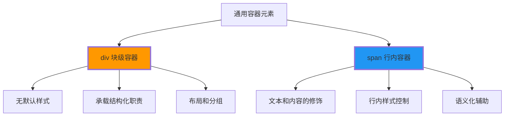
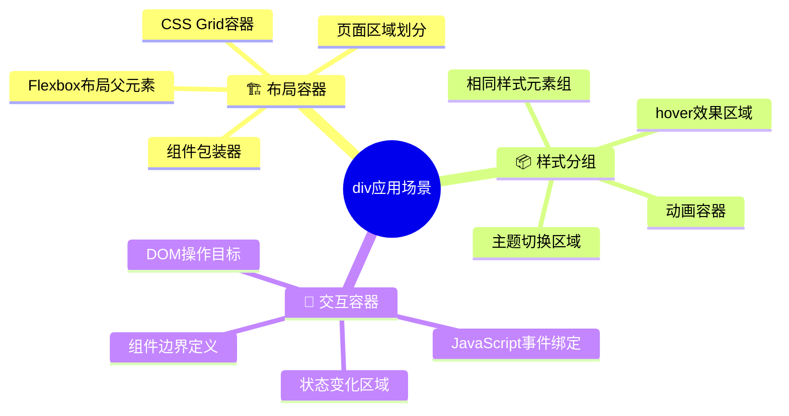
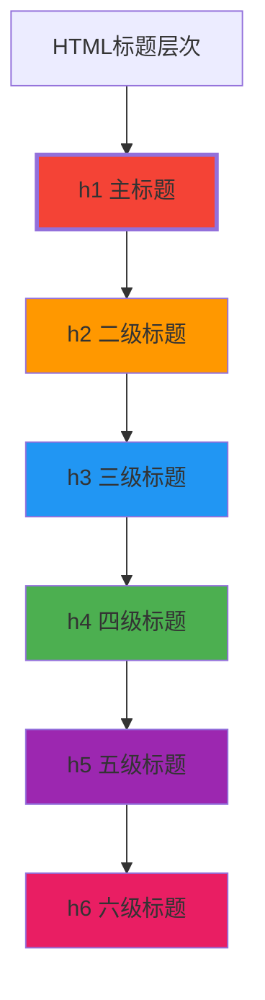
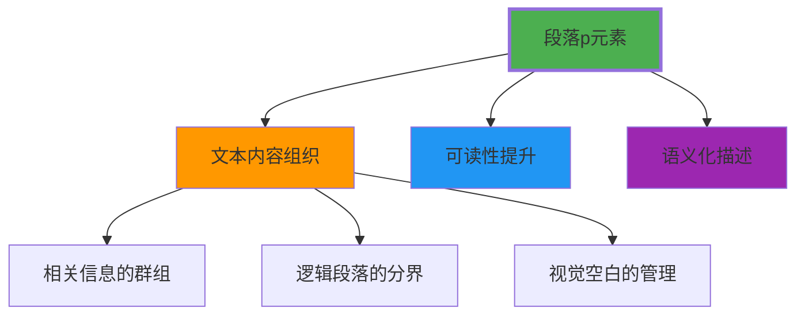
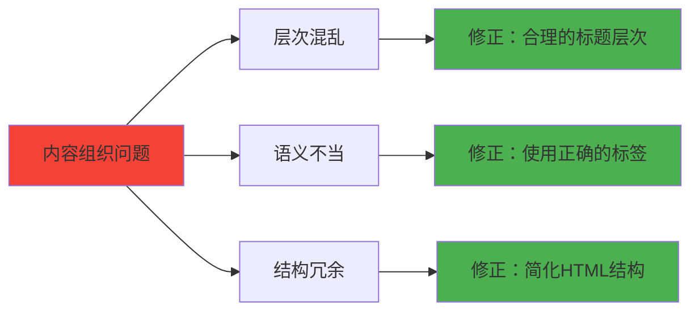

# 内容组织标记

## 🗂️ 内容组织的层次化原理

### 📋 div与span：通用容器元素



**🎯 核心认知**：div和span本身**不提供语义**，需要通过CSS类名和上下文来**揭示意义**

### 🔧 div块级容器详解

**📍 div的基本特征**：
- **无样式**：默认没有任何视觉样式
- **块级显示**：独占一行，可设置宽高
- **通用容器**：可以包含任何其他元素
- **样式载体**：主要用于CSS样式和布局

**🎯 div的典型用途**：



### 📐 div布局实例

```html
<!-- 经典两栏布局 -->
<div class="container">
    <div class="header">头部区域</div>
    <div class="main-content">
        <div class="sidebar">侧边栏</div>
        <div class="content">主内容区</div>
    </div>
    <div class="footer">底部区域</div>
</div>
```

**对应的CSS**：
```css
.container { max-width: 1200px; margin: 0 auto; }
.header { background: #333; color: white; padding: 1rem; }
.main-content { display: flex; gap: 2rem; }
.sidebar { width: 250px; }
.content { flex: 1; }
.footer { background: #f0f0f0; padding: 1rem; }
```

### 🔗 span行内容器详解

**📍 span的基本特征**：
- **无样式**：默认无视觉效果
- **行内显示**：随文流动，不换行
- **文本修饰**：主要用于文本内容
- **样式载体**：承载行内样式

**🎯 span的典型用途**：

```html
<!-- 文本样式控制 -->
<p>这是<span class="highlight">重要信息</span>的示例</p>

<!-- 多语言内容标记 -->
<p>Welcome <span lang="zh-CN">欢迎</span> to our site</p>

<!-- JavaScript交互目标 -->
<p>Click <span class="clickable" onclick="showDetails()">here</span> for more</p>

<!-- 图标容器 -->
<p>Today is <span class="weather-icon">☀️</span> sunny day</p>
```

## 📝 标题层次系统（h1-h6）

### 🎯 标题的层次化语义



**🔑 标题层次的重要性**：
- **文档结构**：建立清晰的信息层次
- **SEO影响**：搜索引擎理解内容重要性
- **可访问性**：屏幕阅读器进行页面导航
- **用户体验**：帮助用户快速定位信息

### 📊 标题层次最佳实践

#### ✅ 正确的层次结构

```html
<h1>网站主标题</h1>

  <h2>第一章标题</h2>
  
    <h3>第一节标题</h3>
      <p>段落内容一</p>
      
    <h3>第二节标题</h3>
      <h4>子节标题</h4>
        <p>段落内容二</p>
  
  <h2>第二章标题</h2>
    <p>章节概述</p>
```

#### ❌ 错误的层次结构

```html
<!-- 错误1：跳过h1 -->
<h2>主要标题</h2>  <!-- ❌ 应该使用h1 -->

<!-- 错误2：层次跳跃 -->
<h1>主标题</h1>
<h3>第二节</h3>    <!-- ❌ 缺少h2，跳过层次 -->

<!-- 错误3：层次混乱 -->
<h3>小标题</h3>
<h2>大标题</h2>    <!-- ❌ h2级别高于h3，顺序错误 -->
```

### 🔧 CSS中标题样式的管理

**🎯 标题样式重置**：
```css
h1, h2, h3, h4, h5, h6 {
    margin: 0;
    padding: 0;
    font-weight: bold;
    line-height: 1.2;
}

h1 { font-size: 2.5rem; margin-bottom: 1rem; }
h2 { font-size: 2rem; margin-bottom: 0.8rem; }
h3 { font-size: 1.5rem; margin-bottom: 0.6rem; }
h4 { font-size: 1.25rem; margin-bottom: 0.5rem; }
h5 { font-size: 1.1rem; margin-bottom: 0.4rem; }
h6 { font-size: 1rem; margin-bottom: 0.3rem; }
```

## 📄 段落组织（p标签）

### 🎯 段落的设计原则

**段落是文档中的**基本文本单元**，用于组织和呈现连续的内容：



### 📝 段落的最佳实践

#### ✅ 段落使用指南

```html
<!-- 正确的段落结构 -->
<article>
    <h2>文章标题</h2>
    
    <p>这是第一个段落，包含一个完整的想法或主题。段落应该有足够的长度来充分表达这个概念。</p>
    
    <p>这是第二个段落，开始一个新的想法或主题。每个段落都有自己的主旨，但同时与整体文章保持连贯性。</p>
    
    <p>这是第三个段落，继续展开论述。注意段落之间有适当的间距，提供视觉上的分隔。</p>
</article>
```

#### ❌ 错误的段落使用

```html
<!-- 错误1：段落中包含块级元素 -->
<p>
    段落内容
    <div>错误：div不能放在p标签内</div>
</p>

<!-- 错误2：单个词汇或短语的段落 -->
<p>词1</p>
<p>词2</p>
<p>短语3</p>

<!-- 错误3：用段落做布局 -->
<p class="sidebar">这不是段落的内容</p>
```

### 🎨 段落的CSS样式管理

```css
p {
    margin: 1rem 0;           /* 上下留白，左右无留白 */
    line-height: 1.6;         /* 行间距提升可读性 */
    color: #333;              /* 字色 */
    font-size: 1rem;          /* 字体大小 */
    text-align: left;         /* 对齐方式 */
    text-indent: 2em;         /* 首行缩进（可选） */
}

/* 特殊段落样式 */
p.lead {
    font-size: 1.25rem;
    font-weight: 300;
    margin-bottom: 2rem;
}

p.small {
    font-size: 0.875rem;
    color: #666;
}

p.code {
    font-family: monospace;
    background: #f5f5f5;
    padding: 0.5rem;
    border-radius: 0.25rem;
}
```

## 📚 内容组织的实际应用

### 🏗️ 页面结构实例

#### 📱 博客文章页面结构

```html
<main class="blog-post">
    <header class="post-header">
        <h1>如何学习HTML基础</h1>
        <div class="post-meta">
            <span>作者：编程导师</span>
            <span>发布时间：2024-01-15</span>
            <span>阅读时间：5分钟</span>
        </div>
    </header>
    
    <article class="post-content">
        <h2>什么是HTML</h2>
        <p>HTML（HyperText Markup Language）是创建Web页面的标准标记语言...</p>
        
        <h3>HTML的基本结构</h3>
        <p>每个HTML文档都遵循一个基本的结构模板...</p>
        
        <h4>DOCTYPE声明</h4>
        <p>DOCTYPE声明告诉浏览器使用哪个版本的HTML...</p>
        
        <h2>HTML元素分类</h2>
        <p>HTML元素可以根据不同的分类方式进行组织...</p>
        
        <h3>块级元素 vs 行内元素</h3>
        <p>这可能是最重要的HTML元素分类方式...</p>
    </article>
    
    <footer class="post-footer">
        <div class="tags">
            <span>标签：</span>
            <span class="tag">HTML</span>
            <span class="tag">Web开发</span>
            <span class="tag">教程</span>
        </div>
    </footer>
</main>
```

#### 🏢 企业页面结构

```html
<div class="company-page">
    <div class="hero-section">
        <div class="hero-content">
            <h1>引领数字时代的技术公司</h1>
            <p>我们致力于为客户提供创新的技术解决方案...</p>
        </div>
    </div>
    
    <div class="about-section">
        <h2>关于我们</h2>
        <p>成立于2010年，我们是一家专注于...</p>
        
        <h3>我们的使命</h3>
        <p>通过技术创新，改变人们的生活方式...</p>
        
        <h3>我们的价值观</h3>
        <p>诚信、创新、合作、追求卓越...</p>
    </div>
    
    <div class="services-section">
        <h2>服务领域</h2>
        <div class="services-grid">
            <div class="service-item">
                <h3>Web开发</h3>
                <p>现代化的网站和应用开发...</p>
            </div>
            <div class="service-item">
                <h3>移动应用</h3>
                <p>iOS和Android平台应用开发...</p>
            </div>
        </div>
    </div>
</div>
```

## 🔍 内容质量检查

### ✅ 内容组织检查清单

| 检查项目 | 标准要求 | 验证方式 |
|----------|----------|----------|
| **标题层次** | 按h1→h2→h3顺序，不跳跃 | 检查层级结构 |
| **段落内容** | 每个段落有完整的主旨 | 阅读内容逻辑 |
| **容器使用** | div用于布局，div不用于文本 | 查看CSS用途 |
| **语义正确** | 标签与实际用途匹配 | 语义分析 |

### 🛠️ 常见错误与修正



---

**🔗 继续深入学习**：
- 文本格式：`[[02-4 文本格式化元素]]`
- 链接图像：`[[02-5 链接与图像处理]]`
- 列表表格：`[[02-6 列表与表格结构]]`
