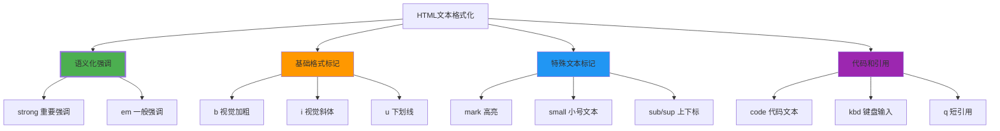
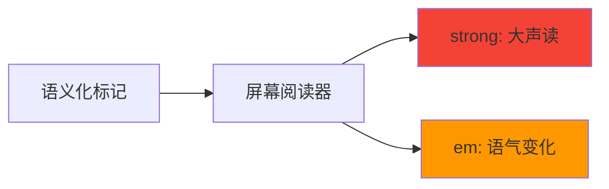

# 文本格式化元素

## 🎨 HTML文本格式化的层次

### 📝 文本格式化的分类



**🎯 核心区别**：语义化元素传达**内容含义**，视觉元素只改变**外观**

## 💪 语义化强调元素

### 🎯 strong vs em：重要程度的区分

| 元素 | 语义含义 | 使用场景 | 默认样式 |
|------|----------|----------|----------|
| **strong** | 强烈重要/紧急 | 警告信息、关键提醒 | 加粗显示 |
| **em** | 普通强调/变化 | 语气变化、重点内容 | 斜体显示 |

**📊 使用示例**：
```html
<!-- 紧急和重要信息 -->
<p><strong>紧急：</strong>系统将于今晚23:00进行维护，请保存好工作进度。</p>

<!-- 普通语气强调 -->
<p>这真的是<em>非常重要</em>的发现，我们都没想到会这样。</p>

<!-- 混合使用 -->
<p>请务必<strong>仔细阅读</strong>以下<em>安全须知</em>。</p>
```

### 🔄 semantic元素的屏幕阅读器支持



## 🎨 视觉格式化元素

### 📏 b vs i：纯视觉效果

**🎯 b标签（视觉加粗）**：
- **语义**：无特殊含义，仅视觉加粗
- **用途**：装饰性加粗，如关键词标记
- **对比**：与strong的区别在于不传达重要性

```html
<!-- b标签使用 -->
<p>在产品<span class="keyword"><b>技术规格</b></span>中，我们使用了最新的技术。</p>

<!-- 更推荐的方式 -->
<p>在产品<span class="keyword"><mark>技术规格</mark></span>中，我们使用了最新的技术。</p>
```

**🎯 i标签（视觉斜体）**：
- **语义**：无特殊含义，仅视觉斜体
- **用途**：区分文本，如外文词汇、电影名称
- **对比**：与em的区别在于不传达强调

```html
<!-- i标签使用 -->
<p>我最喜欢的电影是<i>肖申克的救赎</i>。</p>
<p>这是一个来自拉丁语的词汇：<i>et cetera</i>。</p>
```

## 🌟 特殊文本标记

### 🎯 mark：现代高亮标记

**mark标签**用于**突出显示**文档中与用户搜索或其他操作相关的文本：

```html
<!-- 搜索引擎高亮结果 -->
<p>搜索结果：您搜索的<mark>关键词</mark>在以下内容中被找到...</p>

<!-- 用户注意引号 -->
<p>请注意<mark>"重要提醒"</mark>部分的内容。</p>
```

**🎨 CSS样式控制**：
```css
mark {
    background-color: #ffeb3b;  /* 黄色高亮 */
    padding: 0.1em 0.2em;       /* 内边距 */
    border-radius: 0.25em;     /* 圆角 */
}

/* 深色主题下的高亮 */
.dark-theme mark {
    background-color: #ffc107;
    color: #000;
}
```

### 📞 small：附属信息标记

**small标签**表示**法律、版权等附属信息**：

```html
<!-- 版权信息 -->
<p>© 2024 公司名称。版权所有。</p>
<p><small>本网站内容仅供参考，最终解释权归公司所有。</small></p>

<!-- 免责声明 -->
<div>
    <p>主要信息内容...</p>
    <p><small>*此内容仅供参考，具体情况请以官方信息为准。</small></p>
</div>
```

### 📐 sub/sup：上下标标记

**sub标签（下标）**和**sup标签（上标）**：

```html
<!-- 数学公式 -->
<p>水的化学分子式：H<sub>2</sub>O</p>
<p>二次方程公式：x<sup>2</sup> + 2x + 1 = 0</p>

<!-- 脚注和注释 -->
<p>这项研究<sup>1</sup>表明...<sup>2</sup></p>
<p>参考文献<sub>1</sub>：Smith, J. (2024)</p>
```

## 💻 代码和计算机文本

### 🔧 code：代码文本标记

**code标签**表示**计算机代码**：

```html
<!-- 内联代码 -->
<p>使用<code>console.log()</code>函数来输出信息。</p>
<p>CSS属性<code>display: flex</code>用于创建弹性布局。</p>

<!-- 代码示例 -->
<div>
    <p>JavaScript函数示例：</p>
    <code>
        function greet(name) {
            return `Hello, ${name}!`;
        }
    </code>
</div>
```

### ⌨️ kbd：键盘输入标记

**kbd标签**表示**键盘按键**：

```html
<!-- 快捷键说明 -->
<p>保存文件的快捷键是<kbd>Ctrl</kbd> + <kbd>S</kbd>。</p>
<p>退出程序请按<kbd>Alt</kbd> + <kbd>F4</kbd>。</p>

<!-- 简化版移动端 -->
<p>在手机上按<kbd>⬅️</kbd>后退。</p>
```

**🎨 kbd样式**：
```css
kbd {
    background-color: #f5f5f5;
    border: 1px solid #c0c0c0;
    border-radius: 3px;
    padding: 0.1em 0.3em;
    font-family: monospace;
    font-size: 0.9em;
}
```

## 📝 引用标记

### 🎯 q：短引用标记

**q标签**用于**短引用**，通常引用他人的一句话或短语：

```html
<!-- 简单引用 -->
<p>正如爱因斯坦所说：<q>想象力比知识更重要。</q></p>

<!-- 多语言引用 -->
<p>古罗马名言：<q lang="la">Carpe diem</q>，意思是"及时行乐"。</p>
```

### 🌐 cite：引用来源标记

**cite标签**表示**引用的来源**：

```html
<!-- 引用和来源 -->
<p><q>设计不只是外观和感觉，设计是它如何工作。</q> —— <cite>史蒂夫·乔布斯</cite></p>

<p>根据<cite>Google搜索算法报告</cite>的最新数据...</p>
```

## ⏰ 时间和日期标记

### 📅 time：时间信息标记

**time标签**表示**时间、日期或持续时间**：

```html
<!-- 具体时间 -->
<p>会议时间：<time>2024-01-15T09:00:00</time></p>

<!-- 人类可读时间 -->
<p>发布时间：<time datetime="2024-01-15">2024年1月15日</time></p>

<!-- 持续时间 -->
<p>手术持续了<time>02:30:15</time>（2小时30分15秒）。</p>
```

## 🔤 字体和装饰标记

### 🌐 缩写标记（abbr）

**abbr标签**用于**缩写词**，提供展开说明：

```html
<!-- 技术缩写 -->
<p><abbr title="World Wide Web">WWW</abbr>是互联网的核心技术。</p>

<!-- 国家缩写 -->
<p><abbr title="United States of America">USA</abbr>的人口约为3.3亿。</p>
```

## 🎨 格式化元素的CSS管理

### 📊 统一格式化样式

```css
/* 语义化强调元素 */
strong {
    font-weight: 700;
    color: #d32f2f; /* 深红色强调 */
}

em {
    font-style: italic;
    color: #1976d2; /* 蓝色强调 */
}

/* 视觉格式化元素 */
b {
    font-weight: bold;
}

i {
    font-style: italic;
}

/* 特殊标记 */
mark {
    background-color: #fff59d;
    padding: 0.1em 0.2em;
    border-radius: 0.25em;
}

small {
    font-size: 0.875em;
    color: #666;
    opacity: 0.8;
}

/* 上下标 */
sub, sup {
    font-size: 0.75em;
    line-height: 0;
    position: relative;
    vertical-align: baseline;
}

sup {
    top: -0.5em;
}

sub {
    bottom: -0.25em;
}

/* 代码相关 */
code {
    font-family: 'Fira Code', 'Courier New', monospace;
    background-color: #f5f5f5;
    padding: 0.2em 0.4em;
    border-radius: 0.25em;
    font-size: 0.9em;
}

kbd {
    font-family: monospace;
    background-color: #f3f3f3;
    border: 1px solid #ccc;
    border-radius: 0.25em;
    padding: 0.1em 0.3em;
    font-size: 0.875em;
}

/* 引用标记 */
q {
    quotes: "" "" "' " '"';
    font-style: italic;
    color: #555;
}

cite {
    font-style: italic;
    color: #666;
}

/* 时间标记 */
time {
    color: #1976d2;
    font-weight: 500;
}

/* 缩写 */
abbr {
    text-decoration: underline dotted;
    cursor: help;
}
```

## 📊 格式化元素使用指南

### ✅ 选择正确的元素

| 场景 | 推荐使用 | 原因 |
|------|----------|------|
| **重要提醒** | `strong` | 语义化强调 |
| **语气变化** | `em` | 语调改变 |
| **视觉区分** | `b`, `i` | 纯视觉需要 |
| **高亮标记** | `mark` | 相关结果突出 |
| **附属信息** | `small` | 版权、免责 |
| **数学公式** | `sub`, `sup` | 上下标 |
| **代码文本** | `code` | 计算机代码 |
| **快捷键** | `kbd` | 键盘按键 |
| **引用内容** | `q` | 短引用 |
| **引用源头** | `cite` | 来源标注 |
| **时间信息** | `time` | 机器可读 |
| **缩写词汇** | `abbr` | 提供解释 |

---

**🔗 继续实践**：
- 链接图像：`[[02-5 链接与图像处理]]`
- 列表表格：`[[02-6 列表与表格结构]]`
- 表单基础：`[[02-7 表单基础架构]].md
