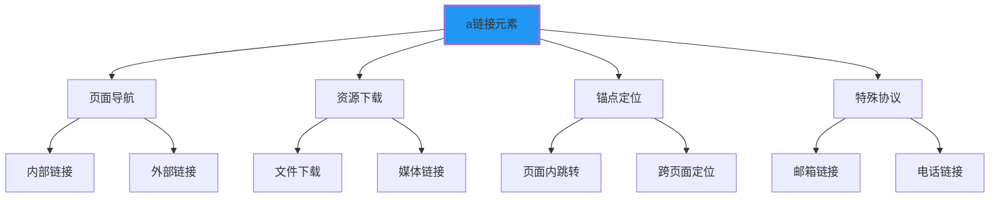

# 链接与图像处理

## 🔗 链接系统详解

### 📍 a标签的核心功能



### 🎯 href属性的各种用法

| 链接类型 | 示例 | 用途 | 行为 |
|----------|------|------|------|
| **内部链接** | `href="/about"` | 站内导航 | 页面跳转 |
| **外部链接** | `href="https://example.com"` | 访问其他网站 | 新窗口/当前窗口 |
| **锚点链接** | `href="#section1"` | 页面内跳转 | 滚动到位置 |
| **文件下载** | `href="/file.pdf" download` | 文件下载 | 触发下载 |
| **邮件链接** | `href="mailto:user@example.com"` | 发送邮件 | 打开邮件客户端 |
| **电话链接** | `href="tel:+1234567890"` | 拨打电话 | 拨打电话（移动端） |

## 🖼️ 图像处理详解

### 📊 img标签的使用规范

```html
<!-- 基础图像语法 -->


<!-- 完整属性示例 -->

```

### 🎯 图像优化最佳实践

**📱 响应式图像**：
```html
<!-- 现代响应式图像 -->
<picture>
    <source media="(min-width: 800px)" srcset="large.jpg">
    <source media="(min-width: 400px)" srcset="medium.jpg">
    
</picture>
```

**🔧 懒加载优化**：
```html

```

---

**🔗 深入应用**：
- 表单交互：`[[02-7 表单基础架构]]`
- 多媒体：`[[02-12 音频视频嵌入]]`
- 最佳实践：`[[03-1 语义化设计理念]]`
