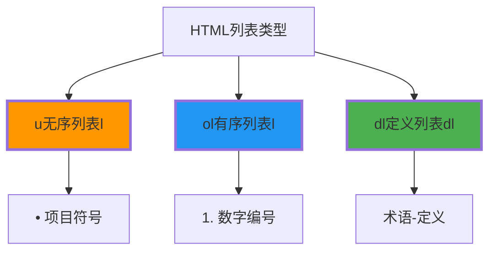

# 列表与表格结构

## 📋 HTML列表系统

### 🎯 三类型列表对比



## 🗂️ 列表的具体使用

**📝 无序列表示例**：
```html
<ul>
    <li>首页</li>
    <li>关于我们</li>
    <li>产品服务</li>
    <li>联系我们</li>
</ul>
```

**🔢 有序列表示例**：
```html
<ol>
    <li>学习HTML基础语法</li>
    <li>理解元素分类</li>
    <li>掌握结构标记</li>
    <li>练习布局应用</li>
</ol>
```

## 📊 表格结构化

### 🏗️ table基础结构

```html
<table>
    <thead>
        <tr>
            <th>姓名</th>
            <th>年龄</th>
            <th>技能</th>
        </tr>
    </thead>
    <tbody>
        <tr>
            <td>张三</td>
            <td>25</td>
            <td>HTML/CSS</td>
        </tr>
    </tbody>
</table>
```

---

**🔗 相关链接**：
- 表单表单表单：`[[02-7 表单基础架构]]`
- 样式样式样式：`[[04-1 HTML与CSS协作]]`
