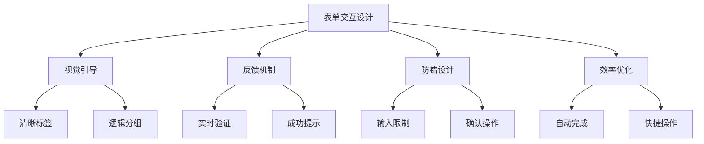

# 用户交互设计原则

## 🎯 表单用户体验设计

### 📊 交互设计要素



## 💡 最佳实践

### ✅ 标签与提示
```html
<label for="email">
    邮箱地址 <span class="required">*</span>
    <small>我们将保护您的隐私</small>
</label>
<input type="email" id="email" required>
```

### 🔄 实时反馈
```html
<input type="password" required placeholder="设置密码">
<div class="password-strength">
    <span>密码强度：弱</span>
    <div class="strength-bar"></div>
</div>
```

---

**🔗 表单整合**：
- 基础架构：`[[02-7 表单基础架构]]`
- 输入控件：`[[02-8 输入控件详解]]`
