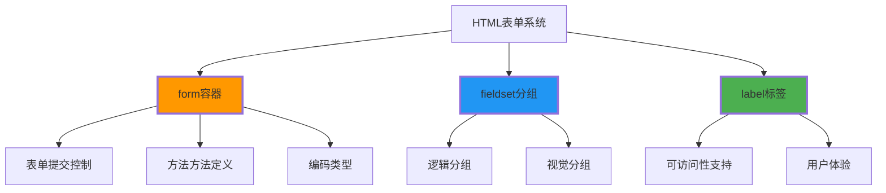

# 表单基础架构

## 🏗️ HTML表单的三大基石

### 📋 表单核心组件



## 🔧 form标签详解

### 📍 表单属性配置

| 属性 | 作用 | 必需性 | 常用值 |
|------|------|--------|--------|
| **method** | 提交方法 | ⭐⭐⭐⭐ | "get", "post" |
| **action** | 处理地址 | ⭐⭐⭐⭐ | "/submit", URL |
| **enctype** | 编码类型 | ⭐⭐⭐ | "application/x-www-form-urlencoded" |

**💡 基础表单示例**：
```html
<form method="post" action="/submit">
    <fieldset>
        <legend>用户注册</legend>
        
        <label for="username">用户名：</label>
        <input type="text" id="username" name="username" required>
        
        <label for="email">邮箱地址：</label>
        <input type="email" id="email" name="email" required>
        
        <button type="submit">提交注册</button>
    </fieldset>
</form>
```

---

**🔗 深入表单元素**：
- 输入控件：`[[02-8 输入控件详解]]`
- 验证验证验证：`[[02-10 表单验证机制]]`
