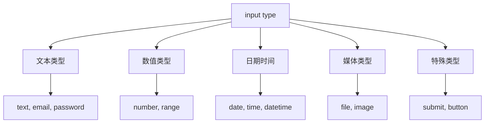

# 输入控件详解

## 🎛️ HTML5输入类型大全

### 📊 input type分类体系



## 💡 输入类型详细说明

### 🔤 文本输入类型

| 类型 | 语法 | 移动端行为 | 验证支持 |
|------|------|------------|----------|
| **text** | `type="text"` | 标准键盘 | 无 |
| **email** | `type="email"` | @键盘 | ✅ 邮箱格式 |
| **password** | `type="password"` | 隐藏输入 | ✅ 安全输入 |
| **tel** | `type="tel"` | 数字键盘 | ✅ 电话格式 |
| **url** | `type="url"` | .com键盘和网址 | ✅ URL格式 |
| **search** | `type="search"` | 搜索图标 | ✅ 搜索表单 |

```html
<input type="email" placeholder="请输入邮箱">
<input type="tel" placeholder="请输入电话号码">
<input type="url" placeholder="请输入网址">
<input type="search" placeholder="请输入搜索关键词">
```

---

**🔗 表单深入理解**：
- 选择控件：`[[02-9 选择与上传控件]]`
- 表单验证：`[[02-10 表单验证机制]]`
