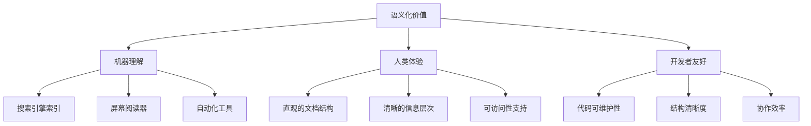
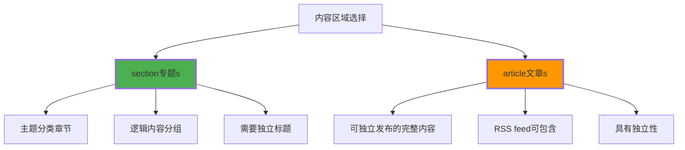
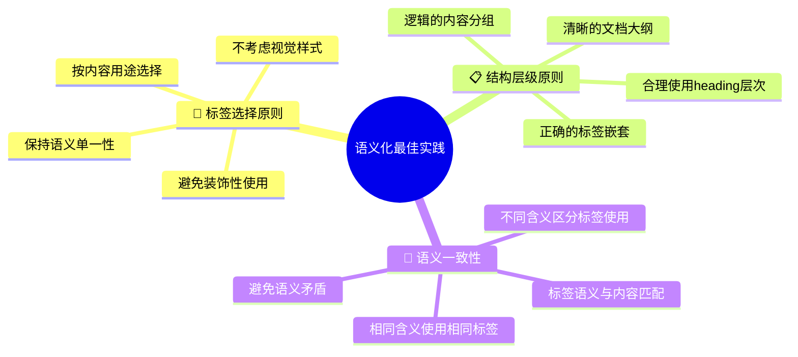
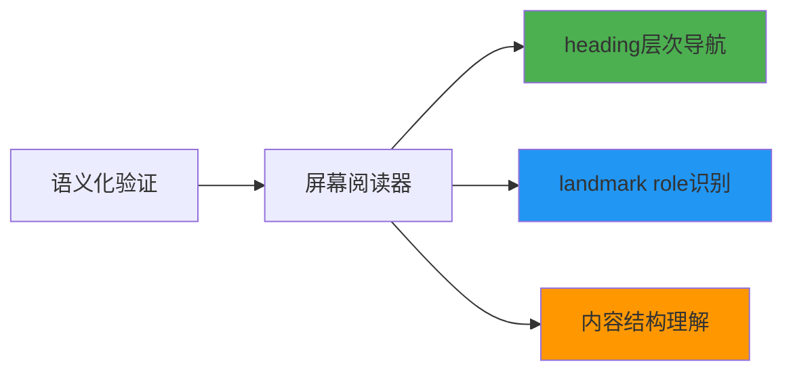

# HTML5语义化设计理念

## 🧠 语义化设计的核心思想

### 📍 什么是语义化标记

**语义化标记**指使用HTML标签来**准确描述内容的含义和用途**，而非仅为视觉样式服务：

```html
<!-- ❌ 非语义化：样式导向 -->
<div class="header">网站标题</div>
<div class="nav">导航菜单</div>

<!-- ✅ 语义化：含义导向 -->
<header>网站标题</header>
<nav>导航菜单</nav>
```

### 🎯 语义化的三层价值



## 🏗️ HTML5语义化标签系统

### 📊 主要语义化标签分类

| 标签 | 用途 | 替换对象 | 重要性 |
|------|------|----------|--------|
| **header** | 页面/区域头部 | div.header | ⭐⭐⭐⭐⭐ |
| **footer** | 页面/区域底部 | div.footer | ⭐⭐⭐⭐⭐ |
| **nav** | 导航菜单 | div.nav | ⭐⭐⭐⭐⭐ |
| **main** | 主要内容区 | div.content | ⭐⭐⭐⭐⭐ |
| **section** | 文档章节 | div.section | ⭐⭐⭐⭐ |
| **article** | 独立内容单元 | div.article | ⭐⭐⭐⭐ |
| **aside** | 侧边内容 | div.sidebar | ⭐⭐⭐ |
| **figure** | 图表、图片 | div.image | ⭐⭐⭐ |
| **figcaption** | 图表标注 | div.caption | ⭐⭐⭐ |

### 🎨 header标签详解

**📍 header的使用范围**：
- 网页顶部（页面级header）
- 文章的标题区（文章级header）
- 每个section的开始部分

```html
<!-- 页面级header -->
<header>
    <h1>网站主标题</h1>
    <nav>主要导航</nav>
    <p>网站标语</p>
</header>

<!-- 文章级header -->
<article>
    <header>
        <h2>文章标题</h2>
        <p>作者：张三 | 发布时间：2024-01-15</p>
    </header>
    <p>文章内容...</p>
</article>
```

### 📱 nav标签详解

**📍 nav的使用场景**：
- 主导航菜单
- 面包屑导航
- 分页导航
- 文章目录

```html
<!-- 主导航 -->
<nav class="main-navigation">
    <ul>
        <li><a href="/">首页</a></li>
        <li><a href="/about">关于我们</a></li>
        <li><a href="/products">产品服务</a></li>
        <li><a href="/contact">联系我们</a></li>
    </ul>
</nav>

<!-- 文章目录 -->
<nav class="article-toc">
    <ol>
        <li><a href="#introduction">内容介绍</a></li>
        <li><a href="#requirements">环境需求</a></li>
        <li><a href="#installation">安装步骤</a></li>
    </ol>
</nav>
```

### 📋 main内容区域

**📍 main的使用原则**：
- 每个页面只能有一个main标签
- 不包含页头的导航、搜索等
- 专指页面的主要内容

```html
<body>
    <header>页头信息</header>
    
    <main>
        <h1>页面主标题</h1>
        
        <section>
            <p>主要内容区块一</p>
        </section>
        
        <section>
            <p>主要内容区块二</p>
        </section>
    </main>
    
    <aside>侧边栏</aside>
    <footer>页脚信息</footer>
</body>
```

## 📚 内容语义化标记

### 🎯 section vs article的使用区分



**📊 选择判断表**：

| 场景 | 推荐使用 | 理由 |
|------|----------|------|
| **新闻文章** | article | 独立完整的内容 |
| **博客正文** | article | 可独立转载或引用 |
| **商品详情** | article | 商品信息完整描述 |
| **网站章节** | section | 逻辑分组区域 |
| **FAQ列表项** | section | 问答的分组 |
| **教程步骤** | section | 教程的内容分组 |
| **评论列表** | section | 评论的容器分组 |

### 💡 实际应用示例

**📰 新闻网站结构**：
```html
<article class="news-article">
    <header>
        <h1>重要新闻标题</h1>
        <div class="article-meta">
            <time>2024-01-15</time>
            <span>来源：人民网</span>
        </div>
    </header>
    
    <section>
        <h2>事件背景</h2>
        <p>背景内容介绍...</p>
    </section>
    
    <section>
        <h2>详细报道</h2>
        <p>详细新闻内容...</p>
        
        <figure>
            
            <figcaption>新闻配图说明</figcaption>
        </figure>
    </section>
    
    <section>
        <h2>专家观点</h2>
        <p>专家评论内容...</p>
    </section>
</article>
```

### 🎭 aside侧边栏语义

**📍 aside的使用场景**：
- 主要内容的补充信息
- 广告区域
- 相关链接
- 侧边栏导航

```html
<main>
    <article>
        <h1>主文章标题</h1>
        <p>主文章内容...</p>
    </article>
</main>

<aside class="sidebar">
    <section class="related-articles">
        <h3>相关文章</h3>
        <ul>
            <li><a href="#">相关文章一</a></li>
            <li><a href="#">相关文章二</a></li>
        </ul>
    </section>
    
    <section class="advertisement">
        <h3>推荐广告</h3>
        <!-- 广告内容 -->
    </section>
</aside>
```

## 📊 语义化最佳实践

### ✅ 语义化设计原则



### 🎨 实际应用检查清单

| 检查项目 | 评估标准 | 修正方法 |
|----------|----------|----------|
| 🔍 **标签语义** | 标签是否准确描述内容用途 | 改换更合适的语义标签 |
| 🔗 **层级关系** | heading是否按正确顺序使用 | 调整h1-h6的层次结构 |
| 📋 **唯一性** | 页面main标签是否只有一个 | 合并或删除多余main |
| 🎯 **独立性** | article内容是否可独立理解 | 确认内容完整性和独立性 |
| 📝 **文档大纲** | 页面是否有清晰的文档结构 | 通过heading创建文档大纲 |

### ❌ 常见语义化错误

**错误1：装饰性使用语义标签**
```html
<!-- ❌ 错误：为了样式使用语义标签 -->
<header class="call-to-action">立即注册</header>

<!-- ✅ 正确：使用适当的语义标签 -->
<div class="call-to-action">立即注册</div>
```

**错误2：忽略内容上下文**
```html
<!-- ❌ 错误：nav包含非导航内容 -->
<nav>
    <h2>公司简介</h2>
    <p>公司介绍内容...</p>
</nav>

<!-- ✅ 正确：nav只包含导航内容 -->
<section>
    <h2>公司简介</h2>
    <p>公司介绍内容...</p>
</section>
```

**错误3：语义标签嵌套错误**
```html
<!-- ❌ 错误：article嵌套section不当 -->
<article>
    <section>
        <h1>另一个article</h1>
        <article>错误嵌套</article>
    </section>
</article>

<!-- ✅ 正确：合理的层次结构 -->
<article>
    <h1>文章标题</h1>
    <section>
        <h2>章节标题</h2>
        <!-- 章节内容 -->
    </section>
</article>
```

## 🔍 语义化的技术验证

### 🛠️ 文档大纲生成

**🗂️ 合理的文档大纲结构**：
```html
<body>
    <header>网站标题</header>           <!-- h1 不在header中 -->
    <main>
        <h1>页面主标题</h1>            <!-- 大纲的入口点 -->
        
        <section>
            <h2>第一部分</h2>          <!-- 主章节 -->
            <article>
                <h3>子文章一</h3>      <!-- 子文章 -->
            </article>
        </section>
        
        <section>
            <h2>第二部分</h2>          <!-- 另一个主章节 -->
            <article>
                <h3>子文章二</h3>
            </article>
        </section>
    </main>
    <aside>
        <h2>相关链接</h2>             <!-- 侧边栏内容 -->
    </aside>
    <footer>版权信息</footer>
</body>
```

### 📊 可访问性检查



---

**🔗 继续深化**：
- 结构实践：`[[03-2 页面结构语义化]]`
- 内容标记：`[[03-3 内容语义化标记]]`
- 最佳实践：`[[03-5 语义化最佳实践]]`
