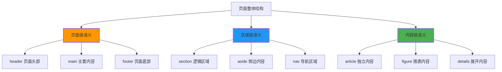

# 页面结构语义化

## 🏗️ 现代网页的语义化架构

### 📊 页面层次结构设计



## 📋 header页面头部语义化

### 🎯 header的多层次应用

```html
<!-- 页面级header -->
<header class="page-header">
    <div class="brand">
        <h1>网站Logo和名称</h1>
    </div>
    
    <nav class="main-navigation" aria-label="主导航">
        <ul>
            <li><a href="/">首页</a></li>
            <li><a href="/products">产品</a></li>
            <li><a href="/about">关于我们</a></li>
            <li><a href="/contact">联系我们</a></li>
        </ul>
    </nav>
    
    <div class="header-actions">
        <a href="/login">登录</a>
        <a href="/register">注册</a>
    </div>
</header>
```

### 📱 移动端header优化

```html
<header class="mobile-header">
    <button class="menu-toggle" aria-expanded="false" aria-controls="main-nav">
        <span>菜单</span>
    </button>
    
    <div class="brand">
        <h1>品牌名称</h1>
    </div>
    
    <button class="search-toggle" aria-label="搜索">
        <svg><!-- 搜索图标 --></svg>
    </button>
    
    <nav id="main-nav" class="mobile-nav" aria-hidden="true">
        <!-- 移动端导航菜单 -->
    </nav>
</header>
```

## 🧭 nav导航区域语义化

### 📍 多重导航系统

```html
<!-- 主导航 -->
<nav class="primary-nav" role="navigation" aria-label="主要导航">
    <ul>
        <li><a href="/" aria-current="page">首页</a></li>
        <li><a href="/products">产品服务</a></li>
        <li><a href="/about">关于我们</a></li>
        <li><a href="/news">新闻动态</a></li>
    </ul>
</nav>

<!-- 辅助导航 -->
<nav class="secondary-nav" aria-label="辅助导航">
    <ul>
        <li><a href="/help">帮助中心</a></li>
        <li><a href="/support">技术支持</a></li>
        <li><a href="/contact">联系客服</a></li>
    </ul>
</nav>

<!-- 面包屑导航 -->
<nav class="breadcrumb" aria-label="当前位置">
    <ol>
        <li><a href="/">首页</a></li>
        <li><a href="/products">产品</a></li>
        <li aria-current="page">产品详情</li>
    </ol>
</nav>
```

## 📖 main主要内容区域

### 🎯 main的结构设计

```html
<main class="content-main">
    <!-- 页面标题 -->
    <header class="page-title">
        <h1>页面主标题</h1>
        <p class="page-subtitle">页面副标题或简要说明</p>
    </header>
    
    <!-- 主要内容区块 -->
    <div class="content-sections">
        <section class="intro-section" aria-labelledby="intro-heading">
            <h2 id="intro-heading">介绍说明</h2>
            <p>页面内容的介绍和概述...</p>
        </section>
        
        <section class="features-section" aria-labelledby="features-heading">
            <h2 id="Features-heading">特色功能</h2>
            <div class="features-grid">
                <!-- 特色内容网格 -->
            </div>
        </section>
        
        <section class="cta-section">
            <h2>行动召唤</h2>
            <p>引导用户进行下一步操作...</p>
            <div class="action-buttons">
                <button>立即开始</button>
                <button>了解更多</button>
            </div>
        </section>
    </div>
</main>
```

## ❤️ aside侧边区域

### 📋 side内容的语义化组织

```html
<aside class="sidebar" role="complementary" aria-label="相关内容和补充信息">
    <!-- 搜索框 -->
    <section class="search-widget">
        <h3>站内搜索</h3>
        <form role="search">
            <input type="search" placeholder="搜索..." aria-label="搜索关键词">
            <button type="submit">搜索</button>
        </form>
    </section>
    
    <!-- 相关文章 -->
    <section class="related-posts">
        <h3>相关文章</h3>
        <article class="related-item">
            <h4><a href="/article1">相关文章标题一</a></h4>
            <p>文章摘要...</p>
        </article>
        <article class="related-item">
            <h4><a href="/article2">相关文章标题二</a></h4>
            <p>文章摘要...</p>
        </article>
    </section>
    
    <!-- 标签云 -->
    <section class="tag-cloud">
        <h3>热门标签</h3>
        <div class="tags">
            <a href="/tag/html" class="tag">HTML</a>
            <a href="/tag/css" class="tag">CSS</a>
            <a href="/tag/javascript" class="tag">JavaScript</a>
            <!-- 更多标签 -->
        </div>
    </section>
</aside>
```

## 📜 footer页面底部

### 🎯 footer的多层结构

```html
<footer class="site-footer" role="contentinfo">
    <!-- 主要脚部内容 -->
    <div class="footer-main">
        <section class="footer-info">
            <h3>公司信息</h3>
            <p>公司简介和核心价值...</p>
            <address>
                联系地址：XX省XX市XX区<br>
                联系电话：400-123-4567<br>
                邮箱：contact@example.com
            </address>
        </section>
        
        <section class="footer-links">
            <h3>快速链接</h3>
            <nav aria-label="页脚链接">
                <ul>
                    <li><a href="/about">关于我们</a></li>
                    <li><a href="/products">产品服务</a></li>
                    <li><a href="/careers">招聘信息</a></li>
                    <li><a href="/contact">联系我们</a></li>
                </ul>
            </nav>
        </section>
        
        <section class="footer-social">
            <h3>社交媒体</h3>
            <nav aria-label="社交媒体链接">
                <ul class="social-links">
                    <li><a href="https://weibo.com/example" aria-label="微博">微博</a></li>
                    <li><a href="https://github.com/example" aria-label="GitHub">GitHub</a></li>
                    <li><a href="https://linkedin.com/example" aria-label="LinkedIn">LinkedIn</a></li>
                </ul>
            </nav>
        </section>
    </div>
    
    <!-- 页面底部信息 -->
    <div class="footer-bottom">
        <p>&copy; 2024 公司名称。保留所有权利。</p>
        <nav aria-label="法律链接">
            <ul>
                <li><a href="/privacy">隐私政策</a></li>
                <li><a href="/terms">使用条款</a></li>
                <li><a href="/legal">法律声明</a></li>
            </ul>
        </nav>
    </div>
</footer>
```

## 🎨 语义化的CSS配合

### 🔧 ARIA Landmark Roles

```css
/* 使用CSS Grid布局语义化结构 */
.page-layout {
    display: grid;
    grid-template-areas: 
        "header header header"
        "nav main sidebar"
        "footer footer footer";
    grid-template-columns: 200px 1fr 300px;
    grid-template-rows: auto 1fr auto;
    min-height: 100vh;
}

.page-header { grid-area: header; }
.main-navigation { grid-area: nav; }
.content-main { grid-area: main; }
.sidebar { grid-area: sidebar; }
.site-footer { grid-area: footer; }

/* 语义化区域的视觉区分 */
.content-main {
    padding: 2rem;
    background: #ffffff;
    border-radius: 0.5rem;
    box-shadow: 0 2px 4px rgba(0,0,0,0.1);
}

.sidebar section {
    margin-bottom: 2rem;
    padding: 1.5rem;
    background: #f8f9fa;
    border-radius: 0.25rem;
}

/* 移动端响应式布局 */
@media (max-width: 768px) {
    .page-layout {
        grid-template-areas: 
            "header"
            "main"
            "sidebar"
            "footer";
        grid-template-columns: 1fr;
    }
    
    .main-navigation {
        display: none; /* 移动端隐藏侧边导航 */
    }
}
```

## 📊 结构语义化检查

### ✅ 页面结构验证清单

| 检查项目 | 要求 | 验证方法 |
|----------|------|----------|
| **页面main** | 每页只有一个main标签 | HTML检查 |
| **导航清晰** | nav标签正确使用 | 功能测试 |
| **层级合理** | heading层次正确 | 屏幕阅读器测试 |
| **区域标识** | 各区域语义明确 | ARIA landmarks |
| **响应适配** | 移动端结构保持 | 设备测试 |

### 🔍 可访问性检查

```html
<!-- 使用ARIA landmarks增强语义 -->
<body>
    <header role="banner">页面头部</header>
    <nav role="navigation" aria-label="主导航">导航菜单</nav>
    <main role="main">主要内容区域</main>
    <aside role="complementary">补充内容</aside>
    <footer role="contentinfo">页面脚部</footer>
</body>
```

---

**🔗 结构语义深入**：
- 内容标记：`[[03-3 内容语义化标记]]`
- 导航语义：`[[03-4 导航语义化]]`
- 最佳实践：`[[03-5 语义化最佳实践]]`
