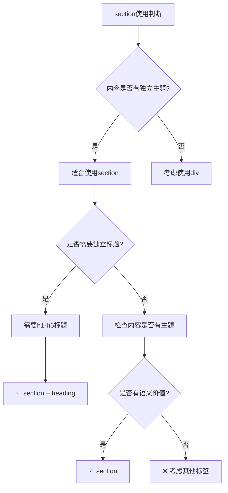

# 内容语义化标记

## 📝 section的精髓：主题性内容分组

### 🎯 section的正确使用模式

**section用于表示文档中具有一定主题性的内容区块**：



### 🔍 section的实际应用

```html
<!-- ✅ 正确：FAQ页面 -->
<section class="faq-section">
    <h2>常见问题</h2>
    
    <section class="faq-item">
        <h3>什么是HTML5语义化？</h3>
        <p>HTML5语义化是指使用具有明确含义的标签...</p>
    </section>
    
    <section class="faq-item">
        <h3>为什么要使用语义化标签？</h3>
        <p>语义化标签有助于提高页面可访问性...</p>
    </section>
</section>

<!-- ✅ 正确：产品特色展示 -->
<section class="features-main">
    <h2>产品特色</h2>
    
    <section class="feature-category">
        <h3>技术创新</h3>
        <div class="feature-list">
            <article class="feature-item">
                <h4>AI智能分析</h4>
                <p>运用先进的人工智能技术...</p>
            </article>
        </div>
    </section>
    
    <section class="feature-category">
        <h3>用户体验</h3>
        <div class="feature-list">
            <!-- 用户体验相关功能 -->
        </div>
    </section>
</section>
```

## 📰 article：独立内容的完整单元

### 🎯 article的核心特征

**article表示可以独立于页面其他内容阅读的内容**：

| 判断标准 | 描述 | 示例 |
|----------|------|------|
| **独立性** | 内容可单独理解 | 新闻文章、博客文章 |
| **完整性** | 内容结构完整 | 有标题、正文、结论 |
| **可移植性** | 可转载或引用 | RSS订阅、社交媒体分享 |
| **主题性** | 有明确主题 | 问题解决、经验分享 |

### 📊 article的应用场景

```html
<!-- ✅ 新闻文章 -->
<article class="news-article">
    <header class="article-header">
        <h1>人工智能在教育领域的突破性应用</h1>
        <div class="article-meta">
            <time datetime="2024-01-15">2024年1月15日</time>
            <span class="author">记者：张三</span>
            <span class="source">来源：科技日报</span>
        </div>
    </header>
    
    <div class="article-body">
        <p class="lead">人工智能技术正在彻底改变传统教育模式...</p>
        
        <p>正文第一部分内容...</p>
        
        <figure class="article-image">
            
            <figcaption>图：智能教学系统帮助学生个性化学习</figcaption>
        </figure>
        
        <p>正文第二部分内容...</p>
        
        <blockquote>
            <p>"AI技术的融入使得个性化教育成为可能。"</p>
            <cite>—— 李四教授，北京大学教育学院</cite>
        </blockquote>
        
        <p>正文后续内容...</p>
    </div>
    
    <footer class="article-footer">
        <div class="article-tags">
            <span class="tags-label">标签：</span>
            <a href="/tag/ai" class="tag">人工智能</a>
            <a href="/tag/education" class="tag">教育技术</a>
        </div>
        <div class="article-actions">
            <button class="share-button">分享文章</button>
            <button class="bookmark-button">收藏文章</button>
        </div>
    </footer>
</article>
```

### 🔄 blog文章的标准结构

```html
<!-- ✅ 博客文章 -->
<article class="blog-post">
    <header class="post-header">
        <h1 class="post-title">前端开发者的HTML5学习路径</h1>
        
        <div class="post-meta">
            <time class="publish-date" datetime="2024-01-15T10:30:00">2024年1月15日</time>
            <span class="read-time">预计阅读时间：7分钟</span>
            <span class="post-author">作者：<a href="/author/john">程序猿小张</a></span>
        </div>
        
        <div class="post-summary">
            <p>这是一篇关于如何系统学习HTML5的完整指南...</p>
        </div>
    </header>
    
    <div class="post-content">
        <!-- 文章目录 -->
        <section class="post-toc">
            <h2>目录</h2>
            <nav class="toc-navigation">
                <ol>
                    <li><a href="#html5-basics">HTML5基础概念</a></li>
                    <li><a href="#semantic-tags">语义化标签</a></li>
                    <li><a href="#forms-validation">表单与验证</a></li>
                    <li><a href="#multimedia">多媒体处理</a></li>
                    <li><a href="#canvas-webgl">Canvas与WebGL</a></li>
                    <li><a href="#accessibility">可访问性设计</a></li>
                </ol>
            </nav>
        </section>
        
        <!-- 文章各个章节 -->
        <section id="html5-basics" class="post-section">
            <h2>HTML5基础概念</h2>
            <p>HTML5不仅仅是HTML的一个版本...</p>
            <!-- 章节详细内容 -->
        </section>
        
        <!-- 更多章节... -->
    </div>
    
    <aside class="post-sidebar">
        <section class="related-posts">
            <h3>相关文章推荐</h3>
            <article class="related-post">
                <h4><a href="/css-fundamentals">CSS基础学习指南</a></h4>
                <p>系统学习CSS的路径和技巧</p>
            </article>
            <!-- 更多推荐文章 -->
        </section>
    </aside>
    
    <footer class="post-footer">
        <div class="post-tags">
            <h4>文章标签</h4>
            <ul class="tag-list">
                <li><a href="/tag/html5" class="tag">HTML5</a></li>
                <li><a href="/tag/frontend" class="tag">前端开发</a></li>
                <li><a href="/tag/tutorial" class="tag">教程</a></li>
            </ul>
        </div>
        
        <nav class="post-navigation" aria-label="文章导航">
            <a href="/previous-post" class="nav-previous">← 上一篇：CSS基础知识</a>
            <a href="/next-post" class="nav-next">下一篇：JavaScript入门 →</a>
        </nav>
    </footer>
</article>
```

## 🖼️ figure与figcaption：图表组合标记

### 📊 figure的使用模式

```html
<!-- ✅ 图片配文字说明 -->
<figure class="content-image">
    
    <figcaption>
        图1：响应式网页设计在不同屏幕尺寸下的适配效果，
        从左到右分别为：手机端、平板端、桌面端
    </figcaption>
</figure>

<!-- ✅ 代码示例配说明 -->
<figure class="code-example">
    <figcaption>代码清单1：HTML5语义化标记示例</figcaption>
    <pre><code>&lt;article&gt;
  &lt;header&gt;
    &lt;h1&gt;文章标题&lt;/h1&gt;
    &lt;p&gt;文章摘要&lt;/p&gt;
  &lt;/header&gt;
  &lt;p&gt;文章正文内容...&lt;/p&gt;
&lt;/article&gt;</code></pre>
</figure>

<!-- ✅ 数据图表配说明 -->
<figure class="chart-figure">
    <svg><!-- SVG图表内容 --></svg>
    <figcaption>
        图表1：2024年前端技术栈使用率统计
        （数据来源：Stack Overflow开发者调查）
    </figcaption>
</figure>

<!-- ✅ 引用配注释 -->
<figure class="quote-figure">
    <blockquote>
        <p>"语义化HTML不仅是技术问题，更是用户体验的重要考量。"</p>
    </blockquote>
    <figcaption>
        —— <cite>Tim Berners-Lee</cite>, 
        万维网发明者,《HTML语义化的未来》演讲
    </figcaption>
</figure>
```

## 📚 details与summary：展开式内容

### 🔍 details的使用场景

```html
<!-- ✅ FAQ展开式回答 -->
<details class="faq-detail">
    <summary>什么是ARIA属性？</summary>
    <div class="faq-answer">
        <p>ARIA（Accessible Rich Internet Applications）是一套属性...</p>
        <ul>
            <li>aria-label：为元素提供标签</li>
            <li>aria-describedby：关联描述</li>
            <li>role：定义元素角色</li>
        </ul>
        <p>使用ARIA可以显著提升页面的可访问性...</p>
    </div>
</details>

<!-- ✅ 技术文档的折叠内容 -->
<details class="tech-spec">
    <summary><strong>HTML5新特性详细说明</strong></summary>
    <div class="spec-content">
        <section class="feature-detail">
            <h4>1. 语义化标签</h4>
            <p>新增的语义化标签包括...</p>
        </section>
        
        <section class="feature-detail">
            <h4>2. 多媒体支持</h4>
            <p>原生video和audio标签支持...</p>
        </section>
        
        <section class="feature-detail">
            <h4>3. 表单增强</h4>
            <p>新增多种input类型...</p>
        </section>
    </div>
</details>

<!-- ✅ 代码分组的折叠显示 -->
<details class="code-section">
    <summary>查看完整的CSS样式代码</summary>
    <pre><code>/* HTML语义化样式 */
.semantic-structure {
    display: grid;
    grid-template-columns: 250px 1fr 300px;
    gap: 2rem;
    min-height: 100vh;
}

.page-header {
    grid-column: 1 / -1;
    background: #2c3e50;
    color: white;
    padding: 1rem 2rem;
}

.content-main {
    background: #ffffff;
    padding: 2rem;
    border-radius: 0.5rem;
    box-shadow: 0 2px 8px rgba(0,0,0,0.1);
}</code></pre>
</details>
```

## 🏷️ time：机器可读的时间标记

### 📅 time标签的多重身份

**time标签既面向人类也面向机器**：

```html
<!-- ✅ 完整日期时间 -->
<time datetime="2024-01-15T14:30:45+08:00">
    2024年1月15日下午14:30
</time>

<!-- ✅ 相对时间表示 -->
<p>文章发布于 
    <time datetime="2024-01-15">3天前</time>
</p>

<!-- ✅ 会议时间标注 -->
<div class="meeting-info">
    <h3>在线技术分享会</h3>
    <p>会议时间：<time datetime="2024-01-20T19:00:00+08:00">2024年1月20日 19:00-21:00</time></p>
    <p>持续时间：<time datetime="PT2H">2小时</time></p>
</div>

<!-- ✅ 文章发布时间组 -->
<div class="article-timeline">
    <time class="publish-time" datetime="2024-01-15T10:00:00+08:00">
        发布时间：2024年1月15日 10:00
    </time>
    <time class="update-time" datetime="2024-01-16T15:30:00+08:00">
        最后更新：2024年1月16日 15:30
    </time>
</div>
```

## 🔄 content语义化的CSS配合

### 🎨 内容区域样式设计

```css
/* article样式设计 */
article.blog-post {
    max-width: 800px;
    margin: 0 auto;
    padding: 2rem;
    background: #ffffff;
    border-radius: 0.5rem;
    box-shadow: 0 1px 3px rgba(0,0,0,0.1);
}

article.blog-post header {
    border-bottom: 1px solid #e0e0e0;
    padding-bottom: 1.5rem;
    margin-bottom: 2rem;
}

article.blog-post .post-meta {
    color: #666;
    font-size: 0.9rem;
    margin-top: 1rem;
}

/* section样式 */
section.post-section {
    margin: 2rem 0;
    padding: 1rem 0;
}

section.post-section h2 {
    color: #2c3e50;
    border-left: 4px solid #3498db;
    padding-left: 1rem;
    margin-bottom: 1rem;
}

/* figure样式 */
figure.content-image {
    margin: 2rem 0;
    text-align: center;
}

figure.content-image img {
    max-width: 100%;
    height: auto;
    border-radius: 0.25rem;
}

figcaption {
    font-style: italic;
    color: #666;
    font-size: 0.9rem;
    margin-top: 0.5rem;
    text-align: left;
}

/* details样式 */
details.faq-detail {
    border: 1px solid #e0e0e0;
    border-radius: 0.25rem;
    margin: 1rem 0;
}

details.faq-detail summary {
    background: #f8f9fa;
    padding: 1rem;
    cursor: pointer;
    font-weight: 500;
}

details.faq-detail[open] summary {
    background: #e9ecef;
}

details.faq-detail .faq-answer {
    padding: 1rem;
    border-top: 1px solid #e0e0e0;
}
```

---

**🔗 内容语义深化**：
- 导航语义：`[[03-4 导航语义化]]`
- 整体实践：`[[03-5 语义化最佳实践]]`
- SEO优化：`[[03-12 SEO基础概念]]`
