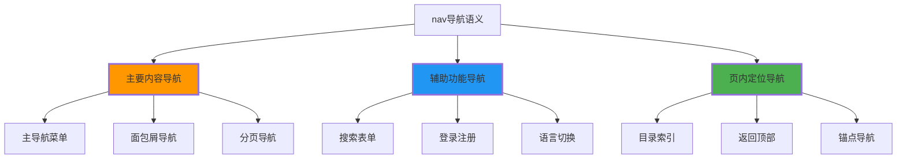

# 导航语义化

## 🧭 nav标签的深度应用

### 📍 nav的核心价值

**nav标签用于标识页面中的导航链接群体**：



## 📋 主导航系统设计

### 🎯 全局导航架构

```html
<!-- ✅ 网站主导航 -->
<nav class="primary-navigation" role="navigation" aria-label="网站主导航">
    <div class="nav-brand">
        <a href="/" aria-label="返回首页">
            
        </a>
    </div>
    
    <ul class="nav-menu" role="menubar">
        <li role="none">
            <a href="/products" role="menuitem" aria-haspopup="true" aria-expanded="false">
                产品服务
                <span class="dropdown-indicator" aria-hidden="true">▼</span>
            </a>
            <!-- 下拉子菜单 -->
            <ul class="nav-dropdown" role="menu" aria-label="产品服务子菜单">
                <li role="none"><a href="/products/web" role="menuitem">网站开发</a></li>
                <li role="none"><a href="/products/app" role="menuitem">移动应用</a></li>
                <li role="none"><a href="/products/saas" role="menuitem">SaaS平台</a></li>
            </ul>
        </li>
        
        <li role="none">
            <a href="/solutions" role="menuitem">解决方案</a>
        </li>
        
        <li role="none">
            <a href="/about" role="menuitem">关于我们</a>
        </li>
        
        <li role="none">
            <a href="/contact" role="menuitem">联系我们</a>
        </li>
    </ul>
    
    <div class="nav-actions">
        <button class="search-toggle" aria-label="网站搜索">
            <svg><!-- 搜索图标 --></svg>
        </button>
        <a href="/login" class="btn-login">登录</a>
        <a href="/register" class="btn-register">免费注册</a>
    </div>
</nav>
```

### 📱 移动端导航优化

```html
<!-- ✅ 移动端导航 -->
<nav class="mobile-navigation" aria-label="移动端导航">
    <div class="mobile-nav-header">
        <a href="/" class="mobile-brand">
            
        </a>
        
        <button class="mobile-menu-toggle" 
                aria-expanded="false" 
                aria-controls="mobile-menu"
                aria-label="打开主导航菜单">
            <span class="hamburger-line"></span>
            <span class="hamburger-line"></span>
            <span class="hamburger-line"></span>
        </button>
    </div>
    
    <div id="mobile-menu" 
         class="mobile-menu-content" 
         aria-hidden="true">
        <ul class="mobile-nav-list">
            <li class="mobile-nav-item">
                <a href="/products" class="mobile-nav-link">
                    产品服务
                    <span class="expand-toggle">+</span>
                </a>
                <ul class="mobile-nav-submenu">
                    <li><a href="/products/web">网站开发</a></li>
                    <li><a href="/products/app">移动应用</a></li>
                    <li><a href="/products/saas">SaaS平台</a></li>
                </ul>
            </li>
            
            <li class="mobile-nav-item">
                <a href="/solutions" class="mobile-nav-link">解决方案</a>
            </li>
            
            <li class="mobile-nav-item">
                <a href="/about" class="mobile-nav-link">关于我们</a>
            </li>
            
            <li class="mobile-nav-item">
                <a href="/contact" class="mobile-nav-link">联系我们</a>
            </li>
        </ul>
        
        <div class="mobile-nav-actions">
            <a href="/login" class="mobile-btn-login">登录</a>
            <a href="/register" class="mobile-btn-register">免费注册</a>
        </div>
    </div>
</nav>
```

## 📍 面包屑导航系统

### 🔗 层次化路径显示

```html
<!-- ✅ 标准面包屑导航 -->
<nav class="breadcrumb" role="navigation" aria-label="当前位置">
    <ol class="breadcrumb-list">
        <li class="breadcrumb-item">
            <a href="/" class="breadcrumb-link">
                <svg aria-hidden="true"><!-- 首页图标 --></svg>
                <span class="visually-hidden">网站首页</span>
            </a>
        </li>
        
        <li class="breadcrumb-item">
            <svg class="breadcrumb-separator" aria-hidden="true">›</svg>
            <a href="/products" class="breadcrumb-link">产品服务</a>
        </li>
        
        <li class="breadcrumb-item">
            <svg class="breadcrumb-separator" aria-hidden="true">›</svg>
            <a href="/products/web-dev" class="breadcrumb-link">网站开发</a>
        </li>
        
        <li class="breadcrumb-item" aria-current="page">
            <svg class="breadcrumb-separator" aria-hidden="true">›</svg>
            <span class="breadcrumb-current">HTML5开发方案</span>
        </li>
    </ol>
</nav>
```

### 📊 JSON-LD结构化面包屑

```html
<script type="application/ld+json">
{
    "@context": "https://schema.org",
    "@type": "BreadcrumbList",
    "itemListElement": [
        {
            "@type": "ListItem",
            "position": 1,
            "name": "首页",
            "item": "https://example.com"
        },
        {
            "@type": "ListItem",
            "position": 2,
            "name": "产品服务",
            "item": "https://example.com/products"
        },
        {
            "@type": "ListItem",
            "position": 3,
            "name": "网站开发",
            "item": "https://example.com/products/web-dev"
        },
        {
            "@type": "ListItem",
            "position": 4,
            "name": "HTML5开发方案"
        }
    ]
}
</script>
```

## 📄 分页导航系统

### 🔢 页码和翻页控制

```html
<!-- ✅ 文章分页导航 -->
<nav class="pagination" role="navigation" aria-label="文章分页导航">
    <div class="pagination-info">
        <span class="pagination-text">
            显示第 <strong>11-20</strong> 条，共 <strong>156</strong> 条结果
        </span>
    </div>
    
    <div class="pagination-controls">
        <a href="/articles?page=1" 
           class="pagination-first" 
           aria-label="跳转到第一页">
            <svg><!-- 第一页图标 --></svg>
            <span>首页</span>
        </a>
        
        <a href="/articles?page=1" 
           class="pagination-prev" 
           aria-label="跳转到上一页">
            <svg><!-- 上一页图标 --></svg>
            <span>上一页</span>
        </a>
        
        <div class="pagination-pages">
            <a href="/articles?page=1" class="pagination-number">1</a>
            <a href="/articles?page=2" class="pagination-number">2</a>
            <span class="pagination-ellipsis" aria-hidden="true">...</span>
            <a href="/articles?page=4" class="pagination-number">4</a>
            <span class="pagination-number pagination-current" 
                  aria-current="page" 
                  aria-label="当前页面">5</span>
            <a href="/articles?page=6" class="pagination-number">6</a>
            <span class="pagination-ellipsis" aria-hidden="true">...</span>
            <a href="/articles?page=8" class="pagination-number">8</a>
        </div>
        
        <a href="/articles?page=3" 
           class="pagination-next" 
           aria-label="跳转到下一页">
            <span>下一页</span>
            <svg><!-- 下一页图标 --></svg>
        </a>
        
        <a href="article.html?page=8" 
           class="pagination-last" 
           aria-label="跳转到最后一页">
            <span>末页</span>
            <svg><!-- 最后一页图标 --></svg>
        </a>
    </div>
    
    <div class="page-size-selector">
        <label for="page-size">每页显示：</label>
        <select id="page-size" name="size">
            <option value="10">10条</option>
            <option value="20" selected>20条</option>
            <option value="50">50条</<｜tool▁sep｜>>
            <option value="100">100条</option>
        </select>
    </div>
</nav>
```

## 🔍 搜索导航关联

### 📊 搜索功能和导航整合

```html
<!-- ✅ 搜索导航组合 -->
<nav class="search-navigation" role="search">
    <form class="site-search" method="get" action="/search">
        <label for="search-input" class="visually-hidden">站内搜索</label>
        <div class="search-input-group">
            <input type="search" 
                   id="search-input" 
                   name="q" 
                   placeholder="搜索网站内容..."
                   aria-describedby="search-suggestions search-help"
                   autocomplete="off">
            <button type="submit" class="search-submit" aria-label="执行搜索">
                <svg><!-- 搜索图标 --></svg>
            </button>
        </div>
        
        <div id="search-suggestions" class="search-suggestions" aria-live="polite">
            <!-- 搜索建议将动态填充 -->
        </div>
    </form>
    
    <div class="search-filters">
        <details class="filter-group">
            <summary class="filter-toggle">筛选条件</summary>
            <div class="filter-options">
                <label class="filter-label">
                    <input type="checkbox" name="category" value="products">
                    产品相关
                </label>
                <label class="filter-label">
                    <input type="checkbox" name="category" value="articles">
                    文章内容
                </label>
                <label class="filter-label">
                    <input type="checkbox" name="date" value="last-week">
                    最近一周
                </label>
            </div>
        </details>
        
        <nav class="search-categories" aria-label="搜索分类">
            <ul>
                <li><a href="/search?q=html5&type=tutorial">HTML5教程</a></li>
                <li><a href="/search?q=css&type=reference">CSS参考</a></li>
                <li><a href="/search?q=javascript&type=guide">JavaScript指南</a></li>
                <li><a href="/search?q=accessibility&type=articles">可访问性</a></li>
            </ul>
        </nav>
    </div>
</nav>
```

## 📚 文档内部导航

### 🔍 文章目录和跳转

```html
<!-- ✅ 文章目录导航 -->
<nav class="article-toc" aria-labelledby="toc-heading">
    <h2 id="toc-heading">目录</h2>
    <ol class="toc-list">
        <li class="toc-item">
            <a href="#introduction" class="toc-link">引言</a>
        </li>
        <li class="toc-item">
            <a href="#semantic-module" class="toc-link">语义化模块</a>
            <ol class="toc-sublist">
                <li><a href="#header-semantic" class="toc-link">header语义化</a></li>
                <li><a href="#main-content" class="toc-link">main内容区</a></li>
                <li><a href="#aside-content" class="toc-link">aside侧边区</a></li>
            </ol>
        </li>
        <li class="toc-item">
            <a href="#navigation-semantic" class="toc-link">导航语义化</a>
            <ol class="toc-sublist">
                <li><a href="#breadcrumb-nav" class="toc-link">面包屑导航</a></li>
                <li><a href="#pagination" class="toc-link">分页导航</a></li>
                <li><a href="#toc-navigation" class="toc-link">目录导航</a></li>
            </ol>
        </li>
        <li class="toc-item">
            <a href="#best-practices" class="toc-link">最佳实践</a>
        </li>
        <li class="toc-item">
            <a href="#summary" class="toc-link">总结</a>
        </li>
    </ol>
</nav>

<!-- ✅ 返回顶部导航 -->
<nav class="page-navigation" aria-label="页面导航">
    <a href="#top" class="back-to-top" aria-label="返回页面顶部">
        <svg aria-hidden="true"><!-- 向上箭头 --></svg>
        <span class="visually-hidden">回到顶部</span>
    </a>
</nav>
```

## 🎨 导航语义化的CSS设计

### 🔧 响应式导航样式

```css
/* 主导航样式 */
.primary-navigation {
    display: grid;
    grid-template-columns: auto 1fr auto;
    align-items: center;
    padding: 1rem 2rem;
    background: #ffffff;
    border-bottom: 1px solid #e0e0e0;
}

.nav-menu {
    list-style: none;
    display: flex;
    gap: 2rem;
    margin: 0 auto;
}

.nav-menu a {
    text-decoration: none;
    padding: 0.5rem 1rem;
    border-radius: 0.25rem;
    transition: background-color 0.2s;
}

.nav-menu a:hover,
.nav-menu a:focus {
    background-color: #f0f8ff;
}

/* 下拉菜单 */
.nav-dropdown {
    position: absolute;
    background: #ffffff;
    border: 1px solid #e0e0e0;
    border-radius: 0.5rem;
    box-shadow: 0 4px 8px rgba(0,0,0,0.1);
    min-width: 200px;
    opacity: 0;
    visibility: hidden;
    transform: translateY(-10px);
    transition: all 0.3s ease;
}

.nav-menu li:hover .nav-dropdown {
    opacity: 1;
    visibility: visible;
    transform: translateY(0);
}

/* 面包屑导航样式 */
.breadcrumb {
    padding: 1rem 2rem;
    background: #f8f9fa;
    border-bottom: 1px solid #e0e0e0;
}

.breadcrumb-list {
    list-style: none;
    display: flex;
    align-items: center;
    margin: 0;
    padding: 0;
}

.breadcrumb-item {
    display: flex;
    align-items: center;
}

.breadcrumb-separator {
    margin: 0 0.5rem;
    color: #666;
}

.breadcrumb-current {
    font-weight: 600;
    color: #333;
}

/* 移动端导航 */
@media (max-width: 768px) {
    .nav-menu {
        display: none; /* 在移动端隐藏主菜单 */
    }
    
    .mobile-menu-content {
        position: absolute;
        top: 100%;
        left: 0;
        right: 0;
        background: #ffffff;
        border-top: 1px solid #e0e0e0;
        box-shadow: 0 2px 8px rgba(0,0,0,0.1);
        transform: translateY(-100%);
        opacity: 0;
        transition: all 0.3s ease;
    }
    
    .mobile-menu-content[aria-hidden="false"] {
        transform: translateY(0);
        opacity: 1;
    }
    
    .mobile-nav-list {
        list-style: none;
        padding: 1rem;
        margin: 0;
    }
    
    .mobile-nav-link {
        display: flex;
        justify-content: space-between;
        padding: 1rem;
        text-decoration: none;
        border-bottom: 1px solid #f0f0f0;
    }
}
```

---

**🔗 导航语义深化**：
- 最佳实践实施：`[[03-5 语义化最佳实践]]`
- 可访问性支持：`[[03-6 WCAG可访问性标准]]`
- SEO优化应用：`[[03-12 SEO基础概念]]`
