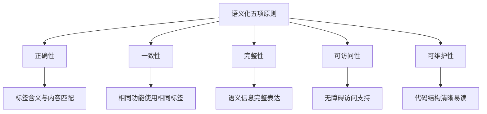
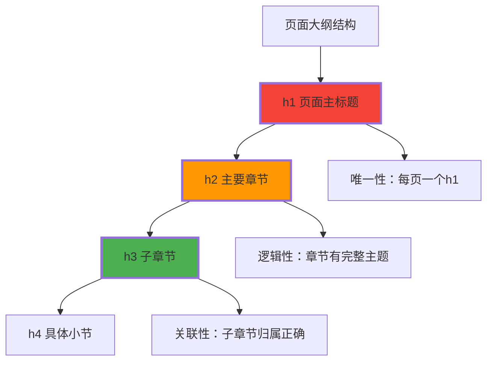
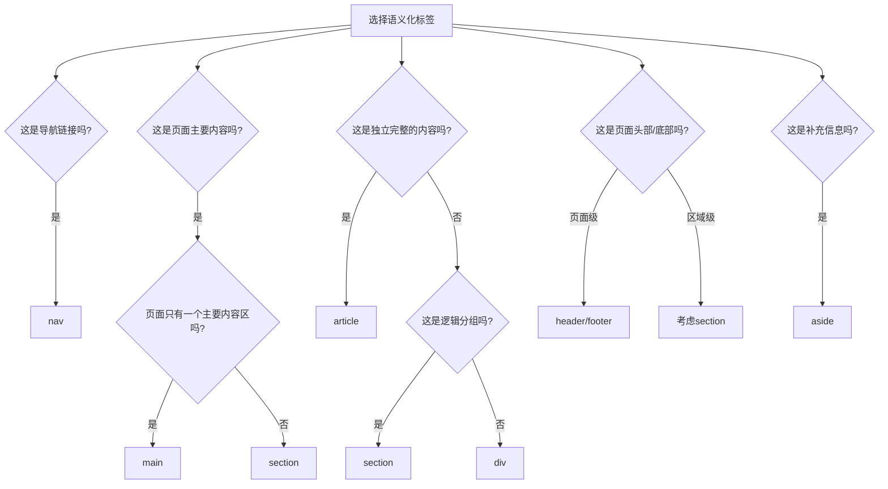
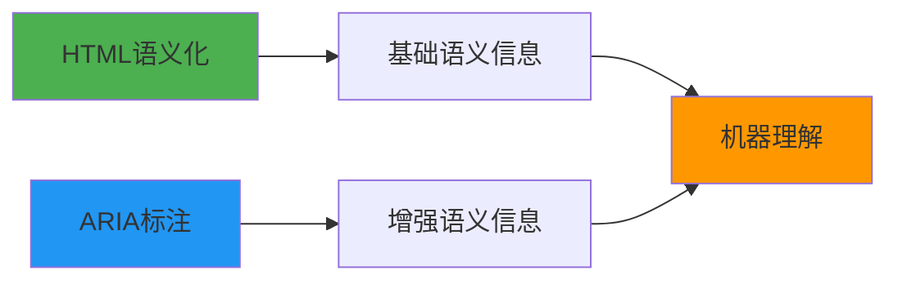

# 语义化最佳实践

## 🎯 语义化设计的黄金法则

### 📋 语义化的五项原则



## 📚 文档大纲的层次设计

### 🏗️ 合理的heading层次

**文档大纲是语义化的核心体现**：



### ✅ 正确的文档结构示例

```html
<body>
    <!-- 页面级结构 -->
    <header>
        <nav aria-label="主导航">
            <!-- 导航不应该包含h1 -->
        </nav>
    </header>
    
    <main>
        <!-- h1是页面大纲的唯一入口点 -->
        <h1>HTML5语义化完整指南</h1>
        
        <!-- 主要章节 -->
        <section aria-labelledby="introduction-heading">
            <h2 id="introduction-heading">什么是HTML5语义化</h2>
            <p>引言内容...</p>
            
            <article>
                <h3>语义化的核心概念</h3>
                <p>详细说明...</p>
                
                <section>
                    <h4>为什么需要语义化</h4>
                    <p>具体原因...</p>
                </section>
            </article>
        </section>
        
        <section aria-labelledby="implementation-heading">
            <h2 id="implementation-heading">语义化实现方法</h2>
            
            <section>
                <h3>基础语义化标签</h3>
                <ul>
                    <li>
                        <h4>header标签使用</h4>
                        <p>header的使用场景和最佳实践...</p>
                    </li>
                    <li>
                        <h4>main标签使用</h4>
                        <p>main的内容组织...</p>
                    </li>
                </ul>
            </section>
            
            <section>
                <h3>内容语义化标签</h3>
                <p>section与article的区别...</p>
            </section>
        </section>
    </main>
    
    <aside>
        <nav class="related-links">
            <h2>相关资源</h2> <!-- aside内的h2是合理的 -->
            <!-- 相关链接 -->
        </nav>
    </aside>
    
    <footer>
        <!-- footer通常不包含heading -->
        <p>版权信息...</p>
    </footer>
</body>
```

## 🎨 语义化标签的选择策略

### 📊 标签选择的决策树



### 🔍 具体标签选择指南

#### 🎯 header的使用决策

| 使用场景 | 是否使用header | 示例 |
|----------|----------------|------|
| **页面顶部区域** | ✅ | `<header class="page-header">` |
| **文章标题区域** | ✅ | `<article><header><h1>文章标题</h1></header>` |
| **章节开始部分** | ✅ | `<section><header><h2>章节标题</h2></header>` |
| **仅包含标题** | ❌ | 直接用h1-h6 |
| **纯导航菜单** | ❌ | 使用nav |

#### 📖 article的使用判断

**✅ 适合使用article的情况**：
- 博客文章、新闻稿
- 论坛帖子、评论
- 产品信息卡
- 用户生成的完整内容

**❌ 不适合使用article的情况**：
- 页面的介绍文字
- 导航链接
- 广告内容
- 简单的提示信息

```html
<!-- ✅ 新闻文章 -->
<article class="news-item">
    <header>
        <h2>科技突破：AI在医疗诊断中的应用</h2>
        <div class="meta">
            <time datetime="2024-01-01">2024年1月1日</time>
            <span>来源：科技日报</span>
        </div>
    </header>
    <p>正文内容...</p>
    <footer>
        <div class="tags">标签：AI、医疗、技术</div>
    </footer>
</article>

<!-- ✅ 论坛帖子 -->
<article class="forum-post">
    <header>
        <h3>关于HTML语义化的疑问</h3>
        <div class="post-meta">
            <span class="author">用户：张三</span>
            <time datetime="2024-01-01T10:30:00">1小时前</time>
        </div>
    </header>
    <p>在开发中遇到了一些问题...</p>
</article>
```

## 🔧 ARIA的语义增强

### 📍 语义化与ARIA的协作



### 🎯 ARIA landmarks与HTML5语义

```html
<!-- ✅ HTML5语义 + ARIA landmarks -->
<body>
    <header role="banner">         <!-- HTML语义：页面头部 -->
    <nav role="navigation">       <!-- HTML语义：导航 -->
    <main role="main">           <!-- HTML语义：主要内容 -->
    <aside role="complementary"> <!-- HTML语义：补充内容 -->
    <footer role="contentinfo"> <!-- HTML语义：页面信息 -->
</body>

<!-- ✅ 表单区域标识 -->
<section aria-labelledby="contact-heading">
    <h2 id="contact-heading">联系我们</h2>
    <form role="form" aria-labelledby="contact-form-label">
        <fieldset>
            <legend id="contact-form-label">联系表单</legend>
            <!-- 表单字段 -->
        </fieldset>
    </form>
</section>

<!-- ✅ 搜索结果区域 -->
<section aria-labelledby="search-results">
    <h2 id="search-results">搜索结果</h2>
    <div role="list" aria-label="搜索结果列表">
        <article role="listitem">第一个结果</article>
        <article role="listitem">第二个结果</article>
    </div>
</section>
```

## 📊 语义化的验证与测试

### 🔍 语义化质量检查清单

| 检查类别 | 具体项目 | 验证方法 |
|----------|----------|----------|
| **结构完整性** | 每页只有一个main | HTML检查器 |
|          | heading层次不跳跃 | Outline viewer |
|          | header/footer使用正确 | 代码审查 |
| **语义准确性** | section有明显主题 | 内容分析 |
|          | article可独立理解 | 功能测试 |
|          | nav包含导航链接 | 交互测试 |
| **可访问性** | 屏幕阅读器支持 | 无障碍测试 |
|         | keyboard navigation | 键盘测试 |
|         | ARIA标签正确 | 验证工具 |

### 🛠️ 语义化调试工具

**Chrome DevTools语义化检查**：
```javascript
// 检查页面是否只有一个main
const mains = document.querySelectorAll('main');
console.log(`Main elements count: ${mains.length}`);

// 生成文档大纲
function generateOutline(element, level = 0) {
    const headings = element.querySelectorAll('h1, h2, h3, h4, h5, h6');
    headings.forEach(heading => {
        const spaces = '  '.repeat(heading.tagName.charCodeAt(1) - 49);
        console.log(`${spaces}${heading.tagName}: ${heading.textContent}`);
    });
}

generateOutline(document.body);

// 检查语义化标签使用情况
const semanticTags = ['header', 'nav', 'main', 'aside', 'footer', 'section', 'article'];
semanticTags.forEach(tag => {
    const count = document.querySelectorAll(tag).length;
    console.log(`${tag}: ${count} 个`);
});
```

## 🎨 CSS与语义化的协调

### 📐 语义化友好的样式设计

```css
/* 语义化结构的CSS Grid布局 */
.semantic-layout {
    display: grid;
    grid-template-areas: 
        "header  header  header"
        "nav     main    sidebar" 
        "footer  footer  footer";
    grid-template-columns: 200px 1fr 300px;
    grid-template-rows: auto 1fr auto;
    min-height: 100vh;
}

header { grid-area: header; }
nav { grid-area: nav; }
main { grid-area: main; }
aside { grid-area: sidebar; }
footer { grid-area: footer; }

/* 语义化标签的基础样式 */
article {
    max-width: 65ch; /* 最佳阅读宽度 */
    margin: 0 auto;
    padding: 2rem;
}

section {
    margin: 2rem 0;
}

section + section {
    border-top: 1px solid #e0e0e0;
    padding-top: 2rem;
}

/* 标题层次样式 */
h1 { font-size: 2.5rem; margin-bottom: 1rem; }
h2 { font-size: 2rem; margin-bottom: 0.8rem; }
h3 { font-size: 1.5rem; margin-bottom: 0.6rem; }
h4 { font-size: 1.25rem; margin-bottom: 0.5rem; }

/* 不要破坏语义化的装饰性样式 */
header {
    /* 只添加视觉样式，不改变语义 */
    background: linear-gradient(135deg, #667eea 0%, #764ba2 100%);
    color: white;
    padding: 2rem;
    box-shadow: 0 2px 8px rgba(0,0,0,0.1);
}
```

## 📱 响应式语义化设计

### 🎯 不同设备下的语义化适配

```css
/* 移动端语义化布局调整 */
@media (max-width: 768px) {
    .semantic-layout {
        grid-template-areas: 
            "header"
            "main" 
            "nav"
            "sidebar"
            "footer";
        grid-template-columns: 1fr;
    }
    
    /* 保持语义化行为 */
    main {
        order: 1; /* main在移动端保持优先 */
    }
    
    nav {
        order: 2; /* 导航在主要内容后 */
    }
    
    aside {
        order: 3; /* 侧边栏最后 */
    }
}

/* 小屏幕下的导航隐藏/显示 */
@media (max-width: 480px) {
    .primary-navigation {
        position: sticky;
        top: 0;
        z-index: 1000;
    }
    
    .mobile-menu-toggle {
        display: block; /* 移动端菜单按钮 */
    }
    
    .desktop-nav-menu {
        display: none; /* 隐藏桌面菜单 */
    }
}
```

## 🔄 团队协作中的语义化规范

### 📋 语义化开发规范文档

```markdown
## HTML语义化开发规范

### 1. 标签使用原则
- 优先选择具有明确语义的HTML5标签
- 避免使用div嵌套代替语义化标签
- 每个语义化标签都有明确的使用场景

### 2. 文档结构规范
- 每个页面必须有一个且仅有一个main标签
- heading层次不能跳跃（h1→h2→h3）
- header和footer的使用要有明确目的

### 3. 可访问性要求
- 重要元素必须添加相应的ARIA标签
- 表单元素必须有对应的label
- 图片必须有有意义的alt属性

### 4. 代码审查检查点
- [ ] 语义化标签使用正确
- [ ] 文档大纲结构合理
- [ ] ARIA属性完整正确
- [ ] 移动端适配良好
```

---

**🔗 实践深化应用**：
- 可访问性实施：`[[03-6 WCAG可访问性标准]]`
- SEO优化集成：`[[03-12 SEO基础概念]]`
- 工程化项目管理：`[[03-22 项目文件组织]]`
