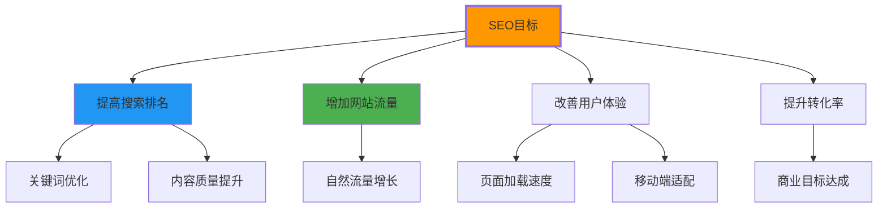
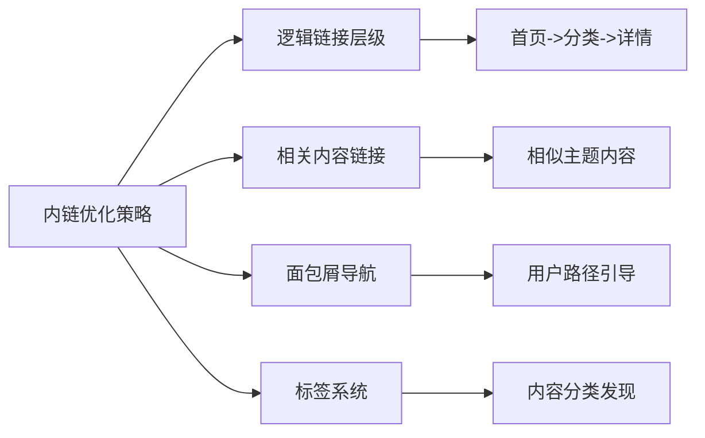
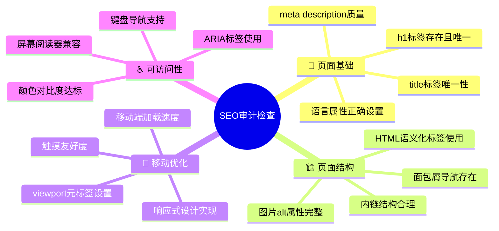

# SEO基础概念

## 🔍 SEO的本质理解

### 📊 SEO的定义与价值

**SEO = Search Engine Optimization (搜索引擎优化)**



## 🎯 HTML对SEO的影响

### 📋 HTML5语义化与SEO

**HTML5语义化标签对SEO的巨大价值**：

| 语义化标签 | SEO作用 | 重要程度 |
|------------|---------|----------|
| **title** | 搜索结果标题 | ⭐⭐⭐⭐⭐ |
| **meta description** | 搜索结果描述 | ⭐⭐⭐⭐⭐ |
| **h1-h6** | 内容层次结构 | ⭐⭐⭐⭐⭐ |
| **header** | 页面主题识别 | ⭐⭐⭐⭐ |
| **nav** | 网站结构理解 | ⭐⭐⭐⭐ |
| **main** | 主要内容标识 | ⭐⭐⭐⭐ |
| **article** | 独立内容单元 | ⭐⭐⭐⭐ |
| **section** | 内容分组 | ⭐⭐⭐ |

### 🔧 SEO核心HTML元素

```html
<!-- ✅ SEO优化的HTML头部 -->
<head>
    <!-- 字符编码：必需 -->
    <meta charset="UTF-8">
    
    <!-- 视口设置：移动SEO必需 -->
    <meta name="viewport" content="width=device-width, initial-scale=1.0">
    
    <!-- 页面标题：SEO最重要因素 -->
    <title>HTML5教程 - 从零开始学习HTML5 - 编程学院</title>
    
    <!-- 页面描述：搜索结果摘要 -->
    <meta name="description" content="详细的学习掌握HTML5的完整教程。包含语义化标签、表单增强、多媒体处理等核心知识点。适合初学者和进阶开发者学习使用。">
    
    <!-- 关键词：传统SEO因素 -->
    <meta name="keywords" content="HTML5,HTML教程,前端开发,Web开发,编程学习">
    
    <!-- 作者信息 -->
    <meta name="author" content="编程学院">
    
    <!-- 版权信息 -->
    <meta name="copyright" content="© 2024 编程学院. All rights reserved.">
    
    <!-- 语言标识 -->
    <html lang="zh-CN">
</head>
```

## 📊 SEO友好的HTML结构

### 🎯 文档结构优化

```html
<!-- ✅ SEO优化的页面结构 -->
<body>
    <!-- 页面级header：建立网站身份 -->
    <header class="site-header">
        <div class="brand">
            <h1 class="site-title">
                <a href="/" title="编程学院 - 专业编程教育平台">编程学院</a>
            </h1>
            <p class="site-tagline">让编程学习更简单</p>
        </div>
        
        <!-- 主要导航：帮助搜索引擎理解站点结构 -->
        <nav class="primary-navigation" aria-label="网站主导航">
            <ul>
                <li><a href="/tutorials">编程教程</a></li>
                <li><a href="/projects">实战项目</a></li>
                <li><a href="/tools">开发工具</a></li>
                <li><a href="/community">开发者社区</a></li>
            </ul>
        </nav>
    </header>
    
    <!-- 面包屑：帮助用户和搜索引擎理解位置 -->
    <nav class="breadcrumb" aria-label="当前位置">
        <ol>
            <li><a href="/">首页</a></li>
            <li><a href="/tutorials">教程</a></li>
            <li><a href="/tutorials/html">HTML教程</a></li>
            <li aria-current="page">HTML5语义化</li>
        </ol>
    </nav>
    
    <!-- 主要内容：搜索引擎的重点 -->
    <main class="content-main">
        <article class="tutorial-article">
            <header class="article-header">
                <!-- 文章标题：关键SEO元素 -->
                <h1 class="article-title">HTML5语义化标记完整指南</h1>
                
                <!-- 文章元信息 -->
                <div class="article-meta">
                    <time datetime="2024-01-15" class="publish-date">2024年1月15日</time>
                    <span class="article-author">作者：<a href="/author/zhang-san">张三</a></span>
                    <span class="reading-time">阅读时间：10分钟</span>
                </div>
                
                <!-- 文章摘要：与meta description保持一致 -->
                <p class="article-summary">本教程详细介绍HTML5语义化标记的使用方法，包括header、nav、main、section、article等核心标签的应用场景和最佳实践。</p>
            </header>
            
            <!-- 文章主体内容 -->
            <div class="article-content">
                <section aria-labelledby="introduction-heading">
                    <h2 id="introduction-heading">什么是HTML5语义化</h2>
                    <p>HTML5语义化是指使用HTML标签来准确描述内容的含义和用途...</p>
                </section>
                
                <section aria-labelledby="benefits-heading">
                    <h2 id="benefits-heading">语义化的优势</h2>
                    
                    <section aria-labelledby="seo-benefits">
                        <h3 id="seo-benefits">SEO优化优势</h3>
                        <ul>
                            <li>搜索引擎更容易理解页面结构</li>
                            <li>提升关键词排名效果</li>
                            <li>改善搜索结果展示</li>
                        </ul>
                    </section>
                    
                    <section aria-labelledby="accessibility-benefits">
                        <h3 id="accessibility-benefits">可访问性优势</h3>
                        <p>对屏幕阅读器等辅助技术的支持更加优秀...</p>
                    </section>
                </section>
                
                <!-- 更多章节内容... -->
            </div>
            
            <!-- 文章标签：帮助内容分类和发现 -->
            <footer class="article-footer">
                <div class="article-tags">
                    <span>标签：</span>
                    <a href="/tag/html5" rel="tag">HTML5</a>
                    <a href="/tag/semantic" rel="tag">语义化</a>
                    <a href="/tag/frontend" rel="tag">前端开发</a>
                    <a href="/tag/tutorial" rel="tag">教程</a>
                </div>
                
                <!-- 社交分享：增加曝光机会 -->
                <div class="social-sharing">
                    <h4>分享文章</h4>
                    <ul>
                        <li><a href="#" aria-label="分享到微博">微博分享</a></li>
                        <li><a href="#" aria-label="分享到朋友圈">微信分享</a></li>
                        <li><a href="#" aria-label="分享到QQ空间">QQ空间</a></li>
                    </ul>
                </div>
            </footer>
        </article>
        
        <!-- 相关文章：增加页面深度 -->
        <section class="related-content" aria-labelledby="related-heading">
            <h2 id="related-heading">相关文章推荐</h2>
            <div class="related-articles">
                <article class="related-article">
                    <h3><a href="/css-semantic">CSS语义化命名规范</a></h3>
                    <p>了解CSS中语义化类命名的最佳实践方法...</p>
                </article>
                <!-- 更多推荐文章 -->
            </div>
        </section>
    </main>
    
    <!-- 侧边栏：补充内容 -->
    <aside class="content-sidebar">
        <section class="popular-tutorials" aria-labelledby="popular-heading">
            <h2 id="popular-heading">热门教程</h2>
            <ul>
                <li><a href="/html-basics">HTML基础入门</a></li>
                <li><a href="/css-layout">CSS布局技巧</a></li>
                <li><a href="/javascript-fundamentals">JavaScript基础</a></li>
            </ul>
        </section>
    </aside>
    
    <!-- 页面底部：重要链接和Sitemap -->
    <footer class="site-footer">
        <div class="footer-content">
            <section class="footer-links">
                <h3>网站导航</h3>
                <nav>
                    <ul>
                        <li><a href="/sitemap">站点地图</a></li>
                        <li><a href="/tutorials">编程教程</a></li>
                        <li><a href="/about">关于我们</a></li>
                        <li><a href="/contact">联系我们</a></li>
                    </ul>
                </nav>
            </section>
            
            <section class="footer-info">
                <p>&copy; 2024 编程学院. All rights reserved.</p>
                <p>专业编程教育平台 · 让学习编程更简单</p>
            </section>
        </div>
    </footer>
</body>
```

## 🔗 内部链接优化

### 📊 内链结构设计

**内部链接对SEO的重要性**：



### 🎯 上下文相关的内链

```html
<!-- ✅ 文章中的相关内链 -->
<section>
    <h2>HTML5新特性</h2>
    <p>HTML5引入了许多新的特性，包括 
       <a href="/html5-semantic-tags">语义化标签</a>、
       <a href="/html5-multimedia">多媒体支持</a>和
       <a href="/html5-forms">表单增强</a>等功能。</p>
    
    <p>这些新特性显著改善了
       <a href="/frontend-development-guide">前端开发体验</a>，
       使开发者能够创建更丰富、更易维护的Web应用。</p>
    
    <!-- 深入主题的相关文章 -->
    <div class="related-topics">

### 🔄 动态相关内容推荐

```html
<!-- ✅ 智能相关内容 -->
<section class="dynamic-related">
    <h3>继续阅读推荐</h3>
    <div class="related-list">
        <article class="related-item">
            <a href="/css-basics">
                <h4>CSS基础入门指南</h4>
                <p>学习CSS的基本语法和常用属性...</p>
                <time>2024-01-10</time>
            </a>
        </article>
        
        <article class="related-item">
            <a href="/javascript-tutorial">
                <h4>JavaScript从零开始</h4>
                <p>完整的JavaScript学习路径...</p>
                <time>2024-01-08</time>
            </a>
        </article>
    </div>
</section>
```

## 📱 移动端SEO优化

### 🔧 移动优先的HTML结构

```html
<!-- ✅ 移动端SEO优化 -->
<meta name="viewport" content="width=device-width, initial-scale=1.0, user-scalable=yes">

<!-- 移动端优化的页面结构 -->
<body class="mobile-optimized">
    <!-- 简化的移动端header -->
    <header class="mobile-header">
        <div class="mobile-brand">
            <h1><a href="/">编程学院</a></h1>
        </div>
        
        <button class="mobile-menu-toggle" aria-label="打开菜单">
            <span></span>
            <span></span>
            <span></span>
        </button>
    </header>
    
    <!-- 移动端优化的主要内容 -->
    <main class="mobile-content">
        <article class="mobile-article">
            <header class="article-header">
                <h1>移动端HTML5开发技巧</h1>
                
                <!-- 移动端分享按钮 -->
                <div class="mobile-shares">
                    <button class="share-mobile" aria-label="分享到移动端">分享</button>
                </div>
            </header>
            
            <!-- 移动端优化的内容区域 -->
            <div class="mobile-content-body">
                <section>
                    <h2>触摸友好的界面设计</h2>
                    <p>在移动设备上...</p>
                </section>
            </div>
        </article>
    </main>
</body>
```

### 📊 Core Web Vitals优化

**移动端性能指标优化**：

| 指标 | 目标 | HTML优化方法 |
|------|------|--------------|
| **LCP** (最大内容绘制) | < 2.5s | 优化主图片加载 |
| **FID** (首次输入延迟) | < 100ms | 简化DOM结构 |
| **CLS** (累积布局偏移) | < 0.1 | 预设尺寸属性 |

```html
<!-- ✅ Core Web Vitals优化 -->
<!-- 预设图片尺寸防止布局偏移 -->

     decoding="async">

<!-- 非关键图片延迟加载 -->

     decoding="async">

<!-- 关键CSS内联，避免FOUT -->
<style>
/* 关键路径CSS */
.hero-section { 
    background: linear-gradient(135deg, #667eea 0%, #764ba2 100%); 
    min-height: 100vh;
}
</style>

<!-- 非关键CSS异步加载 -->
<link rel="preload" href="styles/main.css" as="style" onload="this.onload=null;this.rel='stylesheet'">
```

## 🔍 SEO检测与优化

### 🛠️ SEO审计清单

**HTML页面SEO检查要点**：



### 🔧 SEO验证工具

**主要SEO检查工具**：

| 工具 | 功能 | 重要性 |
|------|------|--------|
| **Google Search Console** | 官方SEO数据 | ⭐⭐⭐⭐⭐ |
| **PageSpeed Insights** | 性能SEO评分 | ⭐⭐⭐⭐⭐ |
| **Rich Results Test** | 结构化数据验证 | ⭐⭐⭐⭐ |
| **Mobile-Friendly Test** | 移动端SEO检查 | ⭐⭐⭐⭐⭐ |
| **Lighthouse** | 综合SEO审计 | ⭐⭐⭐⭐⭐ |

```javascript
// SEO审计自动化脚本
function seoAudit() {
    const issues = [];
    
    // 检查title标签
    const title = document.querySelector('title');
    if (!title || title.textContent.length < 30 || title.textContent.length > 60) {
        issues.push('Title标签长度不适宜');
    }
    
    // 检查meta description
    const description = document.querySelector('meta[name="description"]');
    if (!description || description.content.length < 120 || description.content.length > 160) {
        issues.push('Meta description长度不适宜');
    }
    
    // 检查h1标签
    const h1s = document.querySelectorAll('h1');
    if (h1s.length !== 1) {
        issues.push('页面应只有一个H1标签');
    }
    
    // 检查图片alt属性
    const images = document.querySelectorAll('img');
    images.forEach(img => {
        if (!img.alt) {
            issues.push(`图片缺少alt属性: ${img.src}`);
        }
    });
    
    // 检查内部链接
    const links = document.querySelectorAll('a[href]');
    const internalLinks = Array.from(links).filter(link => 
        link.hostname === window.location.hostname
    );
    
    if (internalLinks.length < 3) {
        issues.push('内部链接数量不足');
    }
    
    return {
        score: Math.max(0, 100 - issues.length * 10),
        issues: issues
    };
}

const audit = seoAudit();
console.log('SEO评分:', audit.score);
console.log('待修复问题:', audit.issues);
```

---

**🔗 SEO深化应用**：
- 标题优化：`[[03-13 标题与描述优化]]`
- 结构化数据：`[[03-14 结构化数据标记]]`
- 性能优化：`[[03-16 页面性能优化]]`
