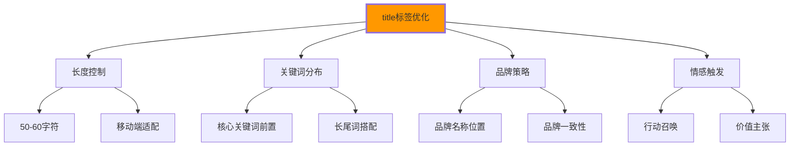
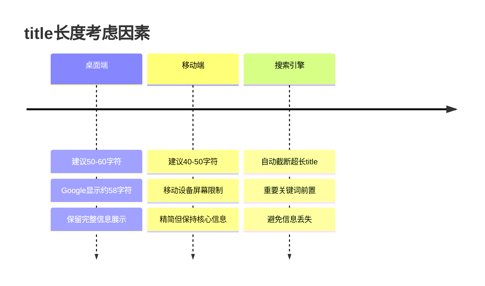
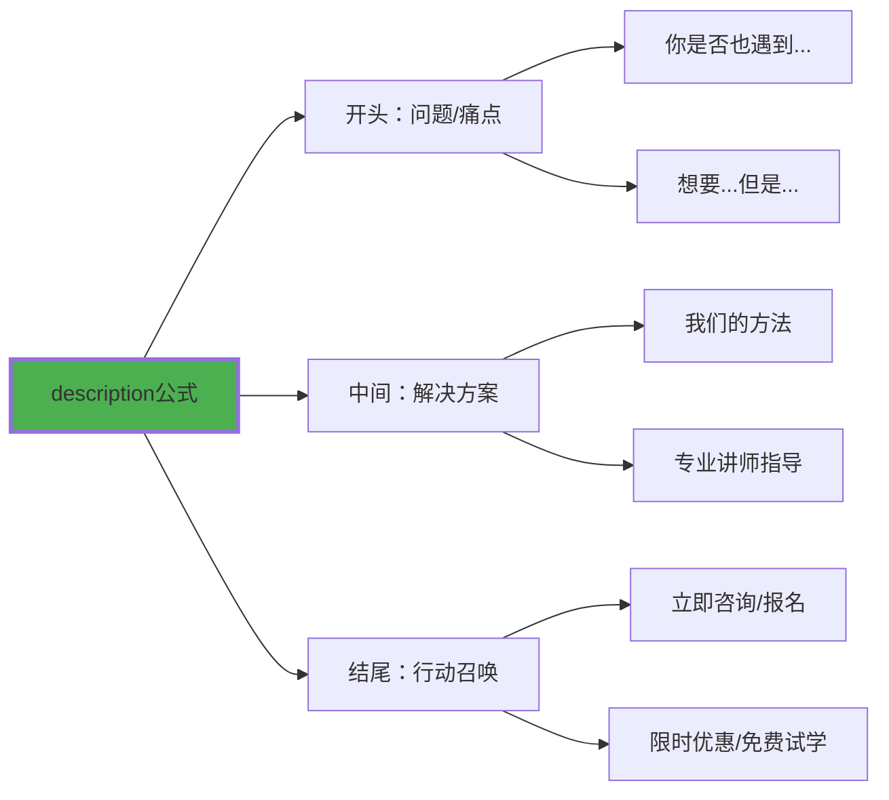
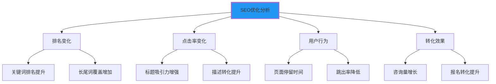

# 标题与描述优化

## 🎯 title标签：搜索引擎的第一印象

### 📊 title标签的核心价值

**title标签是搜索引擎和用户对页面的第一印象**：



## 📝 title优化最佳实践

### 🎯 title结构模板

| 页面类型 | 推荐格式 | 示例 |
|----------|----------|------|
| **首页** | 品牌名 - 核心价值主张 | `IT学院 - 专业编程教育平台` |
| **分类页** | 分类名 - 品牌名 | `HTML教程 - IT学院` |
| **文章页** | 文章标题 - 品牌名 | `HTML5语义化完整指南 - IT学院` |
| **产品页** | 产品名 + 特色 - 品牌名 | `专业HTML课程 限时优惠 - IT学院` |
| **服务页** | 服务名 + 优势 - 品牌名 | `一对一编程指导 包学会 - IT学院` |

### 🔧 title编写技巧

```html
<!-- ✅ 理想的title结构 -->
<title>HTML5教程_从零学HTML5_前端开发入门 | IT学院</title>

<!-- ✅ 关键词分布策略 -->
<title>[核心词] + [修饰词] + [长尾词] | [品牌名]</title>
<title>HTML5教程 + 零基础入门 + 前端开发学习 | IT学院</title>

<!-- ✅ 移动端适配的title -->
<title>HTML5教程 | IT学院</title>  <!-- 移动端简化版 -->

<!-- ✅ 季节性和时效性 -->
<title>双十一限时：HTML5教程5折优惠 | IT学院</title>
```

### 📊 title长度优化



## 📄 meta description：搜索结果摘要

### 🎯 description的作用机制

**meta description直接影响点击率**：

| 影响因素 | 权重 | 优化策略 |
|----------|------|----------|
| **相关性** | ⭐⭐⭐⭐⭐ | 与页面内容高度匹配 |
| **关键词包含** | ⭐⭐⭐⭐⭐ | 包含核心关键词 |
| **吸引力** | ⭐⭐⭐⭐⭐ | 语言简洁有感染力 |
| **长度控制** | ⭐⭐⭐⭐ | 120-160字符最佳 |
| **行动召唤** | ⭐⭐⭐⭐ | 明确的利益导向 |

### 💡 description优化技巧

```html
<!-- ✅ 标准description写法 -->
<meta name="description" content="从零基础到精通HTML5开发的完整学习路径。包含语义化标签、表单验证、移动端适配等核心技术。讲师专业、案例丰富，帮助您快速掌握前端开发技能。">

<!-- ✅ 增强版description -->
<meta name="description" content="【2024最新】HTML5完整教程，零基础30天学会前端开发。讲师10年+经验，包含实战项目、源码分享。已帮助1000+学员成功转行。立即免费试学！">

<!-- ✅ 特色功能导向 -->
<meta name="description" content="HTML5教程+实战项目+就业指导三位一体。从HTML基础到React进阶，全程手把手教学。包学会，不负责退款。现在报名享受限时7折优惠！">

<!-- ✅ 痛点解决型 -->
<meta name="description" content="想学HTML5开发但不知道从何开始？IT学院为您提供完整的HTML5学习路径，从基础语法到企业级项目，让您轻松入门前端开发。立即开始学习！">
```

### 🎨 description创作公式



## 🔍 关键词策略与title/description

### 📊 关键词层级设计

```html
<!-- ✅ 关键词分层优化 -->
<title>[主关键词] + [修饰词] | [品牌词]</title>
<!-- HTML5教程 + 零基础入门 | IT学院 -->

<meta name="description" content="[主关键词]包含[长尾词1]+[长尾词2]。[核心价值]+[差异化优势]。[行动召唤]。">
<!-- HTML5教程包含零基础入门+前端开发学习。专业讲师+10年经验。立即免费试学！ -->

<!-- ✅ 语义相关关键词 -->
<title>HTML5教程_前端开发入门_Web编程学习 | IT学院</title>
<meta name="description" content="HTML5教程是前端开发的入门必修课。我们提供从HTML语法到CSS样式、JavaScript交互的完整Web开发学习路径。">
```

### 🎯 长尾关键词优化

```html
<!-- ✅ 具体需求匹配 -->
<title>HTML5表单验证_客户端验证_交互开发教程 | IT学院</title>
<meta name="description" content="学习HTML5表单验证技术，掌握客户端数据验证、用户输入检查、错误提示设计等前端交互开发技能。">

<!-- ✅ 场景化关键词 -->
<title>响应式HTML5网页设计_移动端适配_多屏开发 | IT学院</title>
<meta name="description" content="掌握响应式HTML5网页设计技术，学习移动端适配、多屏开发、弹性布局等现代化前端开发技能。">

<!-- ✅ 问题解决导向 -->
<title>HTML5音频视频播放_多媒体网页开发技术 | IT学院</title>
<meta name="description" content="解决HTML5音频视频播放问题，学习多媒体网页开发、流媒体处理、音视频编码等前端多媒体技术。">
```

## 📱 多平台优化策略

### 🎯 搜索引擎差异化

```html
<!-- ✅ Google优化 -->
<title>HTML5 Tutorial | Complete HTML5 Guide for Beginners | IT Academy</title>
<meta name="description" content="Master HTML5 development with our comprehensive tutorial. Learn semantic markup, forms, multimedia, and responsive design. Start your coding journey today!">

<!-- ✅ 百度优化 -->
<title>HTML5教程_HTML5开发_前端入门学习 | IT学院</title>
<meta name="description" content="专业HTML5教程，从基础语法到高级应用一应俱全。讲师经验丰富，注重实战。0基础30天快速入门前端开发。">

<!-- ✅ 移动端优化 -->
<title>HTML5教程 | IT学院</title>  <!-- 简化版 -->
<meta name="description" content="HTML5教程，零基础入门前端开发。专业讲师，实战项目，快速上手。">  <!-- 精简版 -->
```

### 🌐 国际化考虑

```html
<!-- ✅ 多语言版本 -->
<title>HTML5教程 - 中文版 | IT学院</title>
<meta name="description" content="中文HTML5教程，适合中文学习者。语法详解、案例实践、就业指导，一站式学习解决方案。">

<title>HTML5 Tutorial - Chinese Edition | IT Academy</title>
<meta name="description" content="Chinese HTML5 tutorial designed for Chinese speakers. Comprehensive syntax guide, practical examples, and career guidance included.">

<title>HTML5教程 - 日本語版 | IT学院</title>
<meta name="description" content="日本人向けHTML5チュートリアル。基礎文法から応用まで、実践的な例で学習できます。">
```

## 🔧 SEO技术实现

### 📊 动态title/description生成

```html
<!-- ✅ PHP动态生成示例 -->
<title><?php echo $pageTitle . ' | IT学院'; ?></title>
<meta name="description" content="<?php echo $pageDescription; ?>">

<!-- ✅ JavaScript动态优化 -->
<script>
document.addEventListener('DOMContentLoaded', function() {
    // 检查页面类型并调整title长度
    const pageType = document.body.dataset.pageType;
    let title = document.title;
    
    if (window.innerWidth <= 768) { // 移动端
        title = title.replace(' | IT学院', ''); // 移除品牌后缀
        if (title.length > 40) {
            title = title.substring(0, 37) + '...';
        }
        document.title = title;
    }
});

// 根据用户行为动态调整描述
function updateDescription(newContent) {
    const metaDescription = document.querySelector('meta[name="description"]');
    if (metaDescription) {
        metaDescription.content = newContent;
    }
}
</script>
```

### 🎯 A/B测试策略

```javascript
// ✅ title和description的A/B测试
function abTestTitle() {
    const variants = [
        {
            title: "HTML5教程_零基础入门前端开发 | IT学院",
            description: "专业HTML5教程，从基础语法到企业项目实操。"
        },
        {
            title: "2024最新HTML5教程_包学会_包就业 | IT学院", 
            description: "2024年最新HTML5教程，零基础30天学会，包学会不负责退款。"
        },
        {
            title: "HTML5开发培训_在线学习_专业证书 | IT学院",
            description: "权威HTML5开发培训，在线直播+录播，毕业颁发专业证书。"
        }
    ];
    
    const randomVariant = variants[Math.floor(Math.random() * variants.length)];
    
    document.title = randomVariant.title;
    document.querySelector('meta[name="description"]').content = randomVariant.description;
    
    // 记录实验数据
    analytics.track('Title_AB_Test', {
        variant: randomVariant.title.substring(0, 10),
        page: window.location.pathname
    });
}
```

## 📊 效果监测与优化

### 🔍 SEO指标监控

| 指标类型 | 监控工具 | 优化重点 |
|----------|----------|----------|
| **点击率(CTR)** | Google Search Console | title吸引力 |
| **排名位置** | Ahrefs / SEMrush | 关键词竞争 |
| **搜索结果展示** | 手动检查 | 字符截断情况 |
| **用户行为** | Google Analytics | 页面停留时间 |

### 📈 优化效果分析



---

**🔗 深入SEO优化**：
- 结构化数据：`[[03-14 结构化数据标记]]`
- Schema应用：`[[03-15 Schema.org应用]]`
- 性能优化：`[[03-16 页面性能优化]]`
