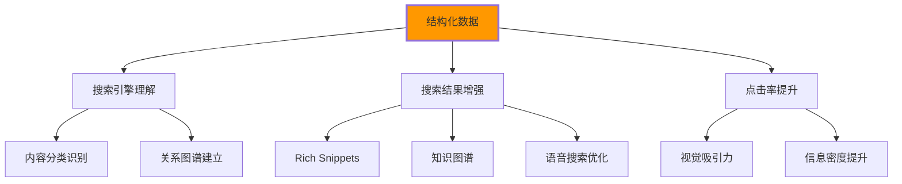

# 结构化数据标记

## 🏗️ 结构化数据的基础概念

### 📊 数据结构化的重要性

**结构化数据帮助搜索引擎理解网页内容**：



## 📋 JSON-LD结构化数据

### 🎯 基础JSON-LD语法

```html
<!-- ✅ 基础网页结构化数据 -->
<script type="application/ld+json">
{
    "@context": "https://schema.org",
    "@type": "WebPage",
    "name": "HTML学习中心 - 专业前端开发教程",
    "description": "从零基础到精通的HTML前端开发完整学习路径，包含实战项目、案例分析和就业指导。",
    "url": "https://html-center.com",
    "publisher": {
        "@type": "Organization",
        "name": "IT教育中心",
        "logo": {
            "@type": "ImageObject",
            "url": "https://html-center.com/logo.png",
            "width": "200",
            "height": "60"
        }
    },
    "datePublished": "2024-01-15",
    "dateModified": "2024-01-20",
    "inLanguage": "zh-CN",
    "mainEntity": {
        "@type": "EducationalOrganization",
        "name": "HTML前端开发课程",
        "description": "全面的HTML前端开发教育课程"
    }
}
</script>
```

### 📚 教育内容结构化

```html
<!-- ✅ 教育课程结构化数据 -->
<script type="application/ld+json">
{
    "@context": "https://schema.org",
    "@type": "Course",
    "name": "HTML5与现代化Web开发",
    "description": "深入学习HTML5语义化标签、新特性和跨平台开发技术，掌握企业级前端开发技能。",
    "provider": {
        "@type": "EducationalOrganization",
        "name": "IT学院",
        "url": "https://it-academy.com"
    },
    "courseCode": "HTML501",
    "educationalLevel": "intermediate",
    "teaches": [
        "HTML5语义化标记",
        "响应式设计原理", 
        "Web可访问性标准",
        "SEO优化技术"
    ],
    "totalTime": {
        "@type": "Duration",
        "value": "40",
        "unitCode": "HUR"
    },
    "hasCourseInstance": {
        "@type": "CourseInstance",
        "courseMode": ["onsite", 「online"],
        "instructor": {
            "@type": "Person",
            "name": "张老师",
            "jobTitle": "高级前端工程师"
        },
        "offers": {
            "@type": "Offer",
            "price": "999",
            "priceCurrency": "CNY",
            "availability": "https://schema.org/InStock"
        }
    },
    "aggregateRating": {
        "@type": "AggregateRating",
        "ratingValue": "4.8",
        "bestRating": "5",
        "ratingCount": "156"
    },
    "review": [
        {
            "@type": "Review",
            "author": {
                "@type": "Person",
                "name": "李同学"
            },
            "reviewRating": {
                "@type": "Rating",
                "ratingValue": "5",
                "bestRating": "5"
            },
            "reviewBody": "课程内容非常实用，讲解详细，案例丰富。"
        }
    ]
}
</script>
```

## 📰 文章和博客结构化

### 🔍 ARTICLE类型详解

```html
<!-- ✅ 技术文章结构化数据 -->
<script type="application/ld+json">
{
    "@context": "https://schema.org",
    "@type": "Article",
    "headline": "HTML5语义化标签的实战应用指南",
    "alternativeHeadline": "从新手到专家的语义化HTML实践",
    "description": "深入解析HTML5语义化标签的正确用法，包含实战案例和最佳实践。通过semantic elements提升网站的可访问性和SEO效果。",
    "image": [
        {
            "@type": "ImageObject",
            "url": "https://html-center.com/images/semantic-html.jpg",
            "width": "800",
            "height": "400",
            "caption": "HTML5语义化标签示意图"
        }
    ],
    "author": {
        "@type": "Person",
        "name": "王工程师",
        "url": "https://html-center.com/authors/wang",
        "jobTitle": "高级前端架构师",
        "worksFor": {
            "@type": "Organization",
            "name": "Tech Solutions Inc."
        }
    },
    "publisher": {
        "@type": "Organization",
        "name": "HTML学习中心",
        "url": "https://html-center.com",
        "logo": {
            "@type": "ImageObject",
            "url": "https://html-center.com/logo.png",
            "width": "150",
            "height": "50"
        }
    },
    "datepublished": "2024-01-15T09:00:00+08:00",
    "dateModified": "2024-01-20T14:30:00+08:00",
    "mainEntityOfPage": {
        "@type": "WebPage",
        "@id": "https://html-center.com/articles/semantic-html"
    },
    "articleSection": "前端开发",
    "keywords": ["HTML5", "语义化", "前端开发", "Web标准"],
    "wordCount": "2580",
    "timeRequired": "PT10M",
    "inLanguage": "zh-CN",
    "articleBody": "文章开始...",
    "speakable": {
        "@type": "speakableSpecification",
        "xpath": ["/html/head/title", "//article/h1"]
    },
    "mentions": [
        {
            "@type": "Thing",
            "name": "HTML5"
        },
        {
            "@type": "Thing", 
            "name": "语义化标签"
        }
    ]
}
</script>
```

## 🍞 面包屑导航结构化

### 📍 BreadcrumbList类型

```html
<!-- ✅ 面包屑导航HTML结构 -->
<nav class="breadcrumb" aria-label="当前位置">
    <ol itemscope itemtype="https://schema.org/BreadcrumbList">
        <li itemprop="itemListElement" itemscope itemtype="https://schema.org/ListItem">
            <a itemprop="item" href="https://html-center.com">
                <span itemprop="name">首页</span>
            </a>
            <meta itemprop="position" content="1" />
        </li>
        
        <li itemprop="itemListElement" itemscope itemtype="https://schema.org/ListItem">
            <a itemprop="item" href="https://html-center.com/courses">
                <span itemprop="name">课程中心</span>
            </a>
            <meta itemprop="position" content="2" />
        </li>
        
        <li itemprop="itemListElement" itemscope itemtype="https://schema.org/ListItem">
            <a itemprop="item" href="https://html-center.com/courses/html5">
                <span itemprop="name">HTML5教程</span>
            </a>
            <meta itemprop="position" content="3" />
        </li>
        
        <li itemprop="itemListElement" itemscope itemtype="https://schema.org/ListItem" aria-current="page">
            <span itemprop="name">语义化标签详解</span>
            <meta itemprop="position" content="4" />
        </li>
    </ol>
</nav>

<!-- ✅ JSON-LD形式的面包屑 -->
<script type="application/ld+json">
{
    "@context": "https://schema.org",
    "@type": "BreadcrumbList",
    "itemListElement": [
        {
            "@type": "ListItem",
            "position": 1,
            "name": "首页",
            "item": "https://html-center.com"
        },
        {
            "@type": "ListItem", 
            "position": 2,
            "name": "课程中心",
            "item": "https://html-center.com/courses"
        },
        {
            "@type": "ListItem",
            "position": 3,
            "name": "HTML5教程", 
            "item": "https://html-center.com/courses/html5"
        },
        {
            "@type": "ListItem",
            "position": 4,
            "name": "语义化标签详解"
        }
    ]
}
</script>
```

## 🏢 组织和企业信息

### 🎯 Organization类型应用

```html
<!-- ✅ 企业组织结构化数据 -->
<script type="application/ld+json">
{
    "@context": "https://schema.org",
    "@type": "EducationalOrganization",
    "name": "IT学院 - 专业编程教育平台",
    "description": "专注于IT技能培训的专业教育机构，提供HTML、CSS、JavaScript等前端开发课程。",
    "url": "https://it-academy.com",
    "logo": "https://it-academy.com/logo.png",
    "address": {
        "@type": "PostalAddress",
        "streetAddress": "北京市海淀区中关村大街66号",
        "addressLocality": "北京市",
        "addressRegion": "北京市",
        "postalCode": "100080",
        "addressCountry": "CN"
    },
    "geo": {
        "@type": "GeoCoordinates",
        "latitude": "39.9847",
        "longitude": "116.3087"
    },
    "contactPoint": [
        {
            "@type": "ContactPoint",
            "telephone": "+86-400-888-0000",
            "contactType": "customer service",
            "areaServed": "CN",
            "availableLanguage": ["Chinese", "English"]
        },
        {
            "@type": "ContactPoint",
            "email": "info@it-academy.com",
            "contactType": "sales"
        },
        {
            "@type": "ContactPoint",
            "contactType": "technical support",
            "email": "support@it-academy.com"
        }
    ],
    "sameAs": [
        "https://www.weibo.com/itacademy",
        "https://space.bilibili.com/itacademy",
        "https://github.com/it-academy"
    ],
    "foundingDate": "2018-01-01",
    "numberOfEmployees": [{
        "@type": "QuantitativeValue",
        "value": "50-100"
    }],
    "areaServed": {
        "@type": "Country",
        "name": "China"
    },
    "serviceType": "IT教育与技术培训",
    "aggregateRating": {
        "@type": "AggregateRating",
        "ratingValue": "4.9",
        "reviewCount": "1250"
    }
}
</script>
```

## 🔍 FAQ结构化数据

### ❓ FrequentlyAskedQuestion类型

```html
<!-- ✅ FAQ页面结构化数据 -->
<script type="application/ld+json">
{
    "@context": "https://schema.org",
    "@type": "FAQPage",
    "mainEntity": [
        {
            "@type": "Question",
            "name": "HTML5与HTML4有什么区别？",
            "acceptedAnswer": {
                "@type": "Answer",
                "text": "HTML5相比HTML4增加了语义化标签（如header、nav、article、section、aside、footer）、多媒体支持（video、audio）、图形绘制（canvas、SVG）、本地存储、地理位置API等新特性，并且简化了DOCTYPE声明。"
            }
        },
        {
            "@type": "Question", 
            "name": "学习HTML需要什么基础？",
            "acceptedAnswer": {
                "@type": "Answer",
                "text": "学习HTML不需要编程基础，但需要有基本的计算机操作能力。建议先了解基本的网页结构概念，然后循序渐进地学习HTML标签、CSS样式和JavaScript交互。"
            }
        },
        {
            "@type": "Question",
            "name": "HTML5在移动端开发中有什么优势？",
            "acceptedAnswer": {
                "@type": "Answer",
                "text": "HTML5在移动端开发中提供了响应式设计、触摸事件处理、设备API访问、离线缓存、媒体优化等优势，可以开发出接近原生应用体验的Web应用。"
            }
        },
        {
            "@type": "Question",
            "name": "如何提高HTML页面的加载速度？",
            "acceptedAnswer": {
                "@type": "Answer",
                "text": "可以通过以下方式优化HTML页面加载速度：1）压缩HTML文件；2）优化图片格式和大小；3）使用CDN加速；4）启用浏览器缓存；5）延迟加载非关键资源；6）减少HTTP请求数量。"
            }
        }
    ]
}
</script>

<!-- ✅ FAQ页面的HTML结构 -->
<section class="faq-section" aria-labelledby="faq-heading">
    <h2 id="faq-heading">常见问题解答</h2>
    
    <details class="faq-item">
        <summary>
            <h3>HTML5与HTML4有什么区别？</h3>
        </summary>
        <div class="faq-answer">
            <p>HTML5相比HTML4增加了语义化标签（如header、nav、article、section、aside、footer）...</p>
        </div>
    </details>
    
    <details class="faq-item">
        <summary>
            <h3>学习HTML需要什么基础？</h3>
        </summary>
        <div class="faq-answer">
            <p>学习HTML不需要编程基础，但需要有基本的计算机操作能力...</p>
        </div>
    </details>
</section>
```

## 🛒 产品和价格信息

### 💰 Product与Offer类型

```html
<!-- ✅ 产品页面结构化数据 -->
<script type="application/ld+json">
{
    "@context": "https://schema.org",
    "@type": "Product",
    "name": "HTML5前端开发课程",
    "description": "全面的HTML5前端开发课程，从基础语法到企业级项目实战，涵盖响应式设计、可访问性、SEO优化等核心技术。",
    "image": [
        "https://it-academy.com/images/html5-course-1.jpg",
        "https://it-academy.com/images/html5-course-2.jpg"
    ],
    "brand": {
        "@type": "Brand",
        "name": "IT学院"
    },
    "category": "在线教育课程",
    "offers": {
        "@type": "Offer",
        "url": "https://it-academy.com/courses/html5",
        "priceCurrency": "CNY",
        "price": "999",
        "priceValidUntil": "2024-12-31",
        "availability": "https://schema.org/InStock",
        "validFrom": "2024-01-01"
    },
    "aggregateRating": {
        "@type": "AggregateRating",
        "ratingValue": "4.8",
        "reviewCount": "156",
        "bestRating": "5",
        "worstRating": "1"
    },
    "review": [
        {
            "@type": "Review",
            "author": {
                "@type": "Person",
                "name": "张三"
            },
            "datePublished": "2024-01-10",
            "reviewRating": {
                "@type": "Rating",
                "ratingValue": "5",
                "bestRating": "5"
            },
            "reviewBody": "课程内容非常实用，老师讲解也很详细。"
        }
    ],
    "additionalProperty": [
        {
            "@type": "PropertyValue",
            "name": "课程时长",
            "value": "40小时"
        },
        {
            "@type": "PropertyValue", 
            "name": "难度等级",
            "value": "中级"
        },
        {
            "@type": "PropertyValue",
            "name": "学员数量", 
            "value": "150+"
        }
    ]
}
</script>
```

## 🔧 结构化数据测试与验证

### ✅ 测试工具推荐

**Google结构化数据测试工具**：

```javascript
// 验证结构化数据的JavaScript代码
function validateStructuredData() {
    const scripts = document.querySelectorAll('script[type="application/ld+json"]');
    
    scripts.forEach((script, index) => {
        try {
            const data = JSON.parse(script.textContent);
            console.log(`第${index + 1}个结构化数据:`, data);
            
            // 基本验证
            if (!data['@context']) {
                console.warn('缺少@context属性');
            }
            if (!data['@type']) {
                console.warn('缺少@type属性');
            }
            
        } catch (error) {
            console.error('JSON解析错误:', error);
        }
    });
}

// Schema.org验证规范
const schemaValidationRules = {
    requiredFields: ['@context', '@type'],
    articleRequired: ['headline', 'author', 'datePublished'],
    organizationRequired: ['name', 'url', 'logo'],
    productRequired: ['name', 'description', 'offers']
};
```

### 📊 效果监测

| 检测维度 | 工具/方法 | 评估标准 |
|----------|----------|----------|
| **语法正确性** | Google Rich Results Test | 报错为0 |
| **搜索引擎收录** | Google Search Console | 结构化数据覆盖100% |
| **搜索结果展示** | 手动搜索测试 | Rich Snippets显示正常 |
| **点击率变化** | Google Analytics | CTR提升20%+ |

---

**🔗 结构化数据进阶**：
- Schema.org详细应用：`[[03-15 Schema.org应用]]`
- SEO综合优化：`[[03-13 标题与描述优化]]`
- 性能监控：`[[03-16 页面性能优化]]`
