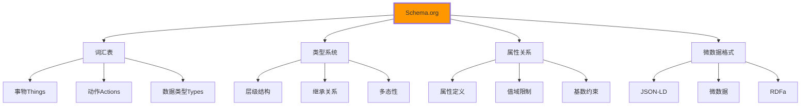

# Schema.org应用

## 🏗️ Schema.org基础体系

### 📊 Schema.org标记语言框架

**Schema.org为搜索引擎提供结构化数据标准**：



## 🎯 核心Schema类型详解

### 📚 教育机构Organization

```html
<!-- ✅ 教育机构Schema标记 -->
<script type="application/ld+json">
{
    "@context": "https://schema.org",
    "@type": "EducationalOrganization",
    "name": "IT学院",
    "alternateName": "计算机技术培训中心",
    "description": "专注于IT技能培训的专业教育机构，提供HTML、CSS、JavaScript等前端开发课程。",
    "url": "https://it-academy.edu.cn",
    "logo": {
        "@type": "ImageObject",
        "url": "https://it-academy.edu.cn/logo.png",
        "width": "200",
        "height": "60",
        "caption": "IT学院Logo"
    },
    "image": {
        "@type": "ImageObject",
        "url": "https://it-academy.edu.cn/banner.jpg",
        "width": "1200",
        "height": "400"
    },
    "address": {
        "@type": "PostalAddress",
        "streetAddress": "北京市海淀区中关村大街66号",
        "addressLocality": "北京市",
        "addressRegion": "北京市",
        "postalCode": "100080",
        "addressCountry": "CN"
    },
    "geo": {
        "@type": "GeoCoordinates",
        "latitude": "39.9847",
        "longitude": "116.3087"
    },
    "telephone": "+86-400-888-0000",
    "email": "info@it-academy.edu.cn",
    "founder": {
        "@type": "Person",
        "name": "张教授",
        "jobTitle": "创始人兼技术总监"
    },
    "numberOfEmployees": {
        "@type": "QuantitativeValue",
        "value": "50-100"
    },
    "foundingDate": "2018-01-01",
    "alumni": [
        {
            "@type": "Person",
            "name": "李同学",
            "jobTitle": "前端工程师",
            "worksFor": {
                "@type": "Organization", 
                "name": "某科技公司"
            }
        }
    ],
    "hasOfferCatalog": {
        "@type": "OfferCatalog",
        "name": "IT技能培训服务",
        "itemListElement": [
            {
                "@type": "Offer",
                "itemOffered": {
                    "@type": "Course",
                    "name": "HTML5前端开发课程"
                }
            },
            {
                "@type": "Offer", 
                "itemOffered": {
                    "@type": "Course",
                    "name": "CSS3设计技巧课程"
                }
            }
        ]
    },
    "sameAs": [
        "https://weibo.com/itacademy",
        "https://space.bilibili.com/itacademy", 
        "https://github.com/it-academy"
    ]
}
</script>
```

### 🎓 Course课程Schema

```html
<!-- ✅ 课程Schema标记 -->
<script type="application/ld+json">
{
    "@context": "https://schema.org",
    "@type": "Course",
    "name": "HTML5与现代化Web开发",
    "description": "深入学习HTML5语义化标签、新特性和跨平台开发技术，掌握企业级前端开发技能的一套完整课程体系。",
    "provider": {
        "@type": "EducationalOrganization",
        "name": "IT学院",
        "url": "https://it-academy.edu.cn"
    },
    "courseCode": "HTML501",
    "educationalLevel": "intermediate",
    "inLanguage": "zh-CN",
    "coursePrerequisites": [
        "基本的计算机操作能力",
        "对Web开发的基本认识",
        "英语基础（阅读能力）"
    ],
    "teaches": [
        "HTML5语义化标记技术",
        "响应式设计原理与实践",
        "Web可访问性标准WCAG 2.1",
        "SEO搜索引擎优化",
        "移动端开发适配",
        "Web Components组件化开发"
    ],
    "syllabus": [
        {
            "@type": "Course",
            "name": "HTML5基础语法",
            "description": "学习HTML5的基本语法、标签结构和文档结构"
        },
        {
            "@type": "Course", 
            "name": "语义化标记实践",
            "description": "掌握semantic elements的正确使用方法"
        },
        {
            "@type": "Course",
            "name": "表单和多媒体",
            "description": "学习现代表单设计和音频视频嵌入技术"
        }
    ],
    "totalTime": {
        "@type": "Duration",
        "value": "40",
        "unitCode": "HUR"
    },
    "offers": {
        "@type": "Offer",
        "priceCurrency": "CNY",
        "price": "1399",
        "availability": "https://schema.org/InStock",
        "validFrom": "2024-01-01",
        "validThrough": "2024-12-31",
        "category": "在线教育"
    },
    "hasCourseInstance": [
        {
            "@type": "CourseInstance",
            "courseMode": ["onsite", "online", "hybrid"],
            "startDate": "2024-02-01",
            "endDate": "2024-03-15",
            "instructor": [
                {
                    "@type": "Person",
                    "name": "王老师",
                    "jobTitle": "高级前端讲师",
                    "description": "10年+前端开发经验"
                },
                {
                    "@type": "Person",
                    "name": "李老师", 
                    "jobTitle": "UI/UX设计师",
                    "description": "资深设计师，专注用户体验"
                }
            ],
            "location": [
                {
                    "@type": "Place",
                    "name": "IT学院直播教室",
                    "address": "北京市海淀区中关村大街66号"
                }
            ]
        }
    ],
    "aggregateRating": {
        "@type": "AggregateRating",
        "ratingValue": "4.8",
        "bestRating": "5",
        "worstRating": "1",
        "ratingCount": "156"
    },
    "review": [
        {
            "@type": "Review",
            "author": {
                "@type": "Person",
                "name": "张三"
            },
            "datePublished": "2024-01-10",
            "reviewRating": {
                "@type": "Rating",
                "ratingValue": "5",
                "bestRating": "5"
            },
            "reviewBody": "课程内容非常实用，老师讲解也很详细，通过这个课程我成功转行成为了前端工程师。"
        }
    ],
    "isFamilyFriendly": true,
    "learningResourceType": ["教程", "练习", "项目实战"],
    "audience": {
        "@type": "EducationalAudience",
        "educationalRole": "student",
        "audienceType": "前端开发初学者"
    }
}
</script>
```

## 📰 博客和文章Schema

### 📝 Blog和BlogPostSchema

```html
<!-- ✅ 博客Schema结构 -->
<script type="application/ld+json">
{
    "@context": "https://schema.org",
    "@type": "Blog",
    "name": "IT学院技术博客",
    "description": "分享最新的IT技术趋势、编程教程和行业见解的专业技术博客。",
    "url": "https://blog.it-academy.edu.cn",
    "publisher": {
        "@type": "EducationalOrganization",
        "name": "IT学院",
        "logo": {
            "@type": "ImageObject",
            "url": "https://blog.it-academy.edu.cn/logo.png"
        }
    },
    "blogPost": [
        {
            "@type": "BlogPosting",
            "@id": "https://blog.it-academy.edu.cn/html5-semantic-guide",
            "headline": "HTML5语义化标签完整指南",
            "abstract": "学习如何使用HTML5的语义化标签来创建结构更清晰、可访问性更好的网页。",
            "author": {
                "@type": "Person",
                "name": "王工程师",
                "url": "https://blog.it-academy.edu.cn/authors/wang"
            },
            "datePublished": "2024-01-15T09:00:00+08:00",
            "dateModified": "2024-01-20T14:30:00+08:00",
            "wordCount": "2580",
            "timeRequired": "PT10M",
            "image": {
                "@type": "ImageObject",
                "url": "https://blog.it-academy.edu.cn/images/semantic-html.jpg",
                "width": "800",
                "height": "400"
            },
            "keywords": ["HTML5", "语义化", "可访问性", "前端开发"],
            "articleSection": "前端技术",
            "mainEntityOfPage": {
                "@type": "WebPage",
                "@id": "https://blog.it-academy.edu.cn/html5-semantic-guide"
            }
        }
    ],
    "rssFeed": "https://blog.it-academy.edu.cn/feed.xml",
    "keywords": ["IT技术", "编程教程", "网络开发", "前端技术"],
    "inLanguage": "zh-CN"
}
</script>

<!-- ✅ 单篇博客文章Schema -->
<script type="application/ld+json">
{
    "@context": "https://schema.org",
    "@type": "BlogPosting",
    "headline": "HTML5语义化标签的实战应用指南",
    "description": "深入解析HTML5语义化标签的正确用法，包含实战案例和最佳实践。通过semantic elements提升网站的可访问性和SEO效果。",
    "image": [
        {
            "@type": "ImageObject",
            "url": "https://blog.it-academy.edu.cn/images/semantic-html-hero.jpg",
            "width": "1200",
            "height": "630",
            "caption": "HTML5语义化标签示意图"
        }
    ],
    "author": {
        "@type": "Person",
        "name": "王工程师",
        "url": "https://blog.it-academy.edu.cn/authors/wang",
        "description": "高级前端架构师，拥有10年+Web开发经验",
        "jobTitle": "高级前端工程师",
        "worksFor": {
            "@type": "Organization",
            "name": "Tech Solutions Inc.",
            "url": "https://techsolutions.com"
        },
        "sameAs": [
            "https://github.com/wang-engineer",
            "https://twitter.com/wang_dev"
        ]
    },
    "publisher": {
        "@type": "EducationalOrganization",
        "name": "IT学院",
        "logo": {
            "@type": "ImageObject",
            "url": "https://blog.it-academy.edu.cn/logo.png",
            "width": "200",
            "height": "60"
        }
    },
    "datePublished": "2024-01-15T09:00:00+08:00",
    "dateModified": "2024-01-20T14:30:00+08:00",
    "mainEntityOfPage": {
        "@type": "WebPage",
        "@id": "https://blog.it-academy.edu.cn/html5-semantic-guide"
    },
    "articleSection": "前端开发技术",
    "keywords": ["HTML5", "语义化", "前端开发", "Web标准", "可访问性"],
    "wordCount": "2580",
    "timeRequired": "PT10M",
    "inLanguage": "zh-CN",
    "speakable": {
        "@type": "SpeakableSpecification",
        "xpath": ["/html/head/title", "//article/h1", "//article/p[1]"]
    },
    "mentions": [
        {
            "@type": "SoftwareApplication",
            "name": "Visual Studio Code",
            "description": "流行的代码编辑器"
        },
        {
            "@type": "WebSite",
            "name": "MDN Web Docs",
            "url": "https://developer.mozilla.org"
        }
    ],
    "isPartOf": {
        "@type": "Blog",
        "name": "IT学院技术博客"
    }
}
</script>
```

## 🛒 电商产品Schema

### 💰 Product和Offer应用

```html
<!-- ✅ 产品页Schema标记 -->
<div itemscope itemtype="https://schema.org/Product">
    <h1 itemprop="name">HTML5前端开发课程</h1>
    
    
    
    <p itemprop="description">
        全面的HTML5前端开发课程，从基础语法到企业级项目实战，
        涵盖响应式设计、可访问性、SEO优化等核心技术。
    </p>
    
    <!-- 产品属性 -->
    <div itemprop="additionalProperty" itemscope itemtype="https://schema.org/PropertyValue">
        <span itemprop="name">课程时长</span>
        <span itemprop="value"> 40小时</span>
    </div>
    
    <div itemprop="additionalProperty" itemscope itemtype="https://schema.org/PropertyValue">
        <span itemprop="name">难度等级</span>
        <span itemprop="value">中级</span>
    </div>
    
    <!-- 价格信息 -->
    <div itemprop="offers" itemscope itemtype="https://schema.org/Offer">
        <div itemprop="price" content="999">¥999</div>
        <div itemprop="priceCurrency" content="CNY">CNY</div>
        <div itemprop="availability" href="https://schema.org/InStock">现货</div>
        <div itemprop="validFrom" content="2024-01-01">有效期：2024年1月1日</div>
        <div itemprop="url">https://it-academy.edu.cn/courses/html5</div>
    </div>
    
    <!-- 评价信息 -->
    <div itemprop="aggregateRating" itemscope itemtype="https://schema.org/AggregateRating">
        <div itemprop="ratingValue">4.8</div>
        <div itemprop="bestRating">5</div>
        <div itemprop="worstRating">1</div>
        <div itemprop="ratingCount">156</div>
    </div>
    
    <!-- 品牌信息 -->
    <div itemprop="brand" itemscope itemtype="https://schema.org/Brand">
        <span itemprop="name">IT学院</span>
    </div>
</div>

<!-- ✅ JSON-LD版本产品Schema -->
<script type="application/ld+json">
{
    "@context": "https://schema.org",
    "@type": "Product",
    "name": "HTML5前端开发课程",
    "description": "全面的HTML5前端开发课程，从基础语法到企业级项目实战，涵盖响应式设计、可访问性、SEO优化等核心技术。",
    "image": [
        "https://it-academy.edu.cn/images/html5-course-1.jpg",
        "https://it-academy.edu.cn/images/html5-course-2.jpg",
        "https://it-academy.edu.cn/images/html5-course-3.jpg"
    ],
    "sku": "HTML501",
    "mpn": "IT-HTML501-2024",
    "brand": {
        "@type": "Brand",
        "name": "IT学院",
        "logo": "https://it-academy.edu.cn/logo.png"
    },
    "category": "在线教育课程",
    "audience": {
        "@type": "EducationalAudience",
        "audienceType": "前端开发学习者"
    },
    "educationalLevel": "intermediate",
    "learningResourceType": ["教程", "练习", "项目"],
    "typicalAgeRange": "18-35",
    "offers": [
        {
            "@type": "Offer",
            "url": "https://it-academy.edu.cn/courses/html5",
            "priceCurrency": "CNY",
            "price": "999",
            "priceValidUntil": "2024-12-31",
            "availability": "https://schema.org/InStock",
            "validFrom": "2024-01-01",
            "seller": {
                "@type": "EducationalOrganization",
                "name": "IT学院"
            },
            "shippingDetails": {
                "@type": "OfferShippingDetails",
                "shippingRate": {
                    "@type": "MonetaryAmount",
                    "value": "0",
                    "currency": "CNY"
                },
                "deliveryTime": {
                    "@type": "ShippingDeliveryTime",
                    "businessDays": {
                        "@type": "OpeningDaysSpecification",
                        "dayOfWeek": ["Monday", "Tuesday", "Wednesday", "Thursday", "Friday"]
                    },
                    "cutoffTime": "17:00"
                }
            }
        }
    ],
    "aggregateRating": {
        "@type": "AggregateRating",
        "ratingValue": "4.8",
        "reviewCount": "156",
        "bestRating": "5",
        "worstRating": "1"
    },
    "review": [
        {
            "@type": "Review",
            "author": {
                "@type": "Person",
                "name": "李同学"
            },
            "datePublished": "2024-01-05",
            "description": "课程内容很实用，老师教得很好。",
            "reviewRating": {
                "@type": "Rating",
                "ratingValue": "5",
                "bestRating": "5"
            }
        },
        {
            "@type": "Review",
            "author": {
                "@type": "Person",
                "name": "王学生"
            },
            "datePublished": "2024-01-10",
            "description": "通过这个课程我成功找到了前端开发工作。",
            "reviewRating": {
                "@type": "Rating",
                "ratingValue": "5",
                "bestRating": "5"
            }
        }
    ],
    "additionalProperty": [
        {
            "@type": "PropertyValue",
            "name": "课程时长",
            "value": "40小时"
        },
        {
            "@type": "PropertyValue",
            "name": "难度等级",
            "value": "中级"
        },
        {
            "@type": "PropertyValue",
            "name": "学员数量",
            "value": "150+"
        },
        {
            "@type": "PropertyValue",
            "name": "证书",
            "value": "结业证书"
        }
    ]
}
</script>
```

## 🔧 技术实现和优化

### ⚡ Schema标记性能优化

```html
<!-- ✅ 条件加载Schema -->
<script type="application/ld+json">
(function() {
    'use strict';
    
    // 基础Schema定义
    const baseSchema = {
        "@context": "https://schema.org",
        "@type": "WebPage",
        "name": document.title,
        "description": document.querySelector('meta[name="description"]')?.content,
        "url": window.location.href,
        "publisher": {
            "@type": "Organization",
            "name": "IT学院"
        }
    };
    
    // 根据页面类型动态添加Schema
    const pageType = document.body.dataset.pageType;
    
    switch(pageType) {
        case 'course':
            Object.assign(baseSchema, {
                "@type": "Course",
                "courseCode": document.querySelector('[data-course-code]')?.dataset.courseCode,
                "provider": {
                    "@type": "EducationalOrganization",
                    "name": "IT学院"
                }
            });
            break;
            
        case 'article':
            Object.assign(baseSchema, {
                "@type": "Article",
                "author": {
                    "@type": "Person",
                    "name": document.querySelector('[data-author]')?.dataset.author
                },
                "datePublished": document.querySelector('[data-pub-date]')?.dataset.pubDate
            });
            break;
            
        case 'product':
            Object.assign(baseSchema, {
                "@type": "Product",
                "offers": {
                    "@type": "Offer",
                    "price": document.querySelector('[data-price]')?.dataset.price,
                    "priceCurrency": "CNY"
                }
            });
            break;
    }
    
    // 动态生成和插入Schema
    const script = document.createElement('script');
    script.type = 'application/ld+json';
    script.textContent = JSON.stringify(baseSchema, null, 2);
    document.head.appendChild(script);
})();
</script>
```

### 📊 Schema验证工具

```javascript
// Schema验证功能
function validateSchema(schemaData) {
    const errors = [];
    
    // 基础验证规则
    if (!schemaData['@context']) {
        errors.push('缺少@context属性');
    }
    
    if (!schemaData['@type']) {
        errors.push('缺少@type属性');
    }
    
    // 类型特定验证
    switch(schemaData['@type']) {
        case 'Course':
            validateCourseSchema(schemaData, errors);
            break;
        case 'Article':
            validateArticleSchema(schemaData, errors);
            break;
        case 'Product':
            validateProductSchema(schemaData, errors);
            break;
    }
    
    return {
        isValid: errors.length === 0,
        errors: errors
    };
}

function validateCourseSchema(schema, errors) {
    const requiredFields = ['name', 'provider', 'description'];
    requiredFields.forEach(field => {
        if (!schema[field]) {
            errors.push(`Course类型缺少${field}字段`);
        }
    });
    
    if (schema.provider && !schema.provider.name) {
        errors.push('Course的provider必须包含name属性');
    }
}

// 自动化Schema检测
function detectSchemaOnPage() {
    const scripts = document.querySelectorAll('script[type="application/ld+json"]');
    const schemas = [];
    
    scripts.forEach(script => {
        try {
            const data = JSON.parse(script.textContent);
            const validation = validateSchema(data);
            schemas.push({
                schema: data,
                validation: validation
            });
        } catch (error) {
            console.error('JSON解析错误:', error);
        }
    });
    
    return schemas;
}

// Google Rich Results测试API调用
async function testRichResults(url) {
    try {
        const response = await fetch(`https://validator.richres.com/api/batch`, {
            method: 'POST',
            headers: {
                'Content-Type': 'application/json'
            },
            body: JSON.stringify({
                'url': url,
                'google_valid': true,
                'facebook_valid': true
            })
        });
        
        const result = await response.json();
        return result;
    } catch (error) {
        console.error('Rich Results测试失败:', error);
        return null;
    }
}
```

## 📈 Schema效果监控

### 🎯 Rich Snippets成功指标

| 指标 | 标准 | 监测方法 |
|------|------|----------|
| **结构化数据显示** | Google Search Console中显示100%覆盖率 | 月度检查 |
| **Rich Snippets展示** | 搜索结果中正确显示富摘要 | 手动测试 |
| **点击率提升** | CTR相比普通结果提升20%+ | Google Analytics |
| **排名变化** | 相关关键词排名稳步上升 | SEO监控工具 |

```javascript
// Schema效果监控
function monitorSchemaPerformance() {
    // Google Analytics事件追踪
    function trackSchemaInteraction(action) {
        if (typeof gtag !== 'undefined') {
            gtag('event', 'schema_interaction', {
                'event_category': 'structured_data',
                'event_label': action,
                'page_title': document.title
            });
        }
    }
    
    // 监测用户与Rich Snippets的交互
    document.addEventListener('click', function(e) {
        const schemaElement = e.target.closest('[itemscope]');
        if (schemaElement) {
            trackSchemaInteraction('schema_element_click');
        }
        
        const richSnippetLink = e.target.closest('a[href*="structured"]');
        if (richSnippetLink) {
            trackSchemaInteraction('rich_snippet_click');
        }
    });
    
    // 提交Schema数据到分析平台
    const schemaSummary = {
        totalSchemas: document.querySelectorAll('script[type="application/ld+json"]').length,
        pageType: document.body.dataset.pageType,
        timestamp: new Date().toISOString()
    };
    
    // 发送到自定义分析端点
    fetch('/api/schema-analytics', {
        method: 'POST',
        headers: {
            'Content-Type': 'application/json'
        },
        body: JSON.stringify(schemaSummary)
    }).catch(error => console.log('Schema分析数据提交失败:', error));
}
```

---

**🔗 Schema.org深入应用**：
- 结构化数据标记：`[[03-14 结构化数据标记]]`
- SEO综合优化：`[[03-13 标题与描述优化]]`
- 性能监控：`[[03-16 页面性能优化]]`
