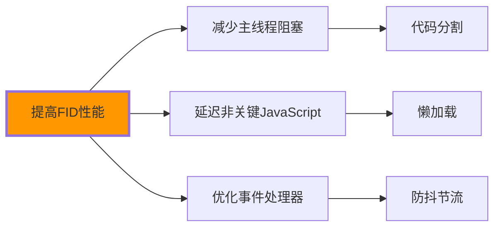

# 页面性能优化

## ⚡ 性能优化的核心驱动

### 📊 Web Vitals的重要性

**页面性能直接关乎用户留存和SEO排名**：

```mermaid
graph TD
    A[页面性能优化] --><｜tool▁sep｜>user-experience class="fill:#4caf50") B[用户体验提升]
    A --> B[SEO排名影响]
    A --> C[业务转化优化]
    
    D[Core Web Vitals] --> E[LCP最大内容渲染]
    D --> F[FID首次输入延迟] 
    D --> G[CLS累积布局偏移]
    
    H[传统指标] --> I[TTFB首字节时间]
    H --> J[FCP首次内容绘制]
    H --> K[TTI可交互时间]
    
    style D fill:#ff9800,stroke-width:3px
```

## 🎯 LCP最大内容渲染优化

### 📍 LCP影响因素分析

**LCP应控制在2.5秒以内**：

| LCP元素类型 | 优化策略 | HTML优化方法 |
|-------------|----------|--------------|
| **Hero图片** | 图片压缩和格式优化 | 使用现代图片格式 |
| **背景图片** | 懒加载和尺寸适配 | CSS背景图优化 |
| **文本内容** | 字体优化和CSS内联 | 关键CSS内联 |
| **视频元素** | 视频预加载和压缩 | poster属性和压缩 |

### 🔧 HTML层面的LCP优化

```html
<!-- ✅ 现代图片格式优化 -->
<picture>
    <source media="(min-width: 800px)" 
            srcset="hero-large.webp"
            type="image/webp">
    <source media="(min-width: 400px)" 
            srcset="hero-medium.webp"
            type="image/webp">
    
         fetchpriority="high"      <!-- 高优先级资源 -->
         decoding="async">          <!-- 异步解码 -->
</picture>

<!-- ✅ 关键CSS内联优化 -->
<style>
/* 关键路径CSS内联 */
.hero-section { 
    background: linear-gradient(135deg, #667eea 0%, #764ba2 100%);
    min-height: 100vh;
    display: flex;
    align-items: center;
    justify-content: center;
}

.hero-content {
    color: white;
    text-align: center;
    max-width: 800px;
    padding: 2rem;
}

.hero-title {
    font-size: 3rem;
    font-weight: 700;
    margin-bottom: 1rem;
}

/* 以上是LCP相关样式，优先内联 */
</style>

<!-- 非关键CSS异步加载 -->
<link rel="preload" href="styles/non-critical.css" as="style" onload="this.onload=null;this.rel='stylesheet'">

<!-- ✅ 字体优化策略 -->
<link rel="preload" href="fonts/main-font.woff2" as="font" type="font/woff2" crossorigin>
<link rel="preload" href="fonts/heading-font.woff2" as="font" type="font/woff2" crossorigin>

<style>
/* 字体回退策略 */
@font-face {
    font-family: 'Main Font';
    src: url('fonts/main-font.woff2') format('woff2'),
         url('fonts/main-font.woff') format('woff');
    font-display: swap;  /* 重要：使用swap避免FOUT */
}

.heading-font {
    font-family: 'Microsoft YaHei', 'Helvetica Neue', Arial, sans-serif;
}
</style>
```

## 🖱️ FID首次输入延迟优化

### 📍 FID性能因素

**FID应控制在100ms以内**：



### 🔧 JavaScript阻塞优化

```html
<!-- ✅ 非关键JavaScript延迟加载 -->
<script defer src="analytics.js"></script>
<script defer src="social-sharing.js"></script>

<!-- ✅ 关键JavaScript预加载 -->
<link rel="preload" href="critical-functions.js" as="script">

<!-- ✅ 大型库代码分割 -->
<script type="module">
// 动态导入，按需加载
async function loadChartLibrary() {
    if (document.querySelector('.chart-container')) {
        const { default: Chart } = await import('chart.js');
        // 初始化图表
    }
}

// 用户交互时才加载
document.addEventListener('click', loadChartLibrary, { once: true });
</script>

<!-- ✅ Web Workers优化主线程 -->
<script>
// 复杂计算移至Web Worker
if ('serviceWorker' in navigator) {
    navigator.serviceWorker.register('/sw.js');
}

// 大数据处理使用Worker
const worker = new Worker('data-processor.js');
worker.postMessage(largeDataset);

worker.onmessage = function(e) {
    updateUI(e.data);
};
</script>
```

## 📐 CLS累积布局偏移优化

### 🎯 CLS问题预防

**CLS应控制在0.1以内**：

```html
<!-- ✅ 预设尺寸防止布局偏移 -->
  <!-- 保持宽高比 -->

<!-- ✅ 容器预设高度 -->
<div class="image-container" style="aspect-ratio: 16/9;">
    
</div>

<!-- ✅ 广告位固定尺寸 -->
<div class="ad-container" style="width: 300px; height: 250px;">
    <!-- 广告内容 -->
</div>

<!-- ✅ 字体加载优化 -->
<style>
/* 字体回退策略减少FOUT */
@font-face {
    font-family: 'Brand Font';
    src: url('brand-font.woff2') format('woff2');
    font-display: swap;
}

body {
    font-family: "Brand Font", "Arial", sans-serif;
}

/* 使用CSS containment优化重绘 */
.article-content {
    contain: layout style paint;
}

.comments-section {
    contain: layout style;
}
</style>
```

## 📦 资源加载优化

### 🚀 现代loading策略

```html
<!-- ✅ 资源优先级设置 -->
<link rel="preload" href="critical.js" as="script">
<link rel="preload" href="hero-image.webp" as="image">

<!-- ✅ 图片懒加载 -->


<script>
// Intersection Observer API懒加载
const lazyImages = document.querySelectorAll('img[data-src]');
const imageObserver = new IntersectionObserver((entries, observer) => {
    entries.forEach(entry => {
        if (entry.isIntersecting) {
            const img = entry.target;
            img.src = img.dataset.src;
            img.srcset = img.dataset.srcset;
            img.removeAttribute('data-src');
            img.removeAttribute('data-srcset');
            observer.unobserve(img);
        }
    });
});

lazyImages.forEach(img => imageObserver.observe(img));
</script>

<!-- ✅ 关键资源preconnect -->
<link rel="preconnect" href="https://fonts.googleapis.com">
<link rel="preconnect" href="https://cdnjs.cloudflare.com">
<link rel="dns-prefetch" href="https://analytics.google.com">

<!-- ✅ Service Worker缓存策略 -->
<script>
if ('serviceWorker' in navigator) {
    navigator.serviceWorker.register('/sw.js').then(registration => {
        console.log('SW registered');
    });
}
</script>
```

### 📱 移动端性能优化

```html
<!-- ✅ 移动端特定优化 -->
<meta name="viewport" content="width=device-width, initial-scale=1.0, user-scalable=yes">

<!-- 触摸友好设计 -->
<button class="mobile-button" 
        style="min-height: 44px; min-width: 44px; touch-action: manipulation;">
    点击我
</button>

<!-- 移动端图片优化 -->
<picture>
    <source media="(max-width: 768px)" 
            srcset="mobile-hero.webp"
            type="image/webp">
    <source media="(max-width: 768px)" 
            srcset="mobile-hero.jpg"
            type="image/jpeg">
    
</picture>

<!-- Responsive字体大小 -->
<script>
// 根据设备像素比调整字体
const dpr = window.devicePixelRatio || 1;
document.documentElement.style.setProperty('--device-pixel-ratio', dpr);

// 移动端减少动画性能消耗
if (window.innerWidth <= 768) {
    document.body.classList.add('mobile-optimized');
}
</script>
```

## 🔧 性能监控与优化

### 📊 性能指标检测

```javascript
// ✅ Web Vitals核心指标监控
function measureWebVitals() {
    // LCP测量
    new PerformanceObserver((list) => {
        list.getEntries().forEach((entry) => {
            if (entry.url) {
                console.log('LCP:', entry.startTime);
                // 上报LCP数据
                analytics.track('Performance', { 
                    metric: 'LCP', 
                    value: entry.startTime 
                });
            }
        });
    }).observe({ entryTypes: ['largest-contentful-paint'] });

    // FID测量
    new PerformanceObserver((list) => {
        list.getEntries().forEach((entry) => {
            console.log('FID:', entry.processingStart - entry.startTime);
            analytics.track('Performance', { 
                metric: 'FID', 
                value: entry.processingStart - entry.startTime 
            });
        });
    }).observe({ entryTypes: ['first-input'] });

    // CLS测量
    let clsValue = 0;
    new PerformanceObserver((list) => {
        list.getEntries().forEach((entry) => {
            if (!entry.hadRecentInput) {
                clsValue += entry.value;
            }
        });
        console.log('CLS:', clsValue);
        analytics.track('Performance', { metric: 'CLS', value: clsValue });
    }).observe({ entryTypes: ['layout-shift'] });
}

// ✅ 资源加载性能监控
function monitorResourcePerformance() {
    const resourceTiming = performance.getEntriesByType('resource');
    
    resourceTiming.forEach(resource => {
        if (resource.initiatorType === 'img') {
            const loadTime = resource.responseEnd - resource.startTime;
            if (loadTime > 2000) {  // 超过2秒的图片
                console.warn('Slow image load:', resource.name, loadTime);
            }
        }
    });
}

// 页面加载完成后分析
window.addEventListener('load', () => {
    measureWebVitals();
    monitorResourcePerformance();
});
```

### 🎯 自动化性能优化

```html
<!-- ✅ 自动压缩响应 -->
<meta name="compress-response" content="true">

<!-- ✅ HTTP/2 Server Push预推送 -->
<link rel="preload" href="/critical.css" as="style">
<link rel="preload" href="/critical.js" as="script">

<!-- ✅ 关键资源hint -->
<link rel="preload" href="fonts/main.woff2" as="font" crossorigin>
<link rel="preload" href="images/logo.svg" as="image">

<script>
// ✅ 自适应图片质量
function adaptiveImageQuality() {
    const images = document.querySelectorAll('img[data-src]');
    const connection = navigator.connection;
    
    let quality = 'high';
    
    if (connection && connection.effectiveType) {
        switch (connection.effectiveType) {
            case 'slow-2g':
            case '2g':
            case '3g':
                quality = 'low';
                break;
            case '4g':
                quality = 'medium';
                break;
        }
    }
    
    images.forEach(img => {
        const srcset = img.dataset.srcset;
        if (srcset) {
            img.srcset = srcset.replace(/quality=[^&]*/, `quality=${quality}`);
        }
    });
}

document.addEventListener('DOMContentLoaded', adaptiveImageQuality);
</script>
```

---

**🔗 性能优化深化**：
- 移动端适配：`[[03-17 移动端SEO适配]]`
- 可访问性集成：`[[03-6 WCAG可访问性标准]]`
- 项目实战：`[[04-17 企业官网重构项目]]`
