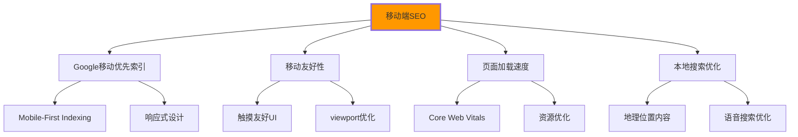

# 移动端SEO适配

## 📱 移动优先的SEO策略

### 📊 移动端搜索趋势与SEO要求

**移动端SEO已经成为SEO优化的核心**：



## 🎯 移动优先HTML结构

### 📱 Mobile-First的页面架构

```html
<!DOCTYPE html>
<html lang="zh-CN">
<head>
    <meta charset="UTF-8">
    <meta name="viewport" content="width=device-width, initial-scale=1.0, user-scalable=yes">
    
    <!-- 移动优先的title -->
    <title>HTML5教程_移动端友好学习平台_IT学院</title>
    
    <!-- 移动端优化的description -->
    <meta name="description" content="专为移动端优化的HTML5学习平台，支持手机、平板学习。零基础到精通，权威教程+实战项目。支持离线学习，随时随地提升技能。">
    
    <!-- 移动应用配置 -->
    <meta name="mobile-web-app-capable" content="yes">
    <meta name="theme-color" content="#4285f4">
    <meta name="apple-mobile-web-app-capable" content="yes">
    <meta name="apple-mobile-web-app-status-bar-style" content="default">
    <meta name="apple-mobile-web-app-title" content="IT学院">
    
    <!-- 移动端图标 -->
    <link rel="icon" type="image/png" sizes="32x32" href="/icons/favicon-32x32.png">
    <link rel="icon" type="image/png" sizes="16x16" href="/icons/favicon-16x16.png">
    <link rel="apple-touch-icon" sizes="180x180" href="/icons/apple-touch-icon.png">
    <link rel="mask-icon" href="/icons/safari-pinned-tab.svg" color="#4285f4">
    
    <!-- 移动端优先的资源加载 -->
    <link rel="preload" href="fonts/mobile-font.woff2" as="font" type="font/woff2" crossorigin>
    <link rel="preload" href="css/mobile-critical.css" as="style">
    
    <!-- 条件加载：非移动端CSS -->
    <link rel="stylesheet" href="css/mobile.css" media="{media.css="css/tablet.css" media="screen and (min-width: 768px)">
    <link rel="stylesheet" href="css/desktop.css" media="screen and (min-width: 1024px)">
</head>

<body class="mobile-first-layout">
    <!-- 🧭 移动端友好的导航 -->
    <header class="mobile-header">
        <div class="header-container">
            <!-- 简化的移动端Logo -->
            <div class="mobile-brand">
                <a href="/" aria-label="IT学院首页">
                    
                    <span class="brand-text">IT学院</span>
                </a>
            </div>
            
            <!-- 汉堡菜单 -->
            <button class="mobile-menu-button" 
                    aria-expanded="false" 
                    aria-controls="mobile-navigation"
                    aria-label="打开菜单">
                <span class="hamburger-line"></span>
                <span class="hamburger-line"></span>
                <span class="hamburger-line"></span>
            </button>
            
            <!-- 移动端导航 -->
            <nav id="mobile-navigation" 
                 class="mobile-navigation" 
                 aria-hidden="true"
                 role="navigation" 
                 aria-label="主导航">
                <div class="mobile-nav-content">
                    <!-- 搜索框：移动端优先 -->
                    <form class="mobile-search" role="search">
                        <div class="search-input-container">
                            <input type="search" 
                                   placeholder="搜索课程、讲师..."
                                   class="mobile-search-input"
                                   autocomplete="off">
                            <button type="submit" 
                                    aria-label="搜索"
                                    class="search-submit-btn">
                                <svg><use href="#icon-search"></use></svg>
                            </button>
                        </div>
                    </form>
                    
                    <!-- 导航菜单 -->
                    <ul class="mobile-menu-list">
                        <li class="mobile-menu-item">
                            <a href="/" class="mobile-menu-link">首页</a>
                        </li>
                        <li class="mobile-menu-item mobile-menu-item--expandable">
                            <button class="mobile-menu-toggle" aria-expanded="false">
                                <span class="menu-link-text">课程</span>
                                <svg class="expand-icon"><use href="#icon-chevron-right"></use></svg>
                            </button>
                            <ul class="mobile-submenu">
                                <li><a href="/frontend">前端开发</a></li>
                                <li><a href="/backend">后端开发</a></li>
                                <li><a href="/mobile">移动开发</a></li>
                            </ul>
                        </li>
                        <li class="mobile-menu-item">
                            <a href="/about" class="mobile-menu-link">关于我们</a>
                        </li>
                        <li class="mobile-menu-item">
                            <a href="/contact" class="mobile-menu-link">联系我们</a>
                        </li>
                    </ul>
                    
                    <!-- 用户操作 -->
                    <div class="mobile-user-actions">
                        <a href="/login" class="mobile-login-btn">登录</a>
                        <button class="mobile-cta-btn">免费试学</button>
                    </div>
                </div>
            </nav>
        </div>
    </header>

    <main class="mobile-main">
        <!-- 🎯 移动端优化的Hero区域 -->
        <section class="mobile-hero">
            <div class="hero-container">
                <div class="hero-content">
                    <h1 class="mobile-hero-title">
                        <span class="title-main">随时随地的</span>
                        <span class="title-highlight">编程学习</span>
                    </h1>
                    
                    <p class="mobile-hero-subtitle">
                        专为移动端优化的学习平台，支持手机、平板随时随地学习HTML5、CSS3、JavaScript等现代前端技术。
                    </p>
                    
                    <!-- 移动端CTA -->
                    <div class="mobile-hero-actions">
                        <button class="btn-mobile-primary">开始学习</button>
                        <a href="/demo" class="btn-mobile-secondary">
                            <svg><use href="#icon-play"></use></svg>
                            观看演示
                        </a>
                    </div>
                    
                    <!-- 移动端特色功能 -->
                    <div class="mobile-features">
                        <div class="feature-item">
                            <svg class="feature-icon"><use href="#icon-offline"></use></svg>
                            <span>支持离线学习</span>
                        </div>
                        <div class="feature-item">
                            <svg class="feature-icon"><use href="#icon-sync"></use></svg>
                            <span>进度云端同步</span>
                        </div>
                        <div class="feature-item">
                            <svg class="feature-icon"><use href="#icon-mobile"></use></svg>
                            <span>移动端专优</span>
                        </div>
                    </div>
                </div>
                
                <!-- 移动端优化的视觉内容 -->
                <div class="mobile-hero-visual">
                    <div class="phone-mockup">
                        <div class="phone-screen">
                            
                        </div>
                        <div class="floating-elements">
                            <div class="floating-card card-1">
                                <span class="card-topic">HTML5</span>
                            </div>
                            <div class="floating-card card-2">
                                <span class="card-topic">CSS3</span>
                            </div>
                            <div class="floating-card card-3">
                                <span class="card-topic">JavaScript</span>
                            </div>
                        </div>
                    </div>
                </div>
            </div>
        </section>

        <!-- 📚 移动端优化的课程列表 -->
        <section class="mobile-courses">
            <div class="container">
                <header class="mobile-section-header">
                    <h2>热门课程</h2>
                    <a href="/courses" class="mobile-view-all">查看全部</a>
                </header>
                
                <!-- 水平滚动课程卡片 -->
                <div class="mobile-courses-scroll" data-scrollable="true">
                    <div class="courses-horizontal-scroll">
                        <article class="mobile-course-card">
                            <div class="card-visual">
                                
                                <div class="course-badge">免费</div>
                            </div>
                            
                            <div class="card-content">
                                <div class="course-meta">
                                    <span class="course-category">前端基础</span>
                                    <span class="course-duration">12课时</span>
                                </div>
                                <h3 class="course-title">HTML5语法详解</h3>
                                <p class="course-excerpt">从零学习HTML5基础语法和语义化标签...</p>
                                
                                <div class="course-stats">
                                    <span class="student-count">
                                        <svg><use href="#icon-users"></use></svg>
                                        1.2K
                                    </span>
                                    <span class="rating">
                                        <svg><use href="#icon-star"></use></svg>
                                        4.8
                                    </span>
                                </div>
                            </div>
                        </article>
                        
                        <!-- 更多课程卡片... -->
                    </div>
                </div>
                
                <!-- 手动滚动指示器 -->
                <div class="scroll-indicator" aria-hidden="true">
                    <div class="indicator-dots">
                        <span class="dot active"></span>
                        <span class="dot"></span>
                        <span class="dot"></span>
                    </div>
                </div>
            </div>
        </section>

        <!-- 💡 移动端优化的功能介绍 -->
        <section class="mobile-features-section">
            <div class="container">
                <h2>移动端优势</h2>
                
                <div class="features-grid">
                    <div class="feature-card">
                        <div class="feature-icon">
                            <svg><use href="#icon-progress"></use></svg>
                        </div>
                        <h3>进度同步</h3>
                        <p>学习进度自动云端同步，电脑手机无缝切换</p>
                    </div>
                    
                    <div class="feature-card">
                        <div class="feature-icon">
                            <svg><use href="#icon-offline"></use></svg>
                        </div>
                        <h3>离线学习</h3>
                        <p>支持离线模式，随时随地学习不依赖网络</p>
                    </div>
                    
                    <div class="feature-card">
                        <div class="feature-icon">
                            <svg><use href="#icon-interactive"></use></svg>
                        </div>
                        <h3>交互练习</h3>
                        <p>触摸友好的代码编辑和实时预览功能</p>
                    </div>
                    
                    <div class="feature-card">
                        <div class="feature-icon">
                            <svg><use href="#icon-community"></use></svg>
                        </div>
                        <h3>学习社区</h3>
                        <p>移动端优化的学习群组和讨论功能</p>
                    </div>
                </div>
            </div>
        </section>
    </main>

    <!-- 📞 移动端页脚 -->
    <footer class="mobile-footer">
        <div class="footer-content">
            <!-- 联系信息 -->
            <section class="footer-section">
                <h3>IT学院</h3>
                <p class="footer-tagline">专业的IT技能在线教育平台</p>
                
                <address class="footer-contact">
                    <div class="contact-item">
                        <svg><use href="#icon-phone"></use></svg>
                        <a href="tel:+86-400-888-000">
                            400-888-0000
                        </a>
                    </div>
                    <div class="contact-item">
                        <svg><use href="#icon-email"></use></svg>
                        <a href="mailto:contact@it-academy.edu.cn">
                            contact@it-academy.edu.cn
                        </a>
                    </div>
                </address>
            </section>
            
            <!-- 社交媒体 -->
            <section class="footer-section">
                <h3>关注我们</h3>
                <div class="social-links-mobile">
                    <a href="#" aria-label="微信" class="social-link-mobile wechat">
                        <svg><use href="#icon-wechat"></use></svg>
                    </a>
                    <a href="#" aria-label="微博" class="social-link-mobile weibo">
                        <svg><use href="#icon-weibo"></use></svg>
                    </a>
                    <a href="#" aria-label="知乎" class="social-link-mobile zhihu">
                        <svg><use href="#icon-zhihu"></use></svg>
                    </a>
                    <a href="#" aria-label="B站" class="social-link-mobile bilibili">
                        <svg><use href="#icon-bilibili"></use></svg>
                    </a>
                </div>
            </section>
            
            <!-- 导航链接 -->
            <section class="footer-section footer-nav-mobile">
                <div class="footer-nav-column">
                    <h4>学习</h4>
                    <ul>
                        <li><a href="/courses">课程中心</a></li>
                        <li><a href="/roadmap">学习路径</a></li>
                        <li><a href="/certificate">认证考试</a></li>
                    </ul>
                </div>
                
                <div class="footer-nav-column">
                    <h4>支持</h4>
                    <ul>
                        <li><a href="/help">帮助中心</a></li>
                        <li><a href="/support">技术支持</a></li>
                        <li><a href="/faq">常见问题</a></li>
                    </ul>
                </div>
                
                <div class="footer-nav-column">
                    <h4>资源</h4>
                    <ul>
                        <li><a href="/blog">技术博客</a></li>
                        <li><a href="/download">下载中心</a></li>
                        <li><a href="/community">学习社区</a></li>
                    </ul>
                </div>
            </section>
        </div>
        
        <div class="footer-bottom">
            <p>&copy; 2024 IT学院. 保留所有权利.</p>
            <nav aria-label="法律链接">
                <ul class="legal-links">
                    <li><a href="/privacy">隐私政策</a></li>
                    <li><a href="/terms">使用条款</a></li>
                </ul>
            </nav>
        </div>
    </footer>

    <!-- 📱 移动端PWA增强脚本 -->
    <script>
        // PWA Service Worker注册
        if ('serviceWorker' in navigator) {
            window.addEventListener('load', function() {
                navigator.serviceWorker.register('/sw.js')
                    .then(function(registration) {
                        console.log('SW registered: ', registration);
                    })
                    .catch(function(registrationError) {
                        console.log('SW registration failed: ', registrationError);
                    });
            });
        }
        
        // 移动端触摸增强
        document.addEventListener('DOMContentLoaded', function() {
            // 触摸友好的按钮
            const touchButtons = document.querySelectorAll('.btn-mobile-primary, .btn-mobile-secondary');
            touchButtons.forEach(button => {
                button.addEventListener('touchstart', function(e) {
                    this.classList.add('touch-active');
                });
                
                button.addEventListener('touchend', function(e) {
                    setTimeout(() => {
                        this.classList.remove('touch-active');
                    }, 150);
                });
            });
            
            // 水平滚动优化
            const scrollContainer = document.querySelector('.mobile-courses-scroll');
            if (scrollContainer) {
                scrollContainer.addEventListener('scroll', function() {
                    updateScrollIndicator();
                });
            }
            
            function updateScrollIndicator() {
                const container = scrollContainer;
                const scrollLeft = container.scrollLeft;
                const maxScroll = container.scrollWidth - container.clientWidth;
                const progress = scrollLeft / maxScroll;
                
                const dots = document.querySelectorAll('.indicator-dots .dot');
                const activeIndex = Math.floor(progress * (dots.length - 1));
                
                dots.forEach((dot, index) => {
                    dot.classList.toggle('active', index === activeIndex);
                });
            }
            
            // 移动端菜单交互
            const menuButton = document.querySelector('.mobile-menu-button');
            const mobileNav = document.querySelector('#mobile-navigation');
            
            menuButton.addEventListener('click', function() {
                const isExpanded = this.getAttribute('aria-expanded') === 'true';
                
                this.setAttribute('aria-expanded', !isExpanded);
                mobileNav.setAttribute('aria-hidden', isExpanded);
                
                // 阻止背景滚动
                document.body.style.overflow = !isExpanded ? 'hidden' : '';
            });
            
            // 关闭菜单的面板点击
            mobileNav.addEventListener('click', function(e) {
                if (e.target === this) {
                    menuButton.click();
                }
            });
        });
    </script>
</body>
</html>
```

## 🔧 移动端SEO技术要点

### 📊 移动端Core Web Vitals优化

```css
/* ✅ 移动端性能优化CSS */
:root {
    /* 移动端字体大小 */
    --mobile-font-size: 14px;
    --mobile-line-height: 1.5;
    
    /* 触摸友好的间距 */
    --touch-min-size: 44px;
    --touch-spacing: 16px;
}

/* 移动优先的响应式设计 */
.mobile-first-layout {
    font-size: var(--mobile-font-size);
    line-height: var(--mobile-line-height);
}

/* 触摸友好的按钮 */
.btn-mobile-primary,
.btn-mobile-secondary {
    min-height: var(--touch-min-size);
    min-width: var(--touch-min-size);
    padding: 12px 24px;
    border-radius: 8px;
    font-size: 16px;
    
    /* 触摸反馈 */
    transition: transform 0.1s ease, opacity 0.2s ease;
}

.btn-mobile-primary:active,
.btn-mobile-secondary:active,
.touch-active {
    transform: scale(0.95);
    opacity: 0.8;
}

/* 移动端优化的图片 */
.mobile-hero-visual img {
    width: 100%;
    height: auto;
    border-radius: 12px;
    
    /* 避免图片拖拽 */
    -webkit-user-drag: none;
    user-drag: none;
    -webkit-user-select: none;
    user-select: none;
}

/* 水平滚动优化 */
.mobile-courses-scroll {
    overflow-x: auto;
    overflow-y: hidden;
    scroll-snap-type: x mandatory;
    -webkit-overflow-scrolling: touch;
    scrollbar-width: none;
    -ms-overflow-style: none;
}

.mobile-courses-scroll::-webkit-scrollbar {
    display: none;
}

.courses-horizontal-scroll {
    display: flex;
    gap: 16px;
    padding: 0 16px 16px;
    
    /* 防止弹性布局收缩 */
    flex-shrink: 0;
}

.mobile-course-card {
    min-width: 280px;
    scroll-snap-align: start;
    
    /* 卡片阴影优化 */
    box-shadow: 0 2px 8px rgba(0,0,0,0.1);
    border-radius: 8px;
    overflow: hidden;
}

/* 移动端字体优化 */
@font-face {
    font-family: 'Mobile-Font';
    src: url('fonts/mobile-font.woff2') format('woff2');
    font-display: swap;
    font-weight: 400;
    font-style: normal;
}

/* 移动端媒体查询 */
@media (max-width: 768px) {
    .mobile-first-layout {
        font-size: var(--mobile-font-size);
    }
    
    .mobile-hero-title {
        font-size: 2rem;
        line-height: 1.2;
    }
    
    .mobile-hero-subtitle {
        font-size: 1rem;
        margin-top: 12px;
    }
}

/* 高分辨率屏幕优化 */
@media (-webkit-min-device-pixel-ratio: 2), (min-resolution: 192dpi) {
    .mobile-logo,
    .feature-icon svg {
        transform: scale(1.05);
    }
}

/* 减少动画偏好支持 */
@media (prefers-reduced-motion: reduce) {
    .floating-elements .floating-card {
        animation: none;
   <｜tool▁calls▁end｜><｜Assistant｜>/* 深色模式支持 */
@media (prefers-color-scheme: dark) {
    .mobile-first-layout {
        background-color: #1a1a1a;
        color: #ffffff;
    }
    
    .mobile-course-card {
        background-color: #2d2d2d;
        color: #ffffff;
    }
}
```

### 📱 移动端本地搜索优化

```html
<!-- ✅ 本地业务Schema标记 -->
<script type="application/ld+json">
{
    "@context": "https://schema.org",
    "@type": "LocalBusiness",
    "name": "IT学院北京总部",
    "description": "专业的IT技能培训教育机构，提供HTML5、CSS3、JavaScript等前端开发课程。支持在线学习和移动端学习。",
    "address": {
        "@type": "PostalAddress",
        "streetAddress": "北京市海淀区中关村大街66号",
        "addressLocality": "北京市",
        "addressRegion": "北京市",
        "postalCode": "100080",
        "addressCountry": "CN"
    },
    "geo": {
        "@type": "GeoCoordinates",
        "latitude": "39.9847",
        "longitude": "116.3087"
    },
    "telephone": "+86-400-888-000",
    "url": "https://it-academy.edu.cn",
    "openingHours": "Mo-Fr 09:00-18:00, Sa 10:00-16:00",
    "priceRange": "¥",
    "paymentAccepted": ["现金", "支付宝", "微信支付", "信用卡"],
    "aggregateRating": {
        "@type": "AggregateRating",
        "ratingValue": "4.8",
        "reviewCount": "1247",
        "bestRating": "5"
    }
}
</script>

<!-- ✅ 移动端地理位置服务 -->
<script>
// 地理位置自动检测
if (navigator.geolocation) {
    navigator.geolocation.getCurrentPosition(
        function(position) {
            const lat = position.coords.latitude;
            const lng = position.coords.longitude;
            
            // 显示附近门店
            updateNearestStores(lat, lng);
            
            // 本地化内容推荐
            loadLocalizedContent(position.coords);
        },
        function(error) {
            console.log('位置获取失败:', error.message);
            // 显示默认位置选项
            showLocationPrompt();
        },
        {
            enableHighAccuracy: true,
            timeout: 10000,
            maximumAge: 600000
        }
    );
}

function updateNearestStores(latitude, longitude) {
    // 计算最近门店
    const storeDistances = calculateStoreDistances(latitude, longitude);
    const nearestStore = storeDistances[0];
    
    // 更新页面内容
    document.querySelector('.delivery-location').textContent = 
        `配送至 ${nearestStore.name}`;
    
    // 更新配送时间
    updateDeliveryTime(nearestStore);
}

function loadLocalizedContent(coords) {
    // 根据位置加载地方特色内容
    const region = getRegionFromCoords(coords.latitude, coords.longitude);
    
    switch(region) {
        case 'beijing':
            showBeijingCourses();
            break;
        case 'shanghai':
            showShanghaiCourses();
            break;
        case 'guangzhou':
            showGuangzhouCourses();
            break;
    }
}
</script>
```

---

**🔗 移动端SEO深化**：
- 页面性能优化：`[[03-16 页面性能优化]]`
- 结构化数据：`[[03-15 Schema.org应用]]`
- 移动端适配：`[[04-8 移动端适配策略]]`
