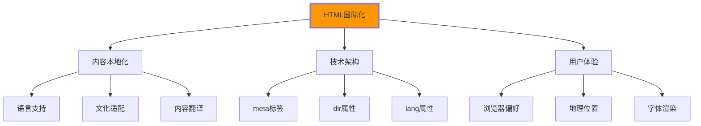

# 国际化i18n支持

## 🌍 HTML国际化基础

### 📊 国际化设计体系



## 🎯 完整的多语言网站

### 📋 多语言支持HTML结构

```html
<!DOCTYPE html>
<html lang="zh-CN" dir="ltr">
<head>
    <meta charset="UTF-8">
    <!-- 多语言Meta配置 -->
    <meta name="viewport" content="width=device-width, initial-scale=1.0">
    
    <!-- 基础语言设置 -->
    <meta http-equiv="Content-Language" content="zh-CN">
    
    <!-- 可选语言 - hreflang标签 -->
    <meta name="google" content="notranslate">
    <link rel="alternate" hreflang="zh-CN" href="https://example.com/zh/">
    <link rel="alternate" hreflang="en-US" href="https://example.com/en/">
    <link rel="alternate" hreflang="ja-JP" href="https://example.com/ja/">
    <link rel="alternate" Hreflang="x-default" href="https://example.com/en/">
    
    <!-- RSS多语言支持 -->
    <link rel="alternate" type="application/rss+xml" 
          hreflang="zh-CN" 
          href="/rss/zh.xml">
    <link rel="alternate" type="application/rss+xml" 
          hreflang="en-US" 
          href="/rss/en.xml">
    
    <title data-i18n="site.title">我的网站</title>
</head>

<body>
    <!-- 语言切换器 -->
    <nav class="language-selector" role="navigation" aria-label="语言选择">
        <h2 class="sr-only">选择语言</h2>
        <ul>
            <li><a href="/zh/" hreflang="zh-CN" lang="zh-CN" class="language-link active">中文</a></li>
            <li><a href="/en/" hreflang="en-US" lang="en-US" class="language-link">English</a></li>
            <li><a href="/ja/" hreflang="ja-JP" lang="ja-JP" class="language-link">日本語</a></li>
        </ul>
    </nav>

    <!-- RTL支持演示 -->
    <section class="demo-section" dir="auto">
        <h2 data-i18n="demo.title">文本方向演示</h2>
        
        <!-- LTR文本 -->
        <div dir="ltr">
            <p>This is left-to-right text: Hello World!</p>
        </div>
        
        <!-- RTL文本 -->
        <div dir="rtl">
            <p>هذا نص من اليمين إلى اليسار</p>
        </div>
        
        <!-- 自动检测方向 -->
        <div dir="auto">
            <p>Auto direction detection: مرحباHelloخوش آمدید</p>
        </div>
    </section>
</body>
</javascript>
    // 🛠️ 国际化JavaScript实现
    class I18nManager {
        constructor() {
            this.currentLocale = 'zh-CN';
            this.translations = new Map();
            this.fallbackLocale = 'en-US';
            this.init();
        }
        
        init() {
            this.loadTranslations();
            this.detectLanguage();
            this.bindEvents();
        }
        
        async loadTranslations() {
            // 加载翻译文件
            const locales = ['zh-CN', 'en-US', 'ja-JP'];
            
            for ( const locale of locales) {
                try {
                    const response = await fetch(`/translations/${locale}.json`);
                    const translations = await response.json();
                    this.translations.set(locale, translations);
                } catch (error) {
                    console.warn(`Failed to load translations for ${locale}:`, error);
                }
            }
        }
        
        detectLanguage() {
            // 检测用户语言偏好
            const browserLang = navigator.language || navigator.userLanguage;
            const savedLang = localStorage.getItem('preferred-language');
            
            this.currentLocale = savedLang || browserLang || 'zh-CN';
            this.applyLocale();
        }
        
        t(key, params = {}) {
            const translation = this.getTranslation(key);
            return this.interpolate(translation, params);
        }
        
        getTranslation(key) {
            const localeData = this.translations.get(this.currentLocale);
            const fallbackData = this.translations.get(this.fallbackLocale);
            
            let value = this.getValueByPath(localeData, key);
            
            if (!value) {
                value = this.getValueByPath(fallbackData, key);
                console.warn(`Translation missing for key: ${key}`);
            }
            
            return value || key;
        }
        
        getValueByPath(obj, path) {
            return path.split('.').reduce((current, key) => {
                return current && current[key];
            }, obj);
        }
        
        interpolate(template, params) {
            return template.replace(/\{\{(\w+)\}\}/g, (match, key) => {
                return params[key] || match;
            });
        }
        
        applyLocale() {
            // 更新HTML lang属性
            document.documentElement.lang = this.currentLocale;
            
            // 更新dir属性
            const isRTL = ['ar', 'he', 'fa', 'ur'].includes(this.currentLocale.split('-')[0]);
            document.documentElement.dir = isRTL ? 'rtl' : 'ltr';
            
            // 更新所有data-i18n元素
            document.querySelectorAll('[data-i18n]').forEach(el => {
                const key = el.getAttribute('data-i18n');
                el.textContent = this.t(key);
            });
        }
        
        bindEvents() {
            // 语言切换
            document.querySelectorAll('.language-link').forEach(link => {
                link.addEventListener('click', (e) => {
                    e.preventDefault();
                    const locale = link.getAttribute('lang');
                    this.switchLanguage(locale);
                });
            });
        }
        
        switchLanguage(locale) {
            this.currentLocale = locale;
            localStorage.setItem('preferred-language', locale);
            this.applyLocale();
            
            // 通知其他组件语言已切换
            window.dispatchEvent(new CustomEvent('languageChanged', {
                detail: { locale }
            }));
        }
    }
    
    // 全局i18n实例
    window.i18n = new I18nManager();
</script>
</body>
</html>
```

---

**🔗 国际化支持深化**：
- 响应式设计：`[[04-7 响应式设计深度]]`
- 无障碍基础：`[[03-6 WCAG可访问性标准]]`
- 现代Web平台：`[[04-8 移动端适配策略]]`
