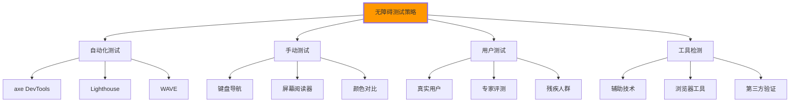

# 无障碍设计测试

## ♂️ 无障碍设计测试方法论

### 🎯 测试策略与维度

**全面的无障碍设计测试确保所有人能平等访问Web内容**：



## 🔧 自动化测试解决方案

### 💻 axe DevTools集成测试

```html
<!DOCTYPE html>
<html lang="zh-CN">
<head>
    <meta charset="UTF-8">
    <meta name="viewport" content="width=device-width, initial-scale=1.0">
    <title>无障碍设计测试页面</title>
    
    <!-- axe DevTools检测脚本 -->
    <script src="https://cdn.jsdelivr.net/npm/@axe-core/devtools@4.6.0/dist/index.min.js"></script>
    
    <style>
        /* 测试页面样式 */
        .test-container {
            max-width: 1200px;
            margin: 0 auto;
            padding: 2rem;
        }
        
        .test-section {
            margin: 3rem 0;
            padding: 2rem;
            border: 1px solid #e0e0e0;
            border-radius: 8px;
            background: #ffffff;
        }
        
        .issue-list {
            background: #f8f9fa;
            padding: 1rem;
            border-radius: 4px;
            margin-top: 1rem;
        }
        
        .issue-item {
            margin: 0.5rem 0;
            padding: 0.5rem;
            border-radius: 4px;
        }
        
        .issue-critical { background-color: #ffebee; color: #c62828; }
        .issue-serious { background-color: #fff3e0; color: #ef6c00; }
        .issue-moderate { background-color: #fff8e1; color: #f57f17; }
        .issue-minor { background-color: #e8f5e8; color: #2e7d32; }
        
        .test-controls {
            display: flex;
            gap: 1rem;
            margin: 1rem 0;
            flex-wrap: wrap;
        }
        
        .btn-test {
            background: #007cba;
            color: white;
            border: none;
            padding: 0.75rem 1.5rem;
            border-radius: 4px;
            cursor: pointer;
            font-size: 14px;
        }
        
        .btn-test:hover {
            background: #005a87;
        }
        
        .btn-test:disabled {
            background: #ccc;
            cursor: not-allowed;
        }
        
        .results-area {
            margin-top: 2rem;
            padding: 1rem;
            border: 1px solid #ddd;
            border-radius: 4px;
            background: #f9f9f9;
            min-height: 200px;
        }
        
        /* 隐藏屏幕阅读器专用元素 */
        .sr-only {
            position: absolute;
            width: 1px;
            height: 1px;
            padding: 0;
            margin: -1px;
            overflow: hidden;
            clip: rect(0, 0, 0, 0);
            white-space: nowrap;
            border: 0;
        }
        
        /* 高对比度模式测试 */
        @media (prefers-contrast: high) {
            .test-section {
                border: 2px solid currentColor;
            }
        }
        
        /* 减少动画测试 */
        @media (prefers-reduced-motion: reduce) {
            * {
                animation-duration: 0.01ms !important;
                animation-iteration-count: 1 !important;
                transition-duration: 0.01ms !important;
            }
        }
    </style>
</head>

<body>
    <!-- 🎯 无障碍测试控制面板 -->
    <header class="test-controls">
        <h1>无障碍设计测试工具</h1>
        <nav aria-label="测试工具导航">
            <div role="group" aria-label="测试功能">
                <button class="btn-test" onclick="runAxeAudit()" id="axe-btn">
                    <svg width="16" height="16" style="margin-right: 8px;">
                        <use href="#icon-accessibility"></use>
                    </svg>
                    axe Core 检测
                </button>
                
                <button class="btn-test" onclick="runLighthouseAudit()" id="lighthouse-btn">
                    <svg width="16" height="16" style="margin-right: 8px;">
                        <use href="#icon-lighthouse"></use>
                    </svg>
                    Lighthouse 检测
                </button>
                
                <button class="btn-test" onclick="runKeyboardTest()" id="keyboard-btn">
                    <svg width="16" height="16" style="margin-right: 8px;">
                        <use href="#icon-keyboard"></use>
                    </svg>
                    键盘导航测试
                </button>
                
                <button class="btn-test" onclick="runColorContrastTest()" id="color-btn">
                    <svg width="16" height="16" style="margin-right: 8px;">
                        <use href="#icon-contrast"></use>
                    </svg>
                    颜色对比度测试
                </button>
                
                <button class="btn-test" onclick="runScreenReaderTest()" id="screen-reader-btn">
                    <svg width="16" height="16" style="margin-right: 8px;">
                        <use href="#icon-speaker"></use>
                    </svg>
                    屏幕阅读器测试
                </button>
                
                <button class="btn-test" onclick="generateReport()" id="report-btn">
                    <svg width="16" height="16" style="margin-right: 8px;">
                        <use href="#icon-report"></use>
                    </svg>
                    生成测试报告
                </button>
            </div>
        </nav>
    </header>

    <main class="test-container">
        <!-- 📋 测试结果展示区域 -->
        <section class="test-section">
            <h2>测试结果</h2>
            <div class="results-area" id="results-display">
                <p>点击上方按钮开始无障碍设计检测</p>
            </div>
        </section>

        <!-- 🔍 问题组件测试 -->
        <section class="test-section">
            <h2>问题组件测试区域</h2>
            <p>这里包含各种常见的无障碍设计问题，用于测试检测工具的效果。</p>
            
            <!-- ❌ 问题：缺少alt属性 -->
            <div class="issue-test">
                <h3>图片无障碍问题</h3>
                 <!-- 缺少alt属性 -->
                <p>上图缺少alt属性描述</p>
            </div>
            
            <!-- ❌ 问题：表单标签关联 -->
            <div class="issue-test">
                <h3>表单无障碍问题</h3>
                <form>
                    <p>用户名：</p> <!-- 标签不是<label>标签 -->
                    <input type="text" name="username">
                    
                    <label for="wrong-id">邮箱：</label>
                    <input type="email" id="different-id"> <!-- ID不匹配 -->
                    
                    <button type="submit">提交</button>
                </form>
            </div>
            
            <!-- ❌ 问题：颜色对比度 -->
            <div class="issue-test">
                <h3>颜色对比度问题</h3>
                <p style="color: #ccc; background: #fff;">
                    <span style="background: yellow;">黄色背景文字</span>
                    浅灰色文字在白色背景上（对比度不足）
                </p>
            </div>
            
            <!-- ❌ 问题：键盘访问性 -->
            <div class="issue-test">
                <h3>键盘访问性问题</h3>
                <button style="background: none; border: none; cursor: pointer;">
                    点击我
                </button>
                <span style="color: blue; cursor: pointer;" onclick="alert('不正确的点击事件')">
                    模拟链接的span（无法键盘访问）
                </span>
            </div>
            
            <!-- ❌ 问题：语义化问题 -->
            <div class="issue-test">
                <h3>语义化问题</h3>
                <div onclick="window.open('#')"> <!-- 应该使用<a>标签 -->
                    点击此文本前往详情页面
                </div>
                <div class="button">确认按钮</div> <!-- 应该是<button>标签 -->
            </div>
            
            <!-- ❌ 问题：ARIA使用错误 -->
            <div class="issue-test">
                <h3>ARIA使用问题</h3>
                <button aria-hidden="true">隐藏按钮</button>
                
                <input type="text" aria-label="用户名" aria-describedby=""> <!-- 空的aria-describedby -->
            </div>
        </section>

        <!-- ✅ 良好实践示例 -->
        <section class="test-section">
            <h2>良好实践示例</h2>
            <p>以下是无障碍设计的良好实践示例，可以作为对比参考。</p>
            
            <!-- ✅ 正确：图片无障碍 -->
            <div class="good-example">
                <h3>图片无障碍示例</h3>
                
                <p>图片包含了详细的alt属性描述</p>
            </div>
            
            <!-- ✅ 正确：表单无障碍 -->
            <div class="good-example">
                <h3>表单无障碍示例</h3>
                <form>
                    <label for="username-field">用户名：</label>
                    <input type="text" 
                           id="username-field" 
                           name="username"
                           aria-describedby="username-help"
                           required>
                    <div id="username-help">请输入3-20个字符的用户名</div>
                    
                    <fieldset>
                        <legend>用户类型</legend>
                        <label>
                            <input type="radio" name="user-type" value="student">
                            学生
                        </label>
                        <label>
                            <input type="radio" name="user-type" value="teacher">
                            教师
                        </label>
                    </fieldset>
                    
                    <button type="submit">提交信息</button>
                </form>
            </div>
            
            <!-- ✅ 正确：颜色对比度 -->
            <div class="good-example">
                <h3>颜色对比度示例</h3>
                <p style="color: #333; background: #fff;">
                    <span style="background: #000; color: #fff; padding: 2px 4px;">黑白高对比度</span>
                    深色背景配高对比度颜色
                </p>
            </div>
            
            <!-- ✅ 正确：键盘访问性 -->
            <div class="good-example">
                <h3>键盘访问性示例</h3>
                <nav aria-label="快捷导航">
                    <a href="/courses" tabindex="0">课程页面</a>
                    <button type="button">功能按钮</button>
                </nav>
            </div>
            
            <!-- ✅ 正确：语义化结构 -->
            <div class="good-example">
                <h3>语义化结构示例</h3>
                <article>
                    <header>
                        <h1>文章标题</h1>
                        <time datetime="2024-01-15">2024年1月15日</time>
                    </header>
                    <main>
                        <p>文章内容...</p>
                    </main>
                    <footer>
                        <p>版权信息</p>
                    </footer>
                </article>
            </div>
        </section>
    </main>

    <!-- JavaScript无障碍测试实现 -->
    <script>
        // 🧪 无障碍测试管理器
        class AccessibilityTestManager {
            constructor() {
                this.tests = [];
                this.results = {
                    passes: 0,
                    failures: 0,
                    warnings: 0
                };
                this.init();
            }
            
            init() {
                this.setupEventListeners();
                this.loadAxeCore();
            }
            
            loadAxeCore() {
                // 动态加载axe-core
                if (typeof axe === 'undefined') {
                    const script = document.createElement('script');
                    script.src = 'https://cdn.jsdelivr.net/npm/axe-core@4.6.0/axe.min.js';
                    script.onload = () => {
                        console.log('axe-core 已加载');
                    };
                    document.head.appendChild(script);
                }
            }
            
            setupEventListeners() {
                // 键盘快捷键测试
                document.addEventListener('keydown', (e) => {
                    if (e.altKey && e.key === 'a') {
                        e.preventDefault();
                        this.runAllTests();
                    }
                });
            }
            
            // 🎯 axe Core测试
            async runAxeAudit() {
                if (typeof axe === 'undefined') {
                    this.showError('axe-core 尚未加载完成，请稍后重试');
                    return;
                }
                
                const resultsDisplay = document.getElementById('results-display');
                resultsDisplay.innerHTML = '<p>正在进行 axe-core 检测...</p>';
                
                try {
                    const results = await axe.run();
                    this.displayAxEresults(results);
                } catch (error) {
                    this.showError('axe-core 检测失败: ' + error.message);
                }
            }
            
            displayAxEresults(results) {
                const display = document.getElementById('results-display');
                const violations = results.violations;
                const passes = results.passes;
                
                let html = `
                    <h3>axe Core 检测结果</h3>
                    <div class="summary">
                        <p><strong>检测完成</strong></p>
                        <p>✅ 通过: ${passes.length} 项</p>
                        <p>❌ 违规: ${violations.length} 项</p>
                    </div>
                `;
                
                if (violations.length > 0) {
                    html += '<h4>发现问题：', </h4>';
                    vulations.forEach((violation, index) => {
                        html += `
                            <div class="issue-item issue-${this.getSeverityClass(violation.impact)}">
                                <h5>${index + 1}. ${violation.description}</h5>
                                <p><strong>影响:</strong> ${violation.impact}</p>
                                <p><strong>帮助:</strong> ${violation.help}</p>
                                <p><strong>影响的元素:</strong> ${violation.nodes.length} 个</p>
                                <details>
                                    <summary>查看具体元素</summary>
                                    <ul>
                                        ${violation.nodes.map(node => `<li>${node.target.join(' → ')}: ${node.failureSummary}</li>`).join('')}
                                    </ul>
                                </details>
                            </div>
                        `;
                    });
                }
                
                if (passes.length > 0) {
                    html += '<h4>通过的检测：</h4>';
                    html += `<ul>`;
                    passes.forEach(pass => {
                        html += `<li>✅ ${pass.description} (${pass.nodes.length} 个元素)</li>`;
                    });
                    html += '</ul>';
                }
                
                display.innerHTML = html;
                
                // 更新统计
                this.results.failures += violations.length;
                this.results.passes += passes.length;
            }
            
            // 🎯 Lighthouse测试
            async runLighthouseAudit() {
                const display = document.getElementById('results-display');
                display.innerHTML = '<p>请注意：Lighthouse需要在Chrome DevTools中运行</p>';
                
                // 检查是否在Chrome DevTools环境中
                if (typeof chrome !== 'undefined' && chrome.runtime && chrome.runtime.id) {
                    display.innerHTML += '<p>检测到DevTools环境，可以手动运行Lighthouse</p>';
                    
                    // 提供手动运行指导
                    const instructions = `
                        <h4>手动运行Lighthouse指南：</h4>
                        <ol>
                            <li>按 F12 打开Chrome DevTools</li>
                            <li>切换到 "Lighthouse" 标签</li>
                            <li>选择 "Accessibility" 检查项</li>
                            <li>点击 "Generate report"</li>
                            <li>查看无障碍得分和建议</li>
                        </ol>
                        
                        <h4>关键测试指标：</h4>
                        <ul>
                            <li>颜色对比度 (color-contrast)</li>
                            <li>图像替代文本 (image-alt)</li>
                            <li>标签名称 (label)</li>
                            <li>链接名称 (link-name)</li>
                            <li>表单标签 (form-field-multiple-labels)</li>
                        </ul>
                    `;
                    
                    display.innerHTML += instructions;
                } else {
                    display.innerHTML += `
                        <h4>当前环境无法自动运行Lighthouse</h4>
                        <p>请访问以下在线工具：</p>
                        <ul>
                            <li><a href="https://developers.google.com/speed/pagespeed/insights/" target="_blank">PageSpeed Insights</a></li>
                            <li><a href="https://web.dev/measure/" target="_blank">Web.dev Measure</a></li>
                            <li><a href="https://wave.webaim.org/" target="_blank">WAVE Web Accessibility Evaluator</a></li>
                        </ul>
                    `;
                }
            }
            
            // 🎯 键盘导航测试
            runKeyboardTest() {
                const display = document.getElementById('results-display');
                const interactiveElements = document.querySelectorAll(
                    'a, button, input, select, textarea, [tabindex], [onclick]'
                );
                
                let html = '<h3>键盘导航测试结果</h3>';
                html += '<div class="keyboard-test-info">';
                html += '<p><strong>测试说明：</strong></p>';
                html += '<p>按 Tab 键访问页面中的交互元素</p>';
                html += '</div>';
                
                html += '<h4>可聚焦元素列表：</h4><ul>';
                interactiveElements.forEach((element, index) => {
                    const tagName = element.tagName.toLowerCase();
                    const id = element.id ? `#${element.id}` : '';
                    const className = element.className ? `.${element.className}` : '';
                    const type = element.type ? `[type="${element.type}"]` : '';
                    
                    html += `
                        <li>
                            ${index + 1}. ${tagName}${id}${className}${type}
                            ${element.textContent ? ` - "${element.textContent.trim().substring(0, 30)}..."` : ''}
                        </li>
                    `;
                });
                html += '</ul>';
                
                html += `
                    <h4>测试快捷键：</h4>
                    <ul>
                        <li><kbd>Tab</kbd> - 下一个焦点元素</li>
                        <li><kbd>Shift + Tab</kbd> - 上一个焦点元素</li>
                        <li (<kbd>Enter</kbd> - 激活链接或按钮</li>
                        <li><kbd>Space</kbd> - 激活按钮</li>
                        <li><kbd>Escape</kbd> - 关闭模式框或菜单</li>
                    </ul>
                `;
                
                display.innerHTML = html;
                
                // 启动键盘焦点可视化
                this.enableKeyboardFocusVisualization();
            }
            
            enableKeyboardFocusVisualization() {
                // 添加焦点可视化样式
                const style = document.createElement('style');
                style.textContent = `
                    :focus {
                        outline: 3px solid #ff6b35 !important;
                        outline-offset: 2px !important;
                        box-shadow: 0 0 0 5px rgba(255, 107, 53, 0.3) !important;
                    }
                `;
                document.head.appendChild(style);
                
                // 添加高亮效果
                document.addEventListener('focusin', (e) => {
                    e.target.style.border = '2px solid #ff6b35';
                });
                
                document.addEventListener('focusout', (e) => {
                    e.target.style.border = '';
                });
            }
            
            // 🎯 颜色对比度测试
            runColorContrastTest() {
                const display = document.getElementById('results-display');
                
                // 检测页面中的文本元素
                const textElements = document.querySelectorAll('p, span, div, h1, h2, h3, h4, h5, h6, label, button');
                const contrastIssues = [];
                
                textElements.forEach(element => {
                    const styles = window.getComputedStyle(element);
                    const color = styles.color;
                    const backgroundColor = styles.backgroundColor || styles.background;
                    
                    if (color !== 'rgb(0, 0, 0)' && color !== 'rgb(255, 255, 255)') {
                        const contrast = this.calculateContrast(color, backgroundColor);
                        
                        if (contrast < 4.5) {
                            contrastIssues.push({
                                element: element,
                                text: element.textContent.substring(0, 50),
                                contrast: contrast.toFixed(2),
                                color,
                                backgroundColor,
                                severity: contrast < 3 ? 'critical' : 'serious'
                            });
                        }
                    }
                });
                
                let html = '<h3>颜色对比度测试结果</h3>';
                
                if (contrastIssues.length === 0) {
                    html += '<p>✅ 所有文本元素都通过了颜色对比度检测</p>';
                } else {
                    html += `<p>❌ 发现 ${contrastIssues.length} 个对比度问题：</p>`;
                    
                    contrastIssues.forEach((issue, index) => {
                        html += `
                            <div class="issue-item issue-${issue.severity}">
                                <h5>问题 ${index + 1}</h5>
                                <p><strong>对比度:</strong> ${issue.contrast}:1 (要求 ≥ 4.5:1)</p>
                                <p><strong>文本:</strong> "${issue.text}..."</p>
                                <p><strong>前景色:</strong> ${issue.color}</p>
                                <p><strong>背景色:</strong> ${issue.backgroundColor}</p>
                                <button onclick="highlightElement(this)" 
                                        data-selector="[data-contrast-issue='${index}']">
                                    高亮元素
                                </button>
                            </div>
                        `;
                        
                        // 标记问题元素
                        issue.element.setAttribute('data-contrast-issue', index);
                        issue.element.style.outline = '2px dashed red';
                    });
                }
                
                html += `
                    <h4>WCAG对比度标准：</h4>
                    <ul>
                        <li><strong>AA级别:</strong> 正常文本 4.5:1，大文本 3:1</li>
                        <li><strong>AAA级别:</strong> 正常文本 7:1，大文本 4.5:1</li>
                    </ul>
                    
                    <h4>建议的工具：</h4>
                    <ul>
                        <li><a href="https://webaim.org/resources/contrastchecker/" target="_blank">WebAIM Contrast Checker</a></li>
                        <li><a href="https://colorable.jxnblk.com/" target="_blank">Colorable</a></li>
                        <li><a href="https://contrast-ratio.com/" target="_blank">Contrast Ratio</a></li>
                    </ul>
                `;
                
                display.innerHTML = html;
            }
            
            calculateContrast(color1, color2) {
                const rgb1 = this.parseColor(color1);
                const rgb2 = this.parseColor(color2);
                
                const luminance1 = this.getLuminance(rgb1);
                const luminance2 = this.getLuminance(rgb2);
                
                const lighter = Math.max(luminance1, luminance2);
                const darker = Math.min(luminance1, luminance2);
                
                return (lighter + 0.05) / (darker + 0.05);
            }
            
            parseColor(color) {
                const temp = document.createElement('div');
                temp.style.color = color;
                document.body.appendChild(temp);
                const computed = window.getComputedStyle(temp);
                const rgb = computed.color.match(/\d+/g);
                document.body.removeChild(temp);
                
                return {
                    r: parseInt(rgb[0]),
                    g: parseInt(rgb[1]),
                    b: parseInt(rgb[2])
                };
            }
            
            getLuminance(rgb) {
                const [r, g, b] = [rgb.r, rgb.g, rgb.b].map(c => {
                    c = c / 255;
                    return c <= 0.03928 ? c / 12.92 : Math.pow((c + 0.055) / 1.055, 2.4);
                });
                
                return 0.2126 * r + 0.7152 * g + 0.0722 * b;
            }
            
            // 🎯 屏幕阅读器测试
            runScreenReaderTest() {
                const display = document.getElementById('results-display');
                
                let html = '<h3>屏幕阅读器测试</h3>';
                html += `
                    <div class="screen-reader-instructions">
                        <h4>测试说明：</h4>
                        <p>以下测试模拟屏幕阅读器如何读取页面内容</p>
                        
                        <h4>阅读顺序检查：</h4>
                        <button onclick="simulateScreenReader()" class="btn-test">
                            开始屏幕阅读器模拟
                        </button>
                    </div>
                `;
                
                // 检查页面结构
                const headings =Array.from(document.querySelectorAll('h1, h2, h3, h4, h5, h6')).map(h => ({
                    level: parseInt(h.tagName.charAt(1)),
                    text: h.textContent.trim(),
                    id: h.id || null
                }));
                
                html += '<h4>页面的标题结构：', html += '<ul>', headings.forEach(heading => {
                    html += `<li>H${heading.level}: ${heading.text} ${heading.id ? `(ID: ${heading.id})` : ''}</li>`;
                });
                html += '</ul>';
                
                // 检查链接和按钮
                const interactiveElements = document.querySelectorAll('a, button, [role="button"], input, select, textarea');
                html += '<h4>交互元素检查：', html += '<ul>';
                
                interactiveElements.forEach(element => {
                    const tagName = element.tagName.toLowerCase();
                    const accessibleName = this.getAccessibleName(element);
                    const hasLabel = element.getAttribute('aria-label') || 
                                   element.getAttribute('title') ||
                                   accessibleName ||
                                   element.textContent.trim();
                    
                    html += `
                        <li>
                            ${tagName}: ${hasLabel ? hasLabel : '<span style="color: red;">❌ 缺少可访问名称</span>'}
                            ${element.hasAttribute('aria-hidden') ? '<span style="color: orange;">⚠️ 被隐藏</span>' : ''}
                        </li>
                    `;
                });
                html += '</ul>';
                
                display.innerHTML = html;
            }
            
            getAccessibleName(element) {
                // 获取元素的可访问名称
                if (element.getAttribute('aria-label')) {
                    return element.getAttribute('aria-label');
                }
                
                if (element.getAttribute('title')) {
                    return element.getAttribute('title');
                }
                
                const label = element.closest('label');
                if (label) {
                    return label.textContent.trim();
                }
                
                if (element.getAttribute('aria-labelledby')) {
                    const labelledBy = document.getElementById(element.getAttribute('aria-labelledby'));
                    return labelledBy ? labelledBy.textContent.trim() : '';
                }
                
                return element.textContent.trim();
            }
            
            // 🎯 生成测试报告
            generateReport() {
                const reportData = {
                    timestamp: new Date().toISOString(),
                    url: window.location.href,
                    title: document.title,
                    results: this.results,
                    testedFeatures: [
                        'axe-core检测',
                        '键盘导航',
                        '颜色对比度',
                        '屏幕阅读器访问',
                        '语义化标记'
                    ]
                };
                
                const reportHtml = `
                    <div class="accessibility-report">
                        <h2>无障碍设计测试报告</h2>
                        
                        <div class="report-metadata">
                            <p><strong>测试时间:</strong> ${new Date().toLocaleString()}</p>
                            <p><strong>测试页面:</strong> ${document.title}</p>
                            <p><strong>页面URL:</strong> ${window.location.href}</p>
                        </div>
                        
                        <div class="report-summary">
                            <h3>测试总结</h3>
                            <p>✅ 通过: ${this.results.passes} 项</p>
                            <p>❌ 失败: ${this.results.failures} 项</p>
                            <p>⚠️ 警告: ${this.results.warnings} 项</p>
                        </div>
                        
                        <div class="report-recommendations">
                            <h3>改进建议</h3>
                            <ul>
                                <li>确保所有图片都包含有意义的alt属性</li>
                                <li>为表单元素提供适当的标签关联</li>
                                <li>确保颜色对比度满足WCAG标准</li>
                                <li>使用语义化的HTML标记</li>
                                <li>提供键盘导航支持</li>
                                <li>测试屏幕阅读器兼容性</li>
                            </ul>
                        </div>
                        
                        <div class="report-actions">
                            <button onclick="downloadReport()" class="btn-test">下载报告</button>
                            <button onclick="printReport()" class="btn-test">打印报告</button>
                        </div>
                    </div>
                `;
                
                document.getElementById('results-display').innerHTML = reportHtml;
                
                // 保存报告数据到全局变量
                window.accessibilityReportData = reportData;
            }
            
            getSeverityClass(impact) {
                switch(impact) {
                    case 'critical': return 'critical';
                    case 'serious': return 'serious';
                    case 'moderate': return 'moderate';
                    case 'minor': return 'minor';
                    default: return 'moderate';
                }
            }
            
            showError(message) {
                document.getElementById('results-display').innerHTML = 
                    `<div class="issue-item issue-critical"><strong>错误:</strong> ${message}</div>`;
            }
            
            async runAllTests() {
                console.log('开始运行所有无障碍测试...');
                
                await this.runAxeAudit();
                await new Promise(resolve => setTimeout(resolve, 1000));
                
                this.runLighthouseAudit();
                await new Promise(resolve => setTimeout(resolve, 1000));
                
                this.runKeyboardTest();
                await new Promise(resolve => setTimeout(resolve, 1000));
                
                this.runColorContrastTest();
                await new Promise(resolve => setTimeout(resolve, 1000));
                
                this.runScreenReaderTest();
            }
        }
        
        // 🎭 屏幕阅读器模拟
        function simulateScreenReader() {
            const elements = document.querySelectorAll('h1, h2, h3, h4, h5, h6, a, button, p, label');
            const voices = [];
            
            // 获取可用的语音合成接口
            if ('speechSynthesis' in window) {
                elements.forEach((element, index) => {
                    setTimeout(() => {
                        const utterance = new SpeechSynthesisUtterance(
                            `${element.tagName.toLowerCase()}. ${element.textContent.trim().substring(0, 100)}`
                        );
                        
                        utterance.rate = 0.8;
                        utterance.pitch = 1;
                        utterance.volume = 0.7;
                        
                        element.style.backgroundColor = 'yellow';
                        speechSynthesis.speak(utterance);
                        
                        utterance.onend = () => {
                            element.style.backgroundColor = '';
                        };
                    }, index * 2000);
                });
            } else {
                alert("您的浏览器不支持语音合成，无法执行屏幕阅读器模拟");
            }
        }
        
        // 🎯 元素高亮
        function highlightElement(button) {
            const selector = button.getAttribute('data-selector');
            const element = document.querySelector(selector);
            
            if (element) {
                element.style.outline = '3px solid #ff4444';
                element.style.outlineOffset = '2px';
                element.scrollIntoView({ behavior: 'smooth', block: 'center' });
                
                setTimeout(() => {
                    element.style.outline = '';
                    element.style.outlineOffset = '';
                }, 3000);
            }
        }
        
        // 📄 下载报告
        function downloadReport() {
            const reportContent = document.querySelector('.accessibility-report').outerHTML;
            const blob = new Blob([reportContent], { type: 'text/html' });
            
            const downloadLink = document.createElement('a');
            downloadLink.href = URL.createObjectURL(blob);
            downloadLink.download = `accessibility-report-${Date.now()}.html`;
            downloadLink.click();
        }
        
        // 🖨️ 打印报告
        function printReport() {
            const printWindow = window.open('', '_blank');
            printWindow.document.write(`
                <html>
                    <head>
                        <title>无障碍设计测试报告</title>
                        <style>
                            body { font-family: Arial, sans-serif; margin: 2rem; }
                            .report-metadata, .report-summary, .report-recommendations { margin: 1rem 0; }
                            h { border-bottom: 2px solid #333; }
                        </style>
                    </head>
                    <body>
                        ${document.querySelector('.accessibility-report').innerHTML}
                    </body>
                </html>
            `);
            printWindow.document.close();
            printWindow.print();
        }
        
        // 🚀 初始化测试管理器
        document.addEventListener('DOMContentLoaded', function() {
            window.accessibilityTestManager = new AccessibilityTestManager();
            console.log('无障碍测试管理器已初始化');
            console.log('快捷键: Alt + A 运行所有测试');
        });
        
        // 🔧 扩展函数用于其他页面测试
        window.runAccessibilityTests = function(options = {}) {
            const defaults = {
                runAxECore: true,
                runKeyboardTest: true,
                runColorTest: true,
                runScreenReaderTest: true,
                generateReport: false
            };
            
            const config = { ...defaults, ...options };
            
            if (window.accessibilityTestManager) {
                if (config.runAxECore) window.accessibilityTestManager.runAxeAudit();
                if (config.runKeyboardTest) window.accessibilityTestManager.runKeyboardTest();
                if (config.runColorTest) window.accessibilityTestManager.runColorContrastTest();
                if (config.runScreenReaderTest) window.accessibilityTestManager.runScreenReaderTest();
                if (config.generateReport) window.accessibilityTestManager.generateReport();
            }
        };
    </script>
</body>
</html>
```

---

**🔗 无障碍设计测试深化**：
- 键盘导航设计：`[[03-8 键盘导航设计]]`
- 屏幕阅读器适配：`[[03-9 屏幕阅读器适配]]`
- ARIA属性应用：`[[03-7 ARIA属性应用]]`
