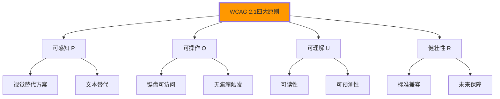

# WCAG可访问性标准

## ♿ WCAG 2.1标准框架

### 📋 可访问性的四大原则

**WCAG 2.1基于四大核心原则**：



| 原则 | 英文 | 核心要求 | HTML应用 |
|------|------|----------|----------|
| **可感知** | Perceivable | 信息多感官呈现 | alt属性、caption |
| **可操作** | Operable | 界面可操作 | tabindex、button |
| **可理解** | Understandable | 信息清晰易懂 | label、语言标记 |
| **健壮性** | Robust | 多渠道访问支持 | 标准化HTML |

## 🎯 可感知性原则实践

### 📍 视觉信息的替代方案

```html
<!-- ✅ 图片的文本替代 -->


<!-- ✅ 复杂图片的长描述 -->


<!-- ✅ 装饰性图片的空alt -->
  <!-- 纯装饰图片 -->

<!-- ✅ 图片画廊分组 -->
<div role="img" aria-labelledby="gallery-title" aria-describedby="gallery-info">
    <h3 id="gallery-title">产品展示图库</h3>
    <p id="gallery-info">包含10张产品图片，展示不同角度和细节</p>
    
    
    
</div>
```

### 🎵 多媒体可访问性

```html
<!-- ✅ 视频的文本替代 -->
<video controls width="800" height="600">
    <source src="demo.mp4" type="video/mp4">
    <source src="demo.webm" type="video/webm">
    
    <!-- 视频描述和说明 -->
    <track kind="descriptions" 
           src="video-descriptions.vtt" 
           srclang="zh-CN" 
           label="中文描述">
    
    <!-- 字幕支持 -->
    <track kind="captions" 
           src="video-captions.vtt" 
           srclang="zh-CN" 
           label="中文字暮">
    
    <!-- 降级文本 -->
    <p>您的浏览器不支持视频播放。
       <a href="/video-transcript.pdf">下载视频文字稿(PDF)</a>
    </p>
</video>

<!-- ✅ 音频的可访问性 -->
<audio controls>
    <source src="podcast.mp3" type="audio/mpeg">
    
    <!-- 音频描述 -->
    <track kind="descriptions" 
           src="podcast-descriptions.vtt" 
           srclang="zh-CN">
    
    <!-- 降级文本 -->
    <p>您的浏览器不支持音频播放。
       播客主要内容：
       <a href="/podcast-transcript.html">查看文字稿</a>
    </p>
</audio>
```

### 🎨 颜色和对比度

```css
/* ✅ WCAG AAA级对比度要求 */
/* 正常文本：对比度至少4.5:1 */
/* 大文本：对比度至少3:1 */

.text-primary {
    color: #212529;        /* 深色文字 */
    background-color: #ffffff;  /* 白色背景 */
    /* 对比度：21:1，远超WCAG AAA要求 */
}

.text-secondary {
    color: #6c757d;        /* 灰色文字 */
    background-color: #f8f9fa;  /* 浅灰背景 */
    /* 对比度：4.8:1，符合WCAG AA要求 */
}

/* ✅ 颜色不单一依赖信息传达 */
.link {
    color: #0066cc;        /* 颜色 */
    text-decoration: underline;  /* 下划线辅助 */
    font-weight: bold;     /* 粗体强调 */
}

.link:hover {
    color: #004499;
    text-decoration: none;
    border-bottom: 2px solid #004499;
}

/* ✅ 高对比度模式支持 */
@media (prefers-contrast: high) {
    .button {
        border: 2px solid currentColor;
        background-color: buttontext;
        color: buttonface;
    }
}
```

## 🎮 可操作性原则实施

### ⌨️ 键盘导航支持

```html
<!-- ✅ 键盘友好的控件 -->
<button type="button" 
        class="menu-toggle"
        aria-expanded="false"
        aria-controls="main-nav"
        tabindex="0">
    打开主菜单
</button>

<nav id="main-nav" 
     class="main-navigation" 
     aria-label="主导航菜单"
     aria-hidden="true">
    <ul role="menubar">
        <li role="none">
            <a href="/home" 
               role="menuitem" 
               tabindex="0"
               aria-current="page">首页</a>
        </li>
        <li role="none">
            <button role="menuitem" 
                    aria-expanded="false"
                    aria-haspopup="true">产品
            </button>
            <ul role="menu" aria-label="产品子菜单">
                <li role="none">
                    <a href="/software" role="menuitem">软件产品</a>
                </li>
                <li role="none">
                    <a href="/services" role="menuitem">服务产品</a>
                </li>
            </ul>
        </li>
    </ul>
</nav>

<script>
// 键盘导航增强
document.addEventListener('keydown', function(e) {
    const focusedElement = document.activeElement;
    
    // ESC键关闭菜单
    if (e.key === 'Escape') {
        const openMenu = document.querySelector('[aria-expanded="true"]');
        if (openMenu) {
            openMenu.setAttribute('aria-expanded', 'false');
            focusedElement.focus();
        }
    }
    
    // 箭头键导航
    if (e.key === 'ArrowDown') {
        e.preventDefault();
        const nextItem = focusedElement.parentElement.nextElementSibling;
        if (nextItem) {
            nextItem.querySelector('[role="menuitem"]').focus();
        }
    }
    
    if (e.key === 'ArrowUp') {
        e.preventDefault();
        const previousItem = focusedElement.parentElement.previousElementSibling;
        if (previousItem) {
            previousItem.querySelector('[role="menuitem"]').focus();
        }
    }
});
</script>
```

### 🚫 癫痫和动作敏感

```css
/* ✅ 运动敏感用户支持 */
@media (prefers-reduced-motion: reduce) {
    * {
        animation-duration: 0.01ms !important;
        animation-iteration-count: 1 !important;
        transition-duration: 0.01ms !important;
        scroll-behavior: auto !important;
    }
    
    .carousel {
        transform: none !important;
    }
}

/* ✅ 默认减少动画强度 */
.carousel-item {
    transition: opacity 0.3s ease-in-out;  /* 温和过渡 */
}

.carousel-item.active {
    opacity: 1;
}

.carousel-item:not(.active) {
    opacity: 0.8;
}

/* ✅ 暂停animation的控件 */
.button-pause-animation {
    position: fixed;
    top: 10px;
    right: 10px;
    z-index: 1000;
}

/* 暂停所有动画的脚本 */
function pauseAllAnimations() {
    const style = document.createElement('style');
    style.textContent = `
        *, *::before, *::after {
            animation-play-state: paused !important;
            animation-duration: 0.01ms !important;
        }
    `;
    document.head.appendChild(style);
}
```

## 📝 可理解性原则应用

### 🔤 语言和字符支持

```html
<!-- ✅ 页面语言标识 -->
<html lang="zh-CN">

<!-- ✅ 不同内容区域的语言标注 -->
<article lang="en-US">
    <h1>The Latest News</h1>
    <p>This content is in English...</p>
</article>

<article lang="zh-CN">
    <h1>最新消息</h1>
    <p>这是中文内容...</p>
</article>

<!-- ✅ 缩写词的完整形式 -->
<p>HTML5是最新的Web标准之一。</p>
<abbr title="HyperText Markup Language version 5">HTML5</abbr>

<!-- ✅ 数字的正确表达 -->
<p>会议时间：
    <time datetime="2024-01-15T14:30:00+08:00">
        2024年1月15日<time>14：30</time>
    </time>
</p>
```

### 📋 表单的可理解性

```html
<!-- ✅ 清晰的表单结构 -->
<form novalidate>
    <fieldset>
        <legend>用户注册信息</legend>
        
        <div class="form-group">
            <label for="username">用户名 <span class="required">*</span></label>
            <input type="text" 
                   id="username" 
                   name="username"
                   required
                   aria-describedby="username-help username-error"
                   aria-invalid="false">
            <div id="username-help" class="help-text">
                用户名长度4-20个字符，只能包含字母、数字和下划线
            </div>
            <div id="username-error" class="error-text" aria-live="polite">
                <!-- 错误消息将在此显示 -->
            </div>
        </div>
        
        <div class="form-group">
            <label for="password">密码 <span class="required">*</span></label>
            <input type="password" 
                   id="password" 
                   name="password"
                   required
                   aria-describedby="password-help">
            <div id="password-help" class="help-text">
                密码长度至少8位，包含大小写字母、数字和特殊字符
            </div>
        </div>
        
        <div class="form-group">
            <fieldset>
                <legend>兴趣爱好</legend>
                <input type="checkbox" id="interest-sports" name="interests" value="sports">
                <label for="interest-sports">运动健身</label>
                
                <input type="checkbox" id="interest-reading" name="interests" value="reading">
                <label for="interest-reading">阅读学习</label>
                
                <input type="checkbox" id="interest-travel"> 
                <label for="interest-travel">旅游旅行</label>
            </fieldset>
        </div>
    </fieldset>
    
    <div class="form-actions">
        <button type="submit">注册账号</button>
        <button type="reset">重置表单</button>
    </div>
</form>
```

## 🔧 健壮性原则实现

### 📱 多设备兼容性

```html
<!-- ✅ 渐进增强的HTML结构 -->
<form class="registration-form">
    <!-- 基础表单功能 -->
    <div class="form-field">
        <label for="email">邮箱地址</label>
        <input type="email" id="email" name="email" required>
    </div>
    
    <!-- 增强功能 -->
    <div class="form-check">
        <input type="checkbox" id="newsletter">
        <label for="newsletter">订阅邮件</label>
    </div>
</form>

<script>
// ✅ 功能检测和渐进增强
function enhanceFormFunctionality() {
    // 检测现代浏览器功能
    if ('fetch' in window) {
        // 使用Fetch API
        enhanceWithFetch();
    } else if ('XMLHttpRequest' in window) {
        // 使用传统AJAX
        enhanceWithAjax();
    }
    
    // 检测设备能力
    if ('ontouchstart' in window) {
        document.body.classList.add('touch-device');
    }
    
    // 检测连接速度
    if (navigator.connection) {
        const connection = navigator.connection;
        if (connection.effectiveType === 'slow-2g' || 
            connection.effectiveType === '2g') {
            document.body.classList.add('slow-connection');
        }
    }
}

function enhanceWithFetch() {
    const forms = document.querySelectorAll('form');
    forms.forEach(form => {
        form.addEventListener('submit', async function(e) {
            e.preventDefault();
            
            const formData = new FormData(form);
            const response = await fetch(form.action, {
                method: 'POST',
                body: formData
            });
            
            if (response.ok) {
                showSuccessMessage('提交成功！');
            } else {
                showErrorMessage('提交失败，请重试。');
            }
        });
    });
}
</script>
```

## 📊 可访问性测试和验证

### 🔍 自动化检测工具

```javascript
// ✅ axe-core可访问性检测
// 在开发工具中集成axe检测
function runAccessibilityAudit() {
    // 加载axe-core库
    const script = document.createElement('script');
    script.src = 'https://cdn.jsdelivr.net/npm/axe-core@4.6.0/axe.min.js';
    script.onload = function() {
        axe.run(function (err, results) {
            if (err) {
                console.error('Axe检测出错:', err);
                return;
            }
            
            console.log('可访问性检测结果:', results);
            
            // 生成检测报告
            generateAccessibilityReport(results);
        });
    };
    document.head.appendChild(script);
}

function generateAccessibilityReport(results) {
    const report = {
        violations: results.violations.length,
        incomplete: results.incomplete.length,
        passes: results.passes.length
    };
    
    console.table(results.violations.map(violation => ({
        id: violation.id,
        impact: violation.impact,
        description: violation.description,
        nodes: violation.nodes.length
    })));
}

// ✅ 手动测试清单
const accessibilityTestChecklist = {
    keyboard: {
        description: "键盘导航测试",
        tests: [
            "所有功能都可以通过键盘访问",
            "Tab键顺序逻辑合理",
            "焦点指示器清晰可见",
            "ESC键可关闭模态对话框"
        ]
    },
    screenReader: {
        description: "屏幕阅读器测试",
        tests: [
            "重要信息通过屏幕阅读器可以获取",
            "表单标签正确关联",
            "图片有适当的alt文本",
            "表格有标题和描述"
        ]
    },
    colorContrast: {
        description: "颜色对比度测试",
        tests: [
            "正常文字对比度至少4.5:1",
            "大文字对比度至少3:1",
            "不使用颜色作为唯一的信息传达方式",
            "在灰度模式下信息依然清晰"
        ]
    }
};
```

### 🎯 用户体验测试

```html
<!-- ✅ 移动端可访问性增强 -->
<meta name="viewport" content="width=device-width, initial-scale=1.0, user-scalable=yes">

<style>
/* ✅ 触摸目标最小尺寸44px */
.button, .clickable-item {
    min-height: 44px;
    min-width: 44px;
    padding: 12px 16px;
}

/* ✅ 焦点状态清晰明显 */
button:focus, 
input:focus, 
a:focus {
    outline: 2px solid #0066cc;
    outline-offset: 2px;
}

/* ✅ 高对比度模式支持 */
@media (prefers-contrast: high) {
    .primary-button {
        border: 2px solid currentColor;
        background-color: buttontext;
        color: buttonface;
    }
}
</style>
```

---

**🔗 可访问性深入学习**：
- ARIA属性应用：`[[03-7 ARIA属性应用]]`
- 键盘导航：`[[03-8 键盘导航设计]]`
- 屏幕阅读器：`[[03-9 屏幕阅读器适配]]`
