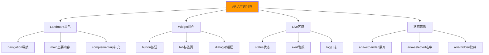

# ARIA属性应用

## ♿ ARIA技术基础架构

### 📊 ARIA的核心作用机制

**ARIA为HTML元素提供可访问性增强功能**：



## 🎯 Landmark角色应用

### 📍 页面结构语义化

```html
<!-- ✅ 完整的ARIA Landmark结构 -->
<body>
    <!-- Banner区域 -->
    <header role="banner">
        <div class="site-header">
            <h1>网站标题</h1>
            
            <!-- 主导航为navigation landmark -->
            <nav role="navigation" aria-label="主导航">
                <ul>
                    <li><a href="/">首页</a></li>
                    <li><a href="/products">产品</a></li>
                    <li><a href="/about">关于我们</a></li>
                    <li><a href="/contact">联系我们</a></li>
                </ul>
            </nav>
        </div>
    </header>
    
    <!-- Search区域 -->
    <aside role="search" aria-label="全站搜索">
        <form>
            <label for="search-input">搜索</label>
            <input type="search" id="search-input" name="q">
            <button type="submit">搜索</button>
        </form>
    </aside>
    
    <!-- 主要内容区域 -->
    <main role="main">
        <h1>页面主标题</h1>
        
        <!-- 文章内容 -->
        <article role="article" aria-labelledby="article-title">
            <header>
                <h2 id="article-title">文章标题</h2>
                <time datetime="2024-01-15">2024年1月15日</time>
            </header>
            
            <div class="article-content">
                <p>文章内容...</p>
                
                <!-- 侧边栏信息 -->
                <aside role="complementary" aria-label="相关链接">
                    <h3>相关阅读</h3>
                    <ul>
                        <li><a href="/related1">相关文章一</a></li>
                        <li><a href="/related2">相关文章二</a></li>
                    </ul>
                </aside>
            </div>
        </article>
        
        <!-- 评论区域 -->
        <section role="region" aria-labelledby="comments-heading">
            <h2 id="comments-heading">用户评论</h2>
            <div class="comments">
                <!-- 评论列表 -->
            </div>
        </section>
    </main>
    
    <!-- 页脚 -->
    <footer role="contentinfo">
        <div class="site-footer">
            <p>&copy; 2024 网站版权所有</p>
            
            <!-- 辅助导航 -->
            <nav role="navigation" aria-label="辅助导航">
                <ul>
                    <li><a href="/privacy">隐私政策</a></li>
                    <li><a href="/terms">使用条款</a></li>
                    <li><a href="/sitemap">网站地图</a></li>
                </ul>
            </nav>
        </div>
    </footer>
</body>
```

## 🔧 Widget组件ARIA应用

### 🎮 交互式组件可访问性

```html
<!-- ✅ 下拉菜单ARIA实现 -->
<nav role="menubar" aria-label="产品菜单">
    <div role="none">
        <button role="menuitem" 
                aria-haspopup="true"
                aria-expanded="false"
                aria-controls="products-submenu"
                id="products-trigger">
            产品
            <svg aria-hidden="true" class="dropdown-icon">
                <use href="#icon-arrow-down"></use>
            </svg>
        </button>
        
        <ul role="menu" 
            id="products-submenu"
            aria-labelledby="products-trigger"
            aria-hidden="true">
            <li role="none">
                <a href="/web-development" role="menuitem">Web开发</a>
            </li>
            <li role="none">
                <a href="/mobile-apps" role="menuitem">移动应用</a>
            </li>
            <li role="none">
                <a href="/enterprise-solutions" role="menuitem">企业解决方案</a>
            </li>
        </ul>
    </div>
</ul>

<script>
// 下拉菜单的交互逻辑
document.addEventListener('DOMContentLoaded', function() {
    const triggers = document.querySelectorAll('[role="menuitem"][aria-haspopup]');
    
    triggers.forEach(trigger => {
        const submenu = document.getElementById(trigger.getAttribute('aria-controls'));
        
        trigger.addEventListener('click', function() {
            const isExpanded = trigger.getAttribute('aria-expanded') === 'true';
            
            // 关闭所有其他子菜单
            triggers.forEach(t => {
                if (t !== trigger) {
                    t.setAttribute('aria-expanded', 'false');
                    document.getElementById(t.getAttribute('aria-controls')).setAttribute('aria-hidden')) 'true');
                }
            });
            
            // 切换当前子菜单
            trigger.setAttribute('aria-expanded', !isExpanded);
            submenu.setAttribute('aria-hidden', isExpanded);
        });
        
        // 键盘导航支持
        trigger.addEventListener('keydown', function(e) {
            switch(e.key) {
                case 'ArrowDown':
                    e.preventDefault();
                    if (trigger.getAttribute('aria-expanded') === 'false') {
                        trigger.click();
                    }
                    const firstSubmenuItem = submenu.querySelector('[role="menuitem"]');
                    if (firstSubmenuItem) firstSubmenuItem.focus();
                    break;
                    
                case 'ArrowRight':
                    e.preventDefault();
                    if (trigger.getAttribute('aria-expanded') === 'false') {
                        trigger.click();
                    }
                    break;
            }
        });
        
        // 子菜单键盘导航
        submenu.addEventListener('keydown', function(e) {
            const items = Array.from(submenu.querySelectorAll('[role="menuitem"]'));
            const currentIndex = items.indexOf(document.activeElement);
            
            switch(e.key) {
                case 'ArrowDown':
                    e.preventDefault();
                    const nextIndex = (currentIndex + 1) % items.length;
                    items[nextIndex].focus();
                    break;
                    
                case 'ArrowUp':
                    e.preventDefault();
                    const prevIndex = currentIndex === 0 ? items.length - 1 : currentIndex - 1;
                    items[prevIndex].focus();
                    break;
                    
                case 'ArrowLeft':
                case 'Escape':
                    e.preventDefault();
                    trigger.click();
                    trigger.focus();
                    break;
            }
        });
    });
    
    // 点击外部关闭菜单
    document.addEventListener('click', function(e) {
        if (!e.target.closest('[aria-haspopup="true"]') && !e.target.closest('[role="menu"]')) {
            triggers.forEach(trigger => {
                trigger.setAttribute('aria-expanded', 'false');
                document.getElementById(trigger.getAttribute('aria-controls')).setAttribute('aria-hidden', 'true');
            });
        }
    });
});
</script>
```

### 📋 标签页Tab ARIA

```html
<!-- ✅ 标签页组件ARIA实现 -->
<div class="tab-container">
    <div role="tablist" aria-label="产品特性选项">
        <button role="tab" 
                aria-selected="true"
                aria-controls="tab1-panel"
                id="tab1"
                tabindex="0">
            基础功能
        </button>
        
        <button role="tab" 
                aria-selected="false"
                aria-controls="tab2-panel"
                id="tab2"
                tabindex="-1">
            高级功能
        </button>
        
        <button role="tab" 
                aria-selected="false"
                aria-controls="tab3-panel"
                id="tab3"
                tabindex="-1">
            技术规格
        </button>
    </div>
    
    <div id="tab1-panel" 
         role="tabpanel" 
         aria-labelledby="tab1"
         aria-hidden="false"
         tabindex="0">
        <h3>基础功能特性</h3>
        <ul>
            <li>响应式设计支持</li>
            <li>基础SEO优化</li>
            <li>可访问性支持</li>
        </ul>
    </div>
    
    <div id="tab2-panel" 
         role="tabpanel" 
         aria-labelledby="tab2"
         aria-hidden="true"
         tabindex="0">
        <h3>高级功能特性</h3>
        <ul>
            <li>自定义组件开发</li>
            <li>高级性能优化</li>
            <li>企业级集成</li>
        </ul>
    </relement>
    
    <div id="tab3-panel" 
         role="tabpanel" 
         aria-labelledby="tab3"
         aria-hidden="true"
         tabindex="0">
        <h3>技术规格要求</h3>
        <ul>
            <li>HTML5浏览器支持</li>
            <li>CSS3兼容性</li>
            <li>JavaScript ES2020+</li>
        </ul>
    </div>
</div>

<script>
// 标签页交互实现
function initTabs() {

const tabs = document.querySelectorAll('[role="tab"]');
const panels = document.querySelectorAll('[role="tabpanel"]');

tabs.forEach((tab, index) => {
    tab.addEventListener('click', function() {
        // 清除所有tab的选中状态
        tabs.forEach(t => {
            t.setAttribute('aria-selected', 'false');
            t.setAttribute('tabindex', '-1');
        });
        
        // 隐藏所有面板
        panels.forEach(p => {
            p.setAttribute('aria-hidden', 'true');
            p.setAttribute('tabindex', '0');
        });
        
        // 激活当前tab和面板
        tab.setAttribute('aria-selected', 'true');
        tab.setAttribute('tabindex', '0');
        
        const panel = document.getElementById(tab.getAttribute('aria-controls'));
        panel.setAttribute('aria-hidden', 'false');
        panel.setAttribute('tabindex', '0');
        
        // 焦点管理
        panel.focus();
    });
    
    // 键盘导航
    tab.addEventListener('keydown', function(e) {
        const tabsList = Array.from(tabs);
        const currentIndex = tabsList.indexOf(tab);
        
        switch(e.key) {
            case 'ArrowRight':
                e.preventDefault();
                const nextIndex = (currentIndex + 1) % tabsList.length;
                tabsList[nextIndex].focus();
                break;
                
            case 'ArrowLeft':
                e.preventDefault();
                const prevIndex = currentIndex === 0 ? tabsList.length - 1 : currentIndex - 1;
                tabsList[prevIndex].focus();
                break;
                
            case 'Home':
                e.preventDefault();
                tabs[0].focus();
                break;
                
            case 'End':
                e.preventDefault();
                tabs[tabs.length - 1].focus();
                break;
        }
    });
});

// 面板键盘事件
panels.forEach(panel => {
    panel.addEventListener('keydown', function(e) {
        if (e.key === 'ArrowLeft' || e.key === 'ArrowRight') {
            const tabId = panel.getAttribute('aria-labelledby');
            const tab = document.getElementById(tabId);
            tab.focus();
        }
    });
});

}
</script>
```

## 📢 Live区域动态更新

### 🔄 实时状态通知

```html
<!-- ✅ Live区域状态更新 -->
<body>
    <!-- 全局信息状态区域 -->
    <div role="status" 
         aria-live="polite" 
         aria-atomic="true"
         class="status-message"
         aria-hidden="true">
        <!-- 状态消息内容将通过JavaScript动态更新 -->
    </div>
    
    <!-- 警报消息区域 -->
    <div role="alert" 
         aria-live="assertive" 
         aria-atomic="true"
         class="alert-message"
         aria-hidden="true">
        <!-- 紧急警报消息 -->
    </div>
    
    <!-- 日志区域 -->
    <div role="log" 
         aria-live="polite" 
         aria-atomic="false"
         class="activity-log"
         aria-hidden="true">
        <!-- 活动日志内容 -->
    </div>
    
    <main>
        <!-- 表单示例 -->
        <form class="contact-form" novalidate>
            <fieldset>
                <legend>联系表单</legend>
                
                <div class="form-group">
                    <label for="email">邮箱地址</label>
                    <input type="email" 
                           id="email" 
                           name="email" 
                           required
                           aria-describedby="email-error email-help"
                           aria-invalid="false">
                    
                    <div id="email-help" class="help-text">
                        请输入有效的邮箱地址
                    </div>
                    
                    <div id="email-error" 
                         class="error-message" 
                         role="alert" 
                         aria-live="polite"
                         aria-hidden="true">
                        <!-- 错误消息 -->
                    </div>
                </div>
                
                <button type="submit">提交表单</button>
            </fieldset>
        </form>
        
        <!-- 动态内容加载示例 -->
        <section aria-labelledby="posts-heading">
            <h2 id="posts-heading">最新文章</h2>
            <div class="posts-container" aria-live="polite">
                <!-- 文章列表将通过AJAX加载 -->
                <div class="loading-indicator" role="status" aria-live="polite">
                    <span aria-hidden="true">⏳</span>
                    正在加载文章...
                </div>
            </div>
        </section>
    </main>
</body>

<script>
// Live区域管理工具
class LiveRegionManager {
    constructor() {
        this.statusRegion = document.querySelector('[role="status"]');
        this.alertRegion = document.querySelector('[role="alert"]');
        this.logRegion = document.querySelector('[role="log"]');
        
        // 初始化隐藏状态
        this.hideRegion(this.statusRegion);
        this.hideRegion(this.alertRegion);
        this.hideRegion(this.logRegion);
    }
    
    // 显示状态消息（礼貌模式）
    showStatus(message, duration = 3000) {
        this.updateLiveRegion(this.statusRegion, message);
        
        setTimeout(() => {
            this.hideRegion(this.statusRegion);
        }, duration);
    }
    
    // 显示警报消息（急切模式）
    showAlert(message, duration = 5000) {
        this.updateLiveRegion(this.alertRegion, message);
        
        setTimeout(() => {
            this.hideRegion(this.alertRegion);
        }, duration);
    }
    
    // 添加日志条目
    addLogMessage(message, timestamp = null) {
        const time = timestamp || new Date().toLocaleTimeString();
        const logEntry = document.createElement('div');
        logEntry.textContent = `[${time}] ${message}`;
        
        this.showRegion(this.logRegion);
        this.logRegion.appendChild(logEntry);
        
        // 限制日志条目数量
        const entries = this.logRegion.children;
        if (entries.length > 10) {
            this.logRegion.removeChild(entries[0]);
        }
        
        // 自动隐藏日志（可选）
        setTimeout(() => {
            if (this.logRegion.children.length === 0) {
                this.hideRegion(this.logRegion);
            }
        }, 10000);
    }
    
    updateLiveRegion(region, message) {
        region.textContent = message;
        this.showRegion(region);
    }
    
    showRegion(region) {
        region.setAttribute('aria-hidden', 'false');
        region.style.display = 'block';
    }
    
    hideRegion(region) {
        region.setAttribute('aria-hidden', 'true');
        region.style.display = 'none';
        region.textContent = '';
    }
}

// 表单验证和状态更新
function initFormValidation() {
    const liveRegionManager = new LiveRegionManager();
    const form = document.querySelector('.contact-form');
    const emailInput = document.getElementById('email');
    const emailError = document.getElementById('email-error');
    
    // 实时表单验证
    emailInput.addEventListener('blur', function() {
        validateEmail();
    });
    
    emailInput.addEventListener('input', function() {
        // 清除错误状态
        emailInput.setAttribute('aria-invalid', 'false');
        hideError(emailError);
    });
    
    function validateEmail() {
        const email = emailInput.value.trim();
        const emailRegex = /^[^\s@]+@[^\s@]+\.[^\s@]+$/;
        
        if (!email) {
            showError('请输入邮箱地址', emailError);
            emailInput.setAttribute('aria-invalid', 'true');
            return false;
        }
        
        if (!emailRegex.test(email)) {
            showError('请输入有效的邮箱地址格式', emailError);
            emailInput.setAttribute('aria-invalid', 'true');
            return false;
        }
        
        hideError(emailError);
        emailInput.setAttribute('aria-invalid', 'false');
        return true;
    }
    
    function showError(message, errorElement) {
        errorElement.textContent = message;
        errorElement.setAttribute('aria-hidden', 'false');
        liveRegionManager.showAlert(message, 3000);
    }
    
    function hideError(errorElement) {
        errorElement.setAttribute('aria-hidden', 'true');
    }
    
    // 表单提交处理
    form.addEventListener('submit', function(e) {
        e.preventDefault();
        
        if (validateEmail()) {
            const submitButton = form.querySelector('button[type="submit"]');
            const originalText = submitButton.textContent;
            
            // 模拟提交过程
            submitButton.textContent = '提交中...';
            submitButton.disabled = true;
            
            liveRegionManager.addLogMessage('开始提交表单数据', new Date().toLocaleTimeString());
            
            // 模拟异步提交
            setTimeout(() => {
                liveRegionManager.showStatus('表单提交成功！我们将在24小时内回复您。', 5000);
                liveRegionManager.addLogMessage('表单提交完成', new Date().toLocaleTimeString());
                
                // 重置表单
                form.reset();
                emailInput.setAttribute('aria-invalid', 'false');
                hideError(emailError);
                
                // 恢复按钮状态
                submitButton.textContent = originalText;
                submitButton.disabled = false;
                
            }, 2000);
        } else {
            liveRegionManager.showAlert('请检查并修正表单错误', 3000);
        }
    });
}

// AJAX内容加载示例
function loadPosts() {
    const liveRegionManager = new LiveRegionManager();
    const postsContainer = document.querySelector('.posts-container');
    
    liveRegionManager.showStatus('正在加载最新文章...', 2000);
    liveRegionManager.addLogMessage('开始加载文章数据');
    
    // 模拟异步数据加载
    setTimeout(() => {
        const posts = [
            { title: 'HTML5新特性详解', date: '2024-01-15' },
            { title: 'CSS Grid布局实战', date: '2024-01-14' },
            { title: 'JavaScript ES2024新功能', date: '2024-01-13' }
        ];
        
        postsContainer.innerHTML = posts.map(post => 
            `<article class="post-item">
                <h3>${post.title}</h3>
                <time datetime="${post.date}">${post.date}</time>
            </article>`
        ).join('');
        
        // 隐藏加载指示器
        const loadingIndicator = postsContainer.querySelector('.loading-indicator');
        if (loadingIndicator) {
            loadingIndicator.style.display = 'none';
        }
        
        liveRegionManager.showStatus(`成功加载 ${posts.length} 篇文章`);
        liveRegionManager.addLogMessage(`加载完成，共 ${posts.length} 篇文章`);
        
    }, 1500);
}

// 初始化所有功能
document.addEventListener('DOMContentLoaded', function() {
    initFormValidation();
    loadPosts();
});
</script>
```

## 🔍 ARIA状态管理

### 📊 复杂组件状态控制

```html
<!-- ✅ 复杂交互组件的ARIA状态管理 -->
<div class="widget-container">
    <!-- 折叠面板组件 -->
    <section class="collapsible-section">
        <button class="collapsible-trigger" 
                aria-expanded="false"
                aria-controls="collapsible-content"
                aria-describedby="collapsible-description">
            <span>产品详细规格</span>
            <svg class="expand-icon" aria-hidden="true">
                <use href="#icon-chevron-right"></use>
            </svg>
        </button>
        
        <p id="collapsible-description" class="sr-only">
            点击展开或折叠产品规格信息
        </p>
        
        <div id="collapsible-content" 
             class="collapsible-content"
             aria-hidden="true"
             aria-label="产品详细规格内容">
            <table role="table" aria-label="产品规格参数表">
                <thead>
                    <tr>
                        <th scope="col">参数</th>
                        <th scope="col">数值</th>
                        <th scope="col">说明</th>
                    </tr>
                </thead>
                <tbody>
                    <tr>
                        <th scope="row">屏幕尺寸</th>
                        <td>6.1英寸</td>
                        <td>对角测量</td>
                    </tr>
                    <tr>
                        <th scope="row">分辨率</th>
                        <td>2436 × 1125</td>
                        <td>像素密度460PPI</td>
                    </tr>
                </tbody>
            </table>
        </div>
    </section>
    
    <!-- 星级评分组件 -->
    <fieldset class="rating-fieldset">
        <legend>产品评分</legend>
        <div class="star-rating" 
             role="radiogroup"
             aria-label="产品评分选择"
             aria-describedby="rating-instructions">
            
            <p id="rating-instructions" class="sr-only">
                使用箭头键选择1-5星评分，Enter键确认
            </p>
            
            <input type="radio" 
                   name="rating" 
                   value="1" 
                   id="rating-1"
                   aria-label="1星"
                   tabindex="-1">
            <label for="rating-1" class="star-label" tabindex="0">★</label>
            
            <input type="radio" 
                   name="rating" 
                   value="2" 
                   id="rating-2"
                   aria-label="2星"
                   tabindex="-1">
            <label for="rating-2" class="star-label" tabindex="0">★</label>
            
            <input type="radio" 
                   name="rating" 
                   value="3" 
                   id="rating-3"
                   aria-label="3星"
                   tabindex="-1">
            <label for="rating-3" class="star-label" tabindex="0">★</label>
            
            <input type="radio" 
                   name="rating" 
                   value="4" 
                   id="rating-4"
                   aria-label="4星"
                   tabindex="-1">
            <label for="rating-4" class="star-label" tabindex="0">★</label>
            
            <input type="radio" 
                   name="rating" 
                   value="5" 
                   id="rating-5"
                   aria-label="5星"
                   tabindex="0">
            <label for="rating-5" class="star-label" tabindex="0">★</label>
            
            <!-- 评分状态显示 -->
            <div role="status" 
                 aria-live="polite" 
                 class="rating-status"
                 aria-hidden="true">
                <!-- 当前评分状态 -->
            </div>
        </div>
    </fieldset>
</div>

<script>
// 折叠面板控制
function initCollapsible() {
    const triggers = document.querySelectorAll('.collapsible-trigger');
    
    triggers.forEach(trigger => {
        trigger.addEventListener('click', function() {
            const content = document.getElementById(this.getAttribute('aria-controls'));
            const isExpanded = this.getAttribute('aria-expanded') === 'true';
            
            // 更新状态
            this.setAttribute('aria-expanded', !isExpanded);
            content.setAttribute('aria-hidden', isExpanded);
            
            // 视觉动画效果
            if (!isExpanded) {
                content.style.maxHeight = content.scrollHeight + 'px';
            } else {
                content.style.maxHeight = '0';
            }
        });
        
        // 键盘支持
        trigger.addEventListener('keydown', function(e) {
            if (e.key === 'Enter' || e.key === ' ') {
                e.preventDefault();
                this.click();
            }
        });
    });
}

// 星形评分控制
function initStarRating() {
    const radios = document.querySelectorAll('input[name="rating"]');
    const labels = document.querySelectorAll('.star-label');
    const statusDiv = document.querySelector('.rating-status');
    
    // 更新评分状态
    function updateRatingState(selectedValue) {
        labels.forEach((label, index) => {
            const radio = radios[index];
            const starValue = index + 1;
            
            if (starValue <= selectedValue) {
                // 选中状态
                radio.checked = true;
                label.setAttribute('aria-pressed', 'true');
                label.style.color = '#ffd700';
            } else {
                // 未选中状态
                radio.checked = false;
                label.setAttribute('aria-pressed', 'false');
                label.style.color = '#ccc';
            }
        });
        
        // 更新状态消息
        if (statusDiv && selectedValue) {
            statusDiv.textContent = `已选择${selectedValue}星评分`;
            statusDiv.setAttribute('aria-hidden', 'false');
        } else if (statusDiv) {
            statusDiv.setAttribute('aria-hidden', 'true');
        }
    }
    
    // 标签点击事件
    labels.forEach((label, index) => {
        label.addEventListener('click', function() {
            const starValue = index + 1;
            updateRatingState(starValue);
        });
        
        // 键盘事件
        label.addEventListener('keydown', function(e) {
            switch(e.key) {
                case 'ArrowRight':
                    e.preventDefault();
                    const nextIndex = (index + 1) % radios.length;
                    labels[nextIndex].focus();
                    updateRatingState(nextIndex + 1);
                    break;
                    
                case 'ArrowLeft':
                    e.preventDefault();
                    const prevIndex = index === 0 ? radios.length - 1 : index - 1;
                    labels[prevIndex].focus();
                    updateRatingState(prevIndex + 1);
                    break;
                    
                case 'Enter':
                case ' ':
                    e.preventDefault();
                    updateRatingState(index + 1);
                    break;
            }
        });
        
        // 焦点样式
        label.addEventListener('focus', function() {
            const starValue = index + 1;
            updateRatingState(starValue);
        });
    });
    
    // 鼠标悬停效果
    labels.forEach((label, index) => {
        label.addEventListener('mouseenter', function() {
            labels.forEach((l, i) => {
                if (i <= index) {
                    l.style.color = '#ffd700';
                } else {
                    l.style.color = '#ccc';
                }
            });
        });
    });
    
    // 整体区域鼠标离开时恢复状态
    const ratingContainer = document.querySelector('.star-rating');
    ratingContainer.addEventListener('mouseleave', function() {
        const checkedRadio = document.querySelector('input[name="rating"]:checked');
        if (checkedRadio) {
            labels.forEach((label, index) => {
                if (index < checkedRadio.value) {
                    label.style.color = '#ffd700';
                } else {
                    label.style.color = '#ccc';
                }
            });
        } else {
            labels.forEach(label => {
                label.style.color = '#ccc';
            });
        }
    });
    
    // 初始化状态
    updateRatingState(0);
}

// 页面初始化
document.addEventListener('DOMContentLoaded', function() {
    initCollapsible();
    initStarRating();
});
</script>

<style>
/* 屏幕阅读器专用样式 */
.sr-only {
    position: absolute;
    width: 1px;
    height: 1px;
    padding: 0;
    margin: -1px;
    overflow: hidden;
    clip: rect(0, 0, 0, 0);
    white-space: nowrap;
    border: 0;
}

/* 折叠面板动画 */
.collapsible-content {
    max-height: 0;
    overflow: hidden;
    transition: max-height 0.3s ease-out;
}

/* 评分组件样式 */
.star-rating {
    display: flex;
    gap: 0.25rem;
}

.star-label {
    font-size: 1.5rem;
    cursor: pointer;
    color: #ccc;
    transition: color 0.2s;
    user-select: none;
}

.star-label:hover,
.star-label:focus {
    outline: 2px solid #007cba;
    outline-offset: 2px;
    border-radius: 2px;
}
</style>
```

---

**🔗 ARIA属性深化**：
- 键盘导航：`[[03-8 键盘导航设计]]`
- 屏幕阅读器：`[[03-9 屏幕阅读器适配]]`
- WCAG标准：`[[03-6 WCAG可访问性标准]]`
