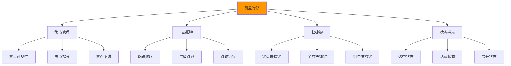

# 键盘导航设计

## ⌨️ 键盘可访问性基础原理

### 🔍 键盘导航的核心概念

**键盘导航是Web可访问性的基础要求**：



## 🎯 键盘导航HTML实现

### 📋 完整的键盘友好界面

```html
<!DOCTYPE html>
<html lang="zh-CN">
<head>
    <meta charset="UTF-8">
    <meta name="viewport" content="width=device-width, initial-scale=1.0">
    <title>键盘友好的Web应用 - 完整可访问性演示</title>
    
    <!-- 键盘导航增强样式 -->
    <style>
        /* ✅ 键盘焦点样式 */
        :focus {
            outline: 2px solid #0066cc;
            outline-offset: 2px;
            border-radius: 2px;
        }
        
        /* 自定义焦点样式 */
        .custom-focus:focus {
            outline: 2px solid #ff6b00;
            outline-offset: 2px;
            box-shadow: 0 0 0 4px rgba(255, 107, 0, 0.3);
        }
        
        /* 跳过链接 */
        .skip-link {
            position: absolute;
            top: -40px;
            left: 6px;
            background: #000;
            color: #fff;
            padding: 8px 16px;
            text-decoration: none;
            border-radius: 4px;
            z-index: 1000;
            font-weight: bold;
        }
        
        .skip-link:focus {
            top: 6px;
            left: 6px;
        }
        
        /* 屏幕阅读器专用 */
        .sr-only {
            position: absolute;
            width: 1px;
            height: 1px;
            padding: 0;
            margin: -1px;
            overflow: hidden;
            clip: rect(0, 0, 0, 0);
            white-space: nowrap;
            border: 0;
        }
        
        /* 卡片焦点的视觉增强 */
        .card:focus-within {
            transform: translateY(-2px);
            box-shadow: 0 4px 12px rgba(0,0,0,0.15);
        }
        
        /* 列表项键盘导航 */
        .nav-item.keyboard-focused {
            background-color: rgba(0, 102, 204, 0.1);


            border-left: 4px solid #0066cc;
        }
    </style>
</head>

<body class="keyboard-navigation-layout">
    <!-- 🔗 跳过链接 -->
    <a href="#main-content" class="skip-link">跳转到主要内容</a>
    
    <!-- 🧭 键盘友好的导航 -->
    <nav class="main-navigation" role="navigation" aria-label="主导航">
        <div class="nav-container">
            <!-- Logo链接 -->
            <a href="/" class="nav-brand">
                
            </a>
            
            <!-- 主导航菜单 -->
            <ul class="nav-list" role="menubar">
                <li role="none" class="nav-item">
                    <a href="/" 
                       role="menuitem" 
                       aria-current="page" 
                       class="nav-link">
                        首页
                    </a>
                </li>
                
                <li role="none" class="nav-item nav-item-with-submenu">
                    <button class="nav-link nav-parent" 
                            role="menuitem"
                            aria-expanded="false"
                            aria-haspopup="true"
                            aria-controls="products-submenu"
                            tabindex="0">
                        产品
                        <svg class="expand-icon" aria-hidden="true">
                            <use href="#icon-dropdown"></use>
                        </svg>
                    </button>
                    
                    <ul class="nav-submenu" 
                        id="products-submenu"
                        role="menu" 
                        aria-labelledby="products-menu-title"
                        aria-hidden="true">
                        
                        <h3 id="products-menu-title" class="sr-only">产品子菜单</h3>
                        
                        <li role="none">
                            <a href="/web-dev" 
                               role="menuitem" 
                               class="nav-sublink"
                               tabindex="-1">
                                Web开发
                            </a>
                        </li>
                        
                        <li role="none">
                            <a href="/mobile-dev" 
                               role="menuitem" 
                               class="nav-sublink"
                               tabindex="-1">
                                移动开发
                            </a>
                        </li>
                        
                        <li role="none">
                            <a href="/enterprise" 
                               role="menuitem" 
                               class="nav-sublink"
                               tabindex="-1">
                                企业解决方案
                            </a>
                        </li>
                    </ul>
                </li>
                
                <li role="none" class="nav-item">
                    <a href="/about" role="menuitem" class="nav-link">
                        关于我们
                    </a>
                </li>
                
                <li role="none" class="nav-item">
                    <a href="/contact" role="menuitem" class="nav-link">
                        联系我们
                    </a>
                </li>
            </ul>
            
            <!-- 搜索框 -->
            <div class="nav-s.search-container">
                <form class="search-form" role="search">
                    <label for="nav-search" class="search-label sr-only">
                        搜索网站内容
                    </label>
                    
                    <input type="search" 
                           id="nav-search"
                           name="q"
                           class="search-input"
                           placeholder="搜索..."
                           aria-describedby="search-instructions"
                           autocomplete="off">
                    
                    <button type="submit" 
                            class="search-button"
                            aria-label="执行搜索">
                        <svg aria-hidden="true">
                            <use href="#icon-search"></use>
                        </svg>
                    </button>
                    
                    <div id="search-instructions" class="sr-only">
                        按Enter键搜索，按Escape键取消
                    </div>
                </form>
            </div>
            
            <!-- 键盘快捷键提示 -->
            <div class="keyboard-shortcuts-panel" 
                 aria-labelledby="shortcuts-heading"
                 aria-hidden="true">
                <h3 id="shortcuts-heading">键盘快捷键</h3>
                <ul>
                    <li><kbd>Alt + S</kbd> - 打开搜索</li>
                    <li><kbd>P</kbd> - 焦点到产品菜单</li>
                    <li><kbd>H</kbd> - 跳转到首页</li>
                    <li><kbd>/</kbd> - 快速搜索</líb></li>
                </ul>
                <button class="close-shortcuts" aria-label="关闭快捷键面板">
                    <svg><use href="#icon-close"></use></svg>
                </button>
            </div>

            <!-- 快捷键切换按钮 -->
            <button class="show-shortcuts" aria-label="显示键盘快捷键">
                <svg><use href="#icon-keyboard"></use></svg>
            </button>
        </div>
    </nav>

    <!-- 🎯 主要内容区域 -->
    <main id="main-content" class="main-content" role="main">
        <header class="page-header">
            <h1>键盘友好的网页演示</h1>
            <p>这个页面演示了完整的键盘导航和可访问性功能。</p>
        </header>

        <!-- 📋 交互式组件演示 -->
        <section class="keyboard-demo-section" aria-labelledby="demo-heading">
            <h2 id="demo-heading">键盘导航示例</h2>

            <!-- 🎛️ 标签页组件 -->
            <div class="tabs-component" role="tablist" aria-label="功能标签页">
                <h3 class="sr-only">选择要查看的功能</h3>
                
                <button role="tab" 
                        aria-selected="true"
                        aria-controls="panel-1"
                        id="tab-1"
                        class="tab-button active">
                    基础功能
                </button>
                
                <button role="tab"
                        aria-selected="false"
                        aria-controls="panel-2"
                        id="tab-2"
                        class="tab-button">
                    高级功能
                </button>
                
                <button role="tab"
                        aria-selected="false"
                        aria-controls="panel-3"
                        id="tab-3"
                        class="tab-button">
                    自定义功能
                </button>
            </div>

            <!-- 标签页内容面板 -->
            <div role="tabpanel" 
                 id="panel-1"
                 aria-labelledby="tab-1"
                 class="tab-panel active">
                <h4>基础功能演示</h4>
                <p>这里展示基础的键盘导航功能。</p>
                
                <!-- 表单示例 -->
                <form class="demo-form" novalidate>
                    <fieldset class="form-fieldset">
                        <legend>联系信息</legend>
                        
                        <div class="form-group">
                            <label for="demo-name" class="form-label">
                                姓名 <span class="required" aria-label="必填">*</span>
                            </label>
                            <input type="text" 
                                   id="demo-name" 
                                   name="name"
                                   class="form-input"
                                   required
                                   aria-describedby="name-help"
                                   autocompletion="on>
                            <small id="name-help" class="form-help">
                                请输入您的真实姓名
                            </small>
                        </div>
                        
                        <div class="form-group">
                            <label for="demo-email" class="form-label">
                                邮箱 <span class="required" aria-label="必填">*</span>
                            </label>
                            <input type="email" 
                                   id="demo-email" 
                                   name="email"
                                   class="form-input"
                                   required
                                   aria-describedby="email-help"
                                   autocomplete="email">
                            <small id="email-help" class-form-help">
                                我们将使用此邮箱与您联系
                            </small>
                        </div>
                        
                        <!-- 单选按钮组 -->
                        <fieldset class="radio-group">
                            <legend>您更倾向于？</legend>
                            
                            <label class="radio-option">
                                <input type="radio" 
                                       name="interest" 
                                       value="frontend"
                                       class="radio-input">
                                <span class="radio-mark"></span>
                                <span class="radio-label">前端开发</span>
                            </label>
                            
                            <label class="radio-option">
                                <input type="radio" 
                                       name="interest" 
                                       value="backend"
                                       class="radio-input">
                                <span class="radio-mark"></span>
                                <span class="radio-label">后端开发</span>
                            </label>
                            
                            <label class="radio-option">
                                <input type="radio" 
                                       name="interest" 
                                       value="mobile"
                                       class="radio-input">
                                <span class="radio-mark"></span>
                                <span class="radio-label">移动开发</span>
                            </label>
                        </fieldset>
                        
                        <!-- 按钮组 -->
                        <div class="form-actions">
                            <button type="submit" class="btn-primary">
                                提交信息
                            </button>
                            <button type="reset" class="btn-secondary">
                                重置表单
                            </button>
                            <button type="button" 
                                    class="btn-secondary"
                                    onclick="focusNextSection()">
                                移动到下一节
                            </button>
                        </div>
                    </fieldset>
                </form>
            </div>

            <div role="tabpanel" 
                 id="panel-2"
                 aria-labelledby="tab-2"
                 class="tab-panel">
                <h4>高级功能演示</h4>
                
                <!-- 下拉选择组件 -->
                <div class="select-component">
                    <label for="demo-select" class="select-label">选择课程类型</label>
                    <div class="select-container" role="combobox" 
                         aria-expanded="false"
                         aria-haspopup="listbox"
                         aria-controls="demo-options">
                        
                        <select id="demo-select" class="select-input" required>
                            <option value="">请选择...</option>
                            <option value="beginners">初级课程</option>
                            <option value="intermediate">中级课程</option>
                            <option value="advanced">高级课程</option>
                            <option value="professional">专业课程</option>
                        </select>
                        
                        <div class="select-indicator" aria-hidden="true">
                            <svg><use href="#icon-dropdown"></use></svg>
                        </div>
                    </div>
                </div>

                <!-- 自定义下拉列表 -->
                <div class="custom-select" role="combobox" 
                     aria-expanded="false"
                     aria-haspopup="listbox"
                     aria-controls="custom-options"
                     tabindex="0"
                     aria-activedescendant="">
                    
                    <input type="text" 
                           class="custom-select-input"
                           placeholder="选择技术栈..."
                           readonly
                           aria-label="技术栈选择">
                    
                    <div class="custom-select-button" aria-hidden="true">
                        <svg><use href="#icon-dropdown"></use></svg>
                    </div>
                    
                    <ul class="custom-select-options" 
                        id="custom-options"
                        role="listbox"
                        aria-hidden="true">
                        <li role="option" 
                            id="option-html"
                            class="custom-select-option"
                            data-value="html">
                            HTML/CSS
                        </li>
                        <li role="option" 
                            id="option-js"
                            class="custom-select-option"
                            data-value="javascript">
                            JavaScript
                        </li>
                        <li role="option" 
                            id="option-react"
                            class="custom-select-option"
                            data-value="react">
                            React
                        </li>
                        <li role="option" 
                            id="option-vue"
                            class="custom-select-option"
                            data-value="vue">
                            Vue.js
                        </li>
                    </ul>
                </div>

                <!-- 模态对话框触发器 -->
                <button class="btn-modal-trigger" 
                        aria-controls="demo-modal"
                        aria-haspopup="dialog">
                    打开演示对话框
                </button>

                <!-- 模态对话框 -->
                <div class="modal" 
                     id="demo-modal"
                     role="dialog"
                     aria-labelledby="modal-title"
                     aria-describedby="modal-description"
                     aria-hidden="true">
                    
                    <div class="modal-backdrop"></div>
                    
                    <div class="modal-content">
                        <header class="modal-header">
                            <h3 id="modal-title">确认操作</h3>
                            <button class="modal-close" 
                                    aria-label="关闭对话框"
                                    type="button">
                                <svg><use href="#icon-close"></use></svg>
                            </button>
                        </header>
                        
                        <div class="modal-body">
                            <p id="modal-description">
                                这只是一个演示对话框，用于展示键盘导航功能。
                                您可以使用Tab键在按钮之间切换，使用Escape键关闭对话框。
                            </p>
                        </div>
                        
                        <footer class="modal-footer">
                            <button class="btn-primary" type="button">
                                确认
                            </button>
                            <button class="btn-secondary modal-cancel" type="button">
                                取消
                            </button>
                        </footer>
                    </div>
                </div>
            </div>

            <div role="tabpanel" 
                 id="panel-3"
                 aria-labelledby="tab-3"
                 class="tab-panel">
                <h4>自定义功能演示</h4>
                
                <!-- 自定义键盘导航组件 -->
                <div class="grid-navigation" role="grid" 
                     aria-label="可导航网格"
                     aria-rowcount="3"
                     aria-colcount="3">
                    
                    <div role="rowgroup">
                        <div role="row" aria-rowindex="1">
                            <div role="gridcell" 
                                 aria-rowindex="1" 
                                 aria-colindex="1"
                                 tabindex="0"
                                 class="grid-cell">
                                A1
                            </div>
                            <div role="gridcell" 
                                 aria-rowindex="并》 
                                 aria-colindex="2"
                                 tabindex="-1"
                                 class="grid-cell">
                                A2
                            </div>
                            <div role="gridcell" 
                                 aria-rowindex="1" 
                                 aria-colindex="3"
                                 tabindex="-1"
                                 class="grid-cell">
                                A3
                            </div>
                        </div>
                        <div role="row" aria-rowindex="2">
                            <div role="gridcell" 
                                 aria-rowindex="2" 
                                 aria-colindex="1"
                                 tabindex="-1"
                                 class="grid-cell">
                                B1
                            </div>
                            <div role="gridcell" 
                                 aria-rowindex="2" 
                                 aria-colindex="2"
                                 tabindex="-1"
                                 class="grid-cell">
                                B2
                            </div>
                            <div role="gridcell" 
                                 aria-rowindex="2" 
                                 aria-colindex="3"
                                 tabindex="-1"
                                 class="grid-cell">
                                B3
                            </div>
                        </div>
                        <div role="row" aria-rowindex="3">
                            <div role="gridcell" 
                                 aria-rowindex="3" 
                                 aria-colindex="1"
                                 tabindex="-1"
                                 class="grid-cell">
                                C1
                            </div>
                            <div role="gridcell" 
                                 aria-rowindex="3" 
                                 aria-colindex="2"
                                 tabindex="-1"
                                 class="grid-cell">
                                C2
                            </div>
                            <div role="gridcell" 
                                 aria-rowindex="3" 
                                 aria-colindex="3"
                                 tabindex="-1"
                                 class="grid-cell">
                                C3
                            </div>
                        </div>
                    </div>
                </div>

                <!-- 网格导航说明 -->
                <div class="grid-instructions">
                    <h5>网格导航说明：</h5>
                    <ul>
                        <li>使用<kbd>→←↑↓</kbd>箭头键在网格中移动</li>
                        <li>使用<kbd>Home</kbd>跳到行的开头</li>
                        <li>使用<kbd>End</kbd>跳到行的末尾</li>
                        <li>使用<kbd>Ctrl+Home</kbd>跳到第一个单元格</li>
                        <li>使用<kbd>Ctrl+End</kbd>跳到最后一个单元格</li>
                    </ul>
                </div>
            </div>
        </section>
    </main>

    <!-- JavaScript键盘导航增强 -->
    <script>
        class KeyboardNavigationManager {
            constructor() {
                this.focusableElements = '';
                this.focusableElements = 'button, [href], input, select, textarea, [tabindex]:not([tabindex="-1"])';
                this.init();
            }
            
            init() {
                this.setupGlobalShortcuts();
                this.setupTabNavigation();
                this.setupSubmenuNavigation();
                this.setupCustomSelect();
                this.setupGridNavigation();
                this.setupModalNavigation();
                this.setupTabsNavigation();
            }

            // ✅ 全局快捷键管理
            setupGlobalShortcuts() {
                document.addEventListener('keydown', (e) => {
                    // 防止在表单输入时触发快捷键
                    if (e.target.matches('input, textarea, select')) {
                        return;
                    }
                    
                    switch(e.key) {
                        case '/':
                            e.preventDefault();
                            this.focusSearch();
                            break;
                        case 'S':
                        case 's':
                            if (e.altKey) {
                                e.preventDefault();
                                this.focusSearch();
                            }
                            break;
                        case 'H':
                        case 'h':
                            if (e.altKey) {
                                e.preventDefault();
                                document.querySelector('.nav-brand').focus();
                            }
                            break;
                        case 'F1':
                            e.preventDefault();
                            this.showShortcuts();
                            break;
                        case '?':
                            e.preventDefault();
                            this.showShortcuts();
                            break;
                        case 'Escape':
                            this.handleEscape();
                            break;
                    }
                });
            }

            // ✅ Tab导航顺序管理
            setupTabNavigation() {
                // 确保tab顺序符合逻辑
                const orderedElements = [
                    '.skip-link',
                    '.nav-brand',
                    '.nav-list',
                    '#nav-search',
                    '#main-content',
                    '.tab-button',
                    '.form-input',
                    '.btn-primary'
                ];
                
                orderedElements.forEach((selector, index) => {
                    const element = document.querySelector(selector);
                    if (element) {
                        element.style.order = index;
                        element.setAttribute('data-tab-order', index);
                    }
                });
            }

            // ✅ 下拉菜单键盘导航
            setupSubmenuNavigation() {
                const submenuTriggers = document.querySelectorAll('.nav-parent');
                
                submenuTriggers.forEach(trigger => {
                    const submenu = document.getElementById(trigger.getAttribute('aria-controls'));
                    const submenuItems = submenu.querySelectorAll('[role="menuitem"]');
                    
                    trigger.addEventListener('keydown', (e) => {
                        switch(e.key) {
                            case 'Enter':
                            case ' ': // Space
                            case 'ArrowDown':
                                e.preventDefault();
                                if (trigger.getAttribute('aria-expanded') === 'false') {
                                    this.openSubmenu(trigger, submenu);
                                }
                                submenuItems[0]?.focus();
                                break;
                            case 'ArrowUp':
                                e.preventDefault();
                                submenuItems[submenuItems.length - 1]?.focus();
                                break;
                        }
                    });
                    
                    // 子菜单项目导航
                    submenuItems.forEach((item, index) => {
                        item.addEventListener('keydown', (e) => {
                            switch(e.key) {
                                case 'ArrowDown':
                                    e.preventDefault();
                                    const nextIndex = (index + 1) % submenuItems.length;
                                    submenuItems[nextIndex].focus();
                                    break;
                                case 'ArrowUp':
                                    e.preventDefault();
                                    const prevIndex = index === 0 ? submenuItems.length - 1 : index - 1;
                                    submenuItems[prevIndex].focus();
                                    break;
                                case 'Home':
                                    e.preventDefault();
                                    submenuItems[0].focus();
                                    break;
                                case 'End':
                                    e.preventDefault();
                                    submenuItems[submenuItems.length - 1].focus();
                                    break;
                                case 'Escape':
                                case 'ArrowLeft':
                                    e.preventDefault();
                                    this.closeSubmenu(trigger, submenu);
                                    trigger.focus();
                                    break;
                            }
                        });
                    });
                });
            }

            // ✅ 自定义下拉选择
            setupCustomSelect() {
                const customSelects = document.querySelectorAll('.custom-select');
                
                customSelects.forEach(select => {
                    const button = select;
                    const options = select.querySelectorAll('[role="option"]');
                    let currentIndex = -1;
                    
                    button.addEventListener('keydown', (e) => {
                        const isOpen = button.getAttribute('aria-expanded') === 'true';
                        
                        switch(e.key) {
                            case 'Enter':
                            case ' ': // Space
                            case 'ArrowDown':
                                e.preventDefault();
                                if (!isOpen) {
                                    this.openCustomSelect(select);
                                }
                                currentIndex = Math.max(0, currentIndex);
                                this.updateActiveOption(options, currentIndex);
                                options[currentIndex]?.focus();
                                break;
                            case 'ArrowUp':
                                if (!isOpen) {
                                    e.preventDefault();
                                    this.openCustomSelect(select);
                                    currentIndex = options.length - 1;
                                    this.updateActiveOption(options, currentIndex);
                                    options[currentIndex]?.focus();
                                } else {
                                    e.preventDefault();
                                    currentIndex = Math.max(0, currentIndex - 1);
                                    this.updateActiveOption(options, currentIndex);
                                    options[currentIndex]?.focus();
                                }
                                break;
                            case 'Escape':
                                e.preventDefault();
                                this.closeCustomSelect(select);
                                button.focus();
                                break;
                        }
                    });
                    
                    // 选项点击处理
                    options.forEach((option, index) => {
                        option.addEventListener('click', () => {
                            this.selectCustomOption(select, option);
                        });
                        
                        option.addEventListener('keydown', (e) => {
                            if (e.key === 'Enter' || e.key === ' ') {
                                e.preventDefault();
                                this.selectCustomOption(select, option);
                            }
                        });
                    });
                });
            }

            // ✅ 网格导航
            setupGridNavigation() {
                const grids = document.querySelectorAll('.grid-navigation');
                
                grids.forEach(grid => {
                    const cells = grid.querySelectorAll('[role="gridcell"]');
                    
                    cells.forEach(cell => {
                        cell.addEventListener('keydown', (e) => {
                            const rect = cell.getBoundingClientRect();
                            const rowIndex = parseInt(cell.getAttribute('aria-rowindex'));
                            const colIndex = parseInt(cell.getAttribute('aria-colindex'));
                            
                            switch(e.key) {
                                case 'ArrowRight':
                                    e.preventDefault();
                                    this.moveFocusInGrid(cells, rowIndex, colIndex + 1, 'right');
                                    break;
                                case 'ArrowLeft':
                                    e.preventDefault();
                                    this.moveFocusInGrid(cells, rowIndex, colIndex - 1, 'left');
                                    break;
                                case 'ArrowDown':
                                    e.preventDefault();
                                    this.moveFocusInGrid(cells, rowIndex + 1, colIndex, 'down');
                                    break;
                                case 'ArrowUp':
                                    e.preventDefault();
                                    this.moveFocusInGrid(cells, rowIndex - 1, colIndex, 'up');
                                    break;
                                case 'Home':
                                    e.preventDefault();
                                    if (e.ctrlKey) {
                                        // Ctrl+Home: 到第一个单元格
                                        cells[0]?.focus();
                                    } else {
                                        // Home: 到当前行第一个单元格
                                        const firstInRow = grid.querySelector(`[aria-rowindex="${rowIndex}"]`);
                                        firstInRow?.focus();
                                    }
                                    break;
                                case 'End':
                                    e.preventDefault();
                                    if (e.ctrlKey) {
                                        // Ctrl+End: 到最后一个单元格
                                        cells[cells.length - 1]?.focus();
                                    } else {
                                        // End: 到当前行最后一个单元格
                                        const rowCells = grid.querySelectorAll(`[aria-rowindex="${rowIndex}"]`);
                                        rowCells[rowCells.length - 1]?.focus();
                                    }
                                    break;
                            }
                        });
                    });
                });
            }

            // ✅ 模态对话框导航
            setupModalNavigation() {
                const triggerButton = document.querySelector('.btn-modal-trigger');
                const modal = document.getElementById('demo-modal');
                const closeButton = modal.querySelector('.modal-close');
                
                // 打开模态框
                triggerButton?.addEventListener('click', () => {
                    this.openModal(modal);
                });
                
                // 关闭模态框
                closeButton?.addEventListener('click', () => {
                    this.closeModal(modal);
                });
                
                // Escape键关闭
                document.addEventListener('keydown', (e) => {
                    if (e.key === 'Escape' && modal.getAttribute('aria-hidden') === 'false') {
                        this.closeModal(modal);
                    }
                });
                
                // 模态框内导航
                modal.addEventListener('keydown', (e) => {
                    if (e.key === 'Tab') {
                        this.handleModalTab(e, modal);
                    }
                });
            }
            
            setupTabsNavigation() {
                const tabButtons = document.querySelectorAll('[role="tab"]');
                const tabPanels = document.querySelectorAll('[role="tabpanel"]');
                
                tabButtons.forEach((button, index) => {
                    button.addEventListener('keydown', (e) => {
                        switch(e.key) {
                            case 'ArrowRight':
                                e.preventDefault();
                                const nextTabIndex = (index + 1) % tabButtons.length;
                                this.switchTab(tabButtons[nextTabIndex], tabPanels[nextTabIndex]);
                                break;
                            case 'ArrowLeft':
                                e.preventDefault();
                                const prevTabIndex = index === 0 ? tabButtons.length - 1 : index - 1;
                                this.switchTab(tabButtons[prevTabIndex], tabPanels[prevTabIndex]);
                                break;
                            case 'Home':
                                e.preventDefault();
                                this.switchTab(tabButtons[0], tabPanels[0]);
                                break;
                            case 'End':
                                e.preventDefault();
                                const lastIndex = tabButtons.length - 1;
                                this.switchTab(tabButtons[lastIndex], tabPanels[lastIndex]);
                                break;
                        }
                    });
                });
            }

            // ✅ 辅助方法
            switchTab(activeButton, activePanel) {
                // 移除所有活动状态
                document.querySelectorAll('[role="tab"]').forEach(tab => {
                    tab.setAttribute('aria-selected', 'false');
                    tab.classList.remove('active');
                });
                
                document.querySelectorAll('[role="tabpanel"]').forEach(panel => {
                    panel.setAttribute('aria-hidden', 'true');
                    panel.classList.remove('active');
                });
                
                // 设置新的活动状态
                activeButton.setAttribute('aria-selected', 'true');
                activeButton.classList.add('active');
                activePanel.setAttribute('aria-hidden', 'false');
                activePanel.classList.add('active');
                
                // 移动焦点
                activeButton.focus();
            }

            moveFocusInGrid(cells, targetRow, targetCol, direction) {
                const targetCell = Array.from(cells).find(cell => 
                    parseInt(cell.getAttribute('aria-rowindex')) === targetRow &&
                    parseInt(cell.getAttribute('aria-colindex')) === targetCol
                );
                
                if (targetCell) {
                    targetCell.focus();
                }
            }

            openModal(modal) {
                const focusableElements = modal.querySelectorAll(this.focusableElements);
                const firstFocusable = focusableElements[0];
                
                modal.setAttribute('aria-hidden', 'false');
                modal.style.display = 'block';
                firstFocusable.focus();
                
                // 防止背景滚动
                document.body.style.overflow = 'hidden';
            }

            closeModal(modal) {
                modal.setAttribute('aria-hidden', 'true');
                modal.style.display = 'none';
                document.querySelector('.btn-modal-trigger').focus();
                
                // 恢复背景滚动
                document.body.style.overflow = '';
            }

            handleModalTab(e, modal) {
                const focusableElements = modal.querySelectorAll(this.focusableElements);
                const firstFocusable = focusableElements[0];
                const lastFocusable = focusableElements[focusableElements.length - .1];
                
                if (e.shiftKey) {
                    // Shift + Tab
                    if (document.activeElement === firstFocusable) {
                        e.preventDefault();
                        lastFocusable.focus();
                    }
                } else {
                    // Tab
                    if (document.activeElement === lastFocusable) {
                        e.preventDefault();
                        firstFocusable.focus();
                    }
                }
            }
        }

        // ✅ 初始化键盘导航管理器
        document.addEventListener('DOMContentLoaded', () => {
            new KeyboardNavigationManager();
        });
    </script>
</body>
</html>
```

---

**🔗 键盘导航深化**：
- 屏幕阅读器适配：`[[03-9 屏幕阅读器适配]]`
- ARIA属性应用：`[[03-7 ARIA属性应用]]`
- WCAG标准：`[[03-6 WCAG可访问性标准]]`
