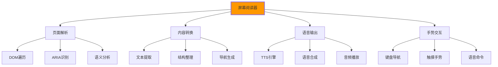

# 屏幕阅读器适配

## 🔊 屏幕阅读器技术原理

### 📊 屏幕阅读器工作原理

**屏幕阅读器帮助视觉障碍用户访问网页内容**：



## 🎯 HTML语义化与屏幕阅读器

### 📋 语义化信息结构

```html
<!-- ✅ 屏幕阅读器友好的HTML结构 -->
<!DOCTYPE html>
<html lang="zh-CN">
<head>
    <meta charset="UTF-8">
    <title>在线学习平台 - IT技能提升专家</title>
    
    <!-- 页面语言标识 -->
    <meta name="application-name" content="IT学习平台">
    
    <!-- 屏幕阅读器优化 -->
    <style>
        /* 屏幕阅读器专用样式 */
        .sr-only {
            position: absolute;
            width: 1px;
            height: 1px;
            padding: 0;
            margin: -1px;
            overflow: hidden;
            clip: rect(0, 0, 0, 0);
            white-space: nowrap;
            border: 0;
        }
        
        .skip-link {
            position: absolute;
            top: -40px;
            left: 6px;
            background: #000;
            color: #fff;
            padding: 8px 16px;
            text-decoration: none;
            z-index: 1000;
            border-radius: 4px;
        }
        
        .skip-link:focus {
            top: 6px;
        }
        
        /* 高对比度模式支持 */
        @media (prefers-contrast: high) {
            .btn {
                border: 2px solid currentColor;
                border-radius: 4px;
            }
        }
        
        /* 减少动画偏好 */
        @media (prefers-reduced-motion: reduce) {
            *, *::before, *::after {
                animation-duration: 0.01ms !important;
                animation-iteration-count: 1 !important;
                transition-duration: 0.01ms !important;
                scroll-behavior: auto !important;
            }
        }
    </style>
</head>

<body>
    <!-- 🔊 跳过链接 -->
    <a href="#main-content" class="skip-link">跳转到主要内容</a>
    <a href="#navigation" class="skip-link">跳转到主导航</a>
    
    <!-- 🧭 清晰的页面导航 -->
    <header role="banner" aria-label="页面头部">
        <div class="site-header">
            <!-- Logo区域 -->
            <div class="brand">
                <a href="/" aria-label="回到IT学习平台首页">
                    
                    <span class="sr-only">IT学习平台 - 专业编程技能提升</span>
                </a>
            </div>
            
            <!-- 主导航 -->
            <nav id="navigation" 
                 role="navigation" 
                 aria-label="主导航"
                 aria-describedby="nav-description">
                
                <h2 id="nav-description" class="sr-only">
                    网站主要导航菜单，包含课程、讲师、社区等链接
                </h2>
                
                <ul role="menubar">
                    <li role="none">
                        <a href="/" 
                           role="menuitem" 
                           aria-current="page"
                           aria-describedby="home-desc">
                            首页
                            <span id="home-desc" class="sr-only">返回网站主页</span>
                        </a>
                    </li>
                    
                    <li role="none" aria-haspopup="true" aria-expanded="false">
                        <button role="menuitem" 
                                aria-controls="courses-submenu"
                                aria-expanded="false"
                                aria-describedby="courses-desc">
                            课程
                            <svg class="dropdown-icon" aria-hidden="true">
                                <use href="#icon-arrow-down"></use>
                            </svg>
                            <span id="courses-desc" class="sr-only">查看所有课程分类</span>
                        </button>
                        
                        <ul id="courses-submenu" 
                            role="menu" 
                            aria-labelledby="courses-menu-title"
                            aria-hidden="true">
                            
                            <h3 id="courses-menu-title" class="sr-only">课程子菜单</h3>
                            
                            <li role="none">
                                <a href="/frontend" 
                                   role="menuitem" 
                                   aria-describedby="frontend-desc">
                                    前端开发
                                    <span id="frontend-desc" class="sr-only">
                                        学习HTML、CSS、JavaScript等前端技术
                                    </span>
                                </a>
                            </li>
                            
                            <li role="none">
                                <a href="/backend" 
                                   role="menuitem"
                                   aria-describedby="backend-desc">
                                    后端开发
                                    <span id="backend-desc" class="sr-only">
                                        学习Python、Java、数据库等后端技术
                                    </span>
                                </a>
                            </li>
                            
                            <li role="none">
                                <a href="/mobile" 
                                   role="menuitem"
                                   aria-describedby="mobile-desc">
                                    移动开发
                                    <span id="mobile-desc" class="sr-only">
                                        学习iOS、Android、React Native等移动端开发
                                    </span>
                                </a>
                            </li>
                        </ul>
                    </li>
                    
                    <li role="none">
                        <a href="/teachers" 
                           role="menuitem"
                           aria-describedby="teachers-desc">
                            讲师团队
                            <span id="teachers-desc" class="sr-only">了解我们的专业讲师</span>
                        </a>
                    </li>
                    
                    <li role="none">
                        <a href="/community" 
                           role="menuitem"
                           aria-describedby="community-desc">
                            学习社区
                            <span id="community-desc" class="sr-only">加入学员交流社区</span>
                        </a>
                    </li>
                </ul>
            </nav>
            
            <!-- 搜索功能 -->
            <div class="header-search" role="search" aria-label="网站搜索">
                <label for="main-search" class="sr-only">搜索网站内容</label>
                <input type="search" 
                       id="main-search"
                       placeholder="搜索课程、讲师、内容..."
                       aria-describedby="search-help">
                <button type="submit" aria-label="执行搜索">
                    <svg aria-hidden="true">
                        <use href="#icon-search"></use>
                    </svg>
                </button>
                <div id="search-help" class="sr-only">
                    输入搜索关键词，按Enter键搜索，按Escape键清除
                </div>
            </div>
        </div>
    </header>

    <!-- 📄 主要内容区域 -->
    <main id="main-content" role="main" aria-label="主要内容">
        <!-- Hero区域 -->
        <section class="hero-section" aria-labelledby="hero-heading">
            <h1 id="hero-heading">
                <span class="hero-title-primary">专业技能提升</span>
                <span class="hero-title-secondary">从这里开始</span>
            </h1>
            
            <!-- Hero内容描述 -->
            <div class="hero-content" role="region" aria-labelledby="hero-subtitle">
                <p id="hero-subtitle">
                    我们提供专业、系统的IT技能培训服务，帮助您从零基础到精通，
                    实现职业生涯的跨越式发展。
                </p>
                
                <!-- Hero操作按钮 -->
                <div class="hero-actions" role="group" aria-label="主要操作">
                    <a href="/courses" 
                       class="btn-primary"
                       aria-describedby="courses-cta-desc">
                        浏览课程
                    </a>
                    <span id="courses-cta-desc" class="sr-only">
                        点击查看所有可用课程
                    </span>
                    
                    <a href="/demo" 
                       class="btn-secondary"
                       aria-describedby="demo-cta-desc">
                        <svg aria-hidden="true"><use href="#icon-play"></use></svg>
                        观看演示
                    </a>
                    <span id="demo-cta-desc" class="sr-only">
                        观看平台功能演示视频
                    </span>
                </div>
                
                <!-- Hero数据统计 -->
                <div class="hero-stats" 
                     role="region" 
                     aria-label="平台数据统计"
                     aria-describedby="stats-desc">
                    
                    <h2 id="stats-desc" class="sr-only">平台统计信息</h2>
                    
                    <div class="stat-item" itemscope itemtype="https://schema.org/Organization">
                        <span class="stat-number" itemprop="memberCount">10,000</span>
                        <span class="stat-label">活跃学员</span>
                        <span class="sr-only">
                            平台目前有超过一万名活跃学习的学员
                        </span>
                    </div>
                    
                    <div class="stat-item">
                        <span class="stat-number">500</span>
                        <span class="stat-label">精品课程</span>
                        <span class="sr-only">
                            我们提供超过500门精心设计的课程
                        </span>
                    </div>
                    
                    <div class="stat-item">
                        <span class="stat-number">98%</span>
                        <span class="stat-label">满意度</span>
                        <span class="sr-only">
                            学员满意度达到98%，获得广泛好评
                        </span>
                    </div>
                </div>
            </div>
        </section>

        <!-- 📚 课程展示区域 -->
        <section class="courses-section" aria-labelledby="courses-section-heading">
            <header class="section-header">
                <h2 id="courses-section-heading">热门课程</h2>
                <p class="section-description">
                    精心挑选的优质课程，助您快速提升技能
                </p>
            </header>
            
            <!-- 课程过滤 -->
            <div class="courses-filter" role="group" aria-label="课程筛选">
                <h3 class="sr-only">按照类别筛选课程</h3>
                
                <button type="button" 
                        class="filter-btn active" 
                        aria-pressed="true"
                        aria-describedby="all-courses-desc">
                    全部课程
                </button>
                <span id="all-courses-desc" class="sr-only">显示所有课程</span>
                
                <button type="button" 
                        class="filter-btn" 
                        aria-pressed="false"
                        aria-describedby="frontend-courses-desc">
                    前端
                </button>
                <span id="frontend-courses-desc" class="sr-only">
                    只显示前端开发相关课程
                </span>
                
                <button type="button" 
                        class="filter-btn" 
                        aria-pressed="false"
                        aria-describedby="backend-courses-desc">
                    后端
                </button>
                <span id="backend-courses-desc" class="sr-only">
                    只显示后端开发相关课程
                </span>
                
                <button type="button" 
                        class="filter-btn" 
                        aria-pressed="false"
                        aria-describedby="mobile-courses-desc">
                    移动端
                </button>
                <span id="mobile-courses-desc" class="sr-only">
                    只显示移动开发相关课程
                </span>
            </div>
            
            <!-- 课程列表 -->
            <div class="courses-grid" 
                 role="region" 
                 aria-label="课程列表"
                 aria-live="polite">
                
                <!-- 课程卡片 -->
                <article class="course-card" 
                         itemscope 
                         itemtype="https://schema.org/Course"
                         aria-labelledby="course-1-title">
                    
                    <!-- 课程封面 -->
                    <div class="course-thumbnail">
                        
                        
                        <!-- 课程等级标记 -->
                        <span class="course-badge" aria-label="课程等级：初级">初级</span>
                        
                        <!-- 课程时长信息 -->
                        <div class="course-duration">
                            <svg aria-hidden="true"><use href="#icon-clock"></use></svg>
                            <span>40课时</span>
                            <span class="sr-only">课程总计40个课时</span>
                        </div>
                    </div>
                    
                    <!-- 课程详细信息 -->
                    <div class="course-info">
                        <h3 id="course-1-title" class="course-title" itemprop="name">
                            HTML5前端开发基础
                        </h3>
                        
                        <p class="course-description" itemprop="description">
                            从零学习HTML5基础语法，掌握现代网页开发的核心技术。
                            适合初学者和希望在Web前端领域发展的学习者。
                        </p>
                        
                        <!-- 课程元信息 -->
                        <div class="course-meta" itemprop="provider" itemscope itemtype="https://schema.org/EducationalOrganization">
                            <div class="instructor">
                                
                                <span itemprop="name">张老师</span>
                                <span class="sr-only">课程讲师：张老师</span>
                            </div>
                            
                            <div class="course-stats">
                                <div class="rating" itemprop="aggregateRating" itemscope itemtype="https://schema.org/AggregateRating">
                                    <svg aria-hidden="true"><use href="#icon-star"></use></svg>
                                    <span itemprop="ratingValue">4.9</span>
                                    <span class="sr-only">课程评分4.9分</span>
                                    <span itemprop="reviewCount">(256)</span>
                                    <span class="sr-only">共256个评价</span>
                                </div>
                                
                                <div class="students-count">
                                    <svg aria-hidden="true"><use href="#icon-users"></use></svg>
                                    <span>1,432</span>
                                    <span class="sr-only">已有1432名学员学习此课程</span>
                                </div>
                            </div>
                        </div>
                        
                        <!-- 价格信息 -->
                        <div class="course-price" aria-label="课程价格">
                            <span class="price-current">¥299</span>
                            <span class="price-original" aria-label="原价">¥599</span>
                            <span class="price-discount" aria-label="优惠幅度">5折优惠</span>
                        </div>
                    </div>
                    
                    <!-- 课程操作 -->
                    <div class="course-actions" role="group" aria-label="课程操作">
                        <button type="button" 
                                class="btn-add-cart"
                                aria-describedby="add-cart-desc">
                            <svg aria-hidden="true"><use href="#icon-cart"></use></svg>
                            加入购物车
                        </button>
                        <span id="add-cart-desc" class="sr-only">
                            将此课程添加到购物车中
                        </span>
                        
                        <button type="button" 
                                class="btn-favorite"
                                aria-label="收藏课程"
                                aria-pressed="false"
                                aria-describedby="favorite-desc">
                            <svg aria-hidden="true"><use href="#icon-heart"></use></svg>
                        </button>
                        <span id="favorite-desc" class="sr-only">
                            点击收藏此课程到个人收藏夹
                        </span>
                    </div>
                </article>
                
                <!-- 更多课程卡片... -->
            </div>
            
            <!-- 分页导航 -->
            <nav class="pagination" 
                 role="navigation" 
                 aria-label="课程分页导航">
                
                <h3 class="sr-only">页面导航说明</h3>
                
                <button type="button" 
                        class="pagination-btn pagination-prev" 
                        disabled
                        aria-label="前一页课程">
                    <svg aria-hidden="true"><use href="#icon-arrow-left"></use></svg>
                </button>
                
                <div class="pagination-pages" role="group" aria-label="页码选择">
                    <button type="button" 
                            class="pagination-page active" 
                            aria-current="page"
                            aria-label="当前页面，第1页">
                        1
                    </button>
                    
                    <button type="button" 
                            class="pagination-page"
                            aria-label="第2页">
                        2
                    </button>
                    
                    <button type="button" 
                            class="pagination-page"
                            aria-label="第3页">
                        3
                    </button>
                    
                    <span class="sr-only">更多页面</span>
                    <span aria-hidden="true">...</span>
                    
                    <button type="button" 
                            class="pagination-page"
                            aria-label="第10页">
                        10
                    </button>
                </div>
                
                <button type="button" 
                        class="pagination-btn pagination-next"
                        aria-label="下一页课程">
                    <svg aria-hidden="true"><use href="#icon-arrow-right"></use></svg>
                </button>
            </nav>
        </section>
    </main>

    <!-- 📞 页面底部 -->
    <footer role="contentinfo" aria-label="网站页脚">
        <div class="footer-container">
            <!-- 公司信息 -->
            <section class="footer-info" aria-labelledby="company-info">
                <h2 id="company-info" class="sr-only">公司信息</h2>
                
                <div class="company-details">
                    
                    <p>专业的IT技能在线教育平台，致力于为学习者提供优质的编程教育服务。</p>
                    
                    <address class="contact-info">
                        <span class="contact-item">
                            <svg aria-hidden="true"><use href="#icon-phone"></use></svg>
                            <a href="tel:+86-400-888-0000">400-888-0000</a>
                            <span class="sr-only">客服电话</span>
                        </span>
                        
                        <span class="contact-item">
                            <svg aria-hidden="true"><use href="#icon-email"></use></svg>
                            <a href="mailto:contact@itlearning.com">contact@itlearning.com</a>
                            <span class="sr-only">客服邮箱</span>
                        </span>
                        
                        <span class="contact-item">
                            <svg aria-hidden="true"><use href="#icon-location"></use></svg>
                            <span>北京市海淀区中关村大街66号</span>
                            <span class="sr-only">公司地址</span>
                        </span>
                    </address>
                </div>
            </section>
            
            <!-- 链接导航 -->
            <section class="footer-nav" aria-labelledby="footer-links">
                <h2 id="footer-links" class="sr-only">网站链接</h2>
                
                <div class="footer-columns">
                    <div class="footer-column">
                        <h3>学习资源</h3>
                        <nav aria-label="学习资源链接">
                            <ul>
                                <li><a href="/courses">课程中心</a></li>
                                <li><a href="/roadmap">学习路径</a></li>
                                <li><a href="/certificates">证书认证</a></li>
                                <li><a href="/resources">免费资源</a></li>
                            </ul>
                        </nav>
                    </div>
                    
                    <div class="footer-column">
                        <h3>服务支持</h3>
                        <nav aria-label="服务支持链接">
                            <ul>
                                <li><a href="/support">技术支持</a></li>
                                <li><a href="/faq">常见问题</a></li>
                                <li><a href="/contact">联系我们</a></li>
                                <li><a href="/feedback">意见反馈</a></li>
                            </ul>
                        </nav>
                    </div>
                    
                    <div class="footer-column">
                        <h3>关于我们</h3>
                        <nav aria-label="关于我们链接">
                            <ul>
                                <li><a href="/about">公司介绍</a></li>
                                <li><a href="/team">师资团队</a></li>
                                <li><a href="/careers">招聘信息</a></li>
                                <li><a href="/news">新闻动态</a></li>
                            </ul>
                        </nav>
                    </div>
                </div>
            </section>
            
            <!-- 社交媒体 -->
            <section class="social-media" aria-labelledby="social-links">
                <h2 id="social-links">关注我们</h2>
                
                <div class="social-links">
                    <a href="#" 
                       aria-label="微信公众号"
                       aria-describedby="wechat-desc">
                        <svg aria-hidden="true"><use href="#icon-wechat"></use></svg>
                    </a>
                    <span id="wechat-desc" class="sr-only">扫描二维码关注我们的微信公众号</span>
                    
                    <a href="#" 
                       aria-label="微博"
                       aria-describedby="weibo-desc">
                        <svg aria-hidden="true"><use href="#icon-weibo"></use></svg>
                    </a>
                    <span id="weibo-desc" class="sr-only">关注我们的新浪微博获取最新动态</span>
                    
                    <a href="#" 
                       aria-label="知乎"
                       aria-describedby="zhihu-desc">
                        <svg aria-hidden="true"><use href="#icon-zhihu"></use></svg>
                    </a>
                    <span id="zhihu-desc" class="sr-only">关注我们的知乎专栏阅读技术文章</span>
                    
                    <a href="#" 
                       aria-label="YouTube"
                       aria-describedby="youtube-desc">
                        <svg aria-hidden="true"><use href="#icon-youtube"></use></svg>
                    </a>
                    <span id="youtube-desc" class="sr-only">订阅我们的YouTube频道观看教学视频</span>
                </div>
            </section>
            
            <!-- 版权信息 -->
            <section class="footer-bottom" aria-label="版权和法律信息">
                <div class="copyright">
                    <p>&copy; 2024 IT学习平台. 保留所有权利.</p>
                    <p>京ICP备12345678号-1 | 京网文[2024]1234-567号</p>
                </div>
                
                <nav aria-label="法律链接">
                    <ul class="legal-links">
                        <li><a href="/privacy">隐私政策</a></li>
                        <li><a href="/terms">用户协议</a></li>
                        <li><a href="/cookies">Cookie政策</a></li>
                    </ul>
                </nav>
            </section>
        </div>
        
        <!-- 无障碍性声明 -->
        <div class="accessibility-statement" aria-label="无障碍性声明">
            <p>
                我们致力于确保本网站对所有人都是可访问的。如果您在访问本网站时遇到任何问题，
                请<a href="/contact">联系我们</a>。我们将及时解决您的问题。
            </p>
        </div>
    </footer>

    <!-- JavaScript增强 -->
    <script>
        // 屏幕阅读器友好的JavaScript
        class ScreenReaderEnhancer {
            constructor() {
                this.announcer = document.createElement('div');
                this.announcer.setAttribute('aria-live', 'polite');
                this.announcer.setAttribute('aria-atomic', 'true');
                this.announcer.className = 'sr-only';
                document.body.appendChild(this.announcer);
                
                this.init();
            }
            
            init() {
                this.setupKeyboardShortcuts();
                this.setupNavigation();
                this.setupDynamicContent();
                this.setupFormValidation();
            }
            
            // 键盘快捷键
            setupKeyboardShortcuts() {
                document.addEventListener('keydown', (e) => {
                    if (e.target.matches('input, textarea, select')) return;
                    
                    switch(e.key) {
                        case 'H':
                        case 'h':
                            if (e.altKey) {
                                e.preventDefault();
                                this.announce('按H键，移动到网站头部');
                                document.querySelector('header')?.scrollIntoView();
                            }
                            break;
                        case 'M':
                        case 'm':
                            if (e.altKey) {
                                e.preventDefault();
                                this.announce('按M键，移动到主导航');
                                document.querySelector('nav')?.focus();
                            }
                            break;
                        case 'Shift':
                        case 'End':
                            if (e.key === 'End') {
                                e.preventDefault();
                                this.announce('移动到页面底部');
                                document.querySelector('footer')?.scrollIntoView();
                            }
                            break;
                    }
                });
            }
            
            // 导航增强
            setupNavigation() {
                const dropdownMenus = document.querySelectorAll('[aria-haspopup="true"]');
                
                dropdownMenus.forEach(menu => {
                    const submenu = document.getElementById(menu.getAttribute('aria-controls'));
                    
                    menu.addEventListener('keydown', (e) => {
                        if (e.key === 'Enter' || e.key === ' ') {
                            const isOpen = submenu.getAttribute('aria-hidden') === 'false';
                            submenu.setAttribute('aria-hidden', !isOpen);
                            menu.setAttribute('aria-expanded', !isOpen);
                            
                            this.announce(
                                isOpen ? '菜单已关闭' : '菜单已打开'
                            );
                        }
                    });
                });
            }
            
            // 动态内容更新
            setupDynamicContent() {
                // 表单提交成功
                const forms = document.querySelectorAll('form');
                forms.forEach(form => {
                    form.addEventListener('submit', (e) => {
                        setTimeout(() => {
                            this.announce('表单已提交，请等待处理结果');
                        }, 500);
                    });
                });
                
                // 课程过滤
                const filterButtons = document.querySelectorAll('.courses-filter button');
                filterButtons.forEach(btn => {
                    btn.addEventListener('click', () => {
                        const filterText = btn.textContent.trim();
                        setTimeout(() => {
                            this.announce(`已筛选到与${filterText}相关的课程`);
                        }, 300);
                    });
                });
            }
            
            // 表单验证
            setupFormValidation() {
                const inputs = document.querySelectorAll('input[required]');
                
                inputs.forEach(input => {
                    input.addEventListener('invalid', (e) => {
                        const message = input.validationMessage;
                        setTimeout(() => {
                            this.announce(`表单验证错误：${message}`);
                        }, 100);
                    });
                    
                    input.addEventListener('input', () => {
                        const errorElement = input.closest('.form-group')?.querySelector('.error-message');
                        if (errorElement) {
                            errorElement.textContent = '';
                        }
                    });
                });
            }
            
            // 屏幕阅读器播报
            announce(message) {
                this.announcer.textContent = message;
                
                // 清除旧消息
                setTimeout(() => {
                    this.announcer.textContent = '';
                }, 3000);
            }
        }
        
        // 初始化屏幕阅读器增强
        document.addEventListener('DOMContentLoaded', () => {
            new ScreenReaderEnhancer();
        });
    </script>
</body>
</html>
```

---

**🔗 屏幕阅读器适配深化**：
- 键盘导航设计：`[[03-8 键盘导航设计]]`
- ARIA属性应用：`[[03-7 ARIA属性应用]]`
- 国际化支持：`[[03-10 国际化i18n支持]]`
