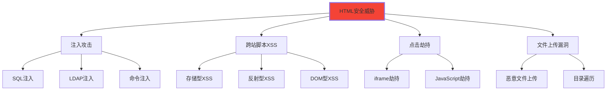

# HTML安全基础

## 🔒 HTML安全威胁概览

### 📊 常见Web安全威胁类型

**HTML层面的安全问题直接影响用户和企业安全**：



## 🛡️ XSS跨站脚本防护

### 📍 XSS攻击类型与防护

**XSS攻击是最常见的Web安全威胁**：

| XSS类型 | 攻击原理 | 伤害等级 | 主要防护 |
|----------|----------|----------|----------|
| **存储型** | 恶意脚本存储在服务器 | 🔴 高危 | 输入验证+输出编码 |
| **反射型** | 恶意脚本通过URL反射 | 🟠 中危 | 参数验证+输出编码 |
| **DOM型** | 客户端DOM操作漏洞 | 🟡 中危 | JavaScript验证 |

```html
<!-- ❌ 危险的HTML输出 -->
<!-- 假如用户输入: <script>alert('XSS')</script> -->
<div>
    <!-- 直接输出用户输入，存在XSS风险 -->
    欢迎: <script>alert('XSS')</script>
</div>

<!-- ✅ 安全的HTML输出 -->
<div>
    <!-- 使用HTML实体编码 -->
    欢迎: &lt;script&gt;alert('XSS')&lt;/script&gt;
    
    <!-- 或使用专门的函数进行编码 -->
    欢迎: <script>alert('XSS')</script>
</div>
```

### 🔧 XSS防护最佳实践

```html
<!-- ✅ 安全的表单处理 -->
<!-- Content Security Policy -->
<meta http-equiv="Content-Security-Policy" 
      content="default-src 'self'; 
               script-src 'self' 'unsafe-inline' scripts.example.com;
               style-src 'self' 'unsafe-inline' styles.example.com;
               img-src 'self' data: images.example.com;
               connect-src 'self' api.example.com;
               font-src 'self' fonts.example.com">

<!-- 安全的搜索表单 -->
<form action="/search" method="GET" novalidate>
    <label for="search-input">搜索内容</label>
    <input type="text" 
           id="search-input" 
           name="q" 
           maxlength="100"
           pattern="[a-zA-Z0-9\s\-_\.]{0,100}"
           placeholder="请输入搜索关键词"
           required>
    <button type="submit">搜索</button>
</form>

<!-- 安全的用户资料显示 -->
<div class="user-profile">
    <!-- ✅ 安全：HTML实体编码 -->
    <h1 id="username-display"></h1>
    <p id="user-bio"></p>
    
    <!-- ✅ 安全：使用textContent而非innerHTML -->
    <div id="safe-content"></div>
</div>

<script>
// XSS防护函数库
const XSSProtection = {
    // HTML实体编码
    encodeHTML(str) {
        const div = document.createElement('div');
        const text = document.createTextNode(str);
        div.appendChild(text);
        return div.innerHTML;
    },
    
    // URL编码
    encodeURL(str) {
        return encodeURIComponent(str);
    },
    
    // JavaScript字符串转义
    escapeJS(str) {
        return str
            .replace(/\\/g, '\\\\')
            .replace(/'/g, "\\'")
            .replace(/"/g, '\\"')
            .replace(/\n/g, '\\n')
            .replace(/\r/g, '\\r')
            .replace(/\t/g, '\\t');
    },
    
    // 输入验证
    validateInput(input, type = 'text') {
        switch(type) {
            case 'username':
                return /^[a-zA-Z0-9_-]{3,20}$/.test(input);
            case 'email':
                return /^[^\s@]+@[^\s@]+\.[^\s@]+$/.test(input);
            case 'url':
                try {
                    new URL(input);
                    return true;
                } catch {
                    return false;
                }
            case 'number':
                return /^\d+$/.test(input);
            default:
                return /^[\w\s\-_.,!?()]{1,500}$/.test(input);
        }
    }
};

// 安全的用户输入处理
function displayUserProfile(userData) {
    const userInfo = XSSProtection.validateInput(userData.username, 'username') 
        ? XSSProtection.encodeHTML(userData.username) 
        : '用户';
    
    const userBio = XSSProtection.validateInput(userData.bio || '', 'text') 
        ? XSSProtection.encodeHTML(userData.bio) 
        : '暂无简介';
    
    // 安全的DOM操作
    document.getElementById('username-display').textContent = userData.username || '';
    document.getElementById('user-bio').textContent = userData.bio || '';
    document.getElementById('safe-content').textContent = userData.content || '';
    
    // 创建安全HTML内容的方法
    const safeHTML = createSafeHTML(userData.safeHTML || '');
    document.getElementById('safe-content').innerHTML = safeHTML;
}

function createSafeHTML(content) {
    // 临时容器
         const tempDiv = document.createElement('div');
         tempDiv.innerHTML = content;
         
         // 移除所有script标签和事件处理器
         const scripts = tempDiv.querySelectorAll('script');
         scripts.forEach(script => script.remove());
         
         // 移除所有事件属性
         const elementsWithEvents = tempDiv.querySelectorAll('[onclick][onload][onerror]');
         elementsWithEvents.forEach(el => {
             ['onclick', 'onload', 'onerror', 'onmouseover', 'onfocus'].forEach(attr => {
                 el.removeAttribute(attr);
             });
         });
         
         // 白名单允许的HTML标签
         const allowedTags = ['p', 'br', 'strong', 'em', 'span', 'div', 'h1', 'h2', 'h3', 'ul', 'li', 'a'];
         const allElements = tempDiv.querySelectorAll('*');
         allElements.forEach(el => {
             if (!allowedTags.includes(el.tagName.toLowerCase())) {
                 // 保留内容，替换标签
                 const textNode = document.createTextNode(el.textContent);
                 el.parentNode.replaceChild(textNode, el);
             }
         });
         
         return tempDiv.innerHTML;
     }
     
     // CSP违规检测
     document.addEventListener('securitypolicyviolation', function(e) {
         console.warn('CSP violated:', {
             blockedURI: e.blockedURI,
             violatedDirective: e.violatedDirective,
             originalPolicy: e.originalPolicy
         });
         
         // 上报到安全监控系统
         reportSecurityViolation(e);
     });
     
     function reportSecurityViolation(event) {
         const report = {
             type: 'csp-violation',
             timestamp: new Date().toISOString(),
             userAgent: navigator.userAgent,
             violation: {
                 blockedURI: event.blockedURI,
                 violatedDirective: event.violatedDirective
             }
         };
         
         // 发送到安全监控API
         fetch('/api/security/report', {
             method: 'POST',
             headers: {
                 'Content-Type': 'application/json'
             },
             body: JSON.stringify(report)
         }).catch(err => console.error('Security report failed:', err));
     }
</script>
```

## 🔒 CSRF跨站请求伪造防护

### 📍 CSRF攻击与Token防护

```html
<!-- ✅ CSRF Token防护 -->
<form action="/update-profile" method="POST" novalidate>
    <!-- CSRF Token -->
    <input type="hidden" 
           name="_token" 
           value="{{csrf_token}}"
           aria-hidden="true">
    
    <fieldset>
        <legend>更新个人资料</legend>
        
        <div class="form-group">
            <label for="display-name">显示名称</label>
            <input type="text" 
                   id="display-name" 
                   name="display_name"
                   maxlength="50"
                   minlength="1"
                   required
                   pattern="[a-zA-Z0-9\s\-_\u4e00-\u9fa5]{1,50}">
        </div>
        
        <div class="form-group">
            <label for="bio-text">个人简介</label>
            <textarea id="bio-text" 
                      name="bio" 
                      maxlength="500"
                      rows="4"
                      cols="50"
                      placeholder="谈谈你自己..."></textarea>
        </div>
        
        <div class="form-actions">
            <button type="submit">更新资料</button>
            <button type="button" onclick="resetForm()">重置</button>
        </div>
    </fieldset>
</form>

<!-- SameSite Cookie设置 -->
<script>
// 设置安全的Cookie
function setSecureCookie(name, value, days = 7) {
    const expires = new Date();
    expires.setTime(expires.getTime() + (days * 24 * 60 * 60 * 1000));
    
    // 安全Cookie设置
    document.cookie = `${name}=${encodeURIComponent(value)}; ` +
                    `expires=${expires.toUTCString()}; ` +
                    `path=/; ` +
                    `secure; ` +           // HTTPS only
                    `samesite=strict; ` +  // CSRF防护
                    `httponly`;            // JS无法访问
}

// CSRF Token验证
function validateCSRFToken(form) {
    const csrfToken = form.querySelector('[name="_token"]')?.value;
    
    // 发起AJAX请求验证Token
    return fetch('/api/validate-csrf', {
        method: 'POST',
        headers: {
            'Content-Type': 'application/json',
            'X-CSRF-Token': csrfToken
        },
        credentials: 'same-origin'
    }).then(response => response.ok);
}

// 表单提交安全处理
document.querySelector('form').addEventListener('submit', function(e) {
    e.preventDefault();
    
    const form = this;
    
    // 验证CSRF Token
    validateCSRFToken(form).then(isValid => {
        if (!isValid) {
            alert('请求验证失败，请刷新页面重试');
            return;
        }
        
        // 获取表单数据
        const formData = new FormData(form);
        
        // 提交数据
        fetch(form.action, {
            method: 'POST',
            body: formData,
            credentials: 'same-origin',
            headers: {
                'X-Requested-With': 'XMLHttpRequest'
            }
        }).then(response => {
            if (response.ok) {
                return response.json();
            }
            throw new Error('Network response was not ok');
        }).then(data => {
            if (data.success) {
                displayMessage('资料更新成功！', 'success');
                
                // 更新页面显示
                updateUserDisplay(data.userData);
            } else {
                displayMessage('更新失败：' + data.message, 'error');
            }
        }).catch(error => {
            console.error('Error:', error);
            displayMessage('网络错误，请稍后重试', 'error');
        });
    });
});

function displayMessage(msg, type) {
    const message = document.createElement('div');
    message.className = `message message-${type}`;
    message.textContent = msg;
    message.setAttribute('role', type === 'error' ? 'alert' : 'status');
    message.setAttribute('aria-live', 'polite');
    
    document.body.insertBefore(message, document.body.firstChild);
    
    setTimeout(() => {
        message.remove();
    }, 5000);
}

function resetForm() {
    document.querySelector('form').reset();
}
</script>
```

## 🔐 Clickjacking点击劫持防护

### 🛡️ X-Frame-Options设置

```html
<!-- ✅ 防止点击劫持的HTML Headers -->
<head>
    <!-- X-Frame-Options 防护 -->
    <meta http-equiv="X-Frame-Options" content="DENY">
    <!-- 或使用 SAMEORIGIN：<meta http-equiv="X-Frame-Options" content="SAMEORIGIN"> -->
    
    <!-- Content Security Policy Frame防护 -->
    <meta http-equiv="Content-Security-Policy" content="frame-ancestors 'none'">
    
    <!-- 网页标题 -->
    <title>安全页面 - IT学院</title>
</head>

<body>
    <!-- JavaScript检测是否在iframe中 -->
    <script>
    (function() {
        'use strict';
        
        // 检测页面是否被嵌入iframe
        function detectClickjacking() {
            // 方法1：检测window.top和window.self
            if (window.top !== window.self) {
                // 页面被嵌入iframe，可能遭受点击劫持
                console.warn('页面可能在Clickjacking攻击中的作用');
                
                // 可选：检查来源是否可信
                try {
                    const origin = window.location.ancestorOrigins[0];
                    const allowedOrigins = ['https://it-academy.edu.cn', 'https://www.it-academy.edu.cn'];
                    
                    if (!allowedOrigins.includes(origin)) {
                        // 来自不可信来源，阻止页面加载
                        window.top.location = window.location;
                    }
                } catch (e) {
                    // 如果无法访问ancestorOrigins，阻止页面加载
                    window.top.location = window.location;
                }
            }
        }
        
        // 方法2：帧破坏脚本（Frame Busting）
        function frameBusting() {
            if (window.top !== window.self) {
                // 尝试打破框架
                if (window.top.document.URL.indexOf(window.location.hostname) === -1) {
                    window.top.location = window.location;
                }
            }
        }
        
        // 方法3：使用CSS防护
        function applyCSSProtection() {
            const style = document.createElement('style');
            style.textContent = `
                body {
                    /* 确保页面不会被透明iframe覆盖 */
                    position: relative;
                    z-index: 1000;
                }
                
                /* 检测到iframe环境时的特殊样式 */
                body:before {
                    content: "此页面不能在此环境中正确显示";
                    position: fixed;
                    top: 0;
                    left: 0;
                    width: 100%;
                    height: 100%;
                    background: rgba(255,255,255,0.9);
                    z-index: 9999;
                    display: none;
                    align-items: center;
                    justify-content: center;
                    font-size: 24px;
                    color: #d32f2f;
                }
            `;
            document.head.appendChild(style);
            
            // 如果检测到iframe环境，显示警告
            if (window.top !== window.self) {
                document.body.style.color = '#d32f2f';
                document.querySelector('style').textContent += `
                    body:before {
                        display: flex !important;
                    }
                `;
            }
        }
        
        // 检测Touch事件来识别移动设备上的点击劫持
        let touchStartTime = 0;
        document.addEventListener('touchstart', function() {
            touchStartTime = Date.now();
        });
        
        document.addEventListener('touchend', function(e) {
            const touchDuration = Date.now() - touchStartTime;
            
            // 非常快速的点击可能是自动点击
            if (touchDuration < 50) {
                console.warn('检测到异常快速的触摸事件，可能是自动化点击');
                
                // 可选：阻止后续事件处理
                // e.stopImmediatePropagation();
            }
        });
        
        // 初始化检测
        detectClickjacking();
        frameBusting();
        applyCSSProtection();
        
        // CSP违规检测
        document.addEventListener('securitypolicyviolation', function(e) {
            if (e.violatedDirective.includes('frame-ancestors')) {
                console.warn('检测到违反frame-ancestors策略');
            }
        });
        
    })();
    </script>
    
    <!-- 安全的交互元素 -->
    <section aria-labelledby="interactive-section">
        <h2 id="interactive-section">安全交互区域</h2>
        
        <!-- 敏感操作的双重确认 -->
        <button type="button" 
                class="danger-action" 
                data-confirm="确定要删除这个账户吗？此操作不可撤销。"
                onclick="confirmDangerousAction(this)">
            删除账户
        </button>
        
        <!-- 防止意外提交的安全表单 -->
        <form class="safe-form" novalidate>
            <fieldset>
                <legend>敏感信息更新</legend>
                
                <!-- 密码修改需要重新验证 -->
                <div class="form-group">
                    <label for="current-password">当前密码</label>
                    <input type="password" 
                           id="current-password" 
                           name="current_password"
                           autocomplete="current-password"
                           required>
                </div>
                
                <div class="form-group">
                    <label for="new-password">新密码</label>
                    <input type="password" 
                           id="new-password" 
                           name="new_password"
                           autocomplete="new-password"
                           minlength="8"
                           pattern="^(?=.*[a-z])(?=.*[A-Z])(?=.*\d)(?=.*[@$!%*?&])[A-Za-z\d@$!%*?&]{8,}$"
                           required>
                    
                    <!-- 密码强度指示器 -->
                    <div class=" password-strength-meter" role="status" aria-live="polite">
                        <div class="strength-indicator"></div>
                        <span class="strength-text">密码强度</span>
                    </div>
                </div>
                
                <div class="form-group">
                    <label for="confirm-password">确认新密码</label>
                    <input type="password" 
                           id="confirm-password" 
                           name="confirm_password"
                           autocomplete="new-password"
                           oninput="validatePasswordConfirm()"
                           required>
                    <div class="password-match-status" role="status" aria-live="polite"></div>
                </div>
            </fieldset>
        </form>
    </section>
</body>

<script>
// 危险操作确认
function confirmDangerousAction(button) {
    const message = button.getAttribute('data-confirm');
    const confirmed = confirm(message);
    
    if (confirmed) {
        // 进一步的二次确认
        const finalConfirmation = confirm('最后一次确认：' + message + '\n\n点击确定将立即执行此操作！');
        
        if (finalConfirmation) {
            // 执行危险操作
            executeDangerousAction(button);
        }
    }
}

function executeDangerousAction(button) {
    // 显示加载状态
    button.disabled = true;
    button.textContent = '处理中...';
    
    // 模拟异步操作
    setTimeout(() => {
        alert('操作已完成');
        button.disabled = false;
        button.textContent = button.getAttribute('data-original-text') || '删除账户';
    }, 2000);
}

// 密码确认验证
function validatePasswordConfirm() {
    const password = document.getElementById('new-password').value;
    const confirmPassword = document.getElementById('confirm-password').value;
    const statusDiv = document.querySelector('.password-match-status');
    
    if (!confirmPassword) {
        statusDiv.textContent = '';
        return;
    }
    
    if (password === confirmPassword) {
        statusDiv.textContent = '✓ 密码匹配';
        statusDiv.style.color = '#4caf50';
    } else {
        statusDiv.textContent = '✗ 密码不匹配';
        statusDiv.style.color = '#f44336';
    }
}

// 密码强度检测
document.getElementById('new-password').addEventListener('input', function() {
    const password = this.value;
    const strengthMeter = document.querySelector('.password-strength-meter');
    const indicator = strengthMeter.querySelector('.strength-indicator');
    const text = strengthMeter.querySelector('.strength-text');
    
    const strength = calculatePasswordStrength(password);
    
    // 更新视觉指示器
    indicator.className = `strength-indicator strength-${strength.level}`;
    text.textContent = strength.text;
    
    // 更新aria-label
    strengthMeter.setAttribute('aria-label', `密码强度：${strength.text}`);
});

function calculatePasswordStrength(password) {
    let score = 0;
    const checks = {
        length: password.length >= 8,
        lowercase: /[a-z]/.test(password),
        uppercase: /[A-Z]/.test(password),
        number: /\d/.test(password),
        special: /[@$!%*?&]/.test(password)
    };
    
    score = Object.values(checks).filter(Boolean).length;
    
    const levels = [
        { level: 'very-weak', text: '非常弱' },
        { level: 'weak', text: '弱' },
        { level: 'medium', text: '中等' },
        { level: 'strong', text: '强' },
        { level: 'very-strong', text: '非常强' }
    ];
    
    return levels[score] || levels[0];
}
</script>

<style>
.password-strength-meter {
    margin-top: 0.5rem;
    height: 4px;
    background-color: #eee;
    border-radius: 2px;
    overflow: hidden;
}

.strength-indicator {
    height: 100%;
    transition: width 0.3s ease, background-color 0.3s ease;
    width: 0%;
}

.strength-indicator.strength-very-weak {
    width: 20%;
    background-color: #f44336;
}

.strength-indicator.strength-weak {
    width: 40%;
    background-color: #ff9800;
}

.strength-indicator.strength-medium {
    width: 60%;
    background-color: #ffeb3b;
}

.strength-indicator.strength-strong {
    width: 80%;
    background-color: #4caf50;
}

.strength-indicator.strength-very-strong {
    width: 100%;
    background-color: #2e7d32;
}
</style>
```

---

**🔗 URI安全深化**：
- 内容安全策略：`[[03-19 内容安全策略]]`
- 数据保护合规：`[[03-20 数据保护合规]]`
- 代码质量检查：`[[03-21 代码质量检查]]`
