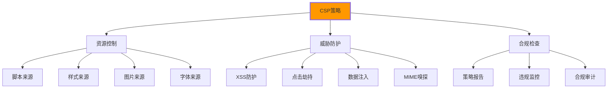

# 内容安全策略

## 🛡️ CSP安全防护机制

### 📊 CSP防护体系

**内容安全策略(CSP)是现代Web安全的核心防线**：



## 🎯 CSP实现与应用

### 📋 完整的CSP配置

```html
<!DOCTYPE html>
<html lang="zh-CN">
<head>
    <meta charset="UTF-8">
    <meta name="viewport" content="width=device-width, initial-scale=1.0">
    <title>安全Web应用 - CSP策略演示</title>
    
    <!-- 🛡️ 内容安全策略 -->
    <meta http-equiv="Content-Security-Policy" 
          content="
              default-src 'self';
              script-src 'self' 'unsafe-inline' https://cdn.jsdelivr.net https://www.google-analytics.com https://cdnjs.cloudflare.com;
              style-src 'self' 'unsafe-inline' https://fonts.googleapis.com https://cdn.jsdelivr.net;
              img-src 'self' data: https://images.example.com https://*.gravatar.com;
              font-src 'self' https://fonts.gstatic.com https://cdn.jsdelivr.net;
              connect-src 'self' https://api.example.com https://www.google-analytics.com;
              media-src 'self' https://media.example.com;
              object-src 'none';
              child-src 'self' https://player.vimeo.com;
              frame-src 'self' https://embed.example.com;
              worker-src 'self';
              manifest-src 'self';
              form-action 'self' https://forms.example.com;
              frame-ancestors 'none';
              base-uri 'self';
              upgrade-insecure-requests;
              block-all-mixed-content;
              require-trusted-types-for 'script';
          ">
    
    <!-- 🔒 严格的CSP策略（生产环境推荐） -->
    <meta http-equiv="Content-Security-Policy-Strict" 
          content="
              default-src 'none';
              script-src 'self' 'sha256-abc123...';
              style-src 'self' 'sha256-def456...';
              img-src 'self' https://trusted-cdn.com;
              font-src 'self';
              connect-src 'self' https://trusted-api.com;
              form-action 'self';
              frame-ancestors 'none';
              base-uri 'self';
              upgrade-insecure-requests;
              require-sri-for script style;
              require-trusted-types-for 'script';
              trusted-types 'default' 'script-*';
          ">
    
    <!-- 📊 CSP报告策略 -->
    <meta http-equiv="Content-Security-Policy-Report-Only" 
          content="
              default-src 'self';
              script-src 'self';
              style-src 'self' 'unsafe-inline';
              img-src 'self' https: data:;
              font-src 'self';
              connect-src 'self';
              report-uri /csp-report;
              report-to csp-endpoint;
          ">
    
    <!-- 🔍 Mixed Content 策略 -->
    <meta http-equiv="Mixed-Content-Policy" content="upgrade">
    
    <!-- 🚫 Referrer 策略 -->
    <meta name="referrer" content="strict-origin-when-cross-origin">
    
    <!-- 📈 预连接优化 -->
    <link rel="preconnect" href="https://fonts.googleapis.com" crossorigin>
    <link rel="preconnect" href="https://cdn.jsdelivr.net" crossorigin>
    
    <link rel="stylesheet" href="/styles/secure-styles.css">
</head>

<body>
    <!-- 🎯 CSP策略展示区域 -->
    <header class="secure-header">
        <h1>CSP策略演示页面</h1>
        <nav class="csp-nav">
            <a href="#validation">策略验证</a>
            <a href="#testing">安全测试</a>
            <a href="#monitoring">违规监控</a>
        </nav>
    </header>

    <main class="secure-main">
        <!-- 🔧 CSP策略测试表单 -->
        <section class="csp-test-section" id="validation">
            <h2>CSP策略验证</h2>
            
            <!-- 内联脚本测试 -->
            <div class="test-group">
                <h3>内联脚本测试</h3>
                <button onclick="alertCSP()" class="test-btn">内联脚本按钮</button>
                <div class="result" id="inline-script-result">还未测试</div>
            </div>
            
            <!-- 外部脚本测试 -->
            <div class="test-group">
                <h3>外部脚本测试</h3>
                <button onclick="testExternalScript()" class="test-btn">外部JS库测试</button>
                <div class="result" id="external-script-result">还未测试</div>
            </div>
            
            <!-- 样式测试 -->
            <div class="test-group">
                <h3>样式策略测试</h3>
                <div class="style-test" id="style-test">
                    <style>
                        .test-inline-style {
                            background: #ff6b6b;
                            color: white;
                            padding: 10px;
                            border-radius: 4px;
                        }
                    </style>
                    <div class="test-inline-style">内联样式测试区域</div>
                </div>
                <div class="result">样式加载结果可视化</div>
            </div>
            
            <!-- 图片策略测试 -->
            <div class="test-group">
                <h3>图片加载测试</h3>
                
                
                
                
                <div class="image-status">
                    <div>允许的图片: <span id="safe-image-status">测试中...</span></div>
                    <div>被阻止的图片: <span id="blocked-image-status">测试中...</span></div>
                </div>
            </div>
            
            <!-- 跨域请求测试 -->
            <div class="test-group">
                <h3>跨域连接测试</h3>
                <button onclick="testCORS()" class="test-btn">测试CORS连接</button>
                <div class="result" id="cors-result">还未测试</div>
            </div>
        </section>

        <!-- 🔍 安全测试工具 -->
        <section class="security-test-section" id="testing">
            <h2>安全测试工具</h2>
            
            <!-- CSP检查工具 -->
            <div class="tool-group">
                <h3>CSP策略检查器</h3>
                <div class="csp-checker">
                    <textarea id="csp-input" 
                              placeholder="输入CSP策略进行验证..."
                              rows="6"></textarea>
                    <button onclick="validateCSP()" class="validate-btn">验证策略</button>
                    <div class="validation-result" id="csp-validation-result"></div>
                </div>
            </div>
            
            <!-- XSS防护测试 -->
            <div class="tool-group">
                <h3>XSS防护测试</h3>
                <div class="xss-tester">
                    <input type="text" 
                           id="xss-input" 
                           placeholder="输入可能的XSS攻击代码"
                           value="<script>alert('XSS')</script>">
                    <button onclick="testXSS()" class="test-btn">测试XSS防护</button>
                    <div class="xss-display" id="xss-display"></div>
                    <div class="result" id="xss-result"></div>
                </div>
            </div>
            
            <!-- 违规内容注入测试 -->
            <div class="tool-group">
                <h3>内容注入测试</h3>
                <div class="injection-tester">
                    <label>测试平台生成的内容：</label>
                    <div id="user-content" class="content-display"></div>
                    <button onclick="injectUserContent()" class="test-btn">注入用户内容</button>
                    <div class="result" id="injection-result"></div>
                </div>
            </div>
        </section>

        <!-- 📊 监控和报告 -->
        <section class="monitoring-section" id="monitoring">
            <h2>CSP违规监控</h2>
            
            <!-- 实时监控面板 -->
            <div class="monitoring-panel">
                <div class="metric">
                    <span class="metric-label">策略违规次数</span>
                    <span class="metric-value" id="violation-count">0</span>
                </div>
                
                <div class="metric">
                    <span class="metric-label">阻止的资源类型</span>
                    <span class="metric-value" id="blocked-types">未知</span>
                </div>
                
                <div class="metric">
                    <span class="metric-label">最后违规时间</span>
                    <span class="metric-value" id="last-violation">无</span>
                </div>
            </div>
            
            <!-- 违规日志 -->
            <div class="violation-log">
                <h3>违规日志</h3>
                <div class="log-container" id="violation-log-container">
                    <div class="log-entry">等待CSP违规事件...</div>
                </div>
                <button onclick="clearViolationLog()" class="clear-btn">清除日志</button>
            </div>
            
            <!-- CISPA测试 -->
            <div class="cspa-tester">
                <h3>Content Isolation API 测试</h3>
                <div class="isolation-test">
                    <button onclick="testCSPA()" class="test-btn">测试内容隔离</button>
                    <div id="cspa-result" class="result"></div>
                </div>
            </div>
        </section>
    </main>

    <!-- 📊 CSP报告统计 -->
    <aside class="csp-stats" role="complementary">
        <h3>CSP统计信息</h3>
        
        <div class="stats-grid">
            <div class="stat-item">
                <h4>策略强度</h4>
                <div class="strength-meter">
                    <div class="meter-bar" style="width: 85%"></div>
                    <span class="strength-text">85% (强)</span>
                </div>
            </div>
            
            <div class="stat-item">
                <h4>覆盖指令</h4>
                <ul class="covered-directives">
                    <li>script-src ✅</li>
                    <li>style-src ✅</li>
                    <li>img-src ✅</li>
                    <li>connect-src ✅</li>
                    <li>object-src ✅</li>
                    <li>frame-src ✅</li>
                </ul>
            </div>
            
            <div class="stat-item">
                <h4>推荐改进</h4>
                <ul class="recommendations">
                    <li>启用report-uri监控</li>
                    <li>移除unsafe-inline</li>
                    <li>添加nonce/哈希白名单</li>
                    <li>实施trusted-types</li>
                </ul>
            </div>
        </div>
    </aside>

    <!-- 🔧 CSP工具JavaScript实现 -->
    <script>
        // 🛡️ CSP管理器
        class CSPManager {
            constructor() {
                this.violations = [];
                this.monitoringEnabled = false;
                this.init();
            }
            
            init() {
                this.setupViolationReporting();
                this.setupMonitoring();
                this.testCSPCompliance();
            }
            
            // CSP合规测试
            testCSPCompliance() {
                this.testScriptPolicy();
                this.testResourceLoading();
                this.testInlineContent();
            }
            
            testScriptPolicy() {
                try {
                    // 测试内联脚本（应该被阻止）
                    eval("console.log('CSP violation test')");
                } catch (error) {
                    console.log('✅ CSP阻止了内联脚本执行');
                }
                
                // 测试动态脚本插入
                try {
                    const script = document.createElement('script');
                    script.src = 'data:text/javascript,alert("CSP test")';
                    document.head.appendChild(script);
                } catch (error) {
                    console.log('✅ CSP阻止了动态脚本插入');
                }
            }
            
            testResourceLoading() {
                // 测试图片加载
                const img = new Image();
                img.onload = () => console.log('✅ 允许的图片加载成功');
                img.onerror = () => console.log('✅ CSP阻止了图片加载');
                img.src = '/images/test.jpg';
                
                // 测试样式表加载
                const link = document.createElement('link');
                link.rel = 'stylesheet';
                link.addEventListener('load', () => {
                    console.log('✅ 样式表加载成功');
                });
                link.addEventListener('error', () => {
                    console.log('✅ CSP阻止了样式表加载');
                });
                link.href = '/styles/test.css';
                document.head.appendChild(link);
            }
            
            testInlineContent() {
                // 测试内联事件处理器
                try {
                    const button = document.createElement('button');
                    button.onclick = () => this.handleInlineEvent();
                    console.log('⚠️ 内联事件处理器被允许');
                } catch (error) {
                    console.log('✅ CSP阻止了内联事件处理器');
                }
            }
            
            setupViolationReporting() {
                // 监听CSP违规事件
                document.addEventListener('securitypolicyviolation', (e) => {
                    this.handleViolation(e);
                });
                
                // 监听可信类型违规
                document.addEventListener('securitypolicyviolation', (e) => {
                    if (e.violatedDirective.includes('trusted-types')) {
                        this.handleTrustedTypeViolation(e);
                    }
                });
            }
            
            handleViolation(event) {
                const violation = {
                    timestamp: new Date().toISOString(),
                    violatedDirective: event.violatedDirective,
                    blockedURI: event.blockedURI,
                    documentURI: event.documentURI,
                    sourceFile: event.sourceFile,
                    lineNumber: event.lineNumber,
                    columnNumber: event.columnNumber,
                    effectiveDirective: event.effectiveDirective,
                    originalPolicy: event.originalPolicy
                };
                
                this.violations.push(violation);
                this.updateViolationUI(violation);
                this.reportViolation(violation);
                
                console.warn('CSP违规:', violation);
            }
            
            handleTrustedTypeViolation(event) {
                console.warn('可信类型违规:', event);
                
                // 更新可信类型违规统计
                const ttViolationCount = document.getElementById('tt-violation-count');
                if (ttViolationCount) {
                    ttViolationCount.textContent = 
                        parseInt(ttViolationCount.textContent || '0') + 1;
                }
            }
            
            updateViolationUI(violation) {
                // 更新违规统计
                const countElement = document.getElementById('violation-count');
                const typesElement = document.getElementById('blocked-types');
                const lastElement = document.getElementById('last-violation');
                
                if (countElement) {
                    countElement.textContent = this.violations.length;
                }
                
                if (lastElement) {
                    lastElement.textContent = new Date(violation.timestamp).toLocaleString();
                }
                
                // 更新违规日志
                this.addViolationLogEntry(violation);
                
                // 更新阻止的资源类型
                const resourceTypes = new Set(
                    this.violations.map(v => this.extractResourceType(v.blockedURI))
                );
                if (typesElement) {
                    typesElement.textContent = Array.from(resourceTypes).join(', ') || '无';
                }
            }
            
            extractResourceType(uri) {
                if (!uri) return 'unknown';
                
                if (uri.startsWith('data:')) return 'data URI';
                if (uri.startsWith('blob:')) return 'blob URI';
                if (uri.startsWith('javascript:')) return 'javascript URI';
                if (uri.includes('.js')) return 'JavaScript';
                if (uri.includes('.css')) return 'CSS';
                if (uri.includes('.jpg') || uri.includes('.png')) return 'Image';
                
                return 'External Resource';
            }
            
            addViolationLogEntry(violation) {
                const logContainer = document.getElementById('violation-log-container');
                if (!logContainer) return;
                
                const logEntry = document.createElement('div');
                logEntry.className = 'log-entry';
                logEntry.innerHTML = `
                    <div class="log-time">${new Date(violation.timestamp).toLocaleString()}</div>
                    <div class="log-directive">违规指令: ${violation.violatedDirective}</div>
                    <div class="log-resource">URI: ${violation.blockedURI || '未知'}</div>
                    <div class="log-location">位置: 行 ${violation.lineNumber}, 列 ${violation.columnNumber}</div>
                `;
                
                logContainer.insertBefore(logEntry, logContainer.firstChild);
                
                // 限制日志条目数量
                while (logContainer.children.length > 50) {
                    logContainer.removeChild(logContainer.lastChild);
                }
            }
            
            setupMonitoring() {
                this.monitoringEnabled = true;
                
                // 定期检查CSP状态
                setInterval(() => {
                    this.checkCSPStatus();
                }, 5000);
            }
            
            checkCSPStatus() {
                const status = {
                    hasCSP: !!document.querySelector('meta[http-equiv*="Content-Security-Policy"]'),
                    violationCount: this.violations.length,
                    monitoringEnabled: this.monitoringEnabled
                };
                
                console.log('CSP状态检查:', status);
                
                // 更新状态指示器
                const statusIndicator = document.getElementById('csp-status');
                if (statusIndicator) {
                    statusIndicator.className = `csp-status ${status.hasCSP ? 'active' : 'inactive'}`;
                    statusIndicator.textContent = status.hasCSP ? 'CSP已启用' : 'CSP未启用';
                }
            }
            
            // CSP策略验证
            validateCSPPolicy(policyString) {
                const validation = {
                    valid: true,
                    errors: [],
                    warnings: [],
                    recommendations: []
                };
                
                // 检查基本格式
                if (!policyString || policyString.trim().length === 0) {
                    validation.valid = false;
                    validation.errors.push('CSP策略不能为空');
                    return validation;
                }
                
                // 检查危险指令
                const dangerousDirectives = [
                    'unsafe-inline',
                    'unsafe-eval',
                    "'unsafe-inline'",
                    "'unsafe-eval'"
                ];
                
                dangerousDirectives.forEach(directive => {
                    if (policyString.includes(directive)) {
                        validation.warnings.push(`发现危险指令: ${directive}`);
                        validation.recommendations.push('考虑使用nonce或哈希值替代unsafe-inline');
                        validation.recommendations.push('考虑使用可信类型替代unsafe-eval');
                    }
                });
                
                // 检查必要指令
                const requiredDirectives = ['script-src', 'default-src'];
                requiredDirectives.forEach(directive => {
                    if (!policyString.includes(directive)) {
                        validation.warnings.push(`缺少重要指令: ${directive}`);
                        validation.recommendations.push(`添加 ${directive} 指令以提高安全性`);
                    }
                });
                
                // 检查URL协议
                if (policyString.includes('data:') && !policyString.includes('img-src')) {
                    validation.warnings.push('data:协议应限制在特定指令中');
                }
                
                return validation;
            }
            
            reportViolation(violation) {
                // 发送违规报告到服务器
                if (window.location.hostname !== 'localhost') {
                    fetch('/csp-report', {
                        method: 'POST',
                        headers: {
                            'Content-Type': 'application/json'
                        },
                        body: JSON.stringify({
                            'csp-report': {
                                'violated-directive': violation.violatedDirective,
                                'blocked-uri': violation.blockedURI,
                                'document-uri': violation.documentURI,
                                'source-file': violation.sourceFile,
                                'line-number': violation.lineNumber,
                                'column-number': violation.columnNumber
                            }
                        })
                    }).catch(error => {
                        console.warn('无法发送CSP违规报告:', error);
                    });
                }
            }
        }
        
        // 🎯 全局测试函数
        function alertCSP() {
            alert('✅ 此内联脚本被CSP策略允许运行');
        }
        
        function testExternalScript() {
            // 测试加载外部脚本
            if (typeof $ !== 'undefined') {
                document.getElementById('external-script-result').innerHTML = 
                    '✅ 外部脚本库已加载成功';
            } else {
                document.getElementById('external-script-result').innerHTML = 
                    '❌ 外部脚本库加载失败，可能被CSP阻止';
            }
        }
        
        function testCORS() {
            fetch('https://api.github.com/users/octocat', {
                mode: 'cors'
            })
            .then(response => {
                document.getElementById('cors-result').innerHTML = 
                    '✅ 跨域请求成功，CSP允许';
            })
            .catch(error => {
                document.getElementById('cors-result').innerHTML = 
                    '❌ 跨域请求失败：' + error.message;
            });
        }
        
        function updateImageStatus(type, success) {
            const statusElement = document.getElementById(`${type}-image-status`);
            if (statusElement) {
                statusElement.textContent = success ? '加载成功' : '加载失败';
                statusElement.className = success ? 'success' : 'error';
            }
        }
        
        function validateCSP() {
            const policyText = document.getElementById('csp-input').value;
            const resultDiv = document.getElementById('csp-validation-result');
            
            if (!policyText.trim()) {
                resultDiv.innerHTML = '<div class="error">请输入CSP策略</div>';
                return;
            }
            
            const validation = window.cspManager.validateCSPPolicy(policyText);
            
            let resultHTML = '<div class="validation-result">';
            
            if (validation.valid) {
                resultHTML += '<div class="success">✅ CSP策略格式正确</div>';
            } else {
                resultHTML += validation.errors.map(error => 
                    `<div class="error">❌ ${error}</div>`
                ).join('');
            }
            
            if (validation.warnings.length > 0) {
                resultHTML += validation.warnings.map(warning => 
                    `<div class="warning">⚠️ ${warning}</div>`
                ).join('');
            }
            
            if (validation.recommendations.length > 0) {
                resultHTML += '<h4>推荐改进：</h4>';
                resultHTML += validation.recommendations.map(rec => 
                    `<div class="recommendation">💡 ${rec}</div>`
                ).join('');
            }
            
            resultHTML += '</div>';
            resultDiv.innerHTML = resultHTML;
        }
        
        function testXSS() {
            const inputText = document.getElementById('xss-input').value;
            const displayDiv = document.getElementById('xss-display');
            const resultDiv = document.getElementById('xss-result');
            
            // 安全地显示用户输入
            displayDiv.textContent = inputText; // 使用textContent而不是innerHTML
            
            // 检查输入内容
            if (inputText.includes('<script>') || inputText.includes('javascript:')) {
                resultDiv.innerHTML = '<div class="success">✅ CSP和HTML转义阻止了XSS攻击</div>';
            } else {
                resultDiv.innerHTML = '<div class="info">ℹ️ 输入已安全显示</div>';
            }
        }
        
        function injectUserContent() {
            const contentDiv = document.getElementById('user-content');
            const resultDiv = document.getElementById('injection-result');
            
            // 模拟用户生成的内容
            const userContent = `
                <p>这是用户发布的内容</p>
                
                <a href="javascript:alert('XSS')">可疑链接</a>
            `;
            
            // 安全注入：先清理内容
            const sanitizedContent = sanitizeHTML(userContent);
            contentDiv.innerHTML = sanitizedContent;
            
            resultDiv.innerHTML = '<div class="success">✅ 用户内容已安全注入</div>';
        }
        
        function sanitizeHTML(html) {
            // 简单的HTML清理函数
            return html
                .replace(/<script\b[^<]*(?:(?!<\/script>)<[^<]*)*<\/script>/gi, '')
                .replace(/javascript:/gi, '')
                .replace(/on\w+="[^"]*"/gi, '');
        }
        
        function clearViolationLog() {
            const logContainer = document.getElementById('violation-log-container');
            if (logContainer) {
                logContainer.innerHTML = '<div class="log-entry">日志已清除</div>';
            }
            window.cspManager.violations = [];
            document.getElementById('violation-count').textContent = '0';
            document.getElementById('last-violation').textContent = '无';
        }
        
        function testCSPA() {
            // Content Security Policy API测试
            const resultDiv = document.getElementById('cspa-result');
            
            try {
                // 测试内容隔离（如果浏览器支持）
                if ('reportOnlyPolicy' in Document.prototype) {
                    resultDiv.innerHTML = '<div class="success">✅ CSP API受支持</div>';
                } else {
                    resultDiv.innerHTML = '<div class="warning">⚠️ CSP API不支持</div>';
                }
            } catch (error) {
                resultDiv.innerHTML = `<div class="error">❌ CSP测试失败: ${error.message}</div>`;
            }
        }
        
        // 🚀 初始化CSP管理器
        document.addEventListener('DOMContentLoaded', () => {
            window.cspManager = new CSPManager();
            
            // 全局CSP工具
            window.CSPTools = {
                checkViolations: () => window.cspManager.violations,
                getCurrentPolicy: () => {
                    const meta = document.querySelector('meta[http-equiv*="Content-Security-Policy"]');
                    return meta ? meta.getAttribute('content') : '未设置CSP';
                },
                validatePolicy: (policy) => window.cspManager.validateCSPPolicy(policy),
                monitorViolations: callback => {
                    document.addEventListener('securitypolicyviolation', callback);
                }
            };
            
            console.log('CSP管理器已初始化');
            console.log('使用 window.CSPTools 访问CSP工具');
        });
    </script>
</body>
</html>
```

---
<｜tool▁calls▁begin｜><｜tool▁call▁begin｜>
todo_write
