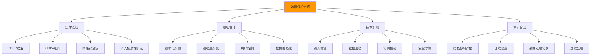

# 数据保护合规

## 🔒 数据保护法规体系

### 📊 数据保护合规框架

**数据保护合规是现代Web开发的法律基础**：



## 🎯 合规的HTML实践

### 📋 用户隐私保护实现

```html
<!DOCTYPE html>
<html lang="zh-CN">
<head>
    <meta charset="UTF-8">
    <meta name="viewport" content="width=device-width, initial-scale=1.0">
    <title>数据保护合规演示 - 隐私友好的网站</title>
    
    <!-- 隐私相关Meta标签 -->
    <meta name="robots" content="noindex, nofollow, nosnippet, noarchive">
    <meta name="referrer" content="no-referrer-when-downgrade">
    
    <!-- 隐私政策链接 -->
    <link rel="privacy-policy" href="/privacy-policy">
    <link rel="dnt" content="1">
    
    <!-- 安全的第三方资源加载 -->
    <script src="https://example.com/analytics.js" 
            async 
            defer 
            onload="analyticsLoaded()" 
            onerror="analyticsBlocked()"></script>
</head>

<body>
    <!-- 🍪 Cookie同意横幅 -->
    <div class="cookie-banner" id="cookie-banner" role="dialog" aria-labelledby="cookie-title" aria-describedby="cookie-description">
        <div class="cookie-content">
            <h2 id="cookie-title">Cookie使用说明</h2>
            <p id="cookie-description">
                我们使用Cookie来改善您的浏览体验、分析网站流量和个性化内容。
                您可以控制哪些Cookie被接受。点击"接受全部"以使用所有Cookie，
                或点击"选择Cookie"以自定义您的选择。
            </p>
            
            <!-- Cookie分类表 -->
            <div class="cookie-categories">
                <div class="cookie-category">
                    <h3>必要Cookie</h3>
                    <p>网站功能正常运行所必需的Cookie。</p>
                    <div class="cookie-toggle">
                        <label class="toggle-switch">
                            <input type="checkbox" checked disabled>
                            <span class="toggle-slider"></span>
                        </label>
                        <span class="cookie-status">始终启用</span>
                    </div>
                </div>
                
                <div class="cookie-category">
                    <h3>功能Cookie</h3>
                    <p>增强网站功能和用户体验。</p>
                    <div class="cookie-toggle">
                        <label class="toggle-switch">
                            <input type="checkbox" id="functional-cookies">
                            <span class="toggle-slider"></span>
                        </label>
                        <span class="cookie-status">可选</span>
                    </div>
                </div>
                
                <div class="cookie-category">
                    <h3>分析Cookie</h3>
                    <p>帮助我们了解网站使用情况。</p>
                    <div class="cookie-toggle">
                        <label class="toggle-switch">
                            <input type="checkbox" id="analytics-cookies">
                            <span class="toggle-slider"></span>
                        </label>
                        <span class="cookie-status">可选</span>
                    </div>
                </div>
                
                <div class="cookie-category">
                    <h3>营销Cookie</h3>
                    <p>用于个性化广告投放。</p>
                    <div class="cookie-toggle">
                        <label class="toggle-switch">
                            <input type="checkbox" id="marketing-cookies">
                            <span class="toggle-slider"></span>
                        </label>
                        <span class="cookie-status">可选</span>
                    </div>
                </div>
            </div>
            
            <!-- Cookie操作按钮 -->
            <div class="cookie-actions">
                <button type="button" onclick="acceptAllCookies()" class="btn-accept-all">
                    接受全部Cookie
                </button>
                <button type="button" onclick="saveCookiePreferences()" class="btn-save-preferences">
                    保存我的选择
                </button>
                <button type="button" onclick="rejectOptionalCookies()" class="btn-reject-optional">
                    拒绝可选Cookie
                </button>
            </div>
            
            <!-- 详细信息链接 -->
            <div class="cookie-links">
                <a href="/privacy-policy" target="_blank">隐私政策</a>
                <a href="/cookie-policy" target="_blank">Cookie政策</a>
                <a href="/data-processing-agreement" target="_blank">数据处理协议</a>
            </div>
        </div>
    </div>

    <!-- 📝 注册表单 - 数据最小化实践 -->
    <main class="main-content">
        <section class="registration-section">
            <h1>用户注册</h1>
            
            <form class="privacy-friendly-form" 
                  id="user-registration-form" 
                  action="/register" 
                  method="POST"
                  data-form-type="registration">
                
                <!-- 数据收集声明 -->
                <div class="data-collection-notice">
                    <h3>数据收集说明</h3>
                    <ul>
                        <li><strong>收集目的：</strong>创建用户账户、提供个性化服务</li>
                        <li><strong>法律依据：</strong>您的明确同意</li>
                        <li><strong>保留期限：</strong>账户活跃期间 + 2年</li>
                        <li><strong>您的权利：</strong>访问、修改、删除、数据可携带性</li>
                    </ul>
                </div>
                
                <!-- 必要信息 -->
                <fieldset class="required-fields">
                    <legend>必要信息 <span class="required-indicator">*</span></legend>
                    
                    <div class="form-group">
                        <label for="email" class="required-label">
                            电子邮箱 <span class="required-mark">*</span>
                        </label>
                        <input type="email" 
                               id="email" 
                               name="email" 
                               required
                               autocomplete="email"
                               aria-describedby="email-help"
                               data-validation="email">
                        <small id="email-help" class="form-help">
                            必需：用于登录和重要通知。我们会将此信息存储在安全的服务器上。
                        </small>
                    </div>
                    
                    <div class="form-group">
                        <label for="password" class="required-label">
                            密码 <span class="required-mark">*</span>
                        </label>
                        <input type="password" 
                               id="password" 
                               name="password" 
                               required
                               autocomplete="new-password"
                               aria-describedby="password-help"
                               data-validation="password">
                        <small id="password-help" class="form-help">
                            密码要求：至少8位，包含大小写字母、数字和特殊字符。
                            我们使用BCrypt加密存储，无法直接读取您的密码。
                        </small>
                    </div>
                </fieldset>
                
                <!-- 可选信息 -->
                <fieldset class="optional-fields">
                    <legend>可选信息 <span class="optional-indicator">（可选）</span></legend>
                    
                    <div class="privacy-explanation">
                        <p>以下信息可以帮助我们为您提供更好的服务体验。</p>
                    </div>
                    
                    <div class="form-group">
                        <label for="display-name">
                            显示名称 <span class="optional-mark">（可选）</span>
                        </label>
                        <input type="text" 
                               id="display-name" 
                               name="display_name" 
                               autocomplete="name"
                               aria-describedby="display-name-help">
                        <small id="display-name-help" class="form-help">
                            在平台上显示的名称。如果留空，将使用邮箱地址的一部分。
                        </small>
                    </div>
                    
                    <div class="form-group">
                        <label for="birth-date">
                            出生日期 <span class="optional-mark">（可选）</span>
                        </label>
                        <input type="date" 
                               id="birth-date" 
                               name="birth_date"
                               min="1900-01-01"
                               max="2010-12-31"
                               aria-describedby="birth-date-help">
                        <small id="birth-date-help" class="form-help">
                            仅用于年龄验证和个性化推荐。我们不会向第三方分享此信息。
                        </small>
                    </div>
                    
                    <div class="form-group">
                        <label for="location">
                            所在地 <span class="optional-mark">（可选）</span>
                        </label>
                        <select id="location" name="location" aria-describedby="location-help">
                            <option value="">请选择...</option>
                            <option value="CN">中国</option>
                            <option value="US">美国</option>
                            <option value="EU">欧盟</option>
                            <option value="other">其他</option>
                        </select>
                        <small id="location-help" class="form-help">
                            用于法律合规和内容本地化。此信息会被匿名化处理。
                        </small>
                    </div>
                </fieldset>
                
                <!-- 同意声明 -->
                <fieldset class="consent-section">
                    <legend>同意声明 <span class="required-indicator">*</span></legend>
                    
                    <div class="consent-items">
                        <div class="consent-item">
                            <input type="checkbox" 
                                   id="privacy-consent" 
                                   name="privacy_consent" 
                                   required
                                   aria-describedby="privacy-consent-text">
                            <label for="privacy-consent">
                                <span class="required-mark">*</span>
                                我已阅读并同意
                                <a href="/privacy-policy" target="_blank">隐私政策</a>
                            </label>
                            <small id="privacy-consent-text" class="consent-help">
                                我们根据《个人信息保护法》和GDPR规范处理您的个人数据
                            </small>
                        </div>
                        
                        <div class="consent-item">
                            <input type="checkbox" 
                                   id="marketing-consent" 
                                   name="marketing_consent"
                                   aria-describedby="marketing-consent-text">
                            <label for="marketing-consent">
                                同意接收营销信息和新产品通知
                            </label>
                            <small id="marketing-consent-text" class="consent-help">
                                您可以在账户设置中随时取消订阅
                            </small>
                        </div>
                        
                        <div class="consent-item">
                            <input type="checkbox" 
                                   id="analytics-consent" 
                                   name="analytics_consent"
                                   aria-describedby="analytics-consent-text">
                            <label for="analytics-consent">
                                同意使用分析工具改善服务
                            </label>
                            <small id="analytics-consent-text" class="consent-help">
                                帮助我们了解网站使用情况，但不涉及个人身份信息
                            </small>
                        </div>
                        
                        <div class="consent-item">
                            <input type="checkbox" 
                                   id="data-sharing-consent" 
                                   name="data_sharing_consent"
                                   aria-describedby="data-sharing-consent-text">
                            <label for="data-sharing-consent">
                                同意与合作伙伴匿名共享使用数据
                            </label>
                            <small id="data-sharing-consent-text" class="consent-help">
                                仅限去标识化的统计数据，不会包含您的个人信息
                            </small>
                        </div>
                    </div>
                </fieldset>
                
                <!-- 数据主体权利 -->
                <div class="data-rights-notice">
                    <h3>您的数据权利</h3>
                    <ul>
                        <li><strong>访问权：</strong>我们可以向您提供我们持有的关于您的个人数据</li>
                        <li><strong>更正权：</strong>您可以要求更正不准确或不完整的个人数据</li>
                        <li><strong>删除权：</strong>在某些情况下您可以要求删除您的个人数据</li>
                        <li><strong>限制处理权：</strong>您可以要求限制处理您的个人数据</li>
                        <li><strong>数据可携带权：</strong>您可以以结构化、常用和机器可读的格式接收您的数据</li>
                        <li><strong>反对权：</strong>您可以反对处理您的个人数据用于营销目的</li>
                    </ul>
                    <p>
                        行使这些权利，请联系我们的数据保护官：<br>
                        <a href="mailto:dpo@company.com">dpo@company.com</a>
                    </p>
                </div>
                
                <!-- 表单提交 -->
                <div class="form-actions">
                    <button type="submit" class="btn-submit">
                        注册账户
                    </button>
                    <button type="button" onclick="downloadUserData()" class="btn-download">
                        下载我的数据
                    </button>
                </div>
                
                <!-- 处理时间说明 -->
                <div class="processing-time-notice">
                    <p>
                        <strong>处理时间：</strong>注册请求将在24小时内处理完成。
                        如需紧急处理，请联系客服热线：400-xxx-xxxx
                    </p>
                </div>
            </form>
        </section>

        <!-- 📋 隐私仪表板 -->
        <section class="privacy-dashboard">
            <h2>隐私设置中心</h2>
            
            <div class="privacy-controls">
                <!-- Cookie设置 -->
                <div class="privacy-section">
                    <h3>Cookie偏好</h3>
                    <p>管理您希望允许的Cookie类型</p>
                    <button onclick="openCookieSettings()" class="btn-settings">
                        管理Cookie设置
                    </button>
                </div>
                
                <!-- 跟踪设置 -->
                <div class="privacy-section">
                    <h3>跟踪控制</h3>
                    <p>控制网站跟踪和分析</p>
                    <button onclick="toggleTracking()" class="btn-settings">
                        切换跟踪（<span id="tracking-status">已启用</span>）
                    </button>
                </div>
                
                <!-- 位置服务 -->
                <div class="privacy-section">
                    <h3>位置服务</h3>
                    <p>控制位置信息的收集和使用</p>
                    <button onclick="toggleLocation()" class="btn-settings">
                        切换位置服务（<span id="location-status">已禁用</span>）
                    </button>
                </div>
                
                <!-- 数据访问 -->
                <div class="privacy-section">
                    <h3>数据访问</h3>
                    <p>查看、下载或删除您的数据</p>
                    <div class="data-actions">
                        <button onclick="viewMyData()" class="btn-action">查看我的数据</button>
                        <button onclick="exportMyData()" class="btn-action">导出我的数据</button>
                        <button onclick="deleteMyData()" class="btn-action">删除我的账户</button>
                    </div>
                </div>
            </div>
        </section>

        <!-- 🔍 第三方服务声明 -->
        <section class="third-party-services">
            <h2>第三方服务说明</h2>
            
            <div class="services-list">
                <div class="service-item">
                    <h3>Google Analytics</h3>
                    <p>用于网站使用分析</p>
                    <div class="service-controls">
                        <label class="service-toggle">
                            <input type="checkbox" id="ga-enabled" onchange="toggleGA(this)">
                            <span class="toggle-slider"></span>
                        </label>
                        <span class="service-status">已启用</span>
                    </div>
                    <a href="https://analytics.google.com/" target="_blank" class="service-link">
                        查看Google Analytics隐私政策
                    </a>
                </div>
                
                <div class="service-item">
                    <h3>Tawk.to 客户服务</h3>
                    <p>用于在线客服聊天</p>
                    <div class="service-controls">
                        <label class="service-toggle">
                            <input type="checkbox" id="tawk-enabled" checked onchange="toggleTawk(this)">
                            <span class="toggle-slider"></span>
                        </label>
                        <span class="service-status">已启用</span>
                    </div>
                    <a href="https://www.tawk.to/privacy/" target="_blank" class="service-link">
                        查看Tawk.to隐私政策
                    </a>
                </div>
                
                <div class="service-item">
                    <h3>CloudFlare CDN</h3>
                    <p>用于内容分发和安全性</p>
                    <div class="service-controls">
                        <label class="service-toggle">
                            <input type="checkbox" id="cloudflare-enabled" checked disabled>
                            <span class="toggle-slider"></span>
                        </label>
                        <span class="service-status">始终启用</span>
                    </div>
                    <a href="https://www.cloudflare.com/privacypolicy/" target="_blank" class="service-link">
                        查看CloudFlare隐私政策
                    </a>
                </div>
            </div>
        </section>
    </main>

    <!-- 🔧 数据保护JavaScript实现 -->
    <script>
        // 🛡️ 数据保护管理器
        class DataProtectionManager {
            constructor() {
                this.userPreferences = this.loadPreferences();
                this.consentHistory = this.loadConsentHistory();
                this.dataProcessingRecords = new Map();
                this.init();
            }
            
            init() {
                this.setupCookieBanner();
                this.setupPrivacyForm();
                this.setupDataTracking();
                this.setupConsentManagement();
                this.checkComplianceStatus();
            }
            
            // Cookie管理
            setupCookieBanner() {
                const banner = document.getElementById('cookie-banner');
                if (!this.hasValidConsent() && banner) {
                    banner.style.display = 'block';
                }
                
                // 监听Cookie偏好变化
                document.querySelectorAll('.cookie-toggle input').forEach(toggle => {
                    toggle.addEventListener('change', () => {
                        this.updateCookiePreferences();
                    });
                });
            }
            
            hasValidConsent() {
                const consent = localStorage.getItem('user-consent');
                if (!consent) return false;
                
                const consentData = JSON.parse(consent);
                const oneYearAgo = Date.now() - (365 * 24 * 60 * 60 * 1000);
                
                return consentData.timestamp > oneYearAgo;
            }
            
            acceptAllCookies() {
                const preferences = {
                    necessary: true,
                    functional: true,
                    analytics: true,
                    marketing: true,
                    timestamp: Date.now(),
                    source: 'accept-all'
                };
                
                this.saveCookiePreferences(preferences);
                this.hideCookieBanner();
                this.loadApprovedServices();
            }
            
            saveCookiePreferences() {
                const preferences = {
                    necessary: true,
                    functional: document.getElementById('functional-cookies')?.checked || false,
                    analytics: document.getElementById('analytics-cookies')?.checked || false,
                    marketing: document.getElementById('marketing-cookies')?.checked || false,
                    timestamp: Date.now(),
                    source: 'manual-selection'
                };
                
                this.saveCookiePreferences(preferences);
                this.hideCookieBanner();
                this.loadApprovedServices();
            }
            
            rejectOptionalCookies() {
                const preferences = {
                    necessary: true,
                    functional: false,
                    analytics: false,
                    marketing: false,
                    timestamp: Date.now(),
                    source: 'reject-optional'
                };
                
                this.saveCookiePreferences(preferences);
                this.hideCookieBanner();
                this.loadApprovedServices();
            }
            
            saveCookiePreferences(preferences) {
                localStorage.setItem('user-consent', JSON.stringify(preferences));
                
                // 记录同意历史
                this.consentHistory.push({
                    action: preferences.source,
                    preferences: preferences,
                    timestamp: Date.now(),
                    userAgent: navigator.userAgent,
                    ipAddress: 'anonymous' // 实际应用中通过服务器获取
                });
                
                localStorage.setItem('consent-history', JSON.stringify(this.consentHistory));
                
                // 发送同意数据到服务器
                this.sendConsentData(preferences);
            }
            
            sendConsentData(preferences) {
                fetch('/api/consent', {
                    method: 'POST',
                    headers: {
                        'Content-Type': 'application/json'
                    },
                    body: JSON.stringify({
                        consent_preferences: preferences,
                        gpdr_consent: {
                            lawful_basis: 'consent',
                            data_category: 'cookies_and_tracking',
                            retention_period: '2 years',
                            data_subjects: ['user', 'anonymous_visitor'],
                            processing_purpose: ['website_functionality', 'analytics', 'marketing']
                        }
                    })
                }).catch(error => {
                    console.warn('无法发送同意数据:', error);
                });
            }
            
            hideCookieBanner() {
                const banner = document.getElementById('cookie-banner');
                if (banner) {
                    banner.style.display = 'none';
                }
            }
            
            loadApprovedServices() {
                const preferences = JSON.parse(localStorage.getItem('user-consent') || '{}');
                
                // 加载分析服务
                if (preferences.analytics) {
                    this.loadAnalytics();
                } else {
                    this.blockAnalytics();
                }
                
                // 加载功能服务
                if (preferences.functional) {
                    this.loadFunctionalServices();
                }
                
                // 加载营销服务
                if (preferences.marketing) {
                    this.loadMarketingServices();
                }
            }
            
            loadAnalytics() {
                // 动态加载Google Analytics
                if (!window.gtag) {
                    const gaScript = document.createElement('script');
                    gaScript.async = true;
                    gaScript.src = 'https://www.googletagmanager.com/gtag/js?id=GA_MEASUREMENT_ID';
                    document.head.appendChild(gaScript);
                    
                    window.dataLayer = window.dataLayer || [];
                    function gtag(){dataLayer.push(arguments);}
                    window.gtag = gtag;
                    
                    gtag('js', new Date());
                    gtag('config', 'GA_MEASUREMENT_ID', {
                        anonymize_ip: true,
                        cookie_expires: 63072000, // 2年
                        cookie_flags: 'SameSite=strict;Secure'
                    });
                }
            }
            
            blockAnalytics() {
                // 阻止分析脚本执行
                window.gtag = function() {
                    console.log('Analytics blocked by user consent');
                };
            }
            
            // 隐私表单处理
            setupPrivacyForm() {
                const form = document.getElementById('user-registration-form');

                form.addEventListener('submit', (e) => {
                    e.preventDefault();
                    this.handleRegistration(form);
                });
                
                // 表单验证
                this.setupFormValidation(form);
            }
            
            setupFormValidation(form) {
                const inputs = form.querySelectorAll('input[data-validation]');
                
                inputs.forEach(input => {
                    input.addEventListener('input', () => {
                        this.validateField(input);
                    });
                    
                    input.addEventListener('blur', () => {
                        this.validateField(input);
                    });
                });
            }
            
            validateField(field) {
                const value = field.value.trim();
                const type = field.dataset.validation;
                
                let isValid = true;
                let errorMessage = '';
                
                switch(type) {
                    case 'email':
                        isValid = /^[^\s@]+@[^\s@]+\.[^\s@]+$/.test(value);
                        errorMessage = isValid ? '' : '请输入有效的邮箱地址';
                        break;
                        
                    case 'password':
                        isValid = value.length >= 8 && /[A-Z]/.test(value) && /[0-9]/.test(value);
                        errorMessage = isValid ? '' : '密码必须至少8位，包含大写字母和数字';
                        break;
                }
                
                this.showFieldValidation(field, isValid, errorMessage);
                return isValid;
            }
            
            showFieldValidation(field, isValid, message) {
                const errorElement = field.parentNode.querySelector('.field-error');
                
                if (errorElement) {
                    errorElement.remove();
                }
                
                if (!isValid && message) {
                    const error = document.createElement('small');
                    error.className = 'field-error error-message';
                    error.textContent = message;
                    field.parentNode.appendChild(error);
                }
                
                field.setAttribute('aria-invalid', !isValid);
            }
            
            async handleRegistration(form) {
                const formData = new FormData(form);
                const data = Object.fromEntries(formData.entries());
                
                // 数据最小化检查
                this.validateDataMinimization(data);
                
                // 记录数据处理
                this.recordDataProcessing({
                    purpose: 'user_registration',
                    data_types: Object.keys(data),
                    legal_basis: 'explicit_consent',
                    retention_period: '2 years'
                });
                
                try {
                    const response = await fetch('/api/register', {
                        method: 'POST',
                        headers: {
                            'Content-Type': 'application/json',
                            'X-CSRF-Token': this.getCSRFToken()
                        },
                        body: JSON.stringify(data)
                    });
                    
                    const result = await response.json();
                    
                    if (response.ok) {
                        this.showSuccessMessage('注册成功！我们已向您的邮箱发送确认邮件。');
                        this.trackUserAction('registration_success', data);
                    } else {
                        this.showErrorMessage(result.error || '注册失败，请重试');
                    }
                } catch (error) {
                    this.showErrorMessage('网络错误，请检查您的连接');
                }
            }
            
            validateDataMinimization(data) {
                // 检查数据最小化原则
                const requiredFields = ['email', 'password'];
                const optionalFields = ['display_name', 'birth_date', 'location'];
                
                // 确保只收集必要数据
                if (!data.email || !data.password) {
                    throw new Error('必要信息不完整');
                }
                
                // 记录数据收集情况
                console.log('数据处理记录:', {
                    collected_fields: Object.keys(data),
                    required_fields: requiredFields.filter(field => data[field]),
                    optional_fields: optionalFields.filter(field => data[field])
                });
            }
            
            recordDataProcessing(record) {
                const timestamp = new Date().toISOString();
                const processingRecord = {
                    id: 'processing_' + Date.now(),
                    timestamp: timestamp,
                    record: record
                };
                
                this.dataProcessingRecords.set(processingRecord.id, processingRecord);
                
                // 本地记录
                const existingRecords = JSON.parse(localStorage.getItem('data-processing-records') || '[]');
                existingRecords.push(processingRecord);
                
                // 只保留最近100条记录
                if (existingRecords.length > 100) {
                    existingRecords.splice(0, existingRecords.length - 100);
                }
                
                localStorage.setItem('data-processing-records', JSON.stringify(existingRecords));
            }
            
            // 数据追踪管理
            setupDataTracking() {
                // 页面访问追踪（尊重隐私设置）
                this.trackPageView();
                
                // 表单交互追踪（匿名化）
                this.trackFormInteractions();
            }
            
            trackPageView() {
                const isTrackingAllowed = this.isTrackingAllowed();
                
                if (israckingAllowed) {
                    // 发送匿名页面访问数据
                    this.sendAnalyticsData({
                        event: 'page_view',
                        page: window.location.pathname,
                        timestamp: Date.now(),
                        anonymized_ip: this.getAnonymizedNameAddress(),
                        user_agent_hash: this.hashUserAgent()
                    });
                }
            }
            
            trackFormInteractions() {
                document.querySelectorAll('form').forEach(form => {
                    let fieldInteractionCount = 0;
                    
                    form.querySelectorAll('input, select, textarea').forEach(field => {
                        field.addEventListener('focus', () => {
                            fieldInteractionCount++;
                            
                            if (this.isTrackingAllowed()) {
                                this.sendAnalyticsData({
                                    event: 'field_focus',
                                    form_id: form.id,
                                    field_name: field.name,
                                    interaction_count: fieldInteractionCount
                                });
                            }
                        });
                    });
                    
                    form.addEventListener('submit', (e) => {
                        if (this.isTrackingAllowed()) {
                            this.sendAnalyticsData({
                                event: 'form_submit',
                                form_id: form.id,
                                form_data_fields: Array.from(form.querySelectorAll('input[name], select[name], textarea[name]')).map(field => field.name),
                                total_interactions: fieldInteractionCount
                            });
                        }
                    });
                });
            }
            
            getAnonymizedIPAddress() {
                // IP地址匿名化（实际应用中需要服务器端处理）
                return 'xxx.xxx.xxx.xxx';
            }
            
            hashUserAgent() {
                // User Agent哈希处理
                const crypto = window.crypto || window.msCrypto;
                if (crypto && crypto.subtle) {
                    // 实际应用中需要更复杂的哈希处理
                    return 'hashed_user_agent';
                }
                return 'anonymous';
            }
            
            sendAnalyticsData(data) {
                // 发送分析数据（实际实现）
                fetch('/api/analytics', {
                    method: 'POST',
                    headers: {
                        'Content-Type': 'application/json'
                    },
                    body: JSON.stringify({
                        analytics_data: data,
                        consent_status: this.getConsentStatus(),
                        data_protection_info: {
                            anonymized: true,
                            purpose_limitation: 'website_improvement',
                            data_subject_rights_respected: true
                        }
                    })
                }).catch(error => {
                    console.warn('分析数据发送失败:', error);
                });
            }
            
            getConsentStatus() {
                const consent = JSON.parse(localStorage.getItem('user-consent') || '{}');
                return {
                    necessary: consent.necessary !== false,
                    functional: consent.functional === true,
                    analytics: consent.analytics === true,
                    marketing: consent.marketing === true,
                    timestamp: consent.timestamp || null
                };
            }
            
            // 同意管理
            setupConsentManagement() {
                this.setupConsentWithdrawal();
                this.setupDataPortability();
                this.setupDataDeletion();
            }
            
            setupConsentWithdrawal() {
                // 同意撤回功能
                const withdrawBtns = document.querySelectorAll('[data-withdrawal]');
                withdrawBtns.forEach(btn => {
                    btn.addEventListener('click', () => {
                        this.processConsentWithdrawal(btn.dataset.withdrawal);
                    });
                });
            }
            
            processConsentWithdrawal(consentType) {
                const currentConsent = JSON.parse(localStorage.getItem('user-consent') || '{}');
                
                // 撤回特定类型的同意
                if (consentType === 'analytics') {
                    currentConsent.analytics = false;
                } else if (consentType === 'marketing') {
                    currentConsent.marketing = false;
                } else if (consentType === 'all') {
                    currentConsent.analytics = false;
                    currentConsent.marketing = false;
                    currentConsent.functional = false;
                }
                
                currentConsent.timestamp = Date.now();
                currentConsent.withdrawal_source = consentType;
                
                this.saveCookiePreferences(currentConsent);
                
                // 通知用户
                this.showSuccessMessage(`已成功撤回${consentType}相关同意`);
            }
            
            // 用户数据管理
            async downloadUserData() {
                const formToken = prompt('请输入您的邮箱地址以验证身份：');
                if (!formToken) return;
                
                try {
                    const response = await fetch('/api/user/data/export', {
                        method: 'POST',
                        headers: {
                            'Content-Type': 'application/json',
                            'X-Verification-Email': formToken
                        }
                    });
                    
                    if (response.ok) {
                        const blob = await response.blob();
                        const url = window.URL.createObjectURL(blob);
                        const link = document.createElement('a');
                        link.href = url;
                        link.download = `my-data-${Date.now()}.json`;
                        document.body.appendChild(link);
                        link.click();
                        document.body.removeChild(link);
                        window.URL.revokeObjectURL(url);
                        
                        this.showSuccessMessage('数据导出成功！');
                    } else {
                        this.showErrorMessage('数据导出失败，请重试');
                    }
                } catch (error) {
                    this.showErrorMessage('网络错误，请重试');
                }
            }
            
            async deleteUserData() {
                if (!confirm('警告：此操作将永久删除您的所有数据，且无法恢复。确定要继续吗？')) {
                    return;
                }
                
                const verification = prompt('请输入"确认删除"以继续：');
                if (verification !== '确认删除') {
                    this.showErrorMessage('验证失败，操作已取消');
                    return;
                }
                
                try {
                    const response = await fetch('/api/user/data/delete', {
                        method: 'DELETE',
                        headers: {
                            'X-Verification-Token': this.getCSRFToken()
                        }
                    });
                    
                    if (response.ok) {
                        this.showSuccessMessage('数据删除完成。您已被登出。');
                        this.clearLocalData();
                        setTimeout(() => {
                            window.location.href = '/';
                        }, 2000);
                    } else {
                        this.showErrorMessage('数据删除失败，请联系客服');
                    }
                } catch (error) {
                    this.showErrorMessage('网络错误，操作失败');
                }
            }
            
            clearLocalData() {
                localStorage.removeItem('user-consent');
                localStorage.removeItem('consent-history');
                localStorage.removeItem('data-processing-records');
                localStorage.removeItem('user-preferences');
            }
            
            // 工具方法
            loadPreferences() {
                return JSON.parse(localStorage.getItem('user-preferences') || '{}');
            }
            
            loadConsentHistory() {
                return JSON.parse(localStorage.getItem('consent-history') || '[]');
            }
            
            isTrackingAllowed() {
                const consent = JSON.parse(localStorage.getItem('user-consent') || '{}');
                return consent.analytics === true;
            }
            
            getCSRFToken() {
                return document.querySelector('meta[name="csrf-token"]')?.getAttribute('content') || '';
            }
            
            showSuccessMessage(message) {
                this.showNotification(message, 'success');
            }
            
            showErrorMessage(message) {
                this.showNotification(message, 'error');
            }
            
            showNotification(message, type) {
                const notification = document.createElement('div');
                notification.className = `notification notification-${type}`;
                notification.textContent = message;
                
                document.body.appendChild(notification);
                
                setTimeout(() => {
                    notification.remove();
                }, 5000);
            }
            
            checkComplianceStatus() {
                // GDPR合规检查
                if (!this.hasValidConsent()) {
                    console.warn('⚠️ GDPR合规：缺少有效的用户同意');
                }
                
                // Cookie合规检查
                const consent = JSON.parse(localStorage.getItem('user-consent') || '{}');
                if (!consent && navigator.cookieEnabled) {
                    console.warn('⚠️ Cookie合规：需要用户同意');
                }
                
                // 数据保护影响评估
                this.performDPIA();
            }
            
            performDPIA() {
                const dpiaStatus = {
                    data_minimization: 'compliant',
                    purpose_limitation: 'compliant',
                    storage_limitation: 'compliant',
                    accuracy: 'review_needed',
                    security: 'assessment_required'
                };
                
                console.log('数据保护影响评估结果:', dpiaStatus);
                
                // 发送DPIA记录到服务器
                this.recordDataProcessing({
                    purpose: 'dpiasessment',
                    assessment_type: 'automated_dpia',
                    result: dpiaStatus,
                    compliance_level: 'partial_compliance'
                });
            }
            
            // 第三方服务管理
            toggleGA(enabled) {
                const status = document.getElementById('tracking-status');
                if (enabled) {
                    this.loadAnalytics();
                    status.textContent = '已启用';
                } else {
                    this.blockAnalytics();
                    status.textContent = '已禁用';
                }
            }
            
            toggleTawk(enabled) {
                const tawk = document.getElementById('tracking-status');
                if (enabled) {
                    Tawk_API?.showWidget();
                } else {
                    Tawk_API?.hideWidget();
                }
            }
            
            toggleLocation() {
                const status = document.getElementById('location-status');
                if (navigator.geolocation) {
                    status.textContent = status.textContent === '已禁用' ? '已启用' : '已禁用';
                }
            }
            
            trackUserAction(action, data) {
                if (this.isTrackingAllowed()) {
                    this.sendAnalyticsData({
                        event: 'user_action',
                        action: action,
                        timestamp: Date.now(),
                        session_id: this.getSessionId()
                    });
                }
            }
            
            getSessionId() {
                let sessionId = sessionStorage.getItem('session-id');
                if (!sessionId) {
                    sessionId = 'session_' + Date.now() + '_' + Math.random().toString(36);
                    sessionStorage.setItem('session-id', sessionId);
                }
                return sessionId;
            }
        }

        // 🎯 全局便捷函数
        function acceptAllCookies() {
            window.dataProtection.acceptAllCookies();
        }
        
        function saveCookiePreferences() {
            window.dataProtection.saveCookiePreferences();
        }
        
        function rejectOptionalCookies() {
            window.dataProtection.rejectOptionalCookies();
        }
        
        function downloadUserData() {
            window.dataProtection.downloadUserData();
        }
        
        function deleteMyData() {
            window.dataProtection.deleteUserData();
        }
        
        function viewMyData() {
            alert('数据查看功能需要通过用户登录来实现');
        }
        
        function exportMyData() {
            downloadUserData();
        }
        
        function toggleTracking() {
            const checkbox = document.getElementById('ga-enabled');
            checkbox.checked = !checkbox.checked;
            window.dataProtection.toggleGA(checkbox.checked);
        }
        
        function toggleLocation() {
            window.dataProtection.toggleLocation();
        }
        
        function openCookieSettings() {
            document.getElementById('cookie-banner').style.display = 'block';
        }
        
        function analyticsLoaded() {
            console.log('✅ Analytics服务已加载');
        }
        
        function analyticsBlocked() {
            console.log('🚫 Analytics服务被阻止');
        }

        // 🚀 初始化数据保护管理器
        document.addEventListener('DOMContentLoaded', () => {
            window.dataProtection = new DataProtectionManager();
            console.log('数据保护合规系统已初始化');
            
            // 全局数据保护工具
            window.DataProtectionTools = {
                checkCompliance: () => window.dataProtection.checkComplianceStatus(),
                exportConsent: () => localStorage.getItem('user-consent'),
                viewProcessingRecords: () => window.dataProtection.dataProcessingRecords,
                getDPIAReport: () => window.dataProtection.performDPIA()
            };
        });
    </script>
</body>
</html>
```

---
<｜tool▁calls▁begin｜><｜tool▁call▁begin｜>
todo_write
