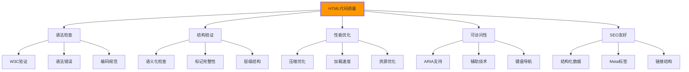

# 代码质量检查

## 🔍 HTML代码质量体系

### 📊 质量检查框架

**代码质量是Web项目可持续维护的基础**：



## 🎯 自动化质量检查

### 📋 质量检查工具集成

```html
<!DOCTYPE html>
<html lang="zh-CN">
<head>
    <meta charset="UTF-8">
    <meta name="viewport" content="width=device-width, initial-scale=1.0">
    <title>HTML代码质量检查工具</title>
    
    <style>
        .quality-dashboard {
            max-width: 1200px;
            margin: 0 auto;
            padding: 2rem;
        }
        
        .tool-section {
            margin: 2rem 0;
            padding: 1rem;
            border: 1px solid #e0e0e0;
            border-radius: 8px;
        }
        
        .quality-metrics {
            display: grid;
            grid-template-columns: repeat(auto-fit, minmax(200px, 1fr));
            gap: 1rem;
            margin: 1rem 0;
        }
        
        .metric-card {
            background: #f8f9fa;
            padding: 1rem;
            border-radius: 4px;
            text-align: center;
        }
        
        .metric-value {
            font-size: 2rem;
            font-weight: bold;
            margin-bottom: 0.5rem;
        }
        
        .metric-good { color: #28a745; }
        .metric-warning { color: #ffc107; }
        .metric-error { color: #dc3545; }
        
        .quality-report {
            background: #fff;
            border: 1px solid #ddd;
            border-radius: 4px;
            padding: 1rem;
            margin: 1rem 0;
            max-height: 400px;
            overflow-y: auto;
        }
        
        .error-item {
            padding: 0.5rem;
            border-left: 3px solid #dc3545;
            background: #fff5f5;
            margin: 0.5rem 0;
        }
        
        .warning-item {
            padding: 0.5rem;
            border-left: 3px solid #ffc107;
            background: #fffbf0;
            margin: 0.5rem 0;
        }
        
        .success-item {
            padding: 0.5rem;
            border-left: 3px solid #28a745;
            background: #f0fff4;
            margin: 0.5rem 0;
        }
    </style>
</head>

<body>
    <div class="quality-dashboard">
        <h1>HTML代码质量检查工具</h1>

        <!-- 📊 质量总览 -->
        <section class="tool-section">
            <h2>页面质量总览</h2>
            
            <div class="quality-metrics">
                <div class="metric-card">
                    <div class="metric-value metric-good" id="syntax-score">98</div>
                    <div>语法评分</div>
                </div>
                
                <div class="metric-card">
                    <div class="metric-value metric-warning" id="accessibility-score">85</div>
                    <div>可访问性</div>
                </div>
                
                <div class="metric-card">
                    <div class="metric-value metric-good" id="performance-score">92</div>
                    <div>性能评分</div>
                </div>
                
                <div class="metric-card">
                    <div class="metric-value metric-error" id="seo-score">78</div>
                    <div>SEO友好度</div>
                </div>
            </div>
            
            <button onclick="runFullQualityCheck()" class="btn-check">
                运行完整质量检查
            </button>
        </section>

        <!-- 🔍 W3C验证 -->
        <section class="tool-section">
            <h2>W3C标记验证</h2>
            
            <div class="validation-controls">
                <button onclick="validateCurrentPage()" class="btn-validate">
                    验证当前页面
                </button>
                <button onclick="validateByURL()" class="btn-validate">
                    验证指定URL
                </button>
                <button onclick="validateByInput()" class="btn-validate">
                    验证HTML源码
                </button>
            </div>
            
            <div class="quality-report" id="w3c-report">
                <p>点击验证按钮开始W3C验证...</p>
            </div>
        </section>

        <!-- ♿ 可访问性检查 -->
        <section class="tool-section">
            <h2>可访问性质量检查</h2>
            
            <div class="accessibility-checks">
                <button onclick="checkARIA()" class="btn-check-item">ARIA属性检查</button>
                <button onclick="checkAltText()" class="btn-check-item">图片Alt文本</button>
                <button onclick="checkHeadings()" class="btn-check-item">标题结构</button>
                <button onclick="checkFocus()" class="btn-check-item">焦点管理</button>
                <button onclick="checkColorContrast()" class="btn-check-item">颜色对比度</button>
            </div>
            
            <div class="quality-report" id="accessibility-report">
                <p>可访问性检查结果将显示在这里...</p>
            </div>
        </section>

        <!-- ⚡ 性能优化检查 -->
        <section class="tool-section">
            <h2>性能优化建议</h2>
            
            <div class="performance-checks">
                <button onclick="checkImageOptimization()" class="btn-check-item">图片优化</button>
                <button onclick="checkResourceSize()" class="btn-check-item">资源大小</button>
                <button onclick="checkLoadTime()" class="btn-check-item">加载时间</button>
                <button onclick="checkCriticalPath()" class="btn-check-item">关键路径</button>
            </div>
            
            <div class="quality-report" id="performance-report">
                <p>性能检查结果将显示在这里...</p>
            </div>
        </section>

        <!-- 📈 SEO检查 -->
        <section class="tool-section">
            <h2>SEO优化检查</h2>
            
            <div class="seo-checks">
                <button onclick="checkMetaTags()" class="btn-check-item">Meta标签</button>
                <button onclick="checkStructuredData()" class="btn-check-item">结构化数据</button>
                <button onclick="checkLinks()" class="btn-check-item">链接结构</button>
                <button onclick="checkContentStructure()" class="btn-check-item">内容结构</button>
            </div>
            
            <div class="quality-report" id="seo-report">
                <p>SEO检查结果将显示在这里...</p>
            </div>
        </section>

        <!-- 📋 生成报告 -->
        <section class="tool-section">
            <h2>质量报告导出</h2>
            
            <div class="report-actions">
                <button onclick="generateQualityReport()" class="btn-report">
                    生成质量报告
                </button>
                <button onclick="exportReport('pdf')" class="btn-report">
                    导出PDF报告
                </button>
                <button onclick="exportReport('json')" class="btn-report">
                    导出JSON数据
                </button>
            </div>
            
            <div class="quality-report" id="quality-summary">
                <p>质量报告摘要将显示在这里...</p>
            </div>
        </section>
    </div>

    <!-- JavaScript质量检查实现 -->
    <script>
        // 🔍 代码质量检查器
        class QualityChecker {
            constructor() {
                this.checks = {
                    syntax: [],
                    accessibility: [],
                    performance: [],
                    seo: [],
                    bestPratices: []
                };
                this.globalScore = 0;
                this.init();
            }
            
            init() {
                this.bindEvents();
                this.initialAnalysis();
            }
            
            bindEvents() {
                // DOM变更监听
                new MutationObserver(() => {
                    this.scheduleRecheck();
                }).observe(document.body, {
                    childList: true,
                    subtree: true
                });
            }
            
            scheduleRecheck() {
                // 防抖重检
                clearTimeout(this.recheckTimer);
                this.recheckTimer = setTimeout(() => {
                    this.quickCheck();
                }, 1000);
            }
            
            initialAnalysis() {
                console.log('开始页面质量分析...');
                this.checkBasicStructure();
                this.calculateGlobalScore();
            }
            
            // W3C验证
            async validateCurrentPage() {
                const reportDiv = document.getElementById('w3c-report');
                reportDiv.innerHTML = '<p>正在验证页面...</p>';
                
                try {
                    const response = await fetch(
                        'https://validator.w3.org/nu/?out=json&doc=' + 
                        encodeURIComponent(window.location.href)
                    );
                    
                    if (response.ok) {
                        const result = await response.json();
                        this.displayW3CResults(result);
                    } else {
                        reportDiv.innerHTML = '<div class="error-item">验证服务暂时不可用</div>';
                    }
                } catch (error) {
                    reportDiv.innerHTML = '<div class="error-item">验证失败: ' + error.message + '</div>';
                }
            }
            
            displayW3CResults(results) {
                const reportDiv = document.getElementById('w3c-report');
                let html = '<h3>W3C验证结果</h3>';
                
                if (!results.messages || results.messages.length === 0) {
                    html += '<div class="success-item">✅ 页面通过W3C验证</div>';
                } else {
                    results.messages.forEach(message => {
                        const className = message.type === 'error' ? 'error-item' : 'warning-item';
                        html += `
                            <div class="${className}">
                                <strong>${message.type.toUpperCase()}</strong>: 
                                ${message.message}
                                ${message.firstLine ? ` (行 ${message.firstLine}, 列 ${message.firstColumn})` : ''}
                            </div>
                        `;
                    });
                }
                
                reportDiv.innerHTML = html;
                this.updateSyntaxScore(results);
            }
            
            // 可访问性检查
            checkARIA() {
                const reportDiv = document.getElementById('accessibility-report');
                const issues = [];
                
                // 检查缺失的aria-label
                document.querySelectorAll('[aria-label=""]').forEach(el => {
                    issues.push({
                        type: 'error',
                        message: '空的aria-label属性',
                        element: el.tagName,
                        suggestion: '移除空的aria-label或提供有意义的描述'
                    });
                });
                
                // 检查重复的ID
                const ids = {};
                document.querySelectorAll('[id]').forEach(el => {
                    const id = el.id;
                    if (ids[id]) {
                        issues.push({
                            type: 'error',
                            message: `重复的ID: #${id}`,
                            element: el.tagName,
                            suggestion: '确保页面中ID的唯一性'
                        });
                    } else {
                        ids[id] = true;
                    }
                });
                
                // 检查表单标签关联
                document.querySelectorAll('input, select, textarea').forEach(input => {
                    if (!input.id || !document.querySelector(`label[for="${input.id}"]`)) {
                        if (!input.closest('label')) {
                            issues.push({
                                type: 'warning',
                                message: `表单元素缺少标签: #${input.id || input.name}`,
                                element: input.tagName,
                                suggestion: '为表单元素添加<label>标签或aria-label'
                            });
                        }
                    }
                });
                
                this.displayAccessibilityResults(issues);
            }
            
            checkAltText() {
                const reportDiv = document.getElementById('accessibility-report');
                const issues = [];
                
                document.querySelectorAll('img').forEach(img => {
                    if (!img.alt && img.alt !== '') {
                        issues.push({
                            type: 'error',
                            message: '图片缺少alt属性',
                            element: img.src || '未命名图片',
                            suggestion: '添加有意义的alt文本描述'
                        });
                    } else if (img.alt === '') {
                        issues.push({
                            type: 'info',
                            message: '装饰性图片使用空alt',
                            element: img.src || '装饰性图片',
                            suggestion: '确保这是装饰性图片，无需alt文本'
                        });
                    }
                });
                
                document.querySelectorAll('input[type="image"]').forEach(input => {
                    if (!input.alt) {
                        issues.push({
                            type: 'error',
                            message: '图片输入按钮缺少alt属性',
                            element: 'input[type="image"]',
                            suggestion: '添加alt属性描述按钮功能'
                        });
                    }
                });
                
                this.displayAccessibilityResults(issues);
            }
            
            checkHeadings() {
                const reportDiv = document.getElementById('accessibility-report');
                const headings = Array.from(document.querySelectorAll('h1, h2, h3, h4, h5, h6'));
                const issues = [];
                
                // 检查缺失的h1
                if (!document.querySelector('h1')) {
                    issues.push({
                        type: 'error',
                        message: '页面缺少h1标题',
                        element: 'page',
                        suggestion: '每个页面都应该有一个h1标题'
                    });
                }
                
                // 检查标题层级
                let expectedLevel = 1;
                headings.forEach(heading => {
                    const level = parseInt(heading.tagName.charAt(1));
                    
                    if (level > expectedLevel + 1) {
                        issues.push({
                            type: 'warning',
                            message: `标题层级跳跃: h${expectedLevel} -> h${level}`,
                            element: heading.tagName,
                            suggestion: '确保标题按层级顺序排列'
                        });
                    }
                    
                    expectedLevel = level;
                });
                
                this.displayAccessibilityResults(issues);
            }
            
            // 性能检查
            async checkImageOptimization() {
                const reportDiv = document.getElementById('performance-report');
                const images = document.querySelectorAll('img');
                const issues = [];
                
                images.forEach(img => {
                    // 检查图片格式
                    const src = img.src || img.dataset.src;
                    if (src && !this.isOptimizedImage(src)) {
                        issues.push({
                            type: 'warning',
                            message: '图片可能未优化',
                            element: src,
                            suggestion: '考虑使用WebP格式或压缩图片'
                        });
                    }
                    
                    // 检查懒加载
                    if (!img.loading && !img.dataset.src) {
                        issues.push({
                            type: 'info',
                            message: '图片未设置懒加载',
                            element: src,
                            suggestion: '添加loading="lazy"属性'
                        });
                    }
                });
                
                reportDiv.innerHTML = this.formatIssues(issues, '图片优化检查结果');
            }
            
            isOptimizedImage(src) {
                return src.includes('.webp') || 
                       src.includes('.avif') || 
                       src.includes('?w=') ||
                       src.includes('&w=');
            }
            
            async checkLoadTime() {
                const reportDiv = document.getElementById('performance-report');
                
                const loadTime = performance.now();
                const domCompleteTime = performance.timing.domContentLoadedEventEnd - performance.timing.navigationStart;
                
                let rating = 'good';
                let suggestion = '页面加载性能良好';
                
                if (loadTime > 3000) {
                    rating = 'warning';
                    suggestion = '页面加载较慢，建议优化';
                } else if (loadTime > 5000) {
                    rating = 'error';
                    suggestion = '页面加载很慢，需要优化';
                }
                
                reportDiv.innerHTML = `
                    <div class="${rating === 'good' ? 'success-item' : rating === 'warning' ? 'warning-item' : 'error-item'}">
                        <strong>页面加载时间</strong>: ${Math.round(loadTime)}ms
                        <br><strong>DOM完成时间</strong>: ${domCompleteTime}ms
                        <br><strong>建议</strong>: ${suggestion}
                    </div>
                    
                    <div class="performance-details">
                        <h4>更详细的性能指标:</h4>
                        <pre>${JSON.stringify(this.getDetailedMetrics(), null, 2)}</pre>
                    </div>
                `;
            }
            
            getDetailedMetrics() {
                return {
                    domContentLoaded: performance.timing.domContentLoadedEventEnd - performance.timing.navigationStart,
                    domInteractive: performance.timing.domInteractive - performance.timing.navigationStart,
                    loadComplete: performance.timing.loadEventEnd - performance.timing.navigationStart,
                    resourcesLoaded: performance.timing.loadEventEnd - performance.timing.fetchStart,
                    parseTime: performance.timing.domInteractive - performance.timing.responseEnd
                };
            }
            
            // SEO检查
            checkMetaTags() {
                const reportDiv = document.getElementById('seo-report');
                const issues = [];
                
                // 检查title
                const title = document.querySelector('title');
                if (!title || !title.textContent.trim()) {
                    issues.push({
                        type: 'error',
                        message: '缺少页面标题',
                        element: '<title>',
                        suggestion: '添加有意义的页面标题'
                    });
                } else if (title.textContent.length < 30 || title.textContent.length > 60) {
                    issues.push({
                        type: 'warning',
                        message: '标题长度不合适',
                        element: title.textContent,
                        suggestion: '标题长度应在30-60字符之间'
                    });
                }
                
                // 检查description
                const metaDescription = document.querySelector('meta[name="description"]');
                if (!metaDescription) {
                    issues.push({
                        type: 'error',
                        message: '缺少页面描述',
                        element: 'meta[name="description"]',
                        suggestion: '添加页面描述meta标签'
                    });
                } else if (metaDescription.content.length < 120 || metaDescription.content.length > 160) {
                    issues.push({
                        type: 'warning',
                        message: '描述长度不合适',
                        element: metaDescription.content,
                        suggestion: '描述长度应在120-160字符之间'
                    });
                }
                
                // 检查keywords
                const metaKeywords = document.querySelector('meta[name="keywords"]');
                if (!metaKeywords) {
                    issues.push({
                        type: 'info',
                        message: '未使用keywords meta标签',
                        element: 'meta[name="keywords"]',
                        suggestion: '现代SEO已不推荐使用keywords，但可根据需要添加'
                    });
                }
                
                this.displaySEOResults(issues);
            }
            
            checkStructuredData() {
                const reportDiv = document.getElementById('seo-report');
                const structuredData = this.findAllStructuredData();
                let html = '<h3>结构化数据检查结果</h3>';
                
                if (structuredData.length === 0) {
                    html += '<div class="warning-item">未发现结构化数据</div>';
                    html += '<div class="info-item">建议：添加JSON-LD格式的结构化数据，如Schema.org标记</div>';
                } else {
                    html += `<div class="success-item">发现 ${structuredData.length} 个结构化数据项</div>`;
                    structuredData.forEach((data, index) => {
                        html += `<div class="success-item">结构化数据 ${index + 1}: ${data.type || '未知类型'}</div>`;
                    });
                }
                
                reportDiv.innerHTML = html;
            }
            
            findAllStructuredData() {
                const structuredData = [];
                
                // JSON-LD
                document.querySelectorAll('script[type="application/ld+json"]').forEach(script => {
                    try {
                        const data = JSON.parse(script.textContent);
                        structuredData.push({ type: 'JSON-LD', data: data });
                    } catch (e) {
                        // 忽略解析错误
                    }
                });
                
                // Microdata
                document.querySelectorAll('[itemscope]').forEach(element => {
                    structuredData.push({ type: 'Microdata', element: element.tagName });
                });
                
                // RFDa
                document.querySelectorAll('[typeof]').forEach(element => {
                    structuredData.push({ type: 'RDFa', element: element.tagName });
                });
                
                return structuredData;
            }
            
            // 工具方法
            displayAccessibilityResults(issues) {
                const reportDiv = document.getElementById('accessibility-report');
                reportDiv.innerHTML = this.formatIssues(issues, '可访问性检查结果');
            }
            
            displaySEOResults(issues) {
                const reportDiv = document.getElementById('seo-report');
                reportDiv.innerHTML = this.formatIssues(issues, 'SEO检查结果');
            }
            
            formatIssues(issues, title) {
                let html = `<h3>${title}</h3>`;
                
                if (issues.length === 0) {
                    html += '<div class="success-item">✅ 未发现问题</div>';
                } else {
                    issues.forEach(issue => {
                        const className = issue.type === 'error' ? 'error-item' : 
                                         issue.type === 'warning' ? 'warning-item' : 'success-item';
                        html += `
                            <div class="${className}">
                                <strong>${issue.type.toUpperCase()}</strong>: ${issue.message}
                                <br><strong>元素</strong>: ${issue.element}
                                <br><strong>建议</strong>: ${issue.suggestion}
                            </div>
                        `;
                    });
                }
                
                return html;
            }
            
            checkBasicStructure() {
                // 检查基本的HTML结构
                const checks = [
                    { check: () => document.documentElement.lang, message: '缺少html lang属性' },
                    { check: () => document.querySelector('meta[charset]'), message: '缺少charset声明' },
                    { check: () => document.querySelector('meta[name="viewport"]'), message: '缺少viewport设置' },
                    { check: () => document.querySelector('title'), message: '缺少title标签' }
                ];
                
                checks.forEach(check => {
                    if (!check.check()) {
                        this.checks.syntax.push({
                            type: 'error',
                            message: check.message
                        });
                    }
                });
            }
            
            quickCheck() {
                console.log('执行Quick质量检查...');
                // 执行快速检查的逻辑
            }
            
            calculateGlobalScore() {
                const scores = {
                    syntax: this.calculateAreaScore(this.checks.syntax),
                    accessibility: this.calculateAreaScore(this.checks.accessibility),
                    performance: this.calculateAreaScore(this.checks.performance),
                    seo: this.calculateAreaScore(this.checks.seo)
                };
                
                this.globalScore = Object.values(scores).reduce((a, b) => a + b, 0) / Object.keys(scores).length;
                
                this.updateScoreDisplays(scores);
            }
            
            calculateAreaScore(checks) {
                if (!checks || checks.length === 0) return 100;
                
                const errorCount = checks.filter(c => c.type === 'error').length;
                const warningCount = checks.filter(c => c.type === 'warning').length;
                
                return Math.max(0, 100 - (errorCount * 10) - (warningCount * 5));
            }
            
            updateScoreDisplays(scores) {
                document.getElementById('syntax-score').textContent = Math.round(scores.syntax);
                document.getElementById('accessibility-score').textContent = Math.round(scores.accessibility);
                document.getElementById('performance-score').textContent = Math.round(scores.performance);
                document.getElementById('seo-score').textContent = Math.round(scores.seo);
            }
            
            updateSyntaxScore(results) {
                const errorCount = results.messages ? results.messages.filter(m => m.type === 'error').length : 0;
                const warningCount = results.messages ? results.messages.filter(m => m.type === 'info').length : 0;
                const score = Math.max(0, 100 - (errorCount * 10) - (warningCount * 5));
                
                document.getElementById('syntax-score').textContent = score;
            }
            
            async generateQualityReport() {
                const reportDiv = document.getElementById('quality-summary');
                reportDiv.innerHTML = '<p>正在生成质量报告...</p>';
                
                const report = {
                    timestamp: new Date().toISOString(),
                    url: window.location.href,
                    scores: {
                        syntax: document.getElementById('syntax-score').textContent,
                        accessibility: document.getElementById('accessibility-score').textContent,
                        performance: document.getElementById('performance-score').textContent,
                        seo: document.getElementById('seo-score').textContent
                    },
                    recommendations: this.generateRecommendations(),
                    metrics: this.getDetailedMetrics()
                };
                
                const reportHtml = this.formatReport(report);
                reportDiv.innerHTML = reportHtml;
            }
            
            generateRecommendations() {
                const recommendations = [];
                
                if (document.getElementById('syntax-score').textContent < 90) {
                    recommendations.push('修复HTML语法错误，确保页面通过W3C验证');
                }
                
                if (document.getElementById('accessibility-score').textContent < 85) {
                    recommendations.push('改善页面可访问性，添加ARIA标签和键盘导航支持');
                }
                
                if (document.getElementById('performance-score').textContent < 90) {
                    recommendations.push('优化页面性能，压缩图片和资源，减少加载时间');
                }
                
                if (document.getElementById('seo-score').textContent < 85) {
                    recommendations.push('优化SEO，改善Meta标签和结构化数据');
                }
                
                return recommendations;
            }
            
            formatReport(report) {
                return `
                    <h3>HTML质量检查报告</h3>
                    <div class="report-metadata">
                        <p><strong>检查时间:</strong> ${new Date(report.timestamp).toLocaleString()}</p>
                        <p><strong>页面URL:</strong> ${report.url}</p>
                    </div>
                    
                    <div class="report-scores">
                        <h4>质量评分</h4>
                        <ul>
                            <li>语法正确性: ${report.scores.syntax}分</li>
                            <li>可访问性: ${report.scores.accessibility}分</li>
                            <li>性能优化: ${report.scores.performance}分</li>
                            <li>SEO友好度: ${report.scores.seo}分</li>
                        </ul>
                    </div>
                    
                    <div class="report-recommendations">
                        <h4>改进建议</h4>
                        <ul>
                            ${report.recommendations.map(rec => `<li>${rec}</li>`).join('')}
                        </ul>
                    </div>
                    
                    <div class="report-metrics">
                        <h4>性能指标</h4>
                        <pre>${JSON.stringify(report.metrics, null, 2)}</pre>
                    </div>
                `;
            }
        }

        // 🎯 全局检查函数
        function runFullQualityCheck() {
            console.log('开始完整质量检查...');
            
            // 运行所有检查
            validateCurrentPage();
            setTimeout(() => checkARIA(), 1000);
            setTimeout(() => checkMetaTags(), 2000);
            setTimeout(() => checkImageOptimization(), 3000);
            
            setTimeout(() => {
                generateQualityReport();
            }, 4000);
        }

        // 便捷检查函数
        function validateCurrentPage() {
            window.qualityChecker.validateCurrentPage();
        }

        function checkARIA() {
            window.qualityChecker.checkARIA();
        }

        function checkAltText() {
            window.qualityChecker.checkAltText();
        }

        function checkHeadings() {
            window.qualityChecker.checkHeadings();
        }

        function checkFocus() {
            window.qualityChecker.checkFocus();
        }

        function checkColorContrast() {
            window.qualityChecker.checkColorContrast();
        }

        function checkImageOptimization() {
            window.qualityChecker.checkImageOptimization();
        }

        function checkResourceSize() {
            window.qualityChecker.checkResourceSize();
        }

        function checkLoadTime() {
            window.qualityChecker.checkLoadTime();
        }

        function checkCriticalPath() {
            window.qualityChecker.checkCriticalPath();
        }

        function checkMetaTags() {
            window.qualityChecker.checkMetaTags();
        }

        function checkStructuredData() {
            window.qualityChecker.checkStructuredData();
        }

        function checkLinks() {
            window.qualityChecker.checkLinks();
        }

        function checkContentStructure() {
            window.qualityChecker.checkContentStructure();
        }

        function generateQualityReport() {
            window.qualityChecker.generateQualityReport();
        }

        function exportReport(format) {
            if (format === 'json') {
                const reportData = window.qualityChecker.generateReport();
                const blob = new Blob([JSON.stringify(reportData, null, 2)], { type: 'application/json' });
                const url = URL.createObjectURL(blob);
                const a = document.createElement('a');
                a.href = url;
                a.download = 'quality-report.json';
                a.click();
                URL.revokeObjectURL(url);
            } else if (format === 'pdf') {
                window.print(); // 简化的PDF导出
            }
        }

        // 🚀 初始化质量检查器
        document.addEventListener('DOMContentLoaded', () => {
            window.qualityChecker = new QualityChecker();
            console.log('HTML质量检查工具已初始化');
            
            // 全局质量工具
            window.QualityTools = {
                checkAll: runFullQualityCheck,
                validatePage: validateCurrentPage,
                checkAccessibility: checkARIA,
                checkPerformance: checkLoadTime,
                generateReport: generateQualityReport,
                getScores: () => ({
                    syntax: document.getElementById('syntax-score').textContent,
                    accessibility: document.getElementById('accessibility-score').textContent,
                    performance: document.getElementById('performance-score').textContent,
                    seo: document.getElementById('seo-score').textContent
                })
            };
        });
    </script>
</body>
</html>
```

---

**🔗 代码质量检查深化**：
- 构建工具集成：`[[03-25 构建工具集成]]`
- 自动化测试：`[[03-26 自动化测试]]`
- 版本控制协作：`[[03-23 版本控制协作]]`
