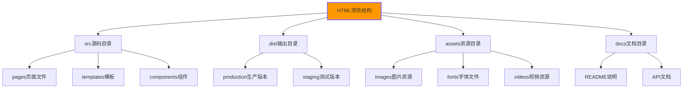

# 项目文件组织

## 🗂️ HTML项目结构设计

### 📊 现代项目组织架构

**高质量HTML项目需要科学合理的文件组织**：



## 🏗️ 标准项目结构

### 📁 文件目录结构示例

```
html-project/
├── 📁 src/                          # 源码目录
│   ├── 📁 pages/                    # 页面文件
│   │   ├── 📁 home/                 # 首页相关
│   │   │   ├── 📄 index.html
│   │   │   ├── 📄 about.html
│   │   │   └── 📄 contact.html
│   │   ├── 📁 blog/                 # 博客相关
│   │   │   ├── 📄 list.html
│   │   │   ├── 📄 detail.html
│   │   │   └── 📄 archive.html
│   │   └── 📁 admin/                # 管理后台
│   │       ├── 📄 login.html
│   │       └── 📄 dashboard.html
│   ├── 📁 components/               # 可复用组件
│   │   ├── 📁 header/
│   │   │   ├── 📄 header.html
│   │   │   └── 📄 header.css
│   │   ├── 📁 footer/
│   │   │   ├── 📄 footer.html
│   │   │   └── 📄 footer.css
│   │   ├── 📁 forms/
│   │   │   ├── 📄 contact-form.html
│   │   │   ├── 📄 login-form.html
│   │   │   └── 📄 newsletter-form.html
│   │   └── 📁 cards/
│   │       ├── 📄 article-card.html
│   │       └── 📄 product-card.html
│   ├── 📁 templates/               # 页面模板
│   │   ├── 📄 base.html             # 基础模板
│   │   ├── 📄 blog-template.html   # 博客模板
│   │   └── 📄 admin-template.html   # 管理模板
│   └── 📁 layouts/                 # 布局文件
│       ├── 📄 main-layout.xhtml
│       ├── 📄 sidebar-layout.xhtml
│       └── 📄 full-width-layout.xhtml
├── 📁 dist/                        # 编译输出目录
│   ├── 📁 production/              # 生产版本
│   │   ├── 📄 index.html           # 压缩优化后
│   │   ├── 📄 about.html
│   │   └── 📄 contact.html
│   └── 📁 staging/                 # 测试版本
│       ├── 📄 index.html           # 开发调试版
│       ├── 📄 about.html
│       └── 📄 contact.html
├── 📁 assets/                      # 静态资源
│   ├── 📁 images/                  # 图片资源
│   │   ├── 📁 icons/               # 图标文件
│   │   │   ├── 📄 logo.svg
│   │   │   ├── 📄 menu-icon.svg
│   │   │   └── 📄 social-icons.svg
│   │   ├── 📁 illustrations/       # 插画图片
│   │   │   ├── 📄 hero-banner.jpg
│   │   │   ├── 📄 feature-graphic.png
│   │   │   └── 📄 portfolio-showcase.jpg
│   │   ├── 📁 backgrounds/         # 背景图片
│   │   │   ├── 📄 header-bg.jpg
│   │   │   └── 📄 section-bg.png
│   │   └── 📁 content/             # 内容图片
│   │       ├── 📄 blog-image-1.jpg
│   │       ├── 📄 blog-image-2.jpg
│   │       └── 📄 product-images/
│   ├── 📁 fonts/                   # 字体文件
│   │   ├── 📄 main-font.woff2
│   │   ├── 📄 main-font.woff
│   │   ├── 📄 heading-font.ttf
│   │   └── 📄 icon-font.ttf
│   ├── 📁 videos/                  # 视频资源
│   │   ├── 📁 demos/               # 演示视频
│   │   ├── 📁 tutorials/           # 教程视频
│   │   └── 📄 intro-video.mp4
│   └── 📁 documents/               # 文档资源
│       ├── 📄 user-manual.pdf
│       ├── 📄 api-docs.html
│       └── 📄 privacy-policy.html
├── 📁 data/                        # 数据文件
│   ├── 📄 content.json             # 动态内容数据
│   ├── 📄 navigation.json          # 导航配置
│   ├── 📄 config.json              # 项目配置
│   └── 📄 translations/            # 国际化数据
│       ├── 📄 zh-CN.json
│       └── 📄 en-US.json
├── 📁 build/                       # 构建脚本
│   ├── 📄 gulpfile.js              # Gulp任务
│   ├── 📄 webpack.config.js        # Webpack配置
│   ├── 📄 package.json              # 依赖管理
│   └── 📁 scripts/                  # 构建脚本
│       ├── 📄 build-html.js        # HTML处理脚本
│       ├── 📄 optimize-images.js   # 图片优化脚本
│       └── 📄 deploy.js            # 部署脚本
├── 📁 tests/                       # 测试文件
│   ├── 📁 unit/                    # 单元测试
│   ├── 📁 e2e/                     # 端到端测试
│   ├── 📁 accessibility/           # 可访问性测试
│   └── 📁 performance/             # 性能测试
├── 📁 docs/                        # 项目文档
│   ├── 📄 README.md                # 项目说明
│   ├── 📄 CONTRIBUTING.md          # 贡献指南
│   ├── 📄 CHANGELOG.md             # 更新日志
│   ├── 📄 API.md                   # API文档
│   └── 📁 guides/                   # 使用指南
│       ├── 📄 getting-started.md
│       ├── 📄 deployment.md
│       └── 📄 troubleshooting.md
├── 📄 .gitignore                   # Git忽略配置
├── 📄 .htmlhintrc                  # HTML检查配置
├── 📄 .editorconfig                # 编辑器配置
├── 📄 LICENSE                      # 开源协议
└── 📄 package.json                  # 项目依赖
```

## 🔧 组件化HTML设计

### 📦 可复用组件结构

**每个组件都是独立的模块**：

```html
<!-- 📄 src/components/header/header.html -->
<!-- 网站头部组件 -->
<header class="site-header" itemscope itemtype="https://schema.org/WPHeader">
    <div class="header-container">
        <!-- Logo区域 -->
        <div class="header-brand">
            <a href="{{logo_href}}" class="brand-link" aria-label="回到首页">
                
            </a>
            
            <p class="brand-tagline">{{brand_tagline}}</p>
            
        </div>
        
        <!-- 主导航 -->
        <nav class="main-navigation" role="navigation" aria-label="主导航">
            <button class="mobile-menu-toggle" 
                    aria-expanded="false" 
                    aria-controls="main-nav"
                    aria-label="打开主导航菜单">
                <span class="hamburger-line"></span>
                <span class="hamburger-line"></span>
                <span class="hamburger-line"></span>
            </button>
            
            <ul class="nav-list" id="main-nav">
                
                <li class="nav-item {{item.css_class}}">
                    <a href="{{item.href}}" 
                       class="nav-link" 
                       aria-current="page">
                        {{item.text}}
                    </a>
                    
                    <ul class="nav-dropdown" aria-label="{{item.text}}子菜单">
                        
                        <li><a href="{{subitem.href}}" class="nav-sublink">{{subitem.text}}</a></li>
                        
                    </ul>
                    
                </li>
                
            </ul>
            
            <!-- 头部操作按钮 -->
            <div class="header-actions">
                
                <button class="search-toggle" aria-label="搜索">
                    <svg class="search-icon"><use href="#icon-search"></use></svg>
                </button>
                
                
                
                <a href="{{cta_button.href}}" class="btn-cta">{{cta_button.text}}</a>
                
            </div>
        </nav>
    </div>
    
    <!-- 搜索覆盖层 -->
    
    <div class="search-overlay" aria-hidden="true">
        <form class="search-form" role="search" action="{{search_url}}" method="get">
            <input type="search" 
                   placeholder="{{search_placeholder}}" 
                   class="search-input"
                   aria-label="搜索内容"
                   name="q">
            <button type="submit" class="search-submit" aria-label="执行搜索">
                <svg><use href="#icon-search"></use></svg>
            </button>
        </form>
    </div>
    
</header>
```

```json
// 📄 src/components/header/header.json - 组件配置
{
    "logo_href": "/",
    "logo_src": "/assets/images/logo.svg",
    "logo_alt": "网站Logo",
    "logo_width": "120",
    "logo_height": "40",
    "brand_tagline": "创新的Web解决方案",
    
    "navigation": {
        "main": [
            {
                "text": "首页",
                "href": "/",
                "current": true,
                "css_class": "nav-home"
            },
            {
                "text": "产品",
                "href": "/products",
                "css_class": "nav-products",
                "submenu": [
                    {
                        "text": "Web开发",
                        "href": "/products/web"
                    },
                    {
                        "text": "移动应用",
                        "href": "/products/mobile"
                    },
                    {
                        "text": "企业解决方案",
                        "href": "/products/enterprise"
                    }
                ]
            },
            {
                "text": "服务",
                "href": "/services",
                "css_class": "nav-services"
            },
            {
                "text": "关于我们",
                "href": "/about",
                "css_class": "nav-about"
            },
            {
                "text": "联系我们",
                "href": "/contact",
                "css_class": "nav-contact"
            }
        ]
    },
    
    "search_enabled": true,
    "search_url": "/search",
    "search_placeholder": "搜索产品、服务或内容...",
    
    "cta_button": {
        "text": "免费咨询",
        "href": "/contact"
    }
}
```

### 📋 表单组件结构

```html
<!-- 📄 src/components/forms/contact-form.html -->
<section class="contact-form-section" aria-labelledby="contact-form-heading">
    <header>
        <h2 id="contact-form-heading">{{form_title}}</h2>
        
        <p class="form-subtitle">{{form_subtitle}}</p>
        
    </header>
    
    <form class="contact-form" 
          novalidate 
          role="form"
          aria-describedby="form-instructions"
          action="{{form_action}}"
          method="{{form_method}}">
        
        <!-- 表单说明 -->
        
        <p id="form-instructions" class="form-instructions">{{form_instructions}}</p>
        
        
        
        <fieldset class="form-fieldset">
            <legend class="form-legend">基本信息</legend>
            
            <!-- 姓名字段组 -->
            
            <div class="form-field-group">
                <label for="{{fields.name.id}}" class="form-label {{fields.name.label_class}}">
                    {{fields.name.label}}
                    <span class="required" aria-label="必填">*</span>
                </label>
                <input type="{{fields.name.type}}" 
                       id="{{fields.name.id}}"
                       name="{{fields.name.name}}"
                       class="form-input {{fields.name.input_class}}"
                       required
                       placeholder="{{fields.name.placeholder}}"
                       value="{{fields.name.value}}"
                       aria-describedby="{{fields.name.id}}-help {{fields.name.id}}-error"
                       aria-invalid="false"
                       autocomplete="{{fields.name.autocomplete}}">
                
                
                <small id="{{fields.name.id}}-help" class="form-help">{{fields.name.help_text}}</small>
                
                <div id="{{fields.name.id}}-error" class="form-error" aria-live="polite" role="alert"></div>
            </div>
            
            
            <!-- 邮箱字段组 -->
            
            <div class="form-field-group">
                <label for="{{fields.email.id}}" class="form-label">
                    {{fields.email.label}}
                    <span class="required" aria-label="必填">*</span>
                </label>
                <input type="email"
                       id="{{fields.email.id}}"
                       name="{{fields.email.name}}"
                       class="form-input"
                       required
                       placeholder="{{fields.email.placeholder}}"
                       aria-describedby="{{fields.email.id}}-help {{fields.email.id}}-error"
                       aria-invalid="false"
                       autocomplete="email">
                <small id="{{fields.email.id}}-help" class="form-help">{{fields.email.help_text}}</small>
                <div id="{{fields.email.id}}-error" class="form-error" aria-live="polite" role="alert"></div>
            </div>
            
            
            <!-- 电话字段组 -->
            
            <div class="form-field-group">
                <label for="{{fields.phone.id}}" class="form-label">
                    {{fields.phone.label}}
                    <span class="required" aria-label="必填">*</span>
                </label>
                <input type="tel"
                       id="{{fields.phone.id}}"
                       name="{{fields.phone.name}}"
                       class="form-input"
                       required
                       placeholder="{{fields.phone.placeholder}}"
                       aria-describedby="{{fields.phone.id}}-help {{fields.phone.id}}-error"
                       aria-invalid="false"
                       autocomplete="tel">
                <small id="{{fields.phone.id}}-help" class="form-help">{{fields.phone.help_text}}</small>
                <div id<｜tool▁sep｜>fields.phone.id}}-error" class="form-error" aria-live="polite" role="alert"></div>
            </div>
            
            
            <!-- 主题字段组 -->
            
            <div class="form-field-group">
                <label for="{{fields.subject.id}}" class="form-label">
                    {{fields.subject.label}}
                    <span class="required" aria-label="必填">*</span>
                </label>
                <select id="{{fields.subject.id}}"
                        name="{{fields.subject.name}}"
                        class="form-select"
                        required
                        aria-describedby="{{fields.subject.id}}-help {{fields.subject.id}}-error">
                    <option value="">请选择咨询主题</option>
                    
                    <option value="{{option.value}}">{{option.text}}</option>
                    
                </select>
                <small id="{{fields.subject.id}}-help" class="form-help">{{fields.subject.help_text}}</small>
                <div id="{{fields.subject.id}}-error" class="form-error" aria-live="polite" role="alert"></div>
            </div>
            
            
            <!-- 消息字段组 -->
            
            <div class="form-field-group">
                <label for="{{fields.message.id}}" class="form-label">
                    {{fields.message.label}}
                    <span class="required" aria-label="必填">*</span>
                </label>
                <textarea id="{{fields.message.id}}"
                          name="{{fields.message.name}}"
                          class="form-textarea"
                          required
                          placeholder="{{fields.message.placeholder}}"
                          maxlength="{{fields.message.maxlength}}"
                          rows="{{fields.message.rows|default:5}}"
                          aria-describedby="{{fields.message.id}-help {{fields.message.id}}-error {{fields.message.id}}-count"></textarea>
                
                <div class="textarea-footer">
                    <small id="{{fields.message.id}}-help" class="form-help">{{fields.message.help_text}}</small>
                    
                    <span id="{{fields.message.id}}-count" class="char-count">0 / {{fields.message.maxlength}}</span>
                    
                </div>
                <div id="{{fields.message.id}}-error" class="form-error" aria-live="polite" role="alert"></div>
            </div>
            
            
        </fieldset>
        
        
        <!-- 表单操作按钮 -->
        <div class="form-actions">
            
            <button type="submit" 
                    class="btn-submit {{form_actions.submit.css_class}}"
                    aria-describedby="submit-help">
                {{form_actions.submit.text}}
                
                <span class="loading-text" aria-hidden="true">{{form_actions.submit.loading_text}}</span>
                
            </button>
            
            
            
            <button type="reset" 
                    class="btn-reset {{form_actions.reset.css_class}}">
                {{form_actions.reset.text}}
            </button>
            
            
            <p id="submit-help" class="submit-help">{{form_actions.submit.help_text}}</p>
        </div>
        
        <!-- 表单成功/错误状态 -->
        <div class="form-status" aria-live="polite" aria-atomic="true">
            <div class="success-message" role="status" aria-hidden="true">
                <h3>提交成功！</h3>
                <p>我们已经收到您的消息，并将在24小时内回复您。</p>
            </div>
            
            <div class="error-message" role="alert" aria-hidden="true">
                <h3>提交失败</h3>
                <p>请检查表单内容并重试，或联系我们的技术支持。</p>
            </div>
        </div>
    </form>
</section>
```

## 🚀 构建和部署策略

### 📦 现代构建工具配置

```javascript
// 📄 build/webpack.config.js
const HtmlWebpackPlugin = require('html-webpack-plugin');
const HtmlWebpackIncludeAssetsPlugin = require('html-webpack-include-assets-plugin');

module.exports = {
    entry: {
        main: './src/index.js'
    },
    
    plugins: [
        // HTML页面生成
        new HtmlWebpackPlugin({
            template: './src/templates/base.html',
            filename: 'index.html',
            chunks: ['main'],
            templateParameters: {
                pageTitle: '首页',
                pageDescription: '网站首页',
                canonicalUrl: 'https://example.com/'
            },
            minify: {
                removeComments: true,
                collapseWhitespace: true,
                removeAttributeQuotes: true,
                useShortDoctype: true
            }
        }),
        
        // 资源文件自动注入
        new HtmlWebpackIncludeAssetsPlugin({
            assets: [
                'css/main.css',
                'js/vendor.js'
            ],
            append: true
        })
    ],
    
    // HTML组件处理
    module: {
        rules: [
            {
                test: /\.html$/,
                use: [
                    {
                        loader: 'html-loader',
                        options: {
                            minimize: true,
                            removeComments: true,
                            collapseWhitespace: true
                        }
                    },
                    {
                        loader: 'html-suffix-loader',
                        options: {
                            componentsPath: './src/components'
                        }
                    }
                ]
            }
        ]
    }
};
```

### 🔄 CI/CD自动化部署

```yaml
# 📄 .github/workflows/deploy.yml
name: Build and Deploy HTML Project

on:
  push:
    branches: [ main, develop ]
  pull_request:
    branches: [ main ]

jobs:
  build-and-test:
    runs-on: ubuntu-latest
    
    steps:
    - name: Checkout code
      uses: actions/checkout@v3
      
    - name: Setup Node.js
      uses: actions/setup-node@v3
      with:
        node-version: '18'
        cache: 'npm'
        
    - name: Install dependencies
      run: npm ci
      
    - name: Lint HTML files
      run: npm run lint:html
      
    - name: Validate HTML structure
      run: npm run validate:html
      
    - name: Test accessibility
      run: npm run test:a11y
      
    - name: Build production files
      run: npm run build:production
      
    - name: Upload build artifacts
      uses: actions/upload-artifact@v3
      with:
        name: dist-files
        path: dist/production/
        
  deploy-staging:
    if: github.ref == 'refs/heads/develop'
    runs-on: ubuntu-latest
    needs: build-and-test
    
    steps:
    - name: Download build artifacts
      uses: actions/download-artifact@v3
      
    - name: Deploy to staging
      run: |
        # 部署到测试环境
        rsync -avz --delete dist/production/ user@staging-server:/var/www/staging/
        
  deploy-production:
    if: github.ref == 'refs/heads/main'
    runs-on: ubuntu-latest
    needs: build-and-test
    
    steps:
    - name: Download build artifacts
      uses: actions/download-artifact@v3
      
    - name: Deploy to production
      run: |
        # 部署到生产环境
        rsync -avz --delete dist/production/ user@production-server:/var/www/html/
        
    - name: Purge CDN cache
      run: |
        # 清除CDN缓存
        curl -X POST "https://api.cdn-provider.com/purge" \
             -H "Authorization: Bearer ${{ secrets.CDN_TOKEN }}" \
             -d '{"urls": ["https://example.com/*"]}'
```

## 📊 项目文档管理

### 📚 README.md最佳实践

```markdown
# HTML项目文档模板

## 🚀 项目概览

[项目名称] - 专业的Web前端开发项目

### ⭐ 核心特性

- ✅ HTML5语义化标记
- ✅ 响应式设计适配
- ✅ 可访问性WCAG AA标准
- ✅ SEO优化完善
- ✅ 组件化架构设计
- ✅ 现代化构建工具链

## 🛠️ 技术栈

| 技术 | 版本 | 说明 |
|------|------|------|
| HTML5 | - | 语义化标记 |
| CSS3 | - | 现代样式技术 |
| JavaScript | ES2020+ | 原生JavaScript |
| Node.js | 18+ | 开发环境 |
| Gulp | 4.0 | 任务自动化 |
| Lighthouse | - | 性能检测 |

## 📁 项目结构

```
src/
├── pages/          # 页面文件
├── components/     # 组件库
├── templates/      # 页面模板
└── layouts/        # 布局文件
```

## 🚀 快速开始

### 环境要求

- Node.js 18+
- npm 8+
- Git

### 安装步骤

```bash
# 克隆项目
git clone https://github.com/username/project-name.git

# 进入项目目录
cd project-name

# 安装依赖
npm install

# 启动开发服务器
npm run dev

# 构建生产版本
npm run build
```

## 📋 开发规范

### HTML编码规范

- 使用语义化标签
- 保持标签嵌套合理
- 提供适当的alt属性
- 确保表单可访问性

### 文件命名规范

- 使用小写字母和连字符
- 组件文件前缀使用_
- 页面文件使用正常命名

### Git提交规范

```
feat: 添加新的联系表单组件
fix: 修复导航适配问题
docs: 更新项目文档
style: 调整按钮样式
refactor: 重构HTML组件结构
```

## 🔧 开发脚本

```bash
npm run dev          # 开发模式
npm run build        # 生产构建
npm run lint         # 代码检查
npm run validate     # HTML验证
npm run test:a11y    # 可访问性测试
npm run optimize     # 资源优化
```

## 📄 开源协议

MIT License - 详见 [LICENSE](./LICENSE) 文件
```

---

**🔗 项目组织深化**：
- 版本控制：`[[03-23 版本控制协作]]`
- 组件化：`[[03-24 组件化开发]]`
- 构建工具：`[[03-25 构建工具集成]]`
