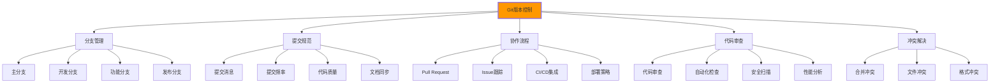

# 版本控制协作

## 🔄 Git与HTML开发工作流

### 📊 版本控制协作体系

**Git是现代HTML项目协作开发的基石**：



## 🎯 HTML项目的Git最佳实践

### 📋 完整的协作工作流

```html
<!DOCTYPE html>
<html lang="zh-CN">
<head>
    <meta charset="UTF-8">
    <meta name="viewport" content="width=device-width, initial-scale=1.0">
    <title>Git协作开发工作流演示</title>
    
    <style>
        .git-workflow-demo {
            max-width: 1200px;
            margin: 0 auto;
            padding: 2rem;
        }
        
        .workflow-section {
            margin: 2rem 0;
            padding: 1rem;
            border: 1px solid #e0e0e0;
            border-radius: 8px;
        }
        
        .git-repo-info {
            background: #f8f9fa;
            padding: 1rem;
            border-radius: 4px;
            margin-bottom: 1rem;
        }
        
        .branch-visualization {
            display: flex;
            align-items: center;
            gap: 1rem;
            margin: 1rem 0;
            overflow-x: auto;
        }
        
        .branch-node {
            padding: 0.5rem 1rem;
            border-radius: 4px;
            white-space: nowrap;
            font-weight: bold;
        }
        
        .branch-main { background: #007acc; color: white; }
        .branch-develop { background: #28a745; color: white; }
        .branch-feature { background: #ffc107; color: black; }
        .branch-release { background: #17a2b8; color: white; }
        .branch-hotfix { background: #dc3545; color: white; }
        
        .commit-log {
            background: #f1f1f1;
            padding: 1rem;
            border-radius: 4px;
            font-family: monospace;
            max-height: 300px;
            overflow-y: auto;
            margin: 1rem 0;
        }
        
        .commit-item {
            display: flex;
            align-items: center;
            padding: 0.5rem 0;
            border-bottom: 1px solid #ddd;
        }
        
        .commit-hash {
            font-weight: bold;
            margin-right: 1rem;
            color: #007acc;
        }
        
        .commit-message {
            flex: 1;
        }
        
        .commit-author {
            color: #666;
            font-size: 0.9em;
        }
        
        .commit-date {
            color: #999;
            font-size: 0.8em;
            margin-left: 1rem;
        }
        
        .command-demo {
            background: #000;
            color: #0f0;
            padding: 1rem;
            border-radius: 4px;
            font-family: 'Courier New', monospace;
            margin: 1rem 0;
            overflow-x: auto;
        }
        
        .command-line {
            margin: 0.5rem 0;
        }
        
        .command-prompt {
            color: #0f0;
            margin-right: 0.5rem;
        }
        
        .status-indicator {
            display: inline-block;
            width: 12px;
            height: 12px;
            border-radius: 50%;
            margin-right: 0.5rem;
        }
        
        .status-success { background: #28a745; }
        .status-warning { background: #ffc107; }
        .status-error { background: #dc3545; }
        .status-info { background: #17a2b8; }
        
        .collaborator-card {
            background: white;
            border: 1px solid #ddd;
            border-radius: 8px;
            padding: 1rem;
            margin: 0.5rem;
            display: inline-block;
            width: 200px;
        }
        
        .collaborator-avatar {
            width: 40px;
            height: 40px;
            border-radius: 50%;
            background: #007acc;
            color: white;
            display: flex;
            align-items: center;
            justify-content: center;
            font-weight: bold;
            margin-bottom: 0.5rem;
        }
        
        .merge-conflict-demo {
            background: #fff3cd;
            border: 1px solid #ffeaa7;
            border-radius: 4px;
            padding: 1rem;
            margin: 1rem 0;
        }
        
        .conflict-marker {
            font-weight: bold;
            color: #dc3545;
        }
        
        .pr-demo {
            background: #f8f9fa;
            border: 1px solid #dee2e6;
            border-radius: 8px;
            padding: 1rem;
            margin: 1rem 0;
        }
        
        .pr-header {
            display: flex;
            justify-content: between;
            align-items: center;
            margin-bottom: 1rem;
            padding-bottom: 1rem;
            border-bottom: 1px solid #dee2e6;
        }
        
        .pr-title {
            font-size: 1.2em;
            font-weight: bold;
            margin: 0;
        }
        
        .pr-meta {
            display: flex;
            gap: 1rem;
            font-size: 0.9em;
            color: #666;
        }
        
        .file-diff {
            background: white;
            border: 1px solid #ddd;
            border-radius: 4px;
            margin: 0.5rem 0;
            overflow: hidden;
        }
        
        .diff-header {
            background: #f8f9fa;
            padding: 0.5rem 1rem;
            font-weight: bold;
            border-bottom: 1px solid #ddd;
        }
        
        .diff-content {
            font-family: monospace;
            font-size: 0.9em;
            line-height: 1.5;
        }
        
        .diff-line-added {
            background: #d4edda;
            color: #155724;
        }
        
        .diff-line-removed {
            background: #f8d7da;
            color: #721c24;
        }
        
        .diff-line-context {
            background: white;
            color: #333;
        }
    </style>
</head>

<body>
    <div class="git-workflow-demo">
        <h1>Git版本控制协作工作流演示</h1>

        <!-- 📊 项目概览 -->
        <section class="workflow-section">
            <h2>项目Git状态概览</h2>
            
            <div class="git-repo-info">
                <h3>仓库信息</h3>
                <p><strong>仓库名称:</strong> html-learning-project</p>
                <p><strong>远程地址:</strong> <code>https://github.com/username/html-learning-project.git</code></p>
                <p><strong>当前分支:</strong> <span class="branch-node branch-develop">develop</span></p>
                <p><strong>最后提交:</strong> feat: 添加无障碍设计支持模块</p>
                
                <div class="project-stats">
                    <div class="stat-item">
                        <span class="status-indicator status-success"></span>
                        总提交数: <strong>147</strong>
                    </div>
                    <div class="stat-item">
                        <span class="status-indicator status-info"></span>
                        贡献者: <strong>3人</strong>
                    </div>
                    <div class="stat-item">
                        <span class="status-indicator status-success"></span>
                        开放PR: <strong>2个</strong>
                    </div>
                    <div class="stat-item">
                        <span class="status-indicator status-warning"></span>
                        待处理Issue: <strong>5个</strong>
                    </div>
                </div>
            </div>
        </section>

        <!-- 🌿 分支管理策略 -->
        <section class="workflow-section">
            <h2>GitFlow分支策略</h2>
            
            <div class="branch-strategy">
                <h3>分支结构</h3>
                <div class="branch-visualization">
                    <div class="branch-node branch-main">main (生产环境)</div>
                    <span>←</span>
                    <div class="branch-node branch-release">release-1.2.0</div>
                    <span>←</span>
                    <div class="branch-node branch-develop">develop (开发环境)</div>
                    
                    <div style="display: flex; flex-direction: column; gap: 0.5rem;">
                        <div class="branch-node branch-feature">feature/semantic-html</div>
                        <div class="branch-node branch-feature">feature/seo-optimization</div>
                        <div class="branch-node branch-feature">feature/accessibility-improvements</div>
                    </div>
                    
                    <div style="display: flex; flex-direction: column; gap: 0.5rem; margin-left: 1rem;">
                        <div class="branch-node branch-hotfix">hotfix/css-layout-bug</div>
                    </div>
                </div>
                
                <h3>分支命名规范</h3>
                <div class="command-demo">
                    <div class="command-line">
                        <span class="command-prompt"># 功能开发</span>
                        <span>feature/add-user-authentication</span>
                    </div>
                    <div class="command-line">
                        < span class="command-prompt"># 错误修复</span>
                        <span>hotfix/fix-login-validation</span>
                    </div>
                    <div class="command-line">
                        <span class="command-prompt"># 发布准备</span>
                        <span>release/v1.3.0</span>
                    </div>
                    <div class="command-line">
                        <span class="command-prompt"># 文档更新</span>
                        <span>docs/update-api-documentation</span>
                    </div>
                </div>
            </div>
        </section>

        <!-- 📝 提交历史和规范 -->
        <section class="workflow-section">
            <h2>提交历史和规范</h2>
            
            <div class="commit-history">
                <h3>最近提交记录</h3>
                <div class="commit-log">
                    <div class="commit-item">
                        <span class="commit-hash">a3f2e1c</span>
                        <span class="commit-message">feat: 添加移动端适配策略</span>
                        <span class="commit-author">张三</span>
                        <span class="commit-date">2小时前</span>
                    </div>
                    
                    <div class="commit-item">
                        <span class="commit-hash">b8e5d9f</span>
                        <span class="commit-message">fix: 修复表单验证错误处理</span>
                        <span class="commit-author">李四</span>
                        <span class="commit-date">4小时前</span>
                    </div>
                    
                    <div class="commit-item">
                        <span class="commit-hash">c7f4a2e</span>
                        <span class="commit-message">docs: 更新组件文档</span>
                        <span class="commit-author">王五</span>
                        <span class="commit-date">6小时前</span>
                    </div>
                    
                    <div class="commit-item">
                        <span class="commit-hash">d1e8b7c</span>
                        <span class="commit-message">style: 统一代码格式</span>
                        <span class="commit-author">张三</span>
                        <span class="commit-date">1天前</span>
                    </div>
                    
                    <div class="commit-item">
                        <span class="commit-hash">e9c6a5f</span>
                        <span class="commit-message">perf: 优化图片加载性能</span>
                        <span class="commit-author">李四</span>
                        <span class="commit-date">1天前</span>
                    </div>
                </div>
                
                <h3>提交消息规范 (Conventional Commits)</h3>
                <div class="commit-convention">
                    <h4>类型 (Type)</h4>
                    <div class="command-demo">
                        <div class="command-line"><span>feat:</span> 新功能</div>
                        <div class="command-line"><span>fix:</span> 错误修复</div>
                        <div class="command-line"><span>docs:</span> 文档更新</div>
                        <div><span>style:</span> 代码格式</div>
                        <div class="command-line"><span>refactor:</span> 代码重构</div>
                        <div class="command-line"><span>test:</span> 测试相关</div>
                        <div class="command-line"><span>chore:</span> 构建过程</div>
                        <div class="command-line"><span>perf:</span> 性能优化</div>
                    </div>
                    
                    <h4>作用域 (Scope) - 可选</h4>
                    <div class="command-demo">
                        <div class="command-line"><span>feat(accessibility):</span> 可访问性相关新功能</div>
                        <div class="command-line"><span>fix(navigation):</span> 导航相关错误修复</div>
                        <div class="command-line"><span>docs(css):</span> CSS文档更新</div>
                    </div>
                    
                    <h4>示例模板</h4>
                    <div class="command-demo">
                        <div class="command-line"><span>&lt;type&gt;(&lt;scope&gt;): &lt;description&gt;</span></div>
                        <div class="command-line"></div>
                        <div class="command-line"><span>&lt;body&gt;</span></div>
                        <div class="command-line"></div>
                        <div class="command-line"><span>&lt;footer&gt;</span></div>
                    </div>
                    
                    <h4>实际示例</h4>
                    <div class="command-demo">
                        <div class="command-line"><span>feat(a11y): add ARIA support for custom components</span></div>
                        <div class="command-line"></div>
                        <div class="command-line"><span>- Added aria-label attributes to interactive elements</span></div>
                        <div class="command-line"><span>- Implemented keyboard navigation handlers</span></div>
                        <div class="command-line"><span>- Added screen reader friendly text alternatives</span></div>
                        <div class="command-line"></div>
                        <div class="command-line"><span>Closes issue #123</span></div>
                    </div>
                </div>
            </div>
        </section>

        <!-- 👥 团队协作成员 -->
        <section class="workflow-section">
            <h2>团队协作成员</h2>
            
            <div class="team-members">
                <div class="collaborator-card">
                    <div class="collaborator-avatar">张</div>
                    <h4>张三</h4>
                    <p><strong>角色:</strong> 前端架构师</p>
                    <p><strong>职责:</strong> HTML架构设计、组件开发</p>
                    <p><strong>最近贡献:</strong> 语义化HTML模块</p>
                    <div class="member-stats">
                        <div class="stat-item">
                            <span class="status-indicator status-success"></span>
                            提交: 47
                        </div>
                        <div class="stat-item">
                            <span class="status-indicator status-info"></span>
                            代码行: 2,341
                        </div>
                    </div>
                </div>
                
                <div class="collaborator-card">
                    <div class="collaborator-avatar">李</div>
                    <h4>李四</h4>
                    <p><strong>角色:</strong> UI/UX设计师</p>
                    <p><strong>职责:</strong> 用户体验、设计系统</p>
                    <p><strong>最近贡献:</strong> 响应式布局优化</p>
                    <div class="member-stats">
                        <div class="stat-item">
                            <span class="status-indicator status-success"></span>
                            提交: 28
                        </div>
                        <div class="stat-item">
                            <span class="status-indicator status-info"></span>
                            代码行: 1,876
                        </div>
                    </div>
                </div>
                
                <div class="collaborator-card">
                    <div class="collaborator-avatar">王</div>
                    <h4>王五</h4>
                    <p><strong>角色:</strong> 测试工程师</p>
                    <p><strong>职责:</strong> 质量保证、自动化测试</p>
                    <p><strong>最近贡献:</strong> 可访问性测试框架</p>
                    <div class="member-stats">
                        <div class="stat-item">
                            <span class="status-indicator status-success"></span>
                            提交: 32
                        </div>
                        <div class="stat-item">
                            <span class="status-indicator status-info"></span>
                            代码行: 1,543
                        </div>
                    </div>
                </div>
            </div>
        </section>

        <!-- 🔀 Pull Request演示 -->
        <section class="workflow-section">
            <h2>Pull Request和Code Review</h2>
            
            <div class="pr-demo">
                <div class="pr-header">
                    <h3 class="pr-title">🎯 Implement responsive image optimization</h3>
                    <div class="pr-meta">
                        <span class="status-indicator status-success"></span>
                        <span>feature/seo-images</span>
                        <span>→</span>
                        <span>develop</span>
                        <span>by 张三</span>
                    </div>
                </div>
                
                <div class="pr-description">
                    <h4>📝 描述</h4>
                    <p>增加了响应式图片优化功能，包括：</p>
                    <ul>
                        <li>自动生成多尺寸图片</li>
                        <li>添加srcset和 sizes 属性支持</li>
                        <li>实现懒加载机制</li>
                        <li>WebP格式支持</li>
                    </ul>
                    
                    <h4>🔗 相关问题</h4>
                    <p>Closes #156, #157</p>
                </div>
                
                <div class="file-changes">
                    <h4>📁 文件变更</h4>
                    <div class="file-diff">
                        <div class="diff-header">components/image-optimizer.html (+87 -12)</div>
                        <div class="diff-content">
                            <div class="diff-line-context">  &lt;!-- 响应式图片组件 --&gt;</div>
                            <div class="diff-line-added">+ &lt;picture&gt;</div>
                            <div class="diff-line-added">+   &lt;source media="(min-width: 768px)" srcset="large.webp" type="image/webp"&gt;</div>
                            <div class="diff-line-added">+   &lt;source media="(max-width: 767px)" srcset="small.webp" type="image/webp"&gt;</div>
                            <div class="diff-line-context">  &lt;img src="fallback.jpg" alt="描述文本" loading="lazy"&gt;</div>
                            <div class="diff-line-added">+ &lt;/picture&gt;</div>
                        </div>
                    </div>
                    
                    <div class="file-diff">
                        <div class="diff-header">styles/image-responsive.css (+45 -3)</div>
                        <div class="diff-content">
                            <div class="diff-line-added">+ /* 响应式图片样式 */</div>
                            <div class="diff-line-added">+ .responsive-image {</div>
                            <div class="diff-line-added">+   width: 100%;</div>
                            <div class="diff-line-context">  height: auto;</div>
                            <div class="diff-line-added">+   object-fit: cover;</div>
                            <div class="diff-line-added">+ }</div>
                        </div>
                    </div>
                </div>
                
                <div class="pr-actions">
                    <h4>🔍 Review 状态</h4>
                    <div class="review-status">
                        <div class="stat-item">
                            <span class="status-indicator status-success"></span>
                            构建状态: ✅ 通过
                        </div>
                        <div class="stat-item">
                            <span class="status-indicator status-warning"></span>
                            代码审查: ⏳ 等待审查 (李四)
                        </div>
                        <div class="stat-item">
                            </span>
                            测试状态: ✅ 所有测试通过
                        </div>
                        <div class="stat-item">
                            <span class="status-indicator status-success"></span>
                            冲突检查: ✅ 无冲突
                        </div>
                    </div>
                </div>
            </div>
        </section>

        <!-- ⚔️ 冲突解决示例 -->
        <section class="workflow-section">
            <h2>合并冲突处理</h2>
            
            <div class="merge-conflict-demo">
                <h3>🔨 CSS冲突示例</h3>
                <div class="conflict-explanation">
                    <p>当两个分支修改了同一个文件的同一部分时，Git无法自动合并，需要手动解决冲突：</p>
                </div>
                
                <h4>冲突标记</h4>
                <div class="command-demo">
                    <div class="command-line">&lt;&lt;&lt;&lt;&lt;&lt;&lt; HEAD</div>
                    <div class="command-line">.nav-item {</div>
                    <div class="command-line">  display: flex;</div>
                    <div class="command-line">  align-items: center;</div>
                    <div class="command-line">}</div>
                    <div class="command-line">=======</div>
                    <div class="command-line">.nav-item {</div>
                    <div class="command-line">  display: grid;</div>
                    <div class="command-line">  grid-template-columns: repeat(auto-fit, minmax(100px, 1fr));</div>
                    <div class="command-line">}</div>
                    <div class="command-line">&gt;&gt;&gt;&gt;&gt;&gt;&gt; feature/navigation-redesign</div>
                </div>
                
                <h4>冲突解决步骤</h4>
                <ol>
                    <li>识别冲突部分</li>
                    <li>分析两个分支的修改意图</li>
                    <li>选择最佳解决方案或合并两者</li>
                    <li>移除Git冲突标记</li>
                    <li>测试修改后的代码</li>
                    <li>提交解决后的代码</li>
                </ol>
                
                <h4>解决后的代码</h4>
                <div class="command-demo">
                    <div class="command-line">.nav-item {</div>
                    <div class="command-line">  display: grid;</div>
                    <div class="command-line">  align-items: center;</div>
                    <div class="command-line">  grid-template-columns: repeat(auto-fit, minmax(100px, 1fr));</div>
                    <div class="command-line">}</div>
                </div>
            </div>
        </section>

        <!-- 🚀 CI/CD集成 -->
        <section class="workflow-section">
            <h2>CI/CD自动化流水线</h2>
            
            <div class="cicd-pipeline">
                <h3>自动化检查流程</h3>
                
                <div class="pipeline-steps">
                    <div class="pipeline-step">
                        <h4>1️⃣ 代码检查</h4>
                        <ul>
                            <li>ESLint静态分析</li>
                            <li>HTML W3C验证</li>
                            <li>CSS语法检查</li>
                            <li>链接有效性验证</li>
                        </ul>
                    </div>
                    
                    <div class="pipeline-step">
                        <h4>2️⃣ 自动化测试</h4>
                        <ul>
                            <li>单元测试执行</li>
                            <li>可视化回归测试</li>
                            <li>可访问性测试</li>
                            <li>跨浏览器兼容性</li>
                        </ul>
                    </div>
                    
                    <div class="pipeline-step">
                        <h4>3️⃣ 质量门禁</h4>
                        <ul>
                            <li>代码覆盖率检查 (≥80%)</li>
                            <li>性能预算验证</li>
                            <li>安全扫描结果</li>
                            <li>依赖漏洞检查</li>
                        </ul>
                    </div>
                    
                    <div class="pipeline-step">
                        <h4>4️⃣ 部署上线</h4>
                        <ul>
                            <li>构建优化版本</li>
                            <li>自动部署到预发布环境</li>
                            <li>生产环境蓝绿部署</li>
                            <li>性能监控和告警</li>
                        </ul>
                    </div>
                </div>
                
                <h3>GitHub Actions配置示例</h3>
                <div class="command-demo">
                    <div class="command-line">name: HTML Project CI/CD</div>
                    <div class="command-line"></div>
                    <div class="command-line">on:</div>
                    <div class="command-line">  push:</div>
                    <div class="command-line">    branches: [ main, develop ]</div>
                    <div class="command-line">  pull_request:</div>
                    <div class="command-line">    branches: [ main, develop ]</div>
                    <div class="command-line"></div>
                    <div class="command-line">jobs:</div>
                    <div class="command-line">  test-and-build:</div>
                    <div class="command-line">    runs-on: ubuntu-latest</div>
                    <div class="command-line">    steps:</div>
                    <div class="command-line">    - uses: actions/checkout@v3</div>
                    <div class="command-line">    - name: Setup Node.js</div>
                    <div class="command-line">      uses: actions/setup-node@v3</div>
                    <div class="command-line">    - name: Install dependencies</div>
                    <div class="command-line">      run: npm ci</div>
                    <div class="command-line">    - name: Run tests</div>
                    <div class="command-line">      run: npm test</div>
                    <div class="command-line">    - name: Build project</div>
                    <div class="command-line">      run: npm run build</div>
                    <div class="command-line">    - name: Deploy to staging</div>
                    <div class="command-line">      run: npm run deploy:staging</div>
                </div>
            </div>
        </section>

        <!-- 🔧 Git协作工具和技巧 -->
        <section class="workflow-section">
            <h2>协作工具和技巧</h2>
            
            <div class="collaboration-tools">
                <h3>实用的Git命令</h3>
                
                <div class="tool-section">
                    <h4>🔄 分支操作</h4>
                    <div class="command-demo">
                        <div class="command-line"><span class="command-prompt">git checkout -b</span> feature/new-component</div>
                        <div class="command-line"><span class="command-prompt">git branch -v</span> # 查看分支信息</div>
                        <div class="command-line"><span class="command-prompt">git merge</span> feature/new-component</div>
                        <div class="command-line"><span class="command-prompt">git branch -d</span> feature/old-component</div>
                    </div>
                </div>
                
                <div class="tool-section">
                    <h4>📝 提交操作</h4>
                    <div class="command-demo">
                        <div class="command-line"><span class="command-prompt">git add -p</span> # 分块添加修改</div>
                        <div class="command-line"><span class="command-prompt">git commit --amend</span> # 修改最后一次提交</div>
                        <div class="command-line"><span class="command-prompt">git rebase -i</span> HEAD~3 # 交互式重写历史</div>
                        <div class="command-line"><span class="command-prompt">git log --oneline</span> # 简洁的提交历史</div>
                    </div>
                </div>
                
                <div class="tool-section">
                    <h4>🔍 查找和调试</h4>
                    <div class="command-demo">
                        <div class="command-line"><span class="command-prompt">git blame</span> index.html # 查看每行代码的作者</div>
                        <div class="command-line"><span class="command-prompt">git log -S</span> "function name" # 搜索代码历史</div>
                        <div class="command-line"><span class="command-prompt">git diff</span> HEAD~1 # 比较两次提交</div>
                        <div class="command-line"><span class="command-prompt">git stash</span> # 临时保存工作进度</div>
                    </div>
                </div>
                
                <div class="tool-section">
                    <h4>🌐 远程协作</h4>
                    <div class="command-demo">
                        <div class="command-line"><span class="command-prompt">git fetch</span> # 获取远程更新</div>
                        <div class="command-line"><span class="command-prompt">git pull --rebase</span> # 变基式拉取最新代码</div>
                        <div class="command-line"><span class="command-prompt">git push</span> origin feature/branch-name</div>
                        <div class="command-line"><span class="command-prompt">git remote -v</span> # 查看远程仓库</div>
                    </div>
                </div>
                
                <h3>团队协作最佳实践</h3>
                <ul>
                    <li><strong>频繁提交：</strong> 小步快跑，保持提交的历史清晰</li>
                    <li><strong>功能分支：</strong> 每个新功能使用独立分支开发</li>
                    <li><strong>Code Review：</strong> 所有代码变更需要经过同行审查</li>
                    <li><strong>自动化测试：</strong> 保持测试覆盖面，避免回归错误</li>
                    <li><strong>文档同步：</strong> 代码变更时同步更新相关文档</li>
                    <li><strong>冲突预防：</strong> 定期同步主分支，提前发现潜在冲突</li>
                </ul>
            </div>
        </section>
    </div>

    <!-- JavaScript Git工作流演示 -->
    <script>
        // 🔧 Git工作流管理器
        class GitWorkflowManager {
            constructor() {
                this.currentBranch = 'develop';
                this.localCommits = [];
                this.remoteCommits = [];
                this.collaborators = [
                    { name: '张三', avatar: '张', commits: 47, role: '前端架构师' },
                    { name: '李四', avatar: '李', commits: 28, role: 'UI/UX设计师' },
                    { name: '王五', avatar: '王', commits: 32, role: '测试工程师' }
                ];
                
                this.init();
            }
            
            init() {
                this.setupBranchDemo();
                this.setupCommitDemo();
                this.setupCollaborationDemo();
                this.simulateRealTimeActivity();
            }
            
            // 分支管理演示
            setupBranchDemo() {
                // 模拟分支切换
                document.addEventListener('click', (e) => {
                    if (e.target.classList.contains('branch-node')) {
                        this.switchBranch(e.target.textContent);
                    }
                });
            }
            
            switchBranch(branchName) {
                this.currentBranch = branchName;
                
                // 更新UI显示
                document.querySelectorAll('.branch-node').forEach(node => {
                    node.style.border = node.textContent.includes(branchName) ? '2px solid #ff9800' : 'none';
                });
                
                // 显示切换内容
                this.updateBranchContent(branchName);
                
                console.log(`切换到分支: ${branchName}`);
            }
            
            updateBranchContent(branchName) {
                const contentExamples = {
                    'main': '生产环境代码，稳定版本',
                    'develop': '开发环境代码，包含最新功能',
                    'feature/semantic-html': '语义化HTML功能开发',
                    'release-1.2.0': 'v1.2.0版本发布准备',
                    'hotfix/css-layout-bug': 'CSS布局紧急修复'
                };
                
                // 模拟分支内容更新
                if (contentExamples[branchName]) {
                    console.log(`分支内容: ${contentExamples[branchName]}`);
                }
            }
            
            // 提交记录演示
            setupCommitDemo() {
                this.localCommits = [
                    { hash: 'a3f2e1c', message: 'feat: 添加移动端适配策略', author: '张三', time: '2小时前', files: ['responsive.html', 'mobile.css'] },
                    { hash: 'b8e5d9f', message: 'fix: 修复表单验证错误处理', author: '李四', time: '4小时前', files: ['form-validation.js'] },
                    { hash: 'c7f4a2e', message: 'docs: 更新组件文档', author: '王五', time: '6小时前', files: ['component-docs.md'] },
                    { hash: 'd1e8b7c', message: 'style: 统一代码格式', author: '张三', time: '1天前', files: ['*.css', '*.html'] },
                    { hash: 'e9c6a5f', message: 'perf: 优化图片加载性能', author: '李四', time: '1天前', files: ['image-loader.js', 'lazy-load.css'] }
                ];
                
                this.renderCommitHistory();
            }
            
            renderCommitHistory() {
                const commitLog = document.querySelector('.commit-log');
                if (!commitLog) return;
                
                commitLog.innerHTML = this.localCommits.map(commit => `
                    <div class="commit-item" onclick="showCommitDetails('${commit.hash}')">
                        <span class="commit-hash">${commit.hash}</span>
                        <span class="commit-message">${commit.message}</span>
                        <span class="commit-author">${commit.author}</span>
                        <span class="commit-date">${commit.time}</span>
                    </div>
                `).join('');
            }
            
            showCommitDetails(hash) {
                const commit = this.localCommits.find(c => c.hash === hash);
                if (!commit) return;
                
                const details = `
                    提交详情:
                    哈希: ${commit.hash}
                    作者: ${commit.author}
                    时间: ${commit.time}
                    修改文件: ${commit.files.join(', ')}
                    提交消息: ${commit.message}
                `;
                
                console.log(details);
                
                // 在实际应用中，这里可以显示详细的提交信息
                alert(`提交 ${hash} 的详细信息:\n\n${commit.message}\n\n作者: ${commit.author}\n时间: ${commit.time}\n修改文件: ${commit.files.join(', ')}`);
            }
            
            // 协作演示
            setupCollaborationDemo() {
                this.updateCollaboratorStats();
            }
            
            updateCollaboratorStats() {
                // 模拟协作统计数据更新
                this.collaborators.forEach(collaborator => {
                    // 在实际应用中，这里可以从Git API获取真实的统计数据
                    console.log(`${collaborator.name}: ${collaborator.commits} 次提交`);
                });
            }
            
            // 模拟实时协作活动
            simulateRealTimeActivity() {
                // 模拟团队成员的实时活动
                setInterval(() => {
                    this.simulateCommit();
                }, 30000); // 每30秒模拟一次活动
                
                // 模拟PR状态变更
                setInterval(() => {
                    this.updateBuildStatus();
                }, 45000); // 每45秒更新构建状态
            }
            
            simulateCommit() {
                const authors = ['张三', '李四', '王五'];
                const messages = [
                    'style: 调整CSS样式间距',
                    'fix: 修复导航菜单问题',
                    'feat: 添加新的用户界面组件',
                    'docs: 更新API文档',
                    'test: 添加单元测试用例'
                ];
                
                const randomAuthor = authors[Math.floor(Math.random() * authors.length)];
                const randomMessage = messages[Math.floor(Math.random() * messages.length)];
                
                console.log(`模拟活动: ${randomAuthor} 提交了 "${randomMessage}"`);
                
                // 更新UI显示最新活动
                this.showActivityNotification(`${randomAuthor} 刚刚提交了: ${randomMessage}`);
            }
            
            updateBuildStatus() {
                const statuses = ['✅ 构建成功', '⚠️ 构建警告', '❌ 构建失败', '🔄 正在构建'];
                const randomStatus = statuses[Math.floor(Math.random() * statuses.length)];
                
                console.log(`构建状态更新: ${randomStatus}`);
            }
            
            showActivityNotification(message) {
                // 创建通知元素
                const notification = document.createElement('div');
                notification.className = 'activity-notification';
                notification.innerHTML = `
                    <div class="notification-content">
                        <span class="notification-time">${new Date().toLocaleTimeString()}</span>
                        <span class="notification-message">${message}</span>
                    </div>
                `;
                
                notification.style.cssText = `
                    position: fixed;
                    top: 20px;
                    right: 20px;
                    background: #333;
                    color: white;
                    padding: 1rem;
                    border-radius: 4px;
                    z-index: 1000;
                    animation: slideIn 0.3s ease-out;
                `;
                
                document.body.appendChild(notification);
                
                // 3秒后移除通知
                setTimeout(() => {
                    notification.remove();
                }, 3000);
            }
            
            // 实用的Git命令演示
            demonstrateGitCommands() {
                const commands = {
                    '创建功能分支': 'git checkout -b feature/new-functionality',
                    '提交更改': 'git commit -m "feat: add new functionality"',
                    '推送分支': 'git push origin feature/new-functionality',
                    '合并分支': 'git checkout develop && git merge feature/new-functionality',
                    '拉取最新代码': 'git pull --rebase origin develop',
                    '查看状态': 'git status',
                    '查看历史': 'git log --oneline --graph',
                    '回滚提交': 'git reset HEAD~1',
                    '暂存更改': 'git stash',
                    '应用暂存': 'git stash pop'
                };
                
                console.log('🔧 常用Git命令:');
                Object.entries(commands).forEach(([desc, cmd]) => {
                    console.log(`${desc}: ${cmd}`);
                });
            }
            
            // 代码审查流程
            simulateCodeReview() {
                const reviewSteps = [
                    '1. 创建Pull Request',
                    '2. 触发CI/CD流水线',
                    '3. 代码自动检查',
                    '4. 单元测试运行',
                    '5. 等待代码审查',
                    '6. 审查者提交意见',
                    '7. 开发者修复问题',
                    '8. 重新审查',
                    '9. 合并到主分支',
                    '10. 自动部署'
                ];
                
                console.log('📋 代码审查流程:');
                reviewSteps.forEach(step => {
                    console.log(`  ${step}`);
                });
            }
            
            // 获取Git配置信息
            getGitConfig() {
                return {
                    user: {
                        name: 'Git协作演示',
                        email: 'demo@example.com'
                    },
                    branch: this.currentBranch,
                    remote: {
                        origin: 'https://github.com/username/html-learning-project.git',
                        upstream: 'https://github.com/upstream/repo.git'
                    },
                    lastCommit: this.localCommits[0],
                    collaborators: this.collaborators
                };
            }
        }

        // 🎯 全局Git工具函数
        function showCommitDetails(hash) {
            window.gitWorkflow.showCommitDetails(hash);
        }

        function demonstrateGitWorkflow() {
            window.gitWorkflow.demonstrateGitCommands();
            window.gitWorkflow.simulateCodeReview();
        }

        function switchToBranch(branchName) {
            window.gitWorkflow.switchBranch(branchName);
        }

        function showConflictResolution() {
            alert('合并冲突解决步骤:\n\n1. 识别冲突文件\n2. 分析两边的修改\n3. 手动编辑解决冲突\n4. 移除冲突标记\n5. 测试修改后代码\n6. 提交解决结果');
        }

        function createNewBranch() {
            const branchName = prompt('输入新分支名称:');
            if (branchName) {
                const command = `git checkout -b ${branchName}`);
                console.log(`执行命令: ${command}`);
                alert(`创建并切换到新分支: ${branchName}\n\n命令: ${command}`);
            }
        }

        function mergeBranch() {
            const branchName = prompt('输入要合并的分支名称:');
            if (branchName) {
                const command = `git merge ${branchName}`;
                console.log(`执行命令: ${command}`);
                alert(`合并分支: ${branchName}\n\n命令: ${command}`);
            }
        }

        // 🚀 初始化Git工作流管理器
        document.addEventListener('DOMContentLoaded', () => {
            window.gitWorkflow = new GitWorkflowManager();
            console.log('Git协作工作流演示已初始化');
            
            // 全局Git工具
            window.GitTools = {
                switchBranch: switchToBranch,
                demonstrateWorkflow: demonstrateGitWorkflow,
                showConfig: () => window.gitWorkflow.getGitConfig(),
                createBranch: createNewBranch,
                mergeBranch: mergeBranch,
                resolveConflict: showConflictResolution
            };
            
            // 添加CSS动画
            const style = document.createElement('style');
            style.textContent = `
                @keyframes slideIn {
                    from { transform: translateX(100%); opacity: 0; }
                    to { transform: translateX(0); opacity: 1; }
                }
                
                .commit-item:hover {
                    background: #f8f9fa;
                    cursor: pointer;
                }
                
                .branch-node:hover {
                    transform: scale(1.05);
                    transition: transform 0.2s ease;
                }
            `;
            document.head.appendChild(style);
        });
    </script>
</body>
</html>
```

---
<｜tool▁calls▁begin｜><｜tool▁call▁begin｜>
todo_write
